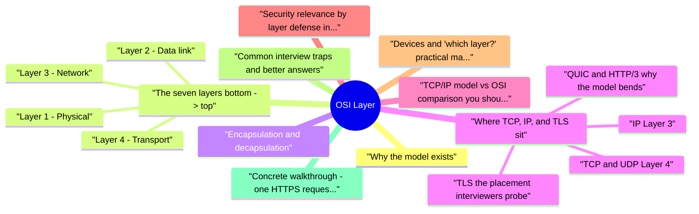

# OSI Layer revision map

I keep this OSI Layer map for the night before a screen, when five markdown files is too many clicks. Built from Critical Clarification OSI Layer Misconceptions.md, OSI Layer - Comprehensive Guide.md, OSI Layer - Interview Questions & Answers.md, OSI Layer - Quick Reference.md. Twenty minutes. Then I close the laptop.

## Why the model exists

## The seven layers (bottom -> top)
- Below, each layer includes concrete examples and a security lens.

### Layer 1 - Physical
- Examples: Electrical signaling on copper, optical pulses on fiber, radio modulation for Wi‑Fi, NIC transceivers, cable specifications, physical ports on switches.

### Layer 2 - Data link
- Examples: Ethernet frames and MAC addresses, Wi‑Fi MAC behavior, switches (MAC learning/forwarding), ARP (maps IP -> MAC on a broadcast domain), VLAN tags (802.1Q), STP for loop prevention.
- PDU name: Frame (often stated as the L2 PDU).

### Layer 3 - Network
- Examples: IPv4/IPv6, routers, routing protocols (OSPF, BGP at the control plane), ICMP (diagnostics), IPsec (often described as L3 VPN technology).

### Layer 4 - Transport
- Examples: TCP (connections, retransmissions, flow/congestion control), UDP (datagrams), port numbers as application endpoints, SCTP in some telco stacks.
- PDU names: Segment (TCP), datagram (UDP-terminology overlaps with "datagram" at IP in some texts; interviews reward clarity: "TCP segment over an IP packet").

### Layer 5 - Session
- Examples (conceptual): Checkpoints in long file transfers, RPC conversation state-many systems fold this into application libraries or TCP's byte stream rather than a distinct "session protocol" you configure daily.
- Security relevance: When session lifecycle is mishandled, you get session fixation, stale sessions, or orphaned authorization-often discussed as application/session management even if the OSI label is fuzzy.

### Layer 6 - Presentation
- Examples (textbook): ASN.1, TLS is sometimes taught here because it handles negotiation and binary record framing above TCP.
- Security relevance: Parsing differences (compression bombs, ambiguous encodings) are real bugs, but pinning TLS as "only L6" without mentioning TCP and HTTP is a common interview trap (see below).

### Layer 7 - Application
- Examples: HTTP/HTTPS, DNS, SMTP, SSH, FTP, gRPC-protocols with application-visible semantics.

## Encapsulation and decapsulation
- L7 produces application data (for example an HTTP request body and headers as bytes).
- Lower layers each wrap that payload with their header (and occasionally a trailer, e.g. Ethernet FCS).
- At L4, TCP adds a TCP header (ports, sequence numbers, flags).
- At L3, IP adds an IP header (source/destination addresses, TTL, protocol field).
- At L2, Ethernet adds Ethernet header (MAC addresses, EtherType) and trailer (FCS).
- At L1, the frame becomes signals on the wire or air.

## Where TCP, IP, and TLS sit

### IP (Layer 3)
- IP provides host-to-host delivery across routed networks. It does not guarantee reliability-that is TCP's job at L4.

### TCP and UDP (Layer 4)
- TCP and UDP multiplex processes using ports and sit above IP. TCP adds connection state, retransmissions, and ordering for a byte stream. UDP is best-effort; the application (or QUIC) must supply what it needs.

### TLS (the placement interviewers probe)
- TLS runs over a reliable byte stream, classically TCP. It provides confidentiality and integrity for application data and authenticates the peer (typically the server to the client; mutual TLS when configured).
- HTTP is an L7 protocol.
- TCP is L4.

### QUIC and HTTP/3 (why the model bends)
- QUIC encrypts much of what older stacks exposed at "transport," carries streams, and is the transport for HTTP/3 over UDP. Mature answers note OSI is pedagogical and real protocols combine concerns.

## TCP/IP model vs OSI (comparison you should be able to draw)
- The TCP/IP model is often taught as four layers:
- Key interview line: OSI splits the top; TCP/IP collapses Session/Presentation/Application into one Application layer for practicality. Neither replaces reading RFCs for real behavior.

## Security relevance by layer (defense in depth)
- L1: Physical controls; supply-chain and hardware trust where relevant.
- L2: Segmentation (VLANs), NAC, monitoring for ARP anomalies, secure Wi‑Fi (WPA3 enterprise, rogue AP detection).
- L3: Firewalls, routing security, IP allow/deny, DDoS mitigation at network edges, IPsec VPNs.
- L4: Stateful filtering, SYN proxy/cookies, rate limits on new connections, load balancers as policy enforcement points.
- L5-7 (as usually discussed in hiring loops): TLS for channel security, authentication/authorization at the app, secure cookies, input validation, WAF (contested but often called L7), API security, logging/detection.

## Devices and "which layer?" (practical mapping)
- Repeater / hub: L1 (bits; no intelligence about frames).
- Switch (classic): L2 forwarding by MAC; L3 switch adds routing.
- Router: L3 forwarding by IP; may apply ACLs and NAT (behavior spans L3/L4 in discussion).
- Load balancer / reverse proxy: Often described as L4 (TCP/UDP balancing), L7 (HTTP routing), or both, depending on product mode.
- Host firewall: Commonly L3/L4 rules; application firewall features climb toward L7.

## Common interview traps (and better answers)
- "TLS is Layer 6, full stop."
- Better: TLS provides a cryptographic session/record layer over TCP, securing data for L7 protocols like HTTP; cite the ordering TLS -> TCP -> IP.
- "Switches are Layer 3 devices."
- "OSI is exactly how Linux networking works."
- "If we use TLS, we're safe from MITM."
- "DDoS is always Layer 7."
- Ignoring QUIC / HTTP/3.
- Confusing PDU names.

## Concrete walkthrough: one HTTPS request (conceptual)
- This is the story interviewers want you to tell without hand-waving.
- Browser builds L7 data: an HTTP request (method, path, headers, optional body) as bytes according to HTTP semantics.
- Physical transmission: the NIC converts the frame to symbols on the medium.

## ICMP and "where does ping live?"
- ICMP is an Internet-layer companion to IP (often discussed as L3). Ping (ICMP Echo Request/Reply) tests reachability and basic routing. It is not TCP or UDP; it is carried in IP packets with a distinct protocol number.
- Interview angle: When ping fails but TCP works (or vice versa), you are often debugging ACLs, path MTU issues tied to ICMP Fragmentation Needed, firewall rules, or control-plane filtering-not "HTTP being broken."

## NAT, PAT, and stateful inspection (how layers combine)

## Middleboxes: TLS termination and "which layer is the load balancer?"
- Production systems rarely look like a classroom diagram end-to-end.
- L4 load balancing distributes based on IP/port without parsing HTTP.
- L7 load balancing routes based on HTTP attributes (path, header, cookie), which is powerful and security-sensitive (routing rules can accidentally bypass intended paths).

## Encapsulation diagram (mental model)
- If you cannot render Mermaid on a whiteboard, draw the same vertical stack with headers drawn as boxes prepended to a payload bar.

## Troubleshooting as "which layer broke?"
- A disciplined method prevents random config changes.
- L1/L2 symptoms: link down, FCS errors, duplex mismatch history, Wi‑Fi association failures, switch port errors.
- L3 symptoms: no route, wrong subnet mask, TTL expired, blackholing after a bad static route.
- L4 symptoms: connection refused (nothing listening), SYNs not completing, RST storms, NAT mapping exhaustion.
- TLS symptoms: certificate errors, hostname mismatch, protocol/cipher mismatch, clock skew affecting validity windows.
- L7 symptoms: HTTP 4xx/5xx with meaningful bodies, API schema errors, auth failures after the tunnel is fine.

## Quick reference: map an issue to a layer (examples)

## Staff-level framing: Zero Trust and OSI
- Zero Trust is not an OSI layer-it is an architecture that says "never assume the network interior is friendly." Still, interviews often ask you to map controls:
- Micro-segmentation and private networking are discussed as L3/L2 tools.
- Identity-aware proxies and service mesh mTLS combine strong authentication between services with L7 routing policies.
- Device compliance checks resemble admission control spanning identity and network access.

## How to practice (quick)
- Sketch encapsulation once with HTTP + TLS + TCP + IP + Ethernet.
- For a system you know, list one control each for L2 segmentation, L3 firewall, L4 rate limit, L7 authZ, and TLS.

## Cross-read
- TCP vs UDP, TLS, MITM Attack, DDoS and Resilience, Security Headers, Zero Trust Architecture, gRPC and Protobuf Security.

## Traps that dump interviews

## "OSI is how the internet is literally implemented."
- Reality: TCP/IP is the dominant stack; OSI is a reference model for discussion. Real systems collapse Session/Presentation into libraries and apps.

## "TLS is always 'Layer 6'."
- Reality: TLS sits between TCP and application protocols in practice; layer labels vary by textbook. Interview-safe: "above transport, below HTTP."

## "If I know the layer, I know the fix."
- Reality: Defense still needs protocol-specific controls (e.g., mTLS policy, HTTP semantics)-layer number is orientation, not action.

## "Switches only care about Layer 2."
- Reality: Enterprise switches often participate in L3 routing, ACLs, and overlay virtualization-roles blur in products.

## "NAT is a Layer 7 feature."
- Reality: NAT is typically understood as L3/L4 rewriting (addresses / ports), not application logic.

## "Firewalls map 1:1 to one OSI layer."
- Reality: Stateful firewalls inspect through L4; NGFW/WAF add L7-products span layers.

## "Encapsulation order is always strict in every OS."
- Reality: Optimization and offload (TSO, GRO) change where segmentation happens in software vs NIC-concept remains, implementation varies.

## "OSI and 'the cloud' don't mix."
- Reality: VPCs, load balancers, and service meshes still map to routing, sessions, and app protocols-the model still helps triage.

## "ICMP is Layer 4."
- Reality: ICMP is companion to IP-often taught as L3 control plane, not TCP/UDP transport.

## "Memorizing mnemonics equals understanding."
- Reality: Interviewers want protocol placement and attack/control mapping (where TLS terminates, where MAC addresses stop), not rote acronyms alone.

## Prompts I drill out loud

- What is the OSI model and why do engineers still reference it?
- List the seven OSI layers from bottom to top and give one example protocol or concept for each.
- What is encapsulation, and what are the usual PDU names at L2, L3, and L4?
- Protocol and device mapping
- At which layer do TCP and UDP operate, and what service do they provide relative to IP?
- Where does HTTP live, and where does TLS sit relative to HTTP and TCP?
- Is IP "Layer 4" because it carries TCP segments?
- What layer is a typical switch vs a typical router? What blurs the line?
- Where does ICMP belong, and why does that matter for debugging?
- TCP/IP comparison and modern stacks
- Contrast the OSI model with the TCP/IP model.
- How does HTTP/3 over QUIC challenge strict OSI layering?
- Security and attacks
- Give one attack example each at L2, L3, L4, and L7.
- Why doesn't TLS stop CSRF or broken access control?
- How does a SYN flood relate to OSI layers, and what mitigations map where?
- Why might VLANs fail to be a complete security boundary?
- Edge cases interviewers like
- Where does DNS fit in the OSI model?
- Is ARP Layer 2 or Layer 3?
- What is NAT, and which layers does it touch in conversation?
- Map "defense in depth" across OSI for a public web API.
- What does "Layer 7 DDoS" mean compared to volumetric DDoS, and how do mitigations differ?
- A junior engineer says "OSI is outdated-I'll ignore it." How do you respond in an interview tone?

## Fundamentals

### Is IP "Layer 4" because it carries TCP segments?
- See the source section `Is IP "Layer 4" because it carries TCP segments?` for the worked example.

### Why doesn't TLS stop CSRF or broken access control?
- See the source section `Why doesn't TLS stop CSRF or broken access control?` for the worked example.

### Map "defense in depth" across OSI for a public web API.
- See the source section `Map "defense in depth" across OSI for a public web API.` for the worked example.

### What does "Layer 7 DDoS" mean compared to volumetric DDoS, and how do mitigations differ?
- See the source section `What does "Layer 7 DDoS" mean compared to volumetric DDoS, and how do mitigations differ?` for the worked example.

### A junior engineer says "OSI is outdated-I'll ignore it." How do you respond in an interview tone?
- See the source section `A junior engineer says "OSI is outdated-I'll ignore it." How do you respond in an interview tone?` for the worked example.

## Depth: Interview follow-ups - OSI model
- TLS placement - Describe HTTP -> TLS -> TCP -> IP -> Ethernet; avoid dogmatic "TLS is only L6" without TCP/HTTP context.
- PDU naming - Frame / packet / segment / datagram consistency.
- QUIC/HTTP3 - Acknowledge layer blending and UDP as the outer transport.
- Middleboxes - TLS termination, NAT, L7 routing changing the end-to-end picture.

## Sibling folders

- Stay inside this folder for the long guide. Jump only when a section names a sibling topic.
- Cookie Security, CSRF, XSS, JWT, OAuth, and TLS show up as neighbors on a lot of these maps.
