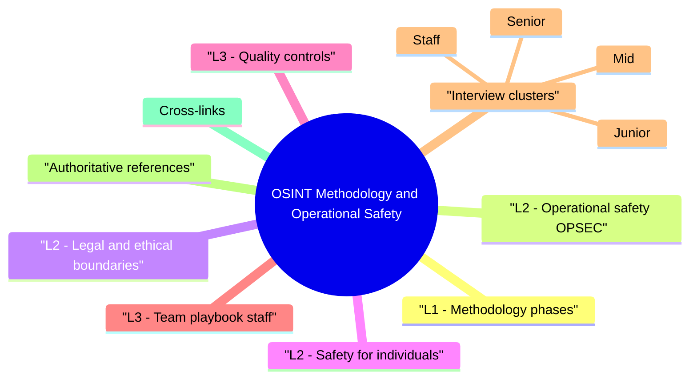

# OSINT Methodology and Operational Safety revision map

Last mock I bounced around the OSINT Methodology and Operational Safety folder. This file is the stop that. Drawn from Critical Clarification OSINT Methodology and Operational Safety Misconceptions.md, OSINT Methodology and Operational Safety - Comprehensive Guide.md, OSINT Methodology and Operational Safety - Interview Questions & Answers.md, OSINT Methodology and Operational Safety - Quick Reference.md. Skim the mermaid, then the outline.

## Misreads that still sneak in

## "OSINT is anonymous and consequence-free."
- Reality: Logs, ToS, and law apply; clients can audit your actions.

## "More VPNs = better OPSEC."
- Reality: Wrong VPN jurisdiction or banned tools can breach contract; match policy.

## "Public data can be used any way we want."
- Reality: GDPR and other laws limit processing even of public personal data.

## "Scraping is always passive OSINT."
- Reality: Automated requests can be active and legally risky-scope it.

## "We don't need to document sources."
- Reality: Without provenance, intel isn't defensible in court or with engineering.

## "Personal social targeting is fine for pentests."
- Reality: Harassment and non-consensual surveillance cross ethical and legal lines-define boundaries in RoE.

## "OSINT tools are all safe to run."
- Reality: Supply-chain risk in scrapers and browser extensions-pin versions and vet.

## "Operational safety is only for nation-state threats."
- Reality: Doxing, stalking, and corporate espionage affect normal consultants too.

## Lab methodology

## L1 - Methodology phases
- Define objective - What decision does this intel support?
- Scope - Domains, people (minimum necessary), time window.
- Collect - Passive first; log queries and URLs.
- Analyze - Correlate, rate confidence (A-F or high/med/low).
- Report - Actionable bullets, separate facts vs inference.
- Dispose - Retention policy for notes and PII.

## L2 - Operational safety (OPSEC)

## L2 - Legal and ethical boundaries
- CFAA, GDPR, local privacy law-know your jurisdiction.
- Active scanning, credential stuffing, and bypassing authentication are not "OSINT" in most contracts.
- Minimize personal data; don't collect children's data without clear basis.

## L2 - Safety for individuals
- No stalking, harassment, or non-consensual tracking of employees as individuals.
- Executive protection teams may treat aggressive personal OSINT as threatening-stay professional.

## L3 - Quality controls
- Corroborate single-source claims.
- Timestamp everything-pages change.
- Archive (authorized) snapshots when policy allows (Wayback terms, etc.).

## L3 - Team playbook (staff)
- Approved tool list
- Data handling classification
- Escalation when intel touches active law enforcement matters

## Interview clusters

### Junior
- OSINT vs active recon?

### Mid
- Three OPSEC practices for consultants?

### Senior
- GDPR considerations for employee LinkedIn data in reports?

### Staff
- Enterprise OSINT governance policy outline?

## Authoritative references
- OSINT framework literature (e.g. IJ intel cycle variants)
- NIST / organizational privacy guidance
- FIRST ethics for handlers

## Cross-links
- OSINT for Security Assessments · Initial Access · Advanced Red Team Operations · Penetration Testing

## Verification checklist
- [ ] Write a one-page RoE snippet for OSINT only.
- [ ] List five OPSEC controls.
- [ ] Explain when you stop collection.

## 60-second answer
- Q: How do you approach OSINT methodology and operational safety?

## Methodology

### Q: What belongs in an OSINT collection plan?
- A: Goal, in-scope assets, approved sources, prohibited actions, retention, reporting format, and escalation path.

### Q: How do you rate confidence?
- A: Multiple independent sources = higher; single paste site = low until verified; document assumptions.

## Safety

### Q: VPN for OSINT-yes or no?
- A: Only if legal and contractually allowed-some clients forbid or require specific egress regions.

### Q: Scraping-concerns?
- A: ToS, CFAA-class risk (US), rate limits, robots.txt ethics-get legal review for non-trivial scraping.

## Depth: Follow-ups
- Burn notice for compromised research personas
- OSINT in sanctioned countries
- Child safety and OSINT (red lines)**

## Mock ladder

## Method (6 steps)
- Objective -> scope -> collect (passive) -> analyze -> report -> dispose

## OPSEC quick wins
- Dedicated profile/VM · rate limits · no personal blur · encrypted notes · approved tools

## Rules of thumb
- RoE first · minimize PII · cite sources + time · corroborate · escalate legal gray zones

## Not OSINT (without extra approval)
- Credential stuffing · port scanning · exploitation · bypassing auth

## Cross-read
- OSINT for Security Assessments · Initial Access · Penetration Testing

## One-liner

## Cross-links I actually follow

- Stay inside this folder for the long guide. Jump only when a section names a sibling topic.
- Cookie Security, CSRF, XSS, JWT, OAuth, and TLS show up as neighbors on a lot of these maps.
