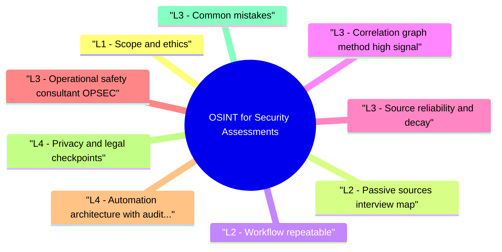

# OSINT for Security Assessments revision map

OSINT for Security Assessments in one sitting. That is the deal. I mined Critical Clarification OSINT for Security Assessments Misconceptions.md, OSINT for Security Assessments - Comprehensive Guide.md, OSINT for Security Assessments - Interview Questions & Answers.md, OSINT for Security Assessments - Quick Reference.md, OSINT for Security Assessments - VAPT Methodology.md. The outline keeps every H2 I cared about from those files.

## L1 - Scope and ethics
- Written RoE: what targets, out-of-scope assets, prohibited techniques (e.g. credential stuffing, scraping PII without need).
- Privacy / GDPR / local law: minimize personal data; document purpose.
- Safe harbor: company bug bounty / assessment letter defines what "public" means for that engagement.

## L2 - Passive sources (interview map)

## L2 - Workflow (repeatable)
- Seed: customer domains, IPs, brands, acquisitions.
- Enumerate: subdomains (amass, subfinder, securitytrails-class APIs).
- Resolve & probe (if in scope): httpx, nmap may be active-confirm RoE.
- Correlate: tech stack (Wappalyzer-class), cloud buckets (only with explicit client approval and legal review).
- Prioritize: exposed admin, pre-prod, legacy VPN portals.
- Report: sources, timestamps, confidence; no sensitive PII unnecessary.

## L3 - Correlation graph method (high signal)
- Strong OSINT output is a graph, not a raw list:
- Build entities: domains, subdomains, IPs, ASNs, cert fingerprints, repo orgs, vendor names.
- Add edges with evidence and timestamp (observed_in, resolved_to, same_cert, mentions_vendor).
- Score confidence per edge (high = direct evidence, medium = inferred relation, low = weak heuristic).
- Pivot from high-centrality nodes first (shared auth hosts, wildcard certs, legacy gateways).

## L3 - Source reliability and decay
- Interview edge: always pair source claim with observation date and confidence level.

## L3 - Operational safety (consultant OPSEC)
- Dedicated VM or browser profile; avoid personal Google session bleed.
- Rate-limit; don't crash third-party services.
- Tor / VPN only if legal and approved (some clients forbid).
- Document what you touched for chain of custody.

## L4 - Automation architecture with auditability
- For recurring assessments, design an OSINT pipeline with controls:
- Ingestion layer: API connectors with explicit per-source rate limits and legal tags.
- Normalization layer: canonical domain/host parsing, timezone normalization, dedupe rules.
- Evidence store: immutable records with source URL, retrieval time, analyst/tool id.
- Scoring layer: configurable confidence and risk weighting (internet-facing auth > marketing microsite).
- Handoff layer: export prioritized targets to testing tools with traceable lineage.

## L4 - Privacy and legal checkpoints
- Before collecting sensitive personal data or breach artifacts, define:
- Necessity test (is this data required to answer the assessment objective?).
- Minimization plan (redact/anonymize before broad distribution).
- Retention limits and secure deletion dates.
- Escalation path for accidental exposure of high-risk personal data.

## L3 - Common mistakes
- Active scanning without permission (illegal / contract breach).
- Dumping employee PII into reports.
- Assuming GitHub leak is in scope for exploitation (may be third-party).

## Toolchain (examples)
- Repos: trufflehog, gitleaks (on cloned authorized repos)
- Buckets: tools exist-only with explicit client approval

## Interview clusters

### Junior
- Define OSINT vs hacking.

### Mid
- CT logs-why matter for assessments?

### Senior
- Passive vs active recon under RoE.

### Staff
- Global program: OSINT playbook + privacy review.

## Authoritative references
- NIST OSINT guidance themes (organizational)
- CAPEC / MITRE PRE-ATT&CK (recon concepts-verify current matrix mapping)
- Vendor docs for CT, RDAP

## Cross-links
- Initial Access · OSINT Methodology and Operational Safety · Threat Modeling · Penetration Testing

## Verification checklist
- [ ] One engagement story with clear RoE limits.
- [ ] Enumerate 5 passive sources from memory.
- [ ] Explain why Shodan queries need approval.
- [ ] Build a mini entity graph from one target domain with confidence labels.
- [ ] Explain one source decay pitfall (CT, passive DNS, search index, or repo intel).

## Pocket list

## Definition
- Lawful, scoped collection of public (or authorized) data to support security assessments-not exploitation by itself.

## Passive sources (quick list)
- DNS · CT logs · ASN/RDAP · search dorks · code repos · Wayback · job posts · app stores

## Active vs passive

## Workflow
- Seeds -> subdomain enum -> resolve -> correlate tech -> prioritize -> document sources

## OPSEC
- Dedicated browser/VM · rate limits · minimal PII · approved tools

## Tools (examples)
- subfinder · amass · httpx · trufflehog/gitleaks (scoped repos)

## Cross-read
- Initial Access · OSINT Methodology and Operational Safety · Penetration Testing

## One-liner

## The clarification file, compressed

## "OSINT is always legal."
- Reality: Collection method, jurisdiction, target, and use matter. Active probing, credential stuffing, or bypassing ToS can be illegal or breach contract.

## "If it's on Google, it's in scope."
- Reality: Scope is contractual. Acquired companies, partner tenants, and typosquat domains may be out of scope even if indexed.

## "More data is always better."
- Reality: PII sprawl increases GDPR/privacy risk and hurts report quality. Targeted collection wins.

## "Shodan results prove vulnerability."
- Reality: Banners are stale and ambiguous. Confirm with authorized validation-don't assume RCE from an open port.

## "OSINT replaces penetration testing."
- Reality: OSINT informs prioritization; it doesn't replace technical testing.

## "Personal social media is off limits."
- Reality: Public posts may be fair game ethically for high-level context, but many employers restrict targeting individuals-follow RoE.

## "We need fake identities for OSINT."
- Reality: Sock puppets may violate law or platform ToS. Use transparent research accounts where required and approved.

## "GitHub secrets are the client's fault only."
- Reality: Report responsibly; coordinate rotation; avoid public disclosure without agreement.

## Authorized testing outline

## Objective
- Create a repeatable assessment workflow for OSINT for Security Assessments that produces reproducible evidence and actionable remediation guidance.

## Phase 1 - Scope and preparation
- Confirm in-scope assets, test windows, and prohibited actions.
- Identify critical user journeys and trust boundaries.
- Define severity rubric and evidence requirements before testing.

## Phase 2 - Recon and attack-surface mapping
- Enumerate relevant endpoints, flows, and data paths.
- Document where security checks are expected to happen.
- Mark high-value assets and high-impact paths.

## Phase 3 - Hypothesis-driven testing
- Start with low-risk probes and baseline behavior.
- Test failure hypotheses systematically (one variable at a time).
- Capture request/response artifacts for each finding candidate.

## Phase 4 - Validation and impact proof
- Reproduce findings with clean-state retests.
- Confirm exploitability and practical impact.
- Eliminate false positives; record confidence level.

## Phase 5 - Remediation and verification
- Provide immediate containment + structural fix recommendations.
- Define post-fix verification tests and telemetry checks.
- Re-test after remediation and close with evidence.

## Evidence template
- Asset / endpoint:
- Preconditions:
- Reproduction steps:
- Observed behavior:
- Security impact:
- Business impact:
- Recommended fix:
- Verification result:

## Interview drill
- In 3 minutes, explain how you would run this VAPT workflow for one production-like service and what evidence you need before escalating severity.

## Oral prompts worth repeating

- Q: Is using Shodan OSINT?
- Q: Employee LinkedIn-fair game?
- Q: What are certificate transparency logs useful for?
- Q: GitHub secret scanning in assessments?
- Q: What does a good OSINT section in a report look like?

## 60-second answer
- Q: How do you use OSINT in a security assessment?

## Scope & law

### Q: Employee LinkedIn-fair game?
- Reality: Public profiles are public, but mass harvesting PII may violate policy or privacy law. Use minimum necessary for tech stack or org chart context.

## Technique

## Deliverables

## Depth: Follow-ups
- Correlate ASN with cloud egress IPs.
- Brand impersonation domains for phishing intel.
- Dark web OSINT-when out of scope for AppSec roles.

## Mock ladder

## What sits next to this topic

- Stay inside this folder for the long guide. Jump only when a section names a sibling topic.
- Cookie Security, CSRF, XSS, JWT, OAuth, and TLS show up as neighbors on a lot of these maps.
