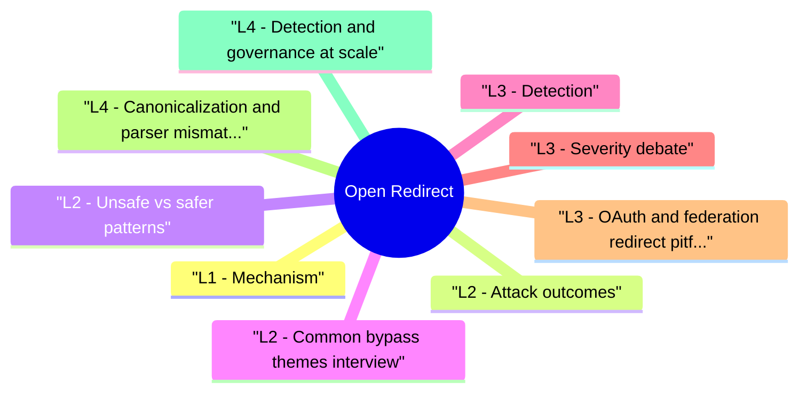

# Open Redirect revision map

Last mock I bounced around the Open Redirect folder. This file is the stop that. Drawn from Critical Clarification Open Redirect Misconceptions.md, Open Redirect - Comprehensive Guide.md, Open Redirect - Interview Questions & Answers.md, Open Redirect - Quick Reference.md, Open Redirect - VAPT Methodology.md. Skim the mermaid, then the outline.

## L1 - Mechanism
- User trusts the first host; bar shows trusted domain until redirect lands phishing.

## L2 - Attack outcomes

## L2 - Unsafe vs safer patterns
- Unsafe: Location: request.args['url'] after weak startswith check.
- Relative redirects only: next=/dashboard where / is forced and path normalized.
- Absolute URLs: match scheme + host against fixed set; reject everything else.
- Use framework URL parsers (net/url in Go, urllib in Python, etc.) and compare structured fields-not raw string contains checks.

## L2 - Common bypass themes (interview)
- //evil.com - protocol-relative appears "relative" to naive checks.
- https://trusted.example.evil.com - subdomain tricks vs suffix checks.
- \evil.com (IE legacy) / unicode homoglyphs - parser dependent.
- Double encoding https%253A//evil.

## L3 - Detection
- Code review: Location, redirect, returnUrl, next, url.
- DAST: follow 302 chains with external host.
- OAuth reviews: redirect_uri exact match per RFC 9700 themes.

## L3 - Severity debate
- Alone: often Medium (phishing) in bug bounties-context matters.
- With OAuth or admin flows: High/Critical.
- Chained to SSRF: follow chain severity.

## L3 - OAuth and federation redirect pitfalls
- Open redirect risk increases sharply in auth ecosystems:
- Weak redirect_uri matching (prefix/suffix/wildcard) lets attackers capture codes/tokens.
- Shared callback endpoints with weak tenant/app binding create cross-client token delivery risks.
- Post-login next parameters can bypass intended application landing restrictions.
- Pre-register exact callback URIs per client/app (no wildcards for production).
- Bind redirect target to authenticated session + client id + anti-CSRF state.
- Reject scheme changes and normalize host/port/path before comparison.
- Use one-time redirect tokens mapped server-side instead of raw user-provided URLs.

## L4 - Canonicalization and parser mismatch hazards
- Naive string checks fail under URL parser differences:
- Mixed slash/backslash normalization.
- Punycode/IDN hostname confusion.
- Double encoding and decode-order differences across middleware tiers.
- Scheme-relative URLs treated as absolute by browsers.
- Parse once with a trusted URL library.
- Canonicalize and compare structured fields (scheme, host, port, path).
- Enforce allowlist after canonicalization.

## L4 - Detection and governance at scale
- For larger products, treat redirects as a controlled security surface:
- Inventory all redirect sinks (next, returnUrl, redirect, SSO relay fields).
- Add centralized redirect utility and block direct framework redirect calls in code review rules.
- Monitor outbound redirect destinations and alert on new external domains.
- Add security tests for known bypass forms (//, encoded forms, unicode host variants).

## Hands-on (authorized)
- PortSwigger open redirect / OAuth labs.
- OWASP Juice Shop redirect challenges.

## Interview clusters

### Junior
- What is an open redirect?

### Mid
- Allowlist vs blocklist for next param?

### Senior
- OAuth redirect_uri - exact match nuances?

### Staff
- Global SSO product - how to eliminate class across hundreds of apps?

## Authoritative references
- OWASP Unvalidated Redirects and Forwards
- RFC 9700 (OAuth security BCP-redirect URI discipline)

## Cross-links
- OAuth · SSRF · XSS · Web Application Security Vulnerabilities · Penetration Testing

## Verification checklist
- [ ] Explain //evil bypass and fix.
- [ ] One sentence on OAuth relationship.
- [ ] Write allowlist pseudocode.
- [ ] Explain why exact redirect_uri matching matters for OAuth code flow.
- [ ] Describe one parser mismatch that breaks naive host checks.

## Flags I check in 90 seconds

## Definition
- User-controlled target -> Location: or JS navigate -> external site (CWE-601)

## Impacts
- Phishing · OAuth code/token theft · chain to SSRF/malware

## Fix pattern
- Parse URL · allowlist host (exact) or path-only /safe/path · reject // and \

## Bypass keywords

## OAuth
- redirect_uri exact match · no open wildcards

## Cross-read
- OAuth · SSRF · XSS · Web App Vulnerabilities

## One-liner

## Misreads that still sneak in

## "Open redirect is always Low severity."
- Reality: Phishing against high-value users or OAuth chains can be High/Critical.

## "Blocking http:// fixes it."
- Reality: Attacker can use https:// or scheme-relative //.

## "startswith('trusted.example') is enough."
- Reality: https://trusted.example.evil.com and encoding tricks bypass naive prefix checks.

## "Client-side redirect validation is sufficient."
- Reality: Attacker calls server directly with malicious parameter-validate server-side.

## "SameSite cookies block open redirect abuse."
- Reality: Phishing doesn't need cookie theft-user types password on evil page.

## "Only login flows matter."
- Reality: Logout, marketing return, partner SSO, mobile deep links all bite.

## "URL parsing libraries always agree."
- Reality: Parser differentials exist-test with framework you ship.

## "WAF is the right primary fix."
- Reality: Allowlist in application code is durable; WAF is supplemental.

## Lab methodology

## Objective
- Create a repeatable assessment workflow for Open Redirect that produces reproducible evidence and actionable remediation guidance.

## Phase 1 - Scope and preparation
- Confirm in-scope assets, test windows, and prohibited actions.
- Identify critical user journeys and trust boundaries.
- Define severity rubric and evidence requirements before testing.

## Phase 2 - Recon and attack-surface mapping
- Enumerate relevant endpoints, flows, and data paths.
- Document where security checks are expected to happen.
- Mark high-value assets and high-impact paths.

## Phase 3 - Hypothesis-driven testing
- Start with low-risk probes and baseline behavior.
- Test failure hypotheses systematically (one variable at a time).
- Capture request/response artifacts for each finding candidate.

## Phase 4 - Validation and impact proof
- Reproduce findings with clean-state retests.
- Confirm exploitability and practical impact.
- Eliminate false positives; record confidence level.

## Phase 5 - Remediation and verification
- Provide immediate containment + structural fix recommendations.
- Define post-fix verification tests and telemetry checks.
- Re-test after remediation and close with evidence.

## Evidence template
- Asset / endpoint:
- Preconditions:
- Reproduction steps:
- Observed behavior:
- Security impact:
- Business impact:
- Recommended fix:
- Verification result:

## Interview drill
- In 3 minutes, explain how you would run this VAPT workflow for one production-like service and what evidence you need before escalating severity.

## Clusters from the Q&A file

- Q: Why is //evil.com dangerous?
- Q: Relative-only redirects-safe?
- Q: How does open redirect relate to OAuth?
- Q: Bug bounty says Low-when do you disagree?

## 60-second answer
- Q: What is an open redirect and how do you fix it?

## Mechanics

### Q: Relative-only redirects-safe?
- A: Safer if you enforce leading /, reject //, normalize path, and forbid \ and encoded variants per your framework.

## OAuth

## Severity

### Q: Bug bounty says Low-when do you disagree?
- A: OAuth in path, admin post-login redirect, mobile app deep link hijack, or chain to SSRF-escalate with evidence.

## Depth: Follow-ups
- JavaScript location open redirect vs HTTP 302
- Open redirect in email tracking links
- CSP navigate-to (limited browser support)

## Mock ladder

## Cross-links I actually follow

- Stay inside this folder for the long guide. Jump only when a section names a sibling topic.
- Cookie Security, CSRF, XSS, JWT, OAuth, and TLS show up as neighbors on a lot of these maps.
