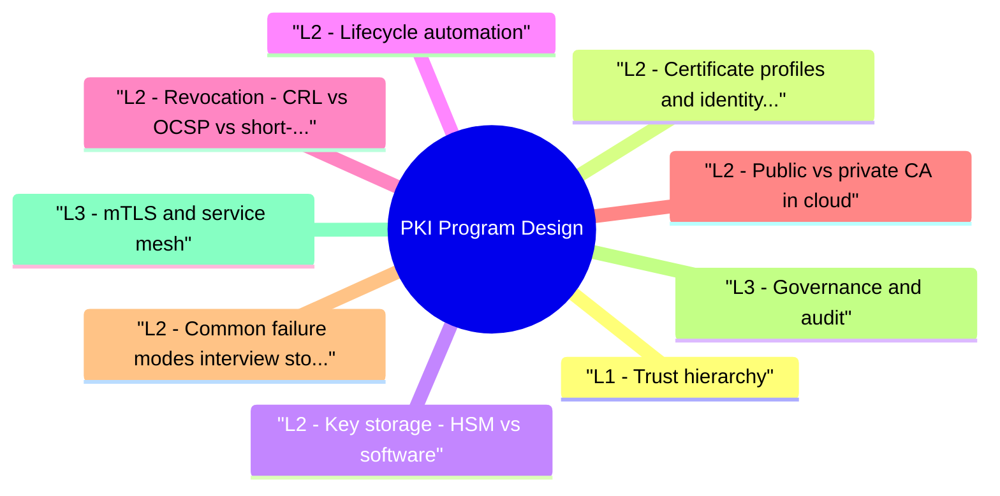

# PKI Program Design revision map

I keep this PKI Program Design map for the night before a screen, when five markdown files is too many clicks. Built from Critical Clarification PKI Program Design Misconceptions.md, PKI Program Design - Comprehensive Guide.md, PKI Program Design - Interview Questions & Answers.md, PKI Program Design - Quick Reference.md. Twenty minutes. Then I close the laptop.

## L1 - Trust hierarchy
- Root private key never online; air-gapped or HSM with dual control.
- Separate intermediates by environment and purpose-never one intermediate for prod + dev.
- Cross-signing only when migration requires; document trust store updates.

## L2 - Certificate profiles and identity proofing
- Identity proofing: Who may request which SAN? Automated enrollment via SPIFFE/SPIRE, IAM role -> cert mapping, or manual for legacy.
- **Wildcard *.prod.example.com** on shared intermediate with no audit.
- Shared private key across load balancers (copy/paste PEM).
- Years-long internal cert lifetimes because rotation is hard.

## L2 - Key storage: HSM vs software
- Interview: Root on offline HSM; issuing intermediates on online HSM with M-of-N ceremony for root signing events.

## L2 - Lifecycle automation
- Discovery problem: Most PKI outages are unknown inventory until expiry.
- Renewal SLO: e.g. alert at 30/14/7 days, auto-renew at 60% lifetime, canary deploy after cert change.

## L2 - Revocation: CRL vs OCSP vs short-lived certs
- Incident: Compromised intermediate -> revoke intermediate, publish CRL/OCSP, push trust store updates, re-issue all leaf certs. Chrome CRLSet and Apple trust updates for public CAs.
- Must-staple (TLS Feature extension): forces stapling-ops cost if misconfigured.

## L2 - Public vs private CA in cloud
- Private CA use cases: mTLS east-west, VPN, 802.1X, code signing internal tools.

## L2 - Common failure modes (interview stories)
- Expiry outage - forgotten cert on load balancer or API gateway (monitor all SANs including internal).
- Chain incomplete - missing intermediate in deploy bundle.
- Weak key - RSA 1024, SHA-1 signatures (legacy).
- Shared dev cert in prod - wrong intermediate trust.
- Compromised CA - DigiNotar, TrustCor distrust events-need migration plan.
- CT log gaps - public mis-issuance detection via Certificate Transparency.

## L3 - Governance and audit
- Certificate inventory CMDB: owner, SAN, expiry, CA, key location.
- Separation of duties: requester ≠ approver ≠ installer.
- Audit log of CA operations (issue, revoke, policy change).
- Quarterly review of wildcard and long-lived exceptions.

## L3 - mTLS and service mesh
- Istio/Linkerd/App Mesh use SDS to rotate certs. SPIFFE ID in SAN (spiffe://trust/domain/workload/id) enables portable identity.
- Interview: mTLS encryption + authentication; still need authZ at app layer.

## Interview clusters

## Cross-links
- TLS · Secrets Management and Key Lifecycle · Kubernetes Security Hardening · Zero Trust Architecture for Product Security

## Cheat sheet bits

## Hierarchy
- Offline root (HSM) -> Issuing intermediates (prod/dev/mTLS) -> Leaf certs

## Lifetimes
- Public web: ≤90d, automated (ACME)
- Internal/mTLS: 24h-90d, SPIRE/cert-manager
- Code signing: years, HSM, strict ceremony

## Revocation
- Short-lived > OCSP staple > OCSP > CRL for most designs

## Automation
- cert-manager · SPIRE/SPIFFE · step-ca · Venafi · AWS PCA

## Outage prevention
- Inventory · renewBefore 33% lifetime · 30/14/7d alerts · game days

## Incident (intermediate compromise)
- Revoke -> re-issue -> trust store update -> CT/audit -> comms

## Interview one-liner

## Cross-reads
- TLS · Secrets Management and Key Lifecycle · Kubernetes Security Hardening

## Traps that dump interviews

## "Let's Encrypt handles PKI so we don't need a program."
- Wrong. Public ACME solves public DV TLS only-not mTLS, code signing, internal service identity, or inventory/discipline for non-ACME certs.

## "Longer certificate lifetime reduces operational risk."
- Wrong. Long lifetimes delay rotation skill and extend compromise window. Industry moves to 90-day or shorter with automation.

## "Wildcard certs simplify security."
- Wrong. Wildcards expand blast radius-one private key protects all subdomains; strict issuance policy and monitoring required.

## "Revocation always saves you."
- Wrong. Clients soft-fail OCSP; revocation is slow. Short-lived certs + automation are primary; revocation is incident response.

## "Copying the same cert to all load balancers is fine."
- Wrong. Key proliferation increases leak risk; prefer centralized issuance or per-node short-lived certs via automation.

## "Private CA means we don't need to monitor expiry."
- Wrong. Internal certs cause major outages when forgotten-often worse visibility than public CAs.

## "mTLS replaces application authorization."
- Wrong. mTLS proves service identity at transport layer; authZ for data/actions still required.

## "CT logs are only for public CAs."
- Mostly public, but the mis-issuance detection mindset applies-audit internal CA logs similarly.

## Prompts I drill out loud

- Why use an offline root CA?
- CRL vs OCSP vs short-lived certs?
- What breaks when an intermediate CA is compromised?
- HSM vs software keys for internal CA?
- How does cert-manager fit into Kubernetes PKI?
- Senior: Design internal mTLS for 500 microservices
- Authoritative references

## 60-second answer
- Q: How do you prevent certificate expiry outages at scale?

## Sibling folders

- Stay inside this folder for the long guide. Jump only when a section names a sibling topic.
- Cookie Security, CSRF, XSS, JWT, OAuth, and TLS show up as neighbors on a lot of these maps.
