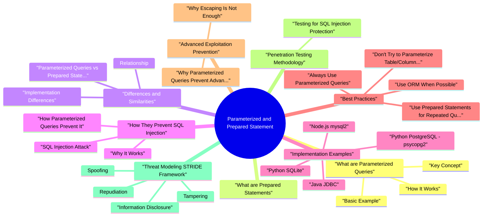

# Parameterized and Prepared Statement revision map

Parameterized and Prepared Statement in one sitting. That is the deal. I mined Critical Clarification Parameterized Queries vs Pr.md, Parameterized Queries and Prepared Statements - Co.md, Parameterized Queries and Prepared Statements - In.md, Parameterized Queries and Prepared Statements - Qu.md. The outline keeps every H2 I cared about from those files.

### Why They Matter
- Prevents SQL injection - Primary defense mechanism
- Separates code from data - Database treats input as data
- Type safety - Database handles type conversion
- No manual escaping needed - Database handles encoding
- Query optimization - Database can cache execution plans
- Faster repeated queries - Parse once, execute many times
- Reduced overhead - Less parsing and compilation

## What are Parameterized Queries
- A parameterized query is a SQL query that uses placeholders (parameters) for values that will be provided at runtime, rather than embedding values directly in the SQL string.

### Key Concept
- Separate SQL structure from data values:
- SQL structure: Defined at development time (safe, constant)
- Data values: Provided at runtime (user input, treated as data)
- Query parsed and optimized once by database
- Execution plan cached for reuse
- Only parameter values change between executions

### Basic Example
- See the source section `Basic Example` for the worked example.

### How It Works
- Query Structure Defined:
- ? is a placeholder (parameter marker)
- Query structure is constant (no user input)
- Values Provided Separately:
- Values provided as separate parameter
- Database substitutes values into placeholders
- Database Processing:
- Database parses query structure (safe, constant)

## What are Prepared Statements
- A prepared statement is a parameterized query that is pre-compiled by the database server for better performance.

## Differences and Similarities

### Parameterized Queries vs Prepared Statements
- See the source section `Parameterized Queries vs Prepared Statements` for the worked example.

### Relationship
- Prepared statements are a type of parameterized query:
- All prepared statements use parameters
- Not all parameterized queries are pre-compiled
- Prepared statements add performance optimization

### Implementation Differences
- SQLite, MySQLi, ODBC: ?
- MySQL (Python), PostgreSQL: %s
- Oracle, .NET: :name (named parameters)

## How They Prevent SQL Injection

### SQL Injection Attack
- See the source section `SQL Injection Attack` for the worked example.

### How Parameterized Queries Prevent It
- See the source section `How Parameterized Queries Prevent It` for the worked example.

### Why It Works
- Query Structure is Constant:
- SQL structure defined at development time
- No user input in SQL structure
- Cannot be manipulated
- Parameters are Treated as Data:
- Database escapes parameters automatically
- Parameters cannot change query structure
- SQL injection impossible

## Implementation Examples

### Python (SQLite)
- See the source section `Python (SQLite)` for the worked example.

### Python (PostgreSQL - psycopg2)
- See the source section `Python (PostgreSQL - psycopg2)` for the worked example.

### Java (JDBC)
- See the source section `Java (JDBC)` for the worked example.

### Node.js (mysql2)
- See the source section `Node.js (mysql2)` for the worked example.

### PHP (PDO)
- See the source section `PHP (PDO)` for the worked example.

## Best Practices

### Always Use Parameterized Queries
- See the source section `Always Use Parameterized Queries` for the worked example.

### Use Prepared Statements for Repeated Queries
- See the source section `Use Prepared Statements for Repeated Queries` for the worked example.

### Don't Try to Parameterize Table/Column Names
- See the source section `Don't Try to Parameterize Table/Column Names` for the worked example.

### Use ORM When Possible
- See the source section `Use ORM When Possible` for the worked example.

### Validate Input Types
- See the source section `Validate Input Types` for the worked example.

## Advanced Exploitation Prevention

### Why Parameterized Queries Prevent Advanced Attacks
- Advanced SQL Injection Techniques Prevented:
- Union-Based Injection:
- Boolean-Based Blind Injection:
- Time-Based Blind Injection:

### Why Escaping Is Not Enough
- See the source section `Why Escaping Is Not Enough` for the worked example.

## Penetration Testing Methodology

### Testing for SQL Injection Protection
- Find all database interactions
- Identify user input points
- Map input to SQL queries
- Check if queries use placeholders
- Verify parameters bound correctly
- Test with SQL injection payloads
- String concatenation: f"SELECT * FROM users WHERE username = '{username}'"
- String formatting: "SELECT * FROM users WHERE username = '%s'" % username

## Threat Modeling (STRIDE Framework)

### Spoofing
- Threat: Attacker spoofs legitimate user via SQL injection.
- Authentication bypass via SQL injection
- Impersonation through manipulated queries
- Parameterized queries prevent SQL injection
- Proper authentication mechanisms
- Input validation (additional layer)

### Tampering
- Threat: Attacker modifies data via SQL injection.
- UPDATE/DELETE statements via SQL injection
- Data manipulation through injected queries
- Parameterized queries prevent SQL injection
- Principle of least privilege
- Input validation

### Repudiation
- Threat: Actions via SQL injection cannot be attributed.
- Malicious queries appear as legitimate
- No audit trail for injected queries
- Parameterized queries prevent SQL injection
- Comprehensive logging
- Audit trails

### Information Disclosure
- Threat: Attacker accesses sensitive data via SQL injection.
- SELECT statements via SQL injection
- Data extraction through injected queries
- Parameterized queries prevent SQL injection
- Principle of least privilege
- Data encryption

### Denial of Service
- Threat: Attacker causes DoS via SQL injection.
- Resource exhaustion via complex queries
- Database overload through injected queries
- Parameterized queries prevent SQL injection
- Query timeout limits
- Resource limits

### Elevation of Privilege
- Threat: Attacker gains elevated privileges via SQL injection.
- Privilege escalation through injected queries
- Administrative access via SQL injection
- Parameterized queries prevent SQL injection
- Principle of least privilege
- Proper access controls

## Real-World Case Studies

### Case Study 1: Authentication Bypass
- Background: During penetration test, discovered SQL injection in login functionality.
- Confidentiality: Critical - Unauthorized access
- Integrity: High - Could modify data
- Business Impact: Critical - Complete authentication bypass

### Case Study 2: Data Extraction
- Background: Security assessment revealed SQL injection in search functionality.
- Confidentiality: Critical - Data breach
- Integrity: High - Could modify data
- Business Impact: Critical - Complete data compromise

## Advanced Mitigations

### Defense in Depth Strategy
- Layer 1: Parameterized Queries (Primary Defense)
- Layer 2: Input Validation (Additional Layer)

## SAST/DAST Detection

### SAST (Static Application Security Testing)
- See the source section `SAST (Static Application Security Testing)` for the worked example.

### DAST (Dynamic Application Security Testing)
- Test all form inputs
- Test URL parameters
- Test headers and cookies
- Check for SQL errors
- Check for unexpected behavior
- Check for data extraction
- Payloads should be treated as literal values
- No SQL errors should occur

## Risk Assessment

### Risk Matrix
- See the source section `Risk Matrix` for the worked example.

### Risk Calculation
- Example: SQL Injection in Authentication
- Common vulnerability
- Easy to exploit
- Widespread impact
- Complete authentication bypass
- Unauthorized access
- Data breach potential
- Financial: Unauthorized access, fraud

## Fundamental Questions

### What are parameterized queries and how do they prevent SQL injection?
- Parameterized queries use placeholders (parameters) for values that will be provided at runtime, separating SQL code from data.
- Query Structure Defined:
- ? is a placeholder (constant, safe)
- Query structure is defined at development time
- Values Provided Separately:
- Values provided as separate parameters
- Database binds values to placeholders
- Database Processing:

### What is the difference between parameterized queries and prepared statements?
- SQL query with placeholders for values
- Values provided at runtime
- May be parsed each time (depending on implementation)
- Primary focus: Security (preventing SQL injection)
- Parameterized query that is pre-compiled by database
- Query parsed and optimized once
- Execution plan cached for reuse
- Primary focus: Security + Performance

### Can you parameterize table names or column names?
- No, you cannot parameterize table names or column names. These are part of the SQL structure, not data values.
- Key Point: Only data values can be parameterized. SQL structure elements (table names, column names, SQL keywords) must use whitelisting.

## Implementation Questions

### Show examples of parameterized queries in different languages/frameworks.
- Note: Syntax varies (?, %s, :name), but the concept is the same - separate SQL structure from data values.

### How do prepared statements improve performance?
- Query Parsing (Once):
- Query parsed and validated once
- Execution plan created once
- Plan cached for reuse
- Query Optimization (Once):
- Database optimizes query once
- Optimization cached
- Faster subsequent executions

## Security Questions

### Why is input validation not enough to prevent SQL injection?
- Context Mismatch:
- Input might be valid but dangerous in SQL context
- Validation doesn't know how input will be used
- Bypass Techniques:
- Encoding can bypass validation
- Multiple encoding layers
- Alternative payload formats
- No Actual Protection:

### Can you explain how parameterized queries prevent advanced SQL injection techniques?
- Query structure is constant (no user input)
- Parameters are treated as data (not code)
- Database escapes parameters automatically
- No way to inject SQL code

## Performance Questions

### When should you use prepared statements vs regular parameterized queries?
- Query executed multiple times (loops, repeated calls)
- Performance is critical
- Database supports prepared statements
- Connection pooling is used
- Query executed once (single use)
- Performance not critical
- Simpler implementation preferred
- Database driver doesn't support prepared statements well

## Scenario-Based Questions

### You discover SQL injection in a login function. How would you fix it?
- See the source section `You discover SQL injection in a login function. How would you fix it?` for the worked example.

### How would you handle dynamic table names in a secure way?
- Problem: Table names cannot be parameterized.
- Key Point: Use whitelisting or mapping for SQL structure elements. Only parameterize data values.

## Advanced Questions

### What are the limitations of parameterized queries?
- Table/Column Names:
- Cannot be parameterized
- Must use whitelisting
- SQL Keywords:
- Cannot parameterize ORDER BY, GROUP BY, etc.
- Dynamic SQL Structure:
- Cannot dynamically change SQL structure
- Must use whitelisting for structure elements

### How do ORMs use parameterized queries?
- ORMs automatically use parameterized queries:
- Automatic parameterization
- Database agnostic
- Type safety
- Less boilerplate code

## Depth: Interview follow-ups - Parameterized / Prepared Statements
- Authoritative references: OWASP SQL Injection Prevention CS (prepared statements + safe APIs).
- Dynamic table/column names - cannot bind identifiers; how do you allowlist?
- Stored procedures - still risky if dynamic SQL inside.
- ORM edge cases: whereRaw, string-built order by.

## Key Concepts

### Parameterized Queries
- SQL query with placeholders (?, %s, :name)
- Values provided separately
- Prevents SQL injection
- Security benefit

### Prepared Statements
- Pre-compiled parameterized query
- Parsed once, executed many times
- Prevents SQL injection + performance
- Security + performance benefits

## Syntax by Database

## Code Patterns

### Vulnerable (String Concatenation)
- See the source section `Vulnerable (String Concatenation)` for the worked example.

### Secure (Parameterized Query)
- See the source section `Secure (Parameterized Query)` for the worked example.

## Protection Checklist
- Use parameterized queries for all user input
- Use prepared statements for repeated queries
- Whitelist table/column names (can't parameterize)
- Validate input types (additional layer)
- Use ORMs when possible (automatic parameterization)
- Follow principle of least privilege
- Test with SQL injection payloads

## Common Mistakes
- Trying to parameterize table/column names
- Using string concatenation with user input
- Relying on input validation alone
- Escaping manually instead of parameterizing
- Not using prepared statements for repeated queries

## When to Use

### Use Prepared Statements When
- Query executed multiple times
- Performance is critical
- Database supports it well

### Use Parameterized Queries When
- Query executed once
- Simpler implementation preferred
- Database support is limited

## Limitations
- Cannot parameterize table/column names (use whitelisting)
- Cannot parameterize SQL keywords (use whitelisting)
- Small overhead for single queries (negligible)
- Different syntax for different databases

## The clarification file, compressed

## ️ Common Misconceptions

### "Parameterized queries and prepared statements are the same thing"
- Truth: They are related but different concepts:
- Parameterized Queries: A general concept of separating SQL code from data
- Prepared Statements: A specific implementation of parameterized queries with performance benefits
- Parameterized queries can be implemented without prepared statements
- Prepared statements are a type of parameterized query
- Both prevent SQL injection when used correctly
- Prepared statements provide additional performance benefits

### "Prepared statements are only for performance"
- Truth: Prepared statements provide both security and performance benefits.
- Prevents SQL injection
- Separates code from data
- Database treats input as data, not code
- Query parsed once
- Execution plan cached
- Faster for repeated queries
- Reduced database load

### "Input validation can replace parameterized queries"
- Truth: Input validation cannot replace parameterized queries. They serve different purposes.
- Key Point: Parameterized queries prevent SQL injection. Input validation helps but doesn't prevent it.

### "Parameterized queries work for all SQL operations"
- Truth: Parameterized queries work for most SQL operations, but there are limitations for some cases.
- SELECT queries
- INSERT statements
- UPDATE statements
- DELETE statements
- WHERE clauses
- VALUES clauses
- ️ Table/column names (must use whitelisting)

### "All database drivers support prepared statements the same way"
- Truth: Different databases and drivers implement prepared statements differently.
- Key Point: Syntax varies (?, %s, :name), but the concept is the same.

### "Prepared statements are slower for single queries"
- Truth: For single queries, there may be a small overhead, but for repeated queries, prepared statements are much faster.
- Prepared statement: Slight overhead (parsing, compilation)
- Regular query: No overhead
- Difference: Negligible in most cases
- Prepared statement: Parse once, execute many times
- Regular query: Parse every time
- Difference: Significant performance gain

## Key Takeaways

### Understanding
- Parameterized queries and prepared statements are related but different
- Prepared statements provide both security and performance benefits
- Input validation cannot replace parameterized queries
- Parameterized queries work for most SQL operations
- Different databases use different syntax
- Prepared statements excel with repeated queries

### Common Mistakes
- Confusing parameterized queries with prepared statements
- Thinking input validation is sufficient
- Trying to parameterize table/column names
- Not using prepared statements for repeated queries
- Assuming all databases work the same way

## Summary Table
- Remember: Parameterized queries (prepared statements) are the primary defense against SQL injection, not input validation or sanitization!

## What sits next to this topic

- Stay inside this folder for the long guide. Jump only when a section names a sibling topic.
- Cookie Security, CSRF, XSS, JWT, OAuth, and TLS show up as neighbors on a lot of these maps.
