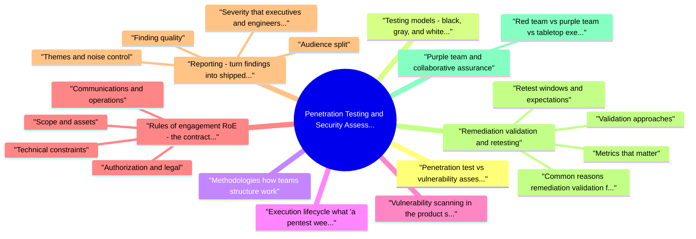

# Penetration Testing and Security Assessment revision map

This is the Penetration Testing and Security Assessment spine I actually use. Types, failures, fixes, traps. Sources: Critical Clarification Penetration Testing and Sec.md, Penetration Testing and Security Assessment - Comp.md, Penetration Testing and Security Assessment - Inte.md, Penetration Testing and Security Assessment - Quic.md. I do not treat it as a second textbook.

## Penetration test vs vulnerability assessment / scan vs bug bounty
- Practical sequencing: Use scanning and VA for baseline hygiene; use pentests for high-risk changes and adversarial validation; use bug bounty when you have mature triage, clear scope, and budget for rewards and noise.

## Testing models: black, gray, and white box
- Black box: Minimal insider knowledge; approximates an external attacker with public data. Slower discovery; can miss logic flaws visible in code.
- Gray box: Partial insider context (architecture diagrams, non-production accounts, API docs). Often the best efficiency for product teams.
- White box: Source, design, and sometimes build pipelines are visible. Strongest for logic flaws, crypto misuse, and dangerous defaults; pairs well with threat modeling.

## Methodologies (how teams structure work)
- You do not need to cite acronyms in every meeting, but align activities to a standard so expectations stay stable.
- OWASP Testing Guide / WSTG: Detailed web and API testing categories-from configuration and identity to business logic and client-side controls. Strong checklist for depth.

## Execution lifecycle (what "a pentest week" actually contains)
- Even when the sales sheet says "pentest," mature delivery separates discovery, validation, and narrative. The list below maps to PTES-style thinking without requiring jargon in every status meeting.
- Pre-engagement: Confirm RoE, access (VPN, SSO roles, API keys, device enrollment), emergency contacts, and SOC notification rules. Freeze scope changes unless a written addendum exists.

## Vulnerability scanning in the product stack
- Scanners differ by layer; teams rarely need "one tool," they need a triage model.
- Network scanners discover hosts, ports, and obvious network exposures. They miss application logic and authenticated abuse cases.
- Web/DAST scanners crawl and fuzz HTTP surfaces; quality improves dramatically with authentication and stable test data.
- SAST and IaC scanners find dangerous patterns in code and Terraform/CloudFormation; expect false positives that require developer judgment.
- Container and dependency scanners map CVEs to images and packages; severity must be weighed against runtime exposure and exploitability.
- Cloud posture tools (CSPM) flag public storage, permissive IAM, and missing encryption-excellent inputs for VA, often weak on app-layer business rules.

## Rules of engagement (RoE): the contract that keeps everyone employed
- RoE is more than a permission slip. It is the operational agreement that defines what, where, when, how, and who stops the test.

### Scope and assets
- In-scope: hostnames, IP ranges, app URLs, API gateways, cloud subscriptions (by ID), mobile apps, specific binaries, and environments (prod vs staging).
- Out-of-scope: third-party SaaS you do not own, partner integrations without written approval, legacy systems that cannot tolerate load, and "do not touch" data classes.
- Scope change process: how to request additions mid-engagement and who approves them.

### Authorization and legal
- Written authorization naming the vendor or internal team, date range, and systems.
- Data handling: whether testers may access PII, secrets, or production data; minimum necessary; storage and destruction expectations.
- Jurisdiction and compliance: regional restrictions, customer contracts, and regulatory context (e.g., finance, healthcare, government).

### Technical constraints
- Testing hours and time zones; maintenance windows.
- Rate limits and load constraints; prohibition of destructive actions unless explicitly allowed.
- Exploitation boundaries: which vulnerability classes may be exploited end-to-end; when to use harmless proofs; rules for credential stuffing, password spraying, and phishing simulations (if any).
- Cloud and multi-tenant: no cross-customer access; no use of shared services that could affect other tenants; respect for break-glass and admin consoles.

### Communications and operations
- Primary and escalation contacts on both sides; security operations center (SOC) notification so findings are not mistaken for real incidents.
- Incident pre-declaration: agreed subject lines or tickets so detections route correctly.
- Stop conditions: service instability, accidental data exposure, or legal concern triggers an immediate halt and debrief.

### Success criteria and deliverables
- Expected outcomes: executive readout, technical report, joint session with engineering, retest window length, and artifact formats.
- Well-run RoE reduces "surprise red buttons," prevents duplicate incident response, and gives testers the clarity needed to work aggressively within safety rails.

### Scoping pitfalls that create incidents or weak tests
- "Test everything" without asset inventory: Leads to missed subsidiaries, orphaned domains, or partner-hosted login pages that were never in scope.
- Production-only access late in the quarter: Engineers avoid risky fixes during freeze windows; staging-first engagements ship faster remediations.
- Shared credentials and unnamed roles: "Use the QA user" is insufficient. Name the role matrix (member, admin, support, API service principal) and which abuse cases are expected.
- Third-party dependency ambiguity: CDNs, WAFs, identity providers, and payment processors often need coordinated approval; spell out what touches vendor infrastructure.
- Denial-of-service ambiguity: Many RoE documents forbid DoS while still needing performance edge-case tests; clarify application-level throttling tests versus volumetric floods.

## Reporting: turn findings into shipped fixes

### Audience split
- Executive summary: risk posture in plain language, top themes (identity, data exposure, supply chain), business impact scenarios, and what was not tested.
- Technical section: reproducible steps, affected components, request/response snippets or logs (redacted), tool output when helpful, and clear distinction between root cause and symptoms.

### Finding quality
- Title and identifier (stable across retest).
- Severity and rationale: tie to exploitability, blast radius, and data sensitivity; avoid "CVSS-only" stories when business context matters.
- Prerequisites: authentication role, feature flags, network position.
- Steps to reproduce that another engineer can follow without the original tester.
- Evidence: screenshots, timestamps, hashes, serialized objects-enough to convince a skeptic and support compliance evidence.
- Impact: what an attacker gains; confidentiality, integrity, availability angles.
- Recommendations: concrete patterns (parameterized queries, SSRF egress controls) not generic "validate input."
- References: CWE, OWASP, vendor guidance where applicable.

### Themes and noise control
- See the source section `Themes and noise control` for the worked example.

### Severity that executives and engineers both accept
- CVSS is a useful shorthand; it is not a substitute for product judgment. A readable severity narrative answers:
- Who can exploit this? Internet anonymous, authenticated low-privilege user, insider, compromised CI token.
- What breaks? Single tenant vs cross-tenant; read vs write; financial integrity vs marketing site defacement.
- How hard is recovery? Revocable token vs stolen database snapshot.
- Is it already exploited or wormable? Public exploit code and ransomware relevance change urgency.

### Report outline (proven structure)
- Executive summary with risk posture and top three themes.
- Scope, methodology, and limitations (what was not tested).
- Key findings table: identifier, title, severity, component, status.
- Detailed findings in consistent order: description, impact, reproduction, evidence, recommendations, references.
- Appendix for lengthy HTTP transcripts, scan exports (redacted), and tool versions.

## Remediation validation and retesting
- Remediation work fails when "fixed in Jira" does not mean fixed in production.

### Validation approaches
- Fix review: pull request or config change inspection for correctness, not just presence of a patch.
- Targeted retest: rerun the proof of concept; attempt bypass variants (encoding, parser differentials, role changes).
- Regression checks: ensure the fix did not break adjacent controls or introduce new weaknesses.
- Environment parity: confirm the fix is deployed where customers actually run (canary vs full rollout).

### Retest windows and expectations
- Contractually or internally define how long retests are included, how many cycles, and SLAs for scheduling. Track time-to-fix and time-to-verify separately; both matter for risk reduction.

### Metrics that matter
- Percentage of criticals verified closed within SLA.
- Recurrence rate (same CWE class reopening).
- Coverage of retested assets versus total scope.

### Common reasons remediation validation fails
- Fix applied only in a branch not yet deployed to the environment customers use.
- Partial patch: parameter filtered in one endpoint but sibling route still vulnerable.
- Compensating control dependency: WAF rule blocks the original payload; underlying deserialization flaw remains.
- Changed identifiers: object IDs rotate but authorization still fails open on "missing" resources.
- Missing negative tests: unit tests cover happy path only; retest finds bypass via content-type or method tunneling.

## Purple team and collaborative assurance
- Purple team outcomes include: mapped ATT&CK techniques with detection coverage; tuned alerts reduced false positives; faster incident handoffs; and shared language between offense and defense.
- Purple teaming is not "a pentest with spectators." It is instrumented rehearsal-expect detection engineering tickets alongside product fixes.

### Red team vs purple team vs tabletop exercise
- See the source section `Red team vs purple team vs tabletop exercise` for the worked example.

## Product security lens: beyond scanning the perimeter
- Traditional pentests focus on exposed software. Product security assessments ask whether the feature set is safe by design.
- Abuse cases: treat misuse scenarios as requirements; pair with STRIDE-style thinking on spoofing, tampering, repudiation, information disclosure, denial of service, and elevation of privilege.
- Identity and authorization: object-level access control, sharing links, admin impersonation, and org-boundary checks-not only "login works."
- Data lifecycle: export, backup, search indexing, retention, and logging of sensitive fields.
- Supply chain: third-party SDKs, build integrity, signing, dependency provenance, and CI/CD secrets exposure.
- Client and API contracts: mass assignment, IDOR across resources, GraphQL depth and batching, webhook authenticity, idempotency keys, and rate limiting.
- Operational safety: feature flags, kill switches, and progressive rollout guardrails.

### Triggers that justify deeper product security assessment
- New trust boundary: cross-tenant analytics, marketplace integrations, AI features acting on customer data, or delegated administration.
- Material auth changes: SSO migration, custom MFA, session model changes, or "login with" providers.
- High-risk data classes: health, financial, government, children, or cryptographic key custody.
- Break-glass or support tooling that can impersonate users or export data.
- Acquisition integration where two identity models and data planes merge.

### Artifacts that pair well with pentest reports
- Updated threat model diagram and abuse cases.
- Security requirements added to epics (rate limits, audit fields, encryption expectations).
- Test data contracts so DAST and manual testing can reach protected states legally and safely.
- Engineering playbooks for secure defaults in frameworks your teams use.

## Third-party testers, independence, and knowledge transfer
- External firms bring fresh perspective; internal teams bring continuity. Healthy programs blend both.
- Independence: Separating testers from authors reduces blind spots; rotating vendors every few cycles reduces stale playbooks.
- Access hygiene: Use time-bound credentials, break-glass accounts with alerting, and session recording where policy allows.
- Knowledge transfer: Require walkthrough sessions and recorded PoCs; findings should not live only in a PDF.
- Safe harbor: Bug bounty and external testing programs should publish legal safe harbor language aligned with your RoE.

## Operational best practices (concise)
- Start with RoE and scope clarity; ambiguity causes incidents or watered-down testing.
- Pair automation with manual exploitation; scanners find candidates, humans prove impact.
- Report for remediation, not for shock value; prioritize actionable themes.
- Validate fixes in production context; retest with adversarial mindset (bypass attempts).
- Purple team for detection and response quality; pentest for exploit paths in software.
- Use the product security lens so assessments track how features move data and trust, not only CVEs.

## Further reading (authoritative sources)
- PTES: http://www.pentest-standard.org/ - methodology overview.
- NIST SP 800-115: https://csrc.nist.gov/publications/detail/sp/800-115/final - organizational technical security testing; map to your program and compliance story.
- OWASP Testing Guide (WSTG): https://owasp.org/www-project-web-security-testing-guide/ - detailed technical test cases.

## Scope, objectives, and test types

### How do you explain the difference between a penetration test, a vulnerability assessment, and automated scanning?
- See the source section `How do you explain the difference between a penetration test, a vulnerability assessment, and automated scanning?` for the worked example.

### When would you recommend a bug bounty program versus an annual penetration test-and can they replace each other?
- See the source section `When would you recommend a bug bounty program versus an annual penetration test-and can they replace each other?` for the worked example.

### What belongs in rules of engagement before any testing starts?
- See the source section `What belongs in rules of engagement before any testing starts?` for the worked example.

### Walk through how you scope a penetration test for a web application, its APIs, and a mobile client.
- See the source section `Walk through how you scope a penetration test for a web application, its APIs, and a mobile client.` for the worked example.

### How do you handle scope disputes or requests to "just quickly" test something that was marked out of scope?
- See the source section `How do you handle scope disputes or requests to "just quickly" test something that was marked out of scope?` for the worked example.

### When do you choose black-box, gray-box, or white-box testing for a product?
- See the source section `When do you choose black-box, gray-box, or white-box testing for a product?` for the worked example.

## Execution, triage, and business logic

### How do you prioritize findings when engineering capacity is limited?
- See the source section `How do you prioritize findings when engineering capacity is limited?` for the worked example.

### How do you reduce false positives from scanners during an assessment?
- See the source section `How do you reduce false positives from scanners during an assessment?` for the worked example.

### How do you approach business-logic flaws that scanners will not find?
- See the source section `How do you approach business-logic flaws that scanners will not find?` for the worked example.

## Reporting, disclosure, and stakeholder alignment

### What makes a penetration test finding genuinely useful to developers?
- See the source section `What makes a penetration test finding genuinely useful to developers?` for the worked example.

### How should the executive summary differ from the technical report-and how do you keep them aligned?
- See the source section `How should the executive summary differ from the technical report-and how do you keep them aligned?` for the worked example.

### A critical issue appears on the last day of the engagement. What do you do?
- See the source section `A critical issue appears on the last day of the engagement. What do you do?` for the worked example.

## Remediation, retest, and validation

### How do you validate that a vulnerability was fixed correctly?
- See the source section `How do you validate that a vulnerability was fixed correctly?` for the worked example.

### What should a retest agreement or SLA cover between security and engineering?
- See the source section `What should a retest agreement or SLA cover between security and engineering?` for the worked example.

## Purple team, detection, and operations

### What is purple teaming, and how is it different from a penetration test?
- See the source section `What is purple teaming, and how is it different from a penetration test?` for the worked example.

### Give a concrete purple-team scenario for a SaaS product and security operations.
- See the source section `Give a concrete purple-team scenario for a SaaS product and security operations.` for the worked example.

## Product security and interview angles

### How does a product security assessment differ from a classic external penetration test?
- See the source section `How does a product security assessment differ from a classic external penetration test?` for the worked example.

### Where in the SDLC should assessments land for maximum use?
- See the source section `Where in the SDLC should assessments land for maximum use?` for the worked example.

### How do you test safely when production is necessary but staging is imperfect?
- See the source section `How do you test safely when production is necessary but staging is imperfect?` for the worked example.

### How would you explain the value of your assessment program to a product manager or executive in an interview-style answer?
- See the source section `How would you explain the value of your assessment program to a product manager or executive in an interview-style answer?` for the worked example.

## Authoritative references
- PTES - Penetration Testing Execution Standard
- NIST SP 800-115 - Technical Guide to Information Security Testing and Assessment
- OWASP - Web Security Testing Guide

## Testing Types

## Testing Methodologies

## Testing Phases (PTES)
- Pre-engagement interactions
- Intelligence gathering
- Threat modeling
- Vulnerability analysis
- Exploitation
- Post-exploitation
- Reporting

## Common Tools

## Risk Prioritization

## Reporting Elements
- Executive summary
- Methodology
- Findings with risk ratings
- Proof of concepts
- Recommendations
- Remediation guidance

## Key Principles
- Structured methodology
- Risk-based approach
- Combine automated and manual testing
- Clear and actionable reporting
- Follow-up and verification

## What people get wrong

## ️ Common Misconceptions

### "Penetration testing and security assessment are the same thing"
- Truth: Penetration testing is a subset of security assessment - they serve different purposes.
- Broader evaluation of security posture
- Includes policy review, architecture review, code review
- Can be manual or automated
- Evaluates people, process, and technology
- Simulated attack to find vulnerabilities
- Typically hands-on testing
- Focuses on exploitable vulnerabilities

### "Automated tools can replace manual penetration testing"
- Truth: Automated tools and manual testing are complementary - both are needed.
- Good for finding known vulnerabilities
- Efficient for large-scale scanning
- Consistent coverage
- Limited to what they're programmed to find
- Finds business logic flaws
- Identifies complex attack chains
- Understands application context

### "Penetration testing should test everything with equal intensity"
- Truth: Penetration testing should be risk-based, focusing on critical assets and high-risk areas.
- Identify critical assets and data flows
- Prioritize high-risk attack vectors
- Focus testing on most likely threats
- Balance coverage with time/resources

### "Finding all vulnerabilities is the goal of penetration testing"
- Truth: The goal is risk reduction, not finding every possible vulnerability.
- Identify exploitable vulnerabilities
- Understand attack surface and risk
- Provide actionable remediation guidance
- Support risk-based decision making

### "Penetration testing is only needed once or before production release"
- Truth: Penetration testing should be periodic and after major changes, not just one-time.
- Initial assessment before production
- Periodic assessments (annual or quarterly)
- After major changes (new features, architecture changes)
- After security incidents
- Based on risk profile

## Key Takeaways
- Different Scopes: Security assessment is broader, penetration testing is one component
- Automated + Manual: Both are needed, complementary approaches
- Risk-Based: Focus testing on high-risk areas and critical assets
- Risk Reduction Goal: Goal is risk reduction, not finding everything
- Regular Testing: Periodic and after major changes, not just one-time

## If I only open two more topics

- Stay inside this folder for the long guide. Jump only when a section names a sibling topic.
- Cookie Security, CSRF, XSS, JWT, OAuth, and TLS show up as neighbors on a lot of these maps.
