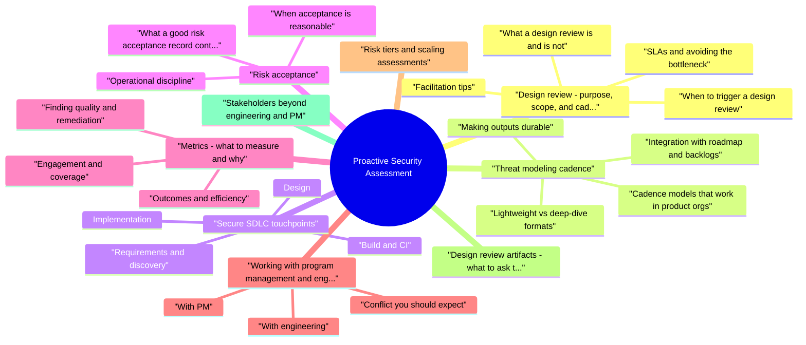

# Proactive Security Assessment revision map

I keep this Proactive Security Assessment map for the night before a screen, when five markdown files is too many clicks. Built from Critical Clarification Proactive Security Assessme.md, Proactive Security Assessment - Comprehensive Guide.md, Proactive Security Assessment - Interview Question.md, Proactive Security Assessment - Quick Reference.md. Twenty minutes. Then I close the laptop.

## Design review: purpose, scope, and cadence

### What a design review is (and is not)
- One-page intent: user story, success metrics, launch timeline.
- Architecture diagram (even a whiteboard photo) showing components and data stores.
- Data classification for new or changed data (PII, credentials, payment, health, etc.).
- Identity model: who acts (human, service, partner), and what they can do.
- Integration list: OAuth providers, webhooks, queues, ML endpoints, admin tools.
- Findings ranked by severity and exploitability in the proposed design.
- Concrete mitigations: patterns, libraries, config changes, or control ownership (e.g., "platform team owns mTLS between these two tiers").
- Residual risks called out explicitly if something cannot be fully mitigated before launch.

### When to trigger a design review
- Use risk-based triggers rather than "every PR." Typical triggers include:
- New external surface (public API, mobile client, partner integration, admin console).
- Changes to authentication, session, or authorization for a high-value asset.
- New data stores or cross-region replication of sensitive data.
- Introduction of privileged operations (impersonation, support tools, bulk export).
- Material dependency changes (new identity broker, payment processor, LLM vendor with data egress).

### SLAs and avoiding the bottleneck
- Teams fear security because reviews arrive late or without predictable turnaround. Publish transparent SLAs (even aspirational at first), for example:
- Triage: acknowledge the request within one business day with a risk tier and expected review window.
- Standard features: written feedback within N business days of complete materials.
- Expedited: same-week path for launches with executive risk acceptance already in flight.
- Office hours for ambiguous "is this a review?" questions.
- Tiered depth: L1 checklist for small changes; L2 architecture session for high impact.
- Reusable patterns: "approved reference designs" for common flows (OAuth, webhooks, file upload) so teams self-serve.
- Parallel tracks: security feedback on the design while engineering spikes implementation feasibility.

### Facilitation tips
- Start with assumptions and threats, not solutions-avoid "quiz the architect" dynamics.
- Ask abuse-case questions: "What happens if this token is stolen?" "Who can call this internal endpoint?"
- Close with a single owner for each action item and a date tied to the release train or milestone.

## Threat modeling cadence

### Cadence models that work in product orgs
- Event-driven (most common): run (or refresh) threat modeling when a design review trigger fires-new surface, new data class, new integration.
- Release-train sampling: for teams shipping continuously, schedule periodic sessions (e.g., quarterly) on the highest-risk services or features shipped that quarter.
- Baseline + delta: maintain a living model for core platforms; for each major feature, document only what changed and new threats.

### Lightweight vs deep-dive formats
- Data flow diagram on a whiteboard or Miro.
- STRIDE-style prompts per element: spoofing, tampering, repudiation, information disclosure, denial of service, elevation of privilege.
- Output: 5-10 bullets in the design doc or ticket, linked to backlog items.
- Multiple stakeholders (service owner, identity, data, SRE).
- Abuse cases and trust-boundary tests.
- Output: threat model document, prioritized mitigations, explicit residual risks for acceptance.

### Making outputs durable
- Threat models fail when they live only in meeting notes. Persist the following where engineers already look (wiki, ADR, design doc):
- Scope and out of scope boundaries.
- Assets and data classes.
- Trust boundaries and entry points.
- Top threats with mitigation status (planned, implemented, accepted).
- Review date and owner for the next refresh.

### Integration with roadmap and backlogs
- PM cares about dates and scope; engineering cares about capacity. Tie threat modeling to milestones:
- "Threat model complete" as a definition-of-ready gate for high-risk epics (not for every story).
- Security findings become normal backlog items with the same estimation and prioritization rituals as functional work-avoid a shadow backlog only security tracks.

## Secure SDLC touchpoints
- A secure SDLC is not a single checklist; it is a set of touchpoints where risk is surfaced early enough to change the plan cheaply. Map these to your actual ceremonies (sprint planning, RFC process, release checklist).

### Requirements and discovery
- Capture security-relevant requirements: authentication strength, retention, residency, audit needs, fraud constraints.
- Identify compliance obligations early (PCI scope, HIPAA BAA, SOC commitments) so architecture is not retrofitted.

### Design
- Design reviews and threat modeling (above).
- Prefer secure defaults in platform choices (managed identity, private networking, centralized secrets).

### Implementation
- Secure coding guidance and copy-paste-safe examples for risky patterns (authz checks, deserialization, HTML rendering).
- Pull-request expectations: security-sensitive paths get human review; use CODEOWNERS for critical areas.
- Dependency policy: approved sources, pinning, automated updates with break-glass process.

### Build and CI
- SAST, secret scanning, IaC checks, and dependency scanners on merge or nightly-with noise management so developers trust signal.
- Policy-as-code for cloud and containers where applicable.

### Test and pre-release
- Targeted DAST or API fuzzing for external interfaces.
- Penetration tests or red-team exercises for high-risk launches-not as the first security activity.
- Chaos or resilience tests where abuse looks like overload or dependency failure.

### Release and operate
- Feature flags and gradual rollout to limit blast radius.
- Runbooks for security incidents involving the new component.
- Telemetry for auth failures, policy denials, and anomaly signals (see Metrics).

## Risk acceptance
- Not every finding blocks a launch. Mature programs distinguish fix, defer with plan, and accept with accountability.

### When acceptance is reasonable
- Low likelihood and low impact after mitigations, with monitoring in place.
- Compensating controls reduce exposure (e.g., admin feature only on corp network with device compliance).
- Business deadline with documented tradeoff-provided leadership with authority accepts the leftover risk.

### What a good risk acceptance record contains
- Description of the gap and affected assets/users.
- Threat scenario in plain language (who attacks, how, what they get).
- Residual likelihood/impact using your standard scale (even qualitative is fine if consistent).
- Compensating controls and expiration: acceptance should expire (e.g., 90 days) or trigger on material change (new data class, new exposure).
- Named approver at the right level (engineering director, CISO delegate, product VP-per your policy).
- Linked work items if the plan is "accept now, remediate next quarter."

### Operational discipline
- Store acceptances in a single system of record (GRC tool, risk register, or structured wiki)-not scattered emails.
- Re-review on architecture changes; "accepted last year" is not perpetual permission.
- Escalate patterns of repeated acceptance for the same issue class to architecture or platform investment.

## Metrics: what to measure and why
- Metrics should drive behavior and investment, not vanity charts.

### Engagement and coverage
- Percentage of high-risk launches that received design review or threat modeling before implementation peak.
- Time from review request to first response (SLA adherence).
- Participation: unique teams or services engaged per quarter.

### Finding quality and remediation
- Mean time to remediate by severity tier.
- Recurrence rate by vulnerability class (signals training, libraries, or platform gaps).
- Findings per assessment trend-interpret carefully; a spike can mean better detection or riskier projects.

### Outcomes and efficiency
- Security defects found in prod vs earlier stages (shift-left ratio).
- Incidents tied to missing controls that the SDLC was supposed to catch-use for retrospective process fixes.
- Developer satisfaction (short survey after engagements): was security helpful, clear, and timely?

## Working with program management and engineering

### With PM
- Translate findings into user-visible or business risk: "Account takeover," "data leak of X," "regulatory exposure," not only CVE IDs.
- Offer options, not ultimatums: scope cut, phased launch, feature flag, temporary control, or scheduled hardening.
- Align on definition of done for security work items so they are not deprioritized silently.
- Use the same roadmap artifacts PM already maintains-do not maintain a parallel secret plan.

### With engineering
- Respect on-call and sprint load; batch questions; come prepared with diagrams consumed asynchronously first.
- Teach while reviewing-link to internal patterns and postmortems so the next project needs less hand-holding.
- Automate the boring parts so human time goes to judgment-heavy problems (authz models, novel integrations).
- Celebrate teams that engage early; positive reinforcement changes culture faster than compliance mandates.

### Conflict you should expect
- "Security is vague." -> Respond with specific scenarios and concrete acceptance criteria for fixes.
- "We'll fix in v2." -> Negotiate bounded risk, timeline, and monitoring; document acceptance.
- "No one told us." -> Improve discovery triggers and templates, not blame.

## Risk tiers and scaling assessments
- Example mapping (illustrative-calibrate to your org):
- Tiers are not permanent labels: a service moves up when it begins storing new data classes, exposes a new network path, or becomes critical to revenue operations.

## Design review artifacts: what to ask teams to attach
- Consistency reduces back-and-forth. Publish a short "security appendix" for RFCs or design docs:
- Problem and users - Who benefits; which personas or services act on the system?
- Data - New or changed data elements and classification; retention; cross-border flow if any.
- Trust boundaries - Diagram with entry points (browser, mobile, partner, batch, admin).
- AuthN / AuthZ - How identity is established; how authorization is enforced (including service-to-service).
- Sensitive operations - Export, delete, impersonation, privilege elevation, webhook issuance, API key creation.
- Third parties - Vendors, subprocessors, model providers; what data leaves your boundary.
- Failure and abuse - Rate limits, circuit breakers, fraud hooks, audit logging expectations.

## Stakeholders beyond engineering and PM
- Proactive programs stall when security forgets partners who constrain or enable launches:
- SRE / platform - Network segmentation, secrets platforms, service mesh, break-glass access.
- Privacy and legal - DPIA triggers, subprocessors, contractual security exhibits.
- IT / enterprise identity - SSO constraints, conditional access, device trust for admin paths.
- Support and GTM - Features that create social-engineering paths (password resets, account recovery).

## Compliance and customer security expectations
- Assessments should front-load compliance and customer questions that otherwise explode at the contract stage:
- Data residency and deletion - Can you meet timelines in the PRD architecturally?
- Audit evidence - Will you have logs, change records, and access reviews that map to SOC 2 / ISO controls customers ask for?
- Shared responsibility - For SaaS, document what the customer must configure (IdP, SCIM, IP allowlists) so gaps are not blamed on engineering alone.

## Metrics: anti-patterns and healthier alternatives
- Set targets with leadership (for example: "90% of T1/T2 launches design-reviewed before mid-sprint") and review quarterly; change targets when the org's risk appetite or product velocity shifts.

## Rolling out the program without big-bang mandates
- Phase 1 - Visibility: Publish triggers, templates, and office hours; measure voluntary uptake on a few flagship teams.
- Phase 2 - Integration: Add security appendix to RFC template; wire triage into existing program management tools (Jira fields, ServiceNow, etc.).

## Putting it together: a minimal operating model
- Publish triggers for design review and threat modeling; keep the list short and memorable.
- Staff predictable review capacity and SLAs; use office hours for the long tail.
- Embed security expectations in RFCs, design docs, and CI-same tools engineering already uses.
- Run a disciplined risk acceptance process with expiration and ownership.
- Measure coverage, SLA, remediation, and recurrence; tell stories with data to leadership.

## Cheat sheet bits

## Key Strategies

## Communication Key Messages
- "Security assessments save time long-term"
- "We'll make it as easy as possible"
- "Security is here to help, not block"
- "Small investment prevents big problems"

## Integration Strategies
- Automated security tools in CI/CD
- Self-service security scanning
- Security in design phase (shift-left)
- Security champions program
- Security office hours
- Clear documentation and guides

## ROI Points

## Common Objections and Responses

## Best Practices
- Understand team priorities
- Provide value, not criticism
- Start small and iterate
- Build security culture over time

## Traps that dump interviews

## ️ Common Misconceptions

### "Security assessments slow down development and should be avoided"
- Truth: Well-integrated security assessments can accelerate development by catching issues early when they're cheaper and faster to fix.
- Fix issues early (10x cheaper than post-production)
- Prevent security incidents and breaches
- Reduce rework and emergency patches
- Improve code quality and architecture

### "Security assessments are only needed before production release"
- Truth: Security assessments should be continuous throughout the development lifecycle, not just at the end.
- Design Phase: Threat modeling, architecture review
- Development Phase: Code review, SAST, dependency scanning
- Testing Phase: DAST, penetration testing, security testing
- Production Phase: Continuous monitoring, periodic assessments

### "Only security team can perform security assessments"
- Truth: Security assessments are a shared responsibility - security team enables, developers participate.
- Security team provides tools and guidance
- Developers perform automated security checks
- Security champions in development teams
- Security team does deep-dive assessments

### "Security assessments always require external consultants"
- Truth: Many security assessments can be done internally with proper tools and processes.
- Internal: Continuous, integrated, cost-effective, team knowledge
- External: Objective perspective, specialized expertise, compliance requirements

### "Security assessments must be perfect and comprehensive"
- Truth: Security assessments should be pragmatic and risk-based, not perfectionist.
- Prioritize high-risk areas
- Use automated tools for coverage
- Focus on common vulnerabilities
- Balance thoroughness with speed

## Key Takeaways
- Enable Development: Frame security as an enabler, not a blocker
- Continuous Process: Security assessments throughout SDLC, not just at release
- Shared Responsibility: Security team enables, developers participate
- Internal + External: Combine internal continuous assessments with external validation
- Pragmatic Approach: Risk-based, regular assessments are better than perfect but infrequent ones

## Prompts I drill out loud

- What is "proactive" security assessment, and how does it differ from a pre-launch penetration test?
- How do you decide when a feature needs a security design review versus a lightweight checklist?
- How would you run threat modeling on a team that ships continuously and "has no time"?
- Where should secure SDLC activities land in a typical product development flow?
- What does a healthy risk acceptance process look like?
- Design review and SLAs
- How do you avoid becoming a bottleneck for design reviews?
- What artifacts do you ask for before a design review, and why?
- How do you facilitate a design review without it feeling like an interrogation?
- Metrics and program health
- What metrics would you report to engineering leadership about proactive assessment?
- How do you interpret an increase in "findings per assessment" over time?
- Working with PM and engineering
- A PM says security is blocking a committed customer date. How do you respond?
- How do you communicate risk to non-technical executives?
- Engineering says automated scanners already run, so design review is redundant. Your view?
- Program design and culture
- How would you stand up a proactive assessment program in a company with immature security culture?
- What is the role of security champions in proactive assessment?
- How do you handle third-party or AI/ML components in proactive assessment?
- A team repeatedly ships the same vulnerability class (e.g., IDOR). What do you change in the program?
- Two teams disagree on severity of a design finding. How do you resolve it?
- How do you integrate proactive assessment with agile ceremonies without turning every sprint into a security gate?
- What would you do after a production incident that "should have been caught" by proactive process?

## Fundamentals

### What is "proactive" security assessment, and how does it differ from a pre-launch penetration test?
- See the source section `What is "proactive" security assessment, and how does it differ from a pre-launch penetration test?` for the worked example.

### How would you run threat modeling on a team that ships continuously and "has no time"?
- See the source section `How would you run threat modeling on a team that ships continuously and "has no time"?` for the worked example.

### How do you interpret an increase in "findings per assessment" over time?
- See the source section `How do you interpret an increase in "findings per assessment" over time?` for the worked example.

## Scenarios

### What would you do after a production incident that "should have been caught" by proactive process?
- See the source section `What would you do after a production incident that "should have been caught" by proactive process?` for the worked example.

## Depth: Interview follow-ups - Proactive Security Assessment
- Authoritative references: Align with OWASP SAMM Design / Implementation practices; internal secure SDLC docs if any.
- Shift-left without burning teams - templates, secure defaults, CI checks.
- Risk-ranked backlog - how security feeds the same systems as product work.
- Design review SLAs - how you avoid becoming a bottleneck.

## Sibling folders

- Stay inside this folder for the long guide. Jump only when a section names a sibling topic.
- Cookie Security, CSRF, XSS, JWT, OAuth, and TLS show up as neighbors on a lot of these maps.
