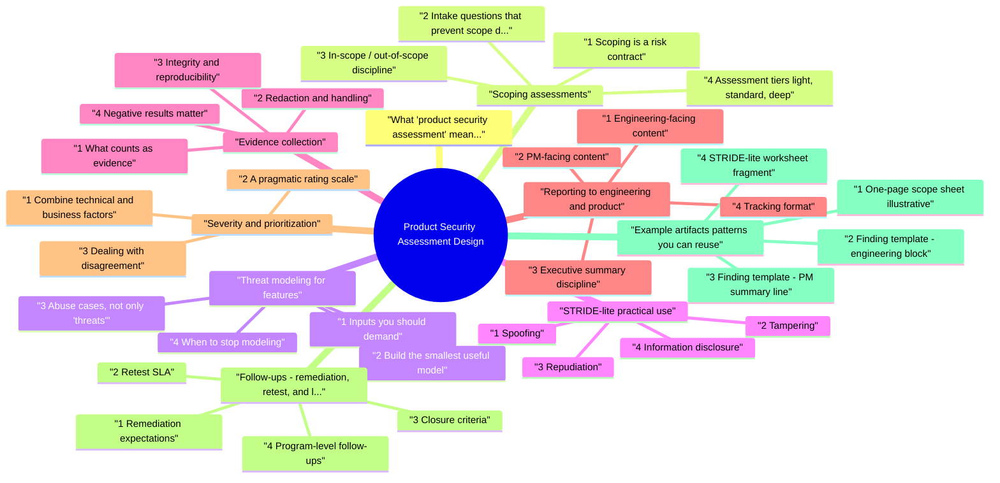

# Product Security Assessment Design revision map

I keep this Product Security Assessment Design map for the night before a screen, when five markdown files is too many clicks. Built from Critical Clarification Product Security Assessment.md, Product Security Assessment Design - Comprehensive.md, Product Security Assessment Design - Interview Que.md, Product Security Assessment Design - Quick Referen.md. Twenty minutes. Then I close the laptop.

## What "product security assessment" means here
- A product assessment answers: Who can do what, with what data, through which interfaces, and what breaks if they try? It blends design review, targeted testing, and judgment about business impact and ship risk.
- It is distinct from a broad penetration test in three ways:
- Object: a bounded change (feature, API surface, integration) rather than "the whole estate."
- Method: threat-led depth on high-risk flows, not uniform crawl coverage everywhere.
- Outcome: decisions that unblock or constrain shipping, with owners and timelines-not only a findings list.

## Scoping assessments

### 1 Scoping is a risk contract
- Scope defines what you promise to evaluate, what you explicitly do not, and what assumptions stakeholders must accept. A weak scope produces false confidence or endless churn.
- Capture scope in writing (short is fine) under these headings:

### 2 Intake questions that prevent scope drift
- Ask product and engineering the same questions early; misalignment here becomes "you should have tested X" later.
- What user problem does this solve, and who is allowed to use it? (roles, tenants, geography)
- What data enters, is stored, and leaves? (including derived data and logs)
- What is new vs reused? (new endpoints, new storage, new third parties)
- What must not happen if this ships wrong? (fraud, privacy breach, account takeover, compliance trigger)
- What are the release gates? (launch date, beta cohort, regulatory deadline)
- What can we touch? (production read-only, staging only, synthetic accounts)

### 3 In-scope / out-of-scope discipline
- Out of scope should name exclusions with rationale, for example:
- Third-party SaaS beyond configuration review (no source)
- Unrelated legacy modules unless called by in-scope code paths
- Social engineering or physical access
- Denial-of-service stress beyond agreed rate limits

### 4 Assessment tiers (light, standard, deep)
- Not every feature deserves a full design review plus manual exploit chain development. Tie tier to data sensitivity × external exposure × novelty.
- Document tier and rationale in the kickoff note so PM and eng know what depth was purchased.

### 5 Rules of engagement (minimum viable)
- Even for internal assessments, write down:
- Authorized testers and systems they may exercise
- No-production policy or constrained prod testing (read-only, synthetic users)
- Stop conditions (credential exposure, customer impact, suspected live abuse)
- Escalation (on-call security, service owner, incident channel)

## Threat modeling for features
- Feature-level threat modeling is fast, concrete, and tied to ship decisions. It is not a wall-sized architecture poster unless the change warrants one.

### 1 Inputs you should demand
- One-pager or PRD: actors, success metrics, rollout plan
- Design doc or RFC: components, protocols, storage, failure modes
- API spec or OpenAPI: methods, parameters, auth schemes
- Migration or rollout plan: flags, backfills, dual-write periods

### 2 Build the smallest useful model
- Actors: anonymous user, customer, admin, partner, internal job, attacker with stolen session
- Assets: objects the business cares about (orders, documents, API keys)
- Trust boundaries: where authentication is established, where data crosses zones
- Data flows: request path, async workers, webhooks, caches, analytics pipelines

### 3 Abuse cases, not only "threats"
- Pair each primary user story with abuse cases:
- Legitimate: user exports their own data.
- Abuse: user exports another tenant's data by swapping identifiers.
- Abuse: user replays an export job with a tampered cursor token.

### 4 When to stop modeling
- Stop when you can list the top five ways this feature could hurt customers or the company and each maps to a control location (code path, config, policy) or an explicit acceptance of leftover risk.

## STRIDE-lite (practical use)
- STRIDE is a prompt list, not a scorecard. "STRIDE-lite" means you touch each category only long enough to produce actionable questions and tests.

### 1 Spoofing
- Question: Can a caller pretend to be another principal?
- Tests and review targets: session binding, JWT aud/iss, mTLS identity, webhook signatures, OAuth state, service-to-service tokens, header trust at proxies.

### 2 Tampering
- Question: Can data be altered in transit, at rest, or across trust boundaries?
- Targets: parameter pollution, unsigned webhooks, client-supplied metadata trusted server-side, optimistic locking on writes, cache poisoning via keys.

### 3 Repudiation
- Question: If something bad happens, can we reconstruct who did what?
- Targets: structured audit logs (actor, tenant, object, before/after hashes where appropriate), admin actions, async job attribution, clock skew.

### 4 Information disclosure
- Question: What leaks to unauthorized users through responses, errors, logs, or side channels?
- Targets: verbose errors, enumeration via timing or ORM lazy loads, excess fields in APIs, log redaction, debug endpoints, shared caches.

### 5 Denial of service
- Question: Can a user or partner exhaust capacity or cost?
- Targets: unbounded queries, fan-out webhooks, expensive regex, file uploads, unauthenticated endpoints that trigger heavy work, retry storms.

### 6 Elevation of privilege
- Question: Can someone obtain capabilities they should not have?
- Targets: IDOR on object APIs, role hints in tokens, admin-only mutations reachable from lower roles, confused deputy in integrations, unsafe internal endpoints.

## Evidence collection
- Findings without evidence become opinions. Evidence without context becomes noise.

### 1 What counts as evidence
- Reproduction: numbered steps or a scripted sequence (curl, Postman collection, minimal code)
- Request/response artifacts: redacted headers and bodies showing the vulnerability
- Scope proof: which account/tenant/role was used
- Version context: commit SHA, build ID, environment name
- Impact narrative: what an attacker gains in this product (not generic CVSS prose)

### 2 Redaction and handling
- See the source section `2 Redaction and handling` for the worked example.

### 3 Integrity and reproducibility
- See the source section `3 Integrity and reproducibility` for the worked example.

### 4 Negative results matter
- Document high-risk areas examined where you did not find issues. That protects the team from "you never looked" and guides sampling disclosure in the report.

## Reporting to engineering and product
- One report rarely fits all readers. Structure content so it can be split by audience without duplicating fiction.

### 1 Engineering-facing content
- Title that states the failure mode, not the tool name
- Affected component (service, route, job name)
- Description in terms of broken invariant ("any authenticated user can read invoice id")
- Reproduction and evidence
- Fix guidance at the right level: pseudo-patch, config change, library upgrade, pattern ("enforce tenant in query, not only in UI")
- Suggested tests (unit, contract, integration) to prevent regression

### 2 PM-facing content
- Product managers need ship risk in plain language:
- Customer impact (privacy, money, availability, trust)
- Likelihood in product terms (internet-exposed, authenticated-only, admin-only)
- Mitigation options with rough cost (flag off, delay launch, partial rollout, hotfix)
- Compliance or contractual triggers if applicable

### 3 Executive summary discipline
- What was assessed and tier
- Top risks and whether they block launch
- What was not covered (explicit scope limits)
- Next milestones (fixes due, retest date)

### 4 Tracking format
- Prefer one ticket per finding (or per cluster) with stable IDs referenced in the report. That enables metrics: age, reopen rate, SLA breaches.

## Severity and prioritization
- Severity answers: How urgent is this for this product, now?

### 1 Combine technical and business factors
- Start from exploitability and impact, then adjust for exposure and detectability:
- Exploitability: authentication required? network position? user interaction?
- Impact: confidentiality/integrity/availability for which data class?
- Exposure: unauthenticated internet vs admin tool behind SSO
- Detectability: would logs show abuse? is there a compensating control?

### 2 A pragmatic rating scale
- Define severities with launch semantics your org can enforce:
- Always document assumptions ("attacker has valid session for tenant A") so severity debates stay factual.

### 3 Dealing with disagreement
- When eng disputes severity, pivot to agreed tests: add monitoring, tighten scope of the fix, or time-box acceptance of leftover risk with named owner and review date.

## Follow-ups: remediation, retest, and learning
- An assessment ends when risk is owned, not when the PDF is sent.

### 1 Remediation expectations
- Owner (team or individual)
- Target date aligned to severity
- Fix type (code, config, dependency, process)
- Verification method (retest steps, new test name, dashboard check)

### 2 Retest SLA
- Define how quickly security will verify fixes after notification. Critical issues often warrant same-day spot checks; medium may wait until the next release train. Publish the SLA so teams do not guess.

### 3 Closure criteria
- The invariant holds under the original abuse case
- Regression coverage exists or is scheduled
- Monitoring exists where abuse would be visible (if relevant)

### 4 Program-level follow-ups
- Repeat findings (same bug class in new features)
- Time-to-fix by severity
- Assessment coverage (% of launches that received appropriate tier)
- Defects escaped to production post-assessment

### 5 Handoff conversation
- See the source section `5 Handoff conversation` for the worked example.

## Example artifacts (patterns you can reuse)

### 1 One-page scope sheet (illustrative)
- Assessment: Export API for workspace reports (Q3 launch)
- Tier: Standard (customer data, authenticated API, new async job)

### 2 Finding template - engineering block
- Use a consistent skeleton so reviewers skim efficiently:
- Title: Cross-workspace export job status disclosure
- Create export in workspace A as user U1; capture jobId.
- As user U2 in workspace B, call GET /v1/exports/{jobId} with U2's bearer token.
- Observe 200 with foreign workspace artifact metadata.

### 3 Finding template - PM summary line
- See the source section `3 Finding template - PM summary line` for the worked example.

### 4 STRIDE-lite worksheet fragment
- The worksheet is disposable; tickets and the report are the durable output.

## Facilitating feature threat reviews without slowing shipping

### 1 Timeboxed sessions
- Schedule 45-60 minutes with engineering lead, one implementer, PM or PM delegate. Pre-read is 10 minutes: your diagram + three abuse cases. In session:
- Confirm actors and trust boundaries (10 min)
- Walk the happiest path data flow (15 min)
- Brainstorm abuse cases starting from STRIDE-lite prompts (20 min)
- Agree on three must-test scenarios before merge (10 min)

### 2 When to insist on design changes vs testing
- See the source section `2 When to insist on design changes vs testing` for the worked example.

### 3 Handling "we will fix fast after launch"
- See the source section `3 Handling "we will fix fast after launch"` for the worked example.

## Aligning assessments with compliance and customer expectations
- Security assessments are not the same as a formal audit, but they should produce evidence artifacts auditors and customers increasingly request.
- Control mapping: For each major finding category (authn, authz, crypto, logging), note which organizational control family it touches. Fixes then double as control operation evidence.
- Data processing narratives: When features move PII across regions or subprocessors, your scope should include data flow accuracy so privacy reviews and security reviews do not contradict each other.
- Customer security questionnaires: Maintain a factual appendix (how keys are stored, how access is logged) that is copy-safe. Avoid copying assessment findings verbatim into public answers without review.

## Quick reference checklist
- [ ] Scope, tier, and RoE documented
- [ ] Actors, assets, trust boundaries sketched
- [ ] STRIDE-lite question table drafted
- [ ] Abuse cases for top user journeys listed
- [ ] Evidence captured with redaction
- [ ] Negative results noted for hot paths
- [ ] Findings ticketed with severity rationale
- [ ] PM summary and eng details aligned

## Other notes sitting in the folder

## Fundamentals

### How do you design a product security assessment end to end?
- See the source section `How do you design a product security assessment end to end?` for the worked example.

### How is a product security assessment different from a broad penetration test?
- See the source section `How is a product security assessment different from a broad penetration test?` for the worked example.

### What do you put in scope versus out of scope, and why does precision matter?
- See the source section `What do you put in scope versus out of scope, and why does precision matter?` for the worked example.

### How do you choose light, standard, or deep assessment tiers?
- See the source section `How do you choose light, standard, or deep assessment tiers?` for the worked example.

## Threat modeling and STRIDE-lite

### How do you threat-model a single feature without boiling the ocean?
- See the source section `How do you threat-model a single feature without boiling the ocean?` for the worked example.

### What is STRIDE-lite in practice?
- See the source section `What is STRIDE-lite in practice?` for the worked example.

### Give an example of turning a user story into an abuse case.
- See the source section `Give an example of turning a user story into an abuse case.` for the worked example.

## Evidence and methodology

### What does strong evidence look like for a product finding?
- See the source section `What does strong evidence look like for a product finding?` for the worked example.

### How do you document negative results responsibly?
- See the source section `How do you document negative results responsibly?` for the worked example.

### How do you balance depth with time and staffing constraints?
- See the source section `How do you balance depth with time and staffing constraints?` for the worked example.

## Reporting: engineering, PM, and leadership

### How do you write findings engineers can act on quickly?
- See the source section `How do you write findings engineers can act on quickly?` for the worked example.

### How do you communicate the same issue to a PM without jargon?
- See the source section `How do you communicate the same issue to a PM without jargon?` for the worked example.

### What belongs in an executive summary of an assessment?
- See the source section `What belongs in an executive summary of an assessment?` for the worked example.

## Severity, prioritization, and disagreement

### How do you assign severity for product issues when CVSS disagrees with gut feel?
- See the source section `How do you assign severity for product issues when CVSS disagrees with gut feel?` for the worked example.

### How do you prioritize which findings get fixed first?
- See the source section `How do you prioritize which findings get fixed first?` for the worked example.

## Follow-up, retest, and program learning

### What does a good remediation and retest loop look like?
- See the source section `What does a good remediation and retest loop look like?` for the worked example.

### What metrics help mature product security assessments over time?
- See the source section `What metrics help mature product security assessments over time?` for the worked example.

### How do you close an assessment so learning persists beyond the PDF?
- See the source section `How do you close an assessment so learning persists beyond the PDF?` for the worked example.

## Depth: Interview follow-ups - Product Security Assessment Design
- Authoritative references: OWASP ASVS for control vocabulary; OWASP SAMM for program maturity framing when discussing scaling assessments.
- Production verification: SLAs for critical retest; coverage of assessed launches; repeat finding rate by component.

## Assessment Types

## Assessment Planning Checklist
- Define objectives and scope
- Threat modeling
- Select assessment types
- Choose methodology (OWASP, PTES, NIST)
- Define rules of engagement
- Risk-based prioritization
- Tool selection
- Reporting framework

## Testing Methodologies

## Risk Prioritization

## Testing Focus Areas (OWASP Top 10)
- Broken Access Control
- Cryptographic Failures
- Injection
- Insecure Design
- Security Misconfiguration
- Vulnerable Components
- Authentication Failures
- Software/Data Integrity Failures

## Key Principles
- Risk-based approach
- Combine automated and manual testing
- Continuous assessments (not one-time)
- full evaluation (people, process, technology)
- Actionable reporting

## Traps that dump interviews

## ️ Common Misconceptions

### "Security assessments should test everything equally"
- Truth: Security assessments should be risk-based, focusing on high-risk areas first.
- Identify critical assets and data
- Prioritize high-risk attack vectors
- Focus on most likely threats
- Balance coverage with time/resources

### "Automated tools are sufficient for security assessments"
- Truth: Automated tools are valuable but insufficient - manual testing and expert analysis are essential.
- May miss business logic flaws
- Limited context understanding
- False positives require manual review
- Can't replicate human attacker creativity

### "Security assessments are one-time activities"
- Truth: Security assessments should be continuous and iterative, not one-time checkboxes.
- Ongoing automated scanning
- Periodic deep-dive assessments
- Assessments after major changes
- Regular threat model updates

### "Finding all vulnerabilities is the goal of security assessments"
- Truth: The goal is risk reduction, not finding every possible vulnerability.
- Identify critical and high-severity issues
- Understand overall security posture
- Provide actionable remediation guidance
- Support risk-based decision making

### "Security assessments are only technical evaluations"
- Truth: Security assessments should evaluate people, processes, and technology, not just code.
- People: Security awareness, training, culture
- Process: Security policies, procedures, SDLC integration
- Technology: Code, infrastructure, configurations

## Key Takeaways
- Risk-Based: Focus assessments on high-risk areas
- Automated + Manual: Combine tools with expert analysis
- Continuous: Ongoing assessments, not one-time activities
- Risk Reduction: Goal is risk reduction, not finding everything
- full: Assess people, processes, and technology

## Sibling folders

- Stay inside this folder for the long guide. Jump only when a section names a sibling topic.
- Cookie Security, CSRF, XSS, JWT, OAuth, and TLS show up as neighbors on a lot of these maps.
