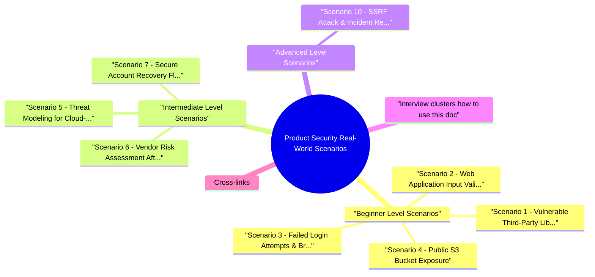

# Product Security Real-World Scenarios revision map

I keep this Product Security Real-World Scenarios map for the night before a screen, when five markdown files is too many clicks. Built from Product Security Real-World Scenarios - Comprehensive Guide.md, Product Security Real-World Scenarios - Interview Questions.md, Product Security Real-World Scenarios - Quick Reference.md. Twenty minutes. Then I close the laptop.

### Beginner Level Scenarios
- Vulnerable Third-Party Library in Mobile App
- Web Application Input Validation & XSS/SQL Injection
- Failed Login Attempts & Brute Force Detection
- Public S3 Bucket Exposure

### Intermediate Level Scenarios
- Threat Modeling for Cloud-Native Microservices
- Vendor Risk Assessment After Data Breach
- Secure Account Recovery Flow Design
- API Rate Limiting Evasion Attack
- Multi-Tenant SaaS Key Management

### Advanced Level Scenarios
- SSRF Attack & Incident Response
- Secure Feature Launch with Tight Deadline
- Zero Trust Architecture Implementation
- Supply Chain Attack Response
- Secure Microservices Communication Design
- PCI-DSS Compliant Payment Processing

## Beginner Level Scenarios

### Scenario 1: Vulnerable Third-Party Library in Mobile App
- Context: You're part of a team developing a mobile app that uses a third-party SDK which has just been reported to have a critical TCP buffer overflow vulnerability (CVE-2024-XXXXX).
- Question: What steps do you take from discovery to resolution?

#### Detailed Answer
- Determine which version of the SDK your app uses
- Check if the vulnerable version is in production
- Identify which features/functionality use the vulnerable component
- Assess what data or processes could be compromised:
- User input handling?
- Network communication?
- Local storage access?
- Privileged operations?

#### Key Takeaways
- Speed matters: Critical vulnerabilities need immediate response
- Know your dependencies: Maintain accurate inventory
- Automate scanning: Don't rely on manual checks
- Test thoroughly: Security fixes can break functionality
- Communicate clearly: Keep stakeholders informed
- Learn and improve: Document lessons for future incidents
- Never trust user input: Always validate and sanitize
- Use parameterized queries: Never concatenate SQL

### Scenario 2: Web Application Input Validation & XSS/SQL Injection
- Context: During security testing of a customer-facing web application, you discover that a search input field does not properly sanitize user input. You suspect risks of both XSS (Cross-Site Scripting) and SQL Injection.
- Question: Walk through how you'd confirm, safely exploit, remediate, and prevent this vulnerability.

#### Data Flow Diagram (DFD)
- See the source section `Data Flow Diagram (DFD)` for the worked example.

### Scenario 3: Failed Login Attempts & Brute Force Detection
- Context: You notice in security logs that a privileged internal server has had 100+ failed SSH login attempts from a single IP address over 10 minutes, followed by a successful login.
- Question: How do you respond immediately, and how do you prevent this from happening again?

### Scenario 4: Public S3 Bucket Exposure
- Context: An internal security audit reveals that one of your AWS S3 buckets is publicly accessible. The bucket stores customer PII (Personally Identifiable Information). There's no evidence of compromise yet.
- Question: How do you analyze the risk, contain it, detect possible exposure, and put processes in place to avoid recurrence?

## Intermediate Level Scenarios

### Scenario 5: Threat Modeling for Cloud-Native Microservices
- Context: You're designing a threat model for a cloud-native microservices-based service handling sensitive user health data (HIPAA-regulated). The system consists of:
- API Gateway (Kong/AWS API Gateway)
- Authentication Service (OAuth 2.0)
- User Service (manages user profiles)
- Health Data Service (processes health records)
- Analytics Service (aggregates data)
- Database (PostgreSQL with encryption)
- Message Queue (RabbitMQ/Kafka)

### Scenario 6: Vendor Risk Assessment After Data Breach
- Context: Your company plans to use a third-party cloud-based CRM vendor that handles sensitive customer data. You discover:
- The vendor suffered a data breach 6 months ago
- Several security practices don't align with your company's standards
- The business team insists on moving forward due to operational benefits
- The vendor is the market leader with no viable alternatives

### Scenario 7: Secure Account Recovery Flow Design
- Question: Design a comprehensive account recovery flow that balances security and user experience.

## Advanced Level Scenarios

### Scenario 10: SSRF Attack & Incident Response
- Question: Walk through detection, response, forensic investigation, and how you redesign to prevent recurrence.

#### Data Flow Diagram (DFD) - Attack Flow
- See the source section `Data Flow Diagram (DFD) - Attack Flow` for the worked example.

## Interview clusters (how to use this doc)
- Fundamentals: Pick one Beginner scenario; answer aloud in 5 minutes with assumptions stated.
- Senior: For Intermediate scenarios, add metrics, rollback, and stakeholder communication.
- Staff: For Advanced scenarios, connect to program (policy, scale, multi-team) and verification.

## Cross-links
- Threat Modeling, Microsoft PSE II prep (if applicable), Cloud/IAM topics, Content Mastery Framework, Security Observability.

## Cheat sheet bits

## Quick Reference Guide
- A concise reference for product security scenario-based interview questions.

## Scenario Response Framework

### Detection & Assessment
- Identify the issue
- Assess impact and scope
- Determine urgency
- Gather information

### Containment
- Immediate actions to limit damage
- Isolate affected systems
- Block attackers
- Revoke compromised credentials

### Investigation
- Forensic analysis
- Timeline reconstruction
- Scope determination
- Attacker attribution

### Remediation
- Fix vulnerabilities
- Implement security controls
- Harden systems
- Update processes

### Communication
- Internal stakeholders
- External notifications (if required)
- Regulatory reporting
- Customer communication

### Prevention
- Process improvements
- Technical controls
- Training and awareness
- Ongoing monitoring

## Common Scenarios Quick Reference

### Third-Party Vulnerability
- See the source section `Third-Party Vulnerability` for the worked example.

### Input Validation (XSS/SQLi)
- See the source section `Input Validation (XSS/SQLi)` for the worked example.

### Brute Force Attack
- See the source section `Brute Force Attack` for the worked example.

### Cloud Misconfiguration
- See the source section `Cloud Misconfiguration` for the worked example.

### Threat Modeling
- See the source section `Threat Modeling` for the worked example.

### Vendor Risk
- See the source section `Vendor Risk` for the worked example.

### Account Recovery
- See the source section `Account Recovery` for the worked example.

### SSRF Attack
- See the source section `SSRF Attack` for the worked example.

## STRIDE Threat Model

## DREAD Risk Assessment

## Security Controls Checklist

### Authentication
- [ ] Multi-factor authentication (MFA)
- [ ] Strong password policies
- [ ] Account lockout mechanisms
- [ ] Session management
- [ ] Token security (JWT, OAuth)

### Authorization
- [ ] Role-based access control (RBAC)
- [ ] Least privilege principle
- [ ] Attribute-based access control (ABAC)
- [ ] Regular access reviews

### Encryption
- [ ] Encryption in transit (TLS 1.3)
- [ ] Encryption at rest
- [ ] Key management (HSM/KMS)
- [ ] Certificate management

### Input Validation
- [ ] Parameterized queries
- [ ] Output encoding
- [ ] Content Security Policy (CSP)
- [ ] File upload validation

### Network Security
- [ ] Network segmentation
- [ ] Firewall rules
- [ ] DDoS protection
- [ ] VPN/bastion hosts

### Monitoring & Logging
- [ ] Comprehensive logging
- [ ] Security monitoring (SIEM)
- [ ] Anomaly detection
- [ ] Incident response procedures

### Compliance
- [ ] Data classification
- [ ] Privacy controls (GDPR, CCPA)
- [ ] Audit trails
- [ ] Regular assessments

## Common Vulnerabilities & Fixes

## Incident Response Steps
- Preparation - Playbooks, tools, team
- Identification - Detect incident
- Containment - Limit damage
- Eradication - Remove threat
- Recovery - Restore services
- Lessons Learned - Post-mortem

## Key Security Principles
- Defense in Depth - Multiple security layers
- Least Privilege - Minimum necessary access
- Zero Trust - Never trust, always verify
- Security by Design - Build security in
- Assume Breach - Design for detection
- Fail Secure - Default to secure state
- Separation of Duties - No single point of failure
- Keep It Simple - Complexity increases risk

## Compliance Quick Reference

### GDPR
- 72-hour breach notification
- Data minimization
- Right to erasure
- Privacy by design

### HIPAA
- Administrative safeguards
- Physical safeguards
- Technical safeguards
- Breach notification

### PCI-DSS
- Scope reduction (tokenization)
- Network segmentation
- Encryption requirements
- Access controls
- Regular assessments

### SOC 2
- Security
- Availability
- Processing integrity
- Confidentiality

## Tools & Technologies

### SAST (Static Analysis)
- SonarQube, Checkmarx, Veracode, Bandit

### DAST (Dynamic Analysis)
- OWASP ZAP, Burp Suite, Acunetix

### Dependency Scanning
- Snyk, Dependabot, OWASP Dependency-Check

### Cloud Security
- AWS Security Hub, Prowler, CloudSploit

### Container Security
- Trivy, Clair, Falco

### SIEM
- Splunk, ELK Stack, Datadog Security

## Interview Tips
- Clarify First - Ask questions before answering
- Think Aloud - Explain your thought process
- Use Frameworks - STRIDE, DREAD, OWASP
- Draw Diagrams - Visualize the problem
- Prioritize - Focus on high-risk items
- Be Practical - Realistic solutions
- Show Experience - Reference real examples
- Consider Trade-offs - Security vs usability

## Quick Formulas
- CVSS Score - Common Vulnerability Scoring System
- Remember: Security is about managing risk, not eliminating it. Focus on practical, risk-based solutions that balance security, usability, and business needs.

## Prompts I drill out loud

- Quick Reference for Interview Practice
- Beginner Level Questions
- Third-Party Library Vulnerability
- Input Validation Issues
- Public Cloud Storage
- Intermediate Level Questions
- Threat Modeling Microservices
- Vendor Risk Assessment
- Account Recovery Design
- API Rate Limiting Evasion
- Multi-Tenant Key Management
- Advanced Level Questions
- SSRF Attack Response
- Secure Feature Launch
- Zero Trust Implementation
- Supply Chain Attack
- Secure Microservices Design
- PCI-DSS Payment Processing
- Answer Structure Template
- Common Follow-up Questions
- Key Concepts to Remember
- Depth: Interview follow-ups - Product Security Real-World Scenarios

### Brute Force Attack
- Question: You see 100+ failed SSH login attempts followed by success. What's your response?
- Immediate (block IP, reset credentials, investigate)
- Forensic (review logs, check compromise, lateral movement)
- Remediate (MFA, rate limiting, SSH hardening)
- Monitor (SIEM, alerts, continuous monitoring)
- Prevent (least privilege, network segmentation)

## Practice Tips
- Think Out Loud: Explain your thought process
- Ask Questions: Clarify requirements first
- Use Frameworks: STRIDE, DREAD, OWASP, etc.
- Draw Diagrams: DFDs, architecture diagrams
- Consider Trade-offs: Security vs usability, cost, time
- Show Experience: Reference real-world examples
- Be Practical: Actionable recommendations
- Think full: Technical + process + people

## Depth: Interview follow-ups - Product Security Real-World Scenarios
- Authoritative references: Use public postmortems as patterns (e.g. AWS/Azure status history / Google Cloud status-illustrate operational security); OWASP Top 10 for vulnerability classes referenced in scenarios.
- Clarifying questions first - scope, assets, adversary, constraints (interview technique).
- Structured response: contain -> assess impact -> fix -> verify -> prevent recurrence.
- Stakeholder narrative - customer trust, regulatory, SLA.

## Sibling folders

- Stay inside this folder for the long guide. Jump only when a section names a sibling topic.
- Cookie Security, CSRF, XSS, JWT, OAuth, and TLS show up as neighbors on a lot of these maps.
