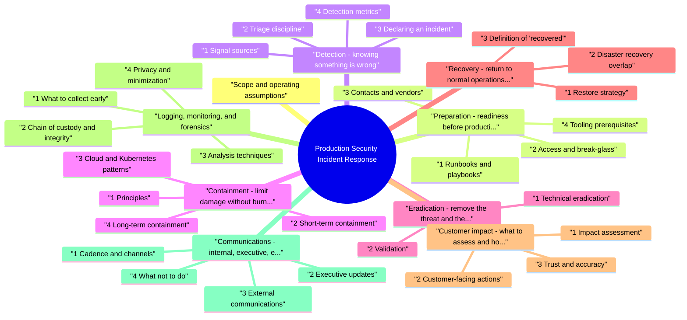

# Production Security Incident Response revision map

Production Security Incident Response in one sitting. That is the deal. I mined Critical Clarification Production Security Inciden.md, Production Security Incident Response - Comprehens.md, Production Security Incident Response - Interview.md, Production Security Incident Response - Quick Refe.md. The outline keeps every H2 I cared about from those files.

## Scope and operating assumptions

## Preparation: readiness before production breaks
- Incidents are won or lost before the alert fires. Preparation reduces time to contain and prevents improvised, error-prone heroics.

### 1 Runbooks and playbooks
- See the source section `1 Runbooks and playbooks` for the worked example.

### 2 Access and break-glass
- See the source section `2 Access and break-glass` for the worked example.

### 3 Contacts and vendors
- See the source section `3 Contacts and vendors` for the worked example.

### 4 Tooling prerequisites
- See the source section `4 Tooling prerequisites` for the worked example.

### 5 Exercises
- Run tabletop exercises at least annually with executives and game days in staging for technical teams. Debrief with concrete tickets: missing dashboards, unclear ownership, or runbook gaps.

## Detection: knowing something is wrong

### 1 Signal sources
- Effective detection blends automated and human channels:
- Detection engineering outputs: alerts from SIEM, EDR, CSPM, WAF, IDS/IPS, DLP, IAM anomaly tooling, Kubernetes audit logs, cloud control-plane APIs, and application-specific security monitors.
- Reliability and abuse signals: sudden error spikes, auth failures, quota exhaustion, cost anomalies, or support tickets describing account takeover or impossible user actions.
- Internal reports: engineers noticing odd processes, unexpected config changes, new admin users, or secrets in logs.
- External intelligence: notifications from researchers, customers, law enforcement, or bug bounty programs; passive DNS or certificate transparency oddities for your domains.

### 2 Triage discipline
- See the source section `2 Triage discipline` for the worked example.

### 3 Declaring an incident
- See the source section `3 Declaring an incident` for the worked example.

### 4 Detection metrics
- Track mean time to detect and mean time to acknowledge for security-relevant alert classes. Review noisy rules quarterly; chronic false positives train responders to ignore real fires.

## Containment: limit damage without burning the investigation

### 1 Principles
- Stop ongoing abuse first when the threat is active; parallelize investigation where staffing allows.
- Prefer reversible, logged containment (revoke session, block IP at edge, disable single integration) over destructive steps unless the situation demands them.
- Preserve evidence: snapshot disks or memory where policy permits, export critical logs to immutable storage, and record who took each action and when.

### 2 Short-term containment
- See the source section `2 Short-term containment` for the worked example.

### 3 Cloud and Kubernetes patterns
- See the source section `3 Cloud and Kubernetes patterns` for the worked example.

### 4 Long-term containment
- See the source section `4 Long-term containment` for the worked example.

### 5 Tradeoffs
- See the source section `5 Tradeoffs` for the worked example.

### 6 Multi-tenant products
- See the source section `6 Multi-tenant products` for the worked example.

## Eradication: remove the threat and the conditions that enabled it
- Eradication means the adversary's foothold and persistence are removed and root causes are addressed-not merely that alerts stopped.

### 1 Technical eradication
- Malware and implants: rebuild from known-good images where integrity is uncertain; forensic imaging first when prosecution or insurance requires it.
- Accounts and keys: assume compromise of anything reachable from the breach; rotate secrets with dual-stack or phased rollout to avoid outages; enforce MFA and session invalidation.
- Vulnerabilities and misconfigurations: patch, fix infrastructure-as-code, remove excessive IAM bindings, close public buckets or admin endpoints.
- Supply chain: pin dependencies, verify provenance with attestations where available, replace compromised build artifacts, and invalidate CI/CD tokens and deploy keys.

### 2 Validation
- See the source section `2 Validation` for the worked example.

## Recovery: return to normal operations safely
- Recovery is phased return of service with verification, not a single big bang.

### 1 Restore strategy
- Restore from known-clean backups or rebuild; verify backup integrity and backup access logs-attackers often target backups and snapshot APIs.
- Gradual traffic ramp or canary deployments for critical paths.
- Enhanced monitoring for a defined period after go-live; tune detections for repeat attempts using the same TTPs.

### 2 Disaster recovery overlap
- If production restoration depends on secondary region failover, runbook the security implications: replication lag may restore already-compromised state; validate RPO/RTO against integrity checks, not only uptime.

### 3 Definition of "recovered"
- See the source section `3 Definition of "recovered"` for the worked example.

## Customer impact: what to assess and how to decide outreach

### 1 Impact assessment
- See the source section `1 Impact assessment` for the worked example.

### 2 Customer-facing actions
- See the source section `2 Customer-facing actions` for the worked example.

### 3 Trust and accuracy
- See the source section `3 Trust and accuracy` for the worked example.

## Logging, monitoring, and forensics

### 1 What to collect early
- See the source section `1 What to collect early` for the worked example.

### 2 Chain of custody and integrity
- See the source section `2 Chain of custody and integrity` for the worked example.

### 3 Analysis techniques
- See the source section `3 Analysis techniques` for the worked example.

### 4 Privacy and minimization
- See the source section `4 Privacy and minimization` for the worked example.

## Communications: internal, executive, external

### 1 Cadence and channels
- See the source section `1 Cadence and channels` for the worked example.

### 2 Executive updates
- See the source section `2 Executive updates` for the worked example.

### 3 External communications
- See the source section `3 External communications` for the worked example.

### 4 What not to do
- See the source section `4 What not to do` for the worked example.

## Legal, regulatory, and contractual context

### 1 Engage legal early
- See the source section `1 Engage legal early` for the worked example.

### 2 Breach notification triggers
- See the source section `2 Breach notification triggers` for the worked example.

### 3 Law enforcement and insurers
- See the source section `3 Law enforcement and insurers` for the worked example.

### 4 Documentation for regulators
- See the source section `4 Documentation for regulators` for the worked example.

## Post-incident: close the loop

### 1 Root cause and contributing factors
- See the source section `1 Root cause and contributing factors` for the worked example.

### 2 Remediation backlog
- See the source section `2 Remediation backlog` for the worked example.

### 3 Metrics
- Measure time to detect, time to contain, time to recover, customer impact duration, and recurrence of similar classes. Trend these quarterly. Compare exercise outcomes to real incidents to validate preparedness.

### 4 Learning culture
- See the source section `4 Learning culture` for the worked example.

## Practical checklist (condensed)
- First hour: declare incident; assign incident commander; preserve logs; contain active harm; notify legal if data or regulatory risk; start timeline.
- First day: scoped eradication plan; customer impact assessment; communications rhythm; forensic copies secured; monitoring for related IOCs.

## References for deeper reading
- NIST Computer Security Incident Handling (SP 800-61 family-use the revision your org standards cite).
- FIRST CSIRT frameworks and coordination practices.
- Your org's privacy notices, data processing agreement templates, status page policy, and cyber insurance documents-these often impose real deadlines and evidence requirements.

## Fundamentals

### Walk through how you handle a credible security incident in live production.
- See the source section `Walk through how you handle a credible security incident in live production.` for the worked example.

### How does production security incident response differ from a generic IT outage?
- See the source section `How does production security incident response differ from a generic IT outage?` for the worked example.

### What is your severity model for security incidents?
- See the source section `What is your severity model for security incidents?` for the worked example.

## Detection and triage

### Where do you expect the first signal of a production compromise to come from?
- See the source section `Where do you expect the first signal of a production compromise to come from?` for the worked example.

### How do you decide whether to declare a formal security incident?
- See the source section `How do you decide whether to declare a formal security incident?` for the worked example.

## Containment and investigation

### How do you balance fast containment with preserving forensic evidence?
- See the source section `How do you balance fast containment with preserving forensic evidence?` for the worked example.

### What containment options do you consider in cloud-native environments?
- See the source section `What containment options do you consider in cloud-native environments?` for the worked example.

### A database alert suggests unauthorized access. What is your first-hour plan?
- See the source section `A database alert suggests unauthorized access. What is your first-hour plan?` for the worked example.

## Eradication and recovery

### How do you know eradication is complete?
- See the source section `How do you know eradication is complete?` for the worked example.

### Describe a safe recovery strategy after a confirmed host compromise.
- See the source section `Describe a safe recovery strategy after a confirmed host compromise.` for the worked example.

## Customer impact and communications

### How do you assess customer impact during a security incident?
- See the source section `How do you assess customer impact during a security incident?` for the worked example.

### Who needs to be in the loop internally during a serious production security incident?
- See the source section `Who needs to be in the loop internally during a serious production security incident?` for the worked example.

### What principles guide external communication during a breach?
- See the source section `What principles guide external communication during a breach?` for the worked example.

## Logging, forensics, and legal

### Which logs matter most in production security investigations?
- See the source section `Which logs matter most in production security investigations?` for the worked example.

### When do you involve legal, and what do you ask them to decide?
- See the source section `When do you involve legal, and what do you ask them to decide?` for the worked example.

### What contractual ideas matter for SaaS operators during incidents?
- See the source section `What contractual ideas matter for SaaS operators during incidents?` for the worked example.

## Post-incident and maturity

### What does a strong post-incident review produce?
- See the source section `What does a strong post-incident review produce?` for the worked example.

### How would you measure whether incident response is improving?
- See the source section `How would you measure whether incident response is improving?` for the worked example.

## Depth: Interview follow-ups - Production Security Incident Response
- Authoritative references: NIST SP 800-61 Rev. 2 (Computer Security Incident Handling-verify the revision your employer standardizes on); FIRST CSIRT practices.
- Order of operations when exfiltration is suspected but containment might alert the attacker.
- Evidence preservation versus business continuity when leadership wants immediate full restore.
- Multi-tenant isolation: how you contain one customer without taking down the fleet.
- Regulatory clocks: who starts the timer and on what factual trigger.

## Incident Response Lifecycle
- Preparation - Policies, procedures, tools
- Detection - Identify incidents
- Containment - Limit scope and impact
- Eradication - Remove threat
- Recovery - Restore operations
- Post-Incident - Lessons learned

## Response Priority Order
- Contain - Stop ongoing damage (FIRST)
- Investigate - Understand what happened
- Eradicate - Remove threat completely
- Recover - Restore normal operations
- Remediate - Fix root cause (after containment)

## Containment Strategies (Least to Most Disruptive)

## Incident Classification

## Communication Checklist
- Notify incident response team immediately
- Regular status updates (every 1-2 hours)
- Stakeholder communication (appropriate level)
- Document everything
- Don't speculate, communicate facts

## Post-Incident Activities
- Root cause analysis
- Timeline reconstruction
- Remediation of root cause
- Process improvements
- Lessons learned documentation
- Follow-up security assessment

## Key Principles
- Contain first, fix root cause later
- Document everything
- Communicate regularly
- Balance security with availability
- Learn from every incident

## The clarification file, compressed

## ️ Common Misconceptions

### "The first priority in an incident is to fix the vulnerability"
- Truth: The first priority is to contain the incident and prevent further damage, not to fix the root cause.
- Contain: Stop the attack from spreading
- Eradicate: Remove the threat
- Recover: Restore normal operations
- Remediate: Fix the root cause (happens after containment)

### "Taking systems offline is always the best containment strategy"
- Truth: System shutdown is a last resort - use least-disruptive containment methods first.
- Containment Options (Least to Most Disruptive):
- Isolate affected systems from network
- Disable specific compromised accounts/keys
- Block malicious IP addresses
- Quarantine affected data
- Take affected services offline
- Full system shutdown (last resort)

### "Incident response can be improvised when needed"
- Truth: Incident response requires preparation and practice - you can't improvise under pressure.
- Clear roles and responsibilities
- Defined procedures and playbooks
- Established communication channels
- Pre-approved escalation paths
- Regular practice through drills

### "Security incidents should be kept secret from stakeholders"
- Truth: Transparency and communication are critical, though communication should be controlled and appropriate.
- Internal stakeholders: Regular updates during incident
- Customers: Transparent communication when required (data breaches)
- Legal/Compliance: Immediate notification if required
- Public: Controlled messaging, avoid speculation

### "Once the incident is resolved, the work is done"
- Truth: Post-incident analysis and remediation are critical phases of incident response.
- Root cause analysis
- Timeline reconstruction
- Impact assessment
- Remediation of root cause
- Process improvements
- Lessons learned documentation
- Follow-up security assessments

## Key Takeaways
- Contain First: Contain incident before fixing root cause
- Least Disruptive: Use least-disruptive containment methods when possible
- Prepare and Practice: Document procedures and practice incident response
- Communicate: Transparent, controlled communication with stakeholders
- Learn and Improve: Post-incident analysis and remediation are essential

## What sits next to this topic

- Stay inside this folder for the long guide. Jump only when a section names a sibling topic.
- Cookie Security, CSRF, XSS, JWT, OAuth, and TLS show up as neighbors on a lot of these maps.
