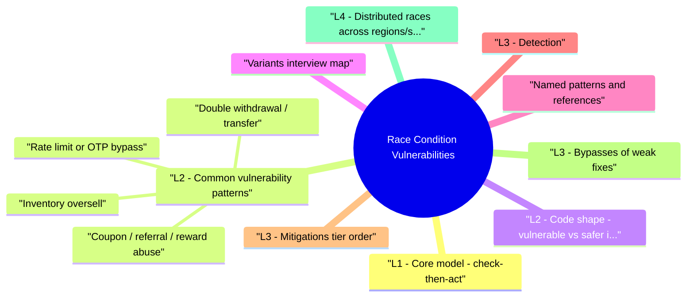

# Race Condition Vulnerabilities revision map

I keep this Race Condition Vulnerabilities map for the night before a screen, when five markdown files is too many clicks. Built from Critical Clarification Race Condition Vulnerabilities Misconceptions.md, Race Condition Vulnerabilities - Comprehensive Guide.md, Race Condition Vulnerabilities - Interview Questions & Answers.md, Race Condition Vulnerabilities - Quick Reference.md, Race Condition Vulnerabilities - VAPT Methodology.md. Twenty minutes. Then I close the laptop.

## L1 - Core model: check-then-act
- The invariant ("balance never negative", "one coupon per user", "stock ≥ 0") is checked outside a single atomic transaction or without a constraint the database enforces.
- Trust boundary: Any mutable resource (balance, inventory, quota, role flag) touched by concurrent clients.

## L2 - Common vulnerability patterns

### Double withdrawal / transfer
- Two parallel POSTs both read the same balance; both pass validation; both deduct.

### Inventory oversell
- Two checkouts read stock = 1; both proceed; two orders confirmed.

### Coupon / referral / reward abuse
- See the source section `Coupon / referral / reward abuse` for the worked example.

### Rate limit or OTP bypass
- Counter incremented after expensive work; parallel requests slip through before counter updates.

### State machine races
- Order status PENDING -> PAID -> SHIPPED - two transitions applied out of order or duplicate PAID callbacks.

### File / token TOCTOU (systems context)
- Symlink swap between access check and open (more common in native code; still fair game in senior "TOCTOU" discussions).

## L2 - Code shape: vulnerable vs safer (illustrative)
- Single UPDATE with predicate (atomic, database enforces):
- Serializable / repeatable read transaction + SELECT FOR UPDATE on the row.
- Idempotency key on the transfer API; store processed keys in a unique table.
- Optimistic locking: version column; UPDATE ... WHERE id = ? AND version = ?; retry on conflict.

## Variants (interview map)

## Named patterns and references
- CWE-362: Concurrent Execution using Shared Resource with Improper Synchronization
- CWE-367: Time-of-check Time-of-use (TOCTOU) Race Condition
- OWASP - business logic / integrity discussions often cite race on workflows

## L3 - Detection
- Code review: grep for read then write on money, inventory, limits, roles without transaction or constraint.
- Design review: state diagrams without single-transition ownership.
- Dynamic: parallel curl/Burp Turbo Intruder with identical sessions; watch for duplicate side effects.
- DB metrics: deadlock / serialization failure spikes after tightening isolation-signals races were previously "winning."

## L3 - Mitigations (tier order)
- Invariant in one place: DB CHECK, unique index, or single atomic UPDATE ... WHERE.
- Right isolation: SERIALIZABLE or explicit locks where needed; understand cost.
- Idempotency: Idempotency-Key header + unique store; safe retries.
- Queues: Serialize mutations per aggregate (per user wallet, per SKU shard).
- Monitoring: duplicate external refs, impossible negative counts, audit trail.

## L3 - Bypasses of weak fixes
- App-level mutex fails across multiple processes/hosts.
- "We use transactions" with READ COMMITTED still allows many races.
- Retry without idempotency creates duplicate charges.

## L4 - Distributed races across regions/services
- When a workflow spans services (payments, inventory, loyalty), "one DB transaction" is no longer available.
- Two regions accept the same logical operation before replication converges.
- Inventory is reserved in one service but payment retries replay stale reservation IDs.
- Saga compensations race with forward actions, creating duplicate side effects.
- Single-writer ownership per aggregate (per wallet/SKU shard).
- Reservation + expiry model with unique reservation IDs.
- Idempotency key propagation across all downstream calls, not just edge API.
- Reconciliation jobs and invariant monitors for eventual-consistency drift.

## L4 - Idempotency design pitfalls
- Idempotency keys are powerful but easy to misuse:
- Key scope too broad (different users collide on same key namespace).
- Key TTL too short (late retries become duplicate business actions).
- Response replay mismatch (same key but mutated request body still accepted).
- Non-atomic key record write (race between business commit and key persistence).
- Store key with request fingerprint + actor/tenant scope.
- Make key write and side effect commit atomic where possible.
- Return the original canonical response for duplicates.

## L4 - Race testing strategy in CI/CD
- Keep a deterministic lab harness with synchronized parallel start (barrier).
- Run short "burst" race suites on high-risk mutations in CI.
- Run longer stochastic contention tests nightly with invariant checks.
- Capture timeline artifacts (request IDs, DB transaction IDs, event timestamps) for debugging.

## Hands-on practice (authorized)
- Build a toy wallet API; hammer with parallel requests; observe lost updates.
- Fix with predicate UPDATE or serializable and re-test.
- PortSwigger business logic labs sometimes include race angles; OWASP WebGoat / custom labs.

## Toolchain

## L4 - Interview clusters

### Junior
- What is check-then-act?
- Name one business impact of a race.

### Mid
- How does READ COMMITTED differ from SERIALIZABLE for a money transfer?
- What is an idempotency key?

### Senior
- Design checkout for high concurrency without oversell.
- Trade-offs of pessimistic vs optimistic locking.

### Staff
- Global inventory across regions with eventual consistency-what invariants can you not promise?
- How do you test for races in CI?

## Authoritative references
- CWE-362, CWE-367
- Database docs: PostgreSQL transaction isolation, MySQL InnoDB locking, SQL Server isolation levels
- OWASP Testing Guide - business logic (race / process timing)

## Cross-links
- Business Logic Abuse and Fraud Threats
- IDOR - parallel ID enumeration + race on shared resources
- Rate Limiting and Abuse Prevention - races on counters
- Security Bug Identification and Validation - proving exploitation
- Threat Modeling - identify concurrent actors on critical flows

## Verification checklist (study)
- [ ] Draw a two-request timeline for your favorite invariant.
- [ ] Write the predicate UPDATE pattern from memory.
- [ ] Explain one failure mode of app-only locks.
- [ ] Run a parallel test in a lab and capture before/after metrics.
- [ ] Explain one distributed race pattern and its mitigation strategy.
- [ ] Define safe idempotency key scope and replay behavior.

## Cheat sheet bits

## Definition
- Check-then-act without atomicity or correct isolation -> concurrent requests invalidate the assumption between check and use (TOCTOU).

## Symptoms in code

## Fixes (pick per case)

## Testing
- Parallel same-session requests (Turbo Intruder / scripts).
- Assert rowcount, constraints, audit uniqueness.
- Watch serialization_failure / deadlock rates after fixes.

## CWEs
- CWE-362 - improper synchronization (shared resource)
- CWE-367 - TOCTOU

## Cross-read
- Business Logic Abuse · IDOR · Rate Limiting · Security Bug Identification

## 60-second answer

## Traps that dump interviews

## "Using a database transaction automatically prevents races."

## "Race conditions only happen under huge load."
- Reality: Two well-timed requests are enough-attackers parallelize intentionally. Burp Turbo Intruder or scripts can create "load" from a laptop.

## "This is a threading bug, not a security issue."
- Reality: In web apps, each HTTP request may hit shared mutable state (DB rows, cache counters). Logical races are security when they break integrity (money, access, quotas).

## "We'll fix it with a mutex in the app."
- Reality: An in-process lock does not coordinate across multiple app servers. You need DB, queue, or distributed coordination-and fencing where external systems are involved.

## "Idempotency keys are only for nice UX."
- Reality: They are a primary control for safe retries once you add serializable transactions or distributed flows. Without them, retries duplicate side effects.

## "SELECT ... IF balance OK then UPDATE is fine in one API handler."
- Reality: Two handlers can both pass the SELECT before either UPDATE unless the row is locked or the check is inside one atomic UPDATE ... WHERE.

## "NoSQL means no race problems."
- Reality: Document databases still have read-modify-write races; some offer conditional writes or transactions-you must use them correctly.

## "Static analysis will find all races."
- Reality: Dataflow across requests is hard; dynamic race tests and domain review remain essential.

## Generic interview traps
- Claiming any single-layer fix without end-to-end story.
- Ignoring webhook / payment duplicate delivery.
- Forgetting monitoring for impossible states (negative balance, count mismatch).

## How I would test it

## Objective
- Create a repeatable assessment workflow for Race Condition Vulnerabilities that produces reproducible evidence and actionable remediation guidance.

## Phase 1 - Scope and preparation
- Confirm in-scope assets, test windows, and prohibited actions.
- Identify critical user journeys and trust boundaries.
- Define severity rubric and evidence requirements before testing.

## Phase 2 - Recon and attack-surface mapping
- Enumerate relevant endpoints, flows, and data paths.
- Document where security checks are expected to happen.
- Mark high-value assets and high-impact paths.

## Phase 3 - Hypothesis-driven testing
- Start with low-risk probes and baseline behavior.
- Test failure hypotheses systematically (one variable at a time).
- Capture request/response artifacts for each finding candidate.

## Phase 4 - Validation and impact proof
- Reproduce findings with clean-state retests.
- Confirm exploitability and practical impact.
- Eliminate false positives; record confidence level.

## Phase 5 - Remediation and verification
- Provide immediate containment + structural fix recommendations.
- Define post-fix verification tests and telemetry checks.
- Re-test after remediation and close with evidence.

## Evidence template
- Asset / endpoint:
- Preconditions:
- Reproduction steps:
- Observed behavior:
- Security impact:
- Business impact:
- Recommended fix:
- Verification result:

## Interview drill
- In 3 minutes, explain how you would run this VAPT workflow for one production-like service and what evidence you need before escalating severity.

## Prompts I drill out loud

- Elevator pitch (45 seconds)
- Q: Explain TOCTOU in one sentence.
- Q: Lost update vs write skew?
- Q: Why are races a "business logic" issue?
- Q: Best fix for a wallet debit?
- Q: When do you need SERIALIZABLE?
- Q: Distributed system without shared DB row?
- Testing and validation
- Q: How do you prove a race in a bug bounty safely?
- Q: How do you regression-test races?
- Q: "We use Redis lock so we're safe."
- Q: Optimistic locking downside?
- Depth: Interview follow-ups

## Mechanism

### Q: Why are races a "business logic" issue?
- A: The code is often "correct" for one request at a time but wrong under parallel use-scanners miss it; threat modeling and code review catch it.

## Defense

## Senior traps

### Q: "We use Redis lock so we're safe."
- A: Redis locks need correct TTL, fencing tokens, and failure handling; still need DB truth for money. Interview answer: defense in depth, not one tool.

## Mock ladder
- Rubric: accuracy, concurrency depth, practical mitigation, verification-7-8/8 target.

## Sibling folders

- Stay inside this folder for the long guide. Jump only when a section names a sibling topic.
- Cookie Security, CSRF, XSS, JWT, OAuth, and TLS show up as neighbors on a lot of these maps.
