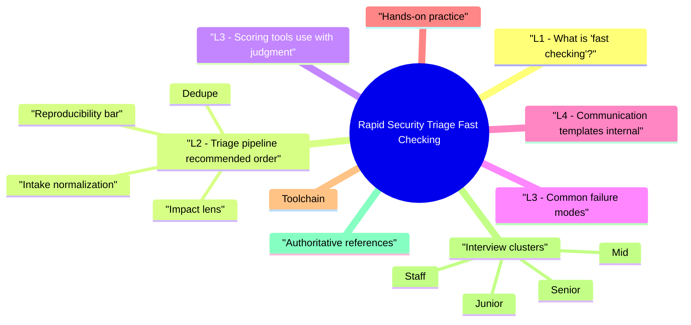

# Rapid Security Triage (Fast Checking) revision map

I keep this Rapid Security Triage (Fast Checking) map for the night before a screen, when five markdown files is too many clicks. Built from Critical Clarification Rapid Security Triage (Fast Checking) Misconceptions.md, Rapid Security Triage (Fast Checking) - Comprehensive Guide.md, Rapid Security Triage (Fast Checking) - Interview Questions & Answers.md, Rapid Security Triage (Fast Checking) - Quick Reference.md. Twenty minutes. Then I close the laptop.

## L1 - What is "fast checking"?
- Goal: In minutes to hours (not days), answer:
- Is it real? Configuration error vs true vuln vs expected behavior?
- What breaks? CIA + safety + compliance angle.
- Who fixes? Product team, platform, vendor, WAF rule?
- How urgent? Exploitability × exposure × asset value.

## L2 - Triage pipeline (recommended order)

### Intake normalization
- Source: scanner, human, dependency DB, threat intel.
- Asset: hostname, repo, image, environment (prod vs staging).
- Evidence: screenshot, CVE ID, request/response, commit.

### Dedupe
- Same CWE + sink + asset as open ticket? Merge.
- Scanner noise: KB articles without local relevance -> close with reason.

### Reproducibility bar
- Policy: "Likely" can still be high if blast radius is huge; "speculative" rarely gets P0.

### Impact lens
- Data: PII, secrets, payment, health, admin actions.
- Users: Internet anonymous vs auth vs staff-only.
- Privilege: RCE vs read vs DoS vs policy bypass.

### Route & SLA
- Owner + service tier + exception path if disputed.

## L3 - Scoring tools (use with judgment)
- CVSS v3.1 / v4.0: Base vs temporal vs environmental-interviewers want environmental awareness (internet-facing? auth?).
- EPSS: Probability of exploitation-great for noise reduction on CVE floods; not business impact.
- KEV catalog (CISA): Known exploited-often forces priority regardless of internal debate.

## L3 - Common failure modes
- Severity inflation to look responsive-burns dev trust.
- Severity deflation on "internal only" that attackers reach via SSRF or VPN.
- Ignoring chained impact (low alone, critical combined).
- No written close reason-same finding reopens forever.

## L4 - Communication templates (internal)

## Hands-on practice
- Take 10 Nuclei findings; triage in 15 minutes; compare to manual verify.
- Red-team report -> map each item to CWE + owner.

## Toolchain

## Interview clusters

### Junior
- What is triage vs remediation?

### Mid
- When would you ignore a Critical CVE?

### Senior
- CVSS 9 but no exploit in wild and mitigating control-your call?

### Staff
- Design triage for 500k container images; 1 FTE.

## Authoritative references
- FIRST (Forum of Incident Response and Security Teams) triage practices
- NIST vulnerability disclosure guidance themes
- CISA KEV, EPSS documentation

## Cross-links
- Vulnerability Management Lifecycle
- Security Observability and Detection Engineering
- Penetration Testing and Security Assessment
- Production Security Incident Response

## Verification checklist
- [ ] Triage 10 findings with explicit confidence P0-P2.
- [ ] Explain one EPSS vs CVSS disagreement you resolved.
- [ ] Write a non-judgmental "not valid" close note.

## Cheat sheet bits

## Pipeline (memorize)
- Intake -> Normalize -> Dedupe -> Repro tier -> Impact -> Route -> SLA

## Confidence labels

## Scoring inputs
- CVSS Base + Environmental (network, auth, data)
- EPSS (exploit probability)
- CISA KEV (known exploited -> bias urgent)
- Asset tier (crown jewel vs low)

## Fast questions (60 seconds)
- Prod or not?
- Exploit chain length?
- Data / money / safety?
- Duplicate?
- Owner team?

## Anti-patterns
- CVSS-only · no close reason · shame engineering · hidden risk acceptance

## Metrics
- MTTA · reopen rate · FP rate · SLA breach %

## Cross-read
- Vulnerability Management · Risk Prioritization · Security Bug Identification · Incident Response

## One-liner

## Traps that dump interviews

## "Highest CVSS always goes first."
- Reality: Unreachable dead code, disabled features, or strong compensating controls can lower effective risk. Environmental metrics and asset criticality matter.

## "EPSS replaces CVSS."
- Reality: EPSS is likelihood of exploitation; CVSS attempts technical severity. You need both plus business impact (data, fraud, availability).

## "Fast triage means skip reproduction."
- Reality: Fast means tiered repro-one curl for reflected XSS vs deep chain for RCE. Never zero evidence for P0.

## "If the scanner says Critical, we must patch today."
- Reality: Scanners over-flag transitive deps and mis-detect versions. Confirm reachability and exploit path first-document exceptions.

## "Triage is junior work."
- Reality: Wrong calls burn millions (wasted eng time or missed breach). Senior triage is judgment under uncertainty.

## "We can close duplicates without linking."
- Reality: Duplicate without reference reopens and wastes reporter trust. Always link canonical ticket.

## "Internal services don't need fast triage."
- Reality: Lateral movement and SSRF make internal high value for attackers. Tier assets by data and trust, not DNS visibility alone.

## "Not reproducible = invalid."
- Reality: Could be timing, race, or missing reporter info. Request artifacts before close; timeout inactivity with clear policy.

## Prompts I drill out loud

- Q: What is the difference between triage and root-cause analysis?
- Q: How do you handle contradictory scanner results?
- Q: When would you not fix a Critical CVE immediately?
- Q: Explain EPSS in one sentence.
- People & stakeholders
- Q: Engineering says "won't fix" for your Medium. What do you do?
- Q: How do you write a rejection to a bug bounty reporter?

## 60-second answer
- Q: How do you triage security findings quickly without missing real issues?

## Process

## Scoring & priority

### Q: Engineering says "won't fix" for your Medium. What do you do?
- A: Understand reason (cost, legacy, alternative control). Re-score with their context; if still risky, escalate via risk register with named acceptor and expiry date-not silent no.

## Depth: Follow-ups
- Design SLAs by severity + asset tier.
- Metrics for triage team: MTTA, false positive rate, reopen rate.
- Automation: auto-close unreachable deps-risks?

## Mock ladder

## Sibling folders

- Stay inside this folder for the long guide. Jump only when a section names a sibling topic.
- Cookie Security, CSRF, XSS, JWT, OAuth, and TLS show up as neighbors on a lot of these maps.
