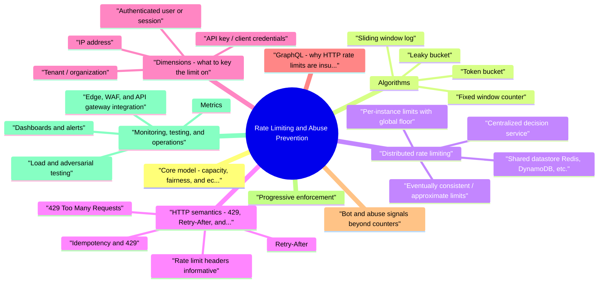

# Rate Limiting and Abuse Prevention revision map

Rate Limiting and Abuse Prevention in one sitting. That is the deal. I mined Critical Clarification Rate Limiting and Abuse Prevention Misconceptions.md, Rate Limiting and Abuse Prevention - Comprehensive Guide.md, Rate Limiting and Abuse Prevention - Interview Questions & Answers.md, Rate Limiting and Abuse Prevention - Quick Reference.md. The outline keeps every H2 I cared about from those files.

## Core model: capacity, fairness, and economics

## Algorithms

### Token bucket
- Refill can be computed lazily: store tokens and last_refill_time; on each check, add (now - last_refill_time) * r capped at B, then decrement if admitting the request.
- Concurrency: In multithreaded or distributed systems, compare-and-set loops, Lua scripts in Redis, or centralized decision services avoid lost updates.
- Weighted costs: Deduct k tokens for expensive operations so one route cannot exhaust the bucket disproportionately when using a shared bucket per tenant.

### Leaky bucket
- Idea: Requests arrive into a queue (the "bucket"). The bucket leaks at a constant rate r (smooth output). If the queue exceeds capacity B, overflow is dropped or rejected.
- Queued leaky bucket introduces latency under burst: requests wait to be released at rate r. For interactive APIs, unbounded queues are dangerous; cap queue depth and shed load explicitly.
- Drop-on-arrival variants avoid queue latency but need clear client-visible signals (429) and monitoring on drops.

### Fixed window counter
- Idea: Partition time into windows of length T (e.g., one minute). Count requests per key (IP, user) in the current window. If count > N, reject.
- Behavior: Extremely simple: one counter per key per window.

### Sliding window log
- Idea: Store timestamps of accepted requests for each key. On each request, purge entries older than T, then if count ≥ N, reject; else append now.
- Behavior: Accurate and fair with respect to the last T seconds-no boundary doubling artifact.

### Choosing among algorithms
- See the source section `Choosing among algorithms` for the worked example.

## Distributed rate limiting
- Single-host limits fail when traffic spreads across many instances, regions, or cells. Common patterns:

### Centralized decision service
- All instances call a small, fast service (or sidecar) that owns limit state. Pros: consistent policy, easier audits. Cons: extra hop, must be highly available; failure modes must be defined (fail open vs closed).

### Shared datastore (Redis, DynamoDB, etc.)
- Atomic increments with TTL for fixed windows; Lua scripts or transactions for read-modify-write on token bucket fields. Pros: mature, scalable. Cons: replication lag, clock skew, hot keys; cross-region latency.
- Hot key mitigation: Shard counters (user:123:shard7), local soft limits with occasional sync, or hierarchical limits (per-instance local cap + global cap).

### Eventually consistent / approximate limits
- See the source section `Eventually consistent / approximate limits` for the worked example.

### Per-instance limits with global floor
- Each instance enforces N / instances (or adaptive share). Pros: no central bottleneck. Cons: uneven routing causes skew; attackers target quiet instances unless load balancing is perfect.

### Sticky sessions
- Routing a user to the same instance makes local counters more accurate but weakens resilience and complicates deploys; generally avoid as a primary strategy for limits.

### Clock skew and boundaries
- Use UTC, monotonic time for refill math where possible, and TTL buffers so counters do not expire mid-window incorrectly. In multi-region systems, prefer server-side clocks authoritative for enforcement.

## HTTP semantics: 429, Retry-After, and related headers

### 429 Too Many Requests
- Meaning: The client has exceeded a rate limit or quota policy. The server understood the request; refusal is due to policy, not inability to process valid traffic in general.
- Bad practice: Using 429 for generic auth failures (prefer 401/403) confuses client libraries and observability.

### Retry-After
- HTTP-date (absolute time), or
- Delay-seconds (integer seconds from now).
- Always send Retry-After on 429 when possible, especially for bursty clients (SDKs, mobile).
- For token bucket style, Retry-After can approximate time until one token is available.
- Ensure consistent behavior: if Retry-After says 30s, do not accept meaningful traffic before that window without a documented exception.

### Rate limit headers (informative)
- X-RateLimit-Limit - policy maximum in the window.
- X-RateLimit-Remaining - remaining quota.
- X-RateLimit-Reset - Unix timestamp or seconds until reset.

### Idempotency and 429
- Safe retries depend on idempotency keys for mutating operations. A client that retries a non-idempotent POST after 429 risks duplicates-document required patterns.

## Dimensions: what to key the limit on

### IP address
- Use: Edge coarse limits, DDoS companions, and first-line login throttles combined with other keys-not alone for high-stakes authenticated flows.

### Authenticated user or session
- See the source section `Authenticated user or session` for the worked example.

### API key / client credentials
- Strengths: Ideal for B2B integrations-per-customer quotas, plan tiers, and billing alignment. Rotate keys without changing user passwords.

### Tenant / organization
- Strengths: Prevents noisy neighbor impact in multi-tenant SaaS; aligns with enterprise contracts ("100k calls/day"). Implementation: tenant ID from token claims plus defense in depth against token forgery.

### Endpoint, route, or operation
- Strengths: Protects expensive handlers (reports, exports, bulk deletes) without throttling cheap health checks. Combine with cost weighting.

### Cost dimension (compute, data, money)
- Strengths: Expresses real backend work: DB rows scanned, resolver count, external API fees, GPU ms. Implementation: static table of weights, dynamic estimates (GraphQL complexity), or post-hoc billing with soft limits.
- Example composite key: (tenant_id, operation_class) with token bucket refill r and burst B sized per plan.

### Concurrency and in-flight limits
- See the source section `Concurrency and in-flight limits` for the worked example.

## GraphQL: why HTTP rate limits are insufficient
- A single POST may expand into deep resolver trees, N+1 database queries, or batch calls to microservices. Per-request HTTP throttles miss amplification.
- Query depth limit - cap nesting (e.g., friends { friends { ... } }).
- Complexity / cost analysis - assign costs per field; reject queries above threshold before execution.
- Pagination limits - maximum first/last; reject unbounded lists.
- Aliases and batching - cap repeated fields/aliases that multiply work.
- Persisted queries / allowlists - for mobile and first-party clients, ship query IDs instead of ad-hoc strings; reduces adversarial query shapes.
- Timeouts and concurrency - per-request deadlines; limit parallel resolver fan-out.

## Bot and abuse signals (beyond counters)
- Raw QPS limits catch simple scripts; sophisticated abuse blends in. Layer signals:
- TLS/JA3/JA4 fingerprints, HTTP/2 behavior, header order anomalies.
- JavaScript challenges and proof-of-work (use sparingly; accessibility and UX cost).
- Device IDs and app attestation (mobile)-not spoof-proof alone but raises cost.
- Behavioral signals: velocity of account actions, impossible travel, password spray patterns (many usernames, one IP).
- Payment and PII velocity: card BIN failures, chargeback rates, linked accounts.
- Content signals for spam/scams when applicable.

## Progressive enforcement
- Shadow mode - log would-have throttles/blocks; compare to baseline; tune thresholds.
- Soft throttle - delay, deprioritize queue, or serve degraded results (cached).
- Challenge - CAPTCHA, MFA step-up, email proof-only when signals justify.
- Hard throttle / 429 - clear policy response with Retry-After.
- Block - IP/account/org denylists; legal/trust review for long-lived blocks.

## Monitoring, testing, and operations

### Metrics
- 429 rate overall and per route, per tenant, per integration partner.
- Retry-After distribution; client retry volume after 429/503.
- Latency added by limit checks (p50/p95).
- False positive proxies: support tickets tagged "blocked," checkout abandonment near limits, SDK errors.
- Abuse caught: challenges shown, login velocity triggers, fraud model scores at enforcement time.

### Dashboards and alerts
- Alert on sudden 429 spikes (misconfiguration) and on 429 drops to zero during attacks (bypass).
- Track quota consumption against commitments for large customers.

### Load and adversarial testing
- Burst tests at window boundaries for fixed windows-verify you do not see 2× acceptance spikes unless intended.
- GraphQL fuzzing: deep queries, alias multiplication, introspection (disable in prod if policy requires).
- Chaos on Redis/limit service: ensure fail-open vs fail-closed matches policy and does not create split-brain billing.

### Edge, WAF, and API gateway integration
- Consistency: Edge counts may diverge from origin counts (cache hits, retries). Define which layer is authoritative for billing vs abuse; avoid two incompatible 429 stories for the same client.
- Managed rules: Commercial WAFs ship rate-based rules (often fixed-window). Tune carefully-false positives on shared IPs are common. Prefer logged/count-only mode before enforcement.

### Documentation and UX
- Publish limits, header meanings, and how to request higher quotas. Client SDKs should parse Retry-After and back off with jitter.

## Failure modes (what breaks in the real world)
- Shared IP punishment - offices, schools, mobile carriers.
- Authenticated attackers - per-IP limits irrelevant; need account and device signals.
- Distributed low-rate bots - aggregate abuse under per-IP thresholds.
- GraphQL amplifier - HTTP 200 with catastrophic backend cost.
- Retry storms - missing Retry-After or clients ignoring it.
- Misconfigured WAF/CDN - country blocks or bot scores catching legitimate markets.
- Strict consistency obsession - engineering months for exact counts where approximate abuse control suffices.

## Interview clusters
- Fundamentals: Compare token bucket vs fixed window; explain boundary spike; when is 429 vs 503?
- Architecture: Central Redis vs gateway vs sidecar-trade-offs for your last system's scale?
- GraphQL: How do you prevent one query from melting the DB?
- Multi-tenant fairness: How do you stop one tenant from starving others?
- Product judgment: You tightened signup limits and conversion dropped-how do you respond?

## Cross-links
- See also in this repo: DDoS and Resilience, GraphQL and API Security, OAuth/API tokens, Business Logic Abuse, Security Observability, Third-Party Integration Security.
- External references: OWASP API Security Top 10 (resource consumption); OWASP Automated Threats; RFC 6585 (Additional HTTP Status Codes).

## The clarification file, compressed

## "Rate limiting stops all bots"
- Truth: Sophisticated actors stay below thresholds across many IPs/accounts. You need behavioral signals, device context, and business rules-not only request counts.

## "429 errors mean we're secure"
- Truth: Clients may retry aggressively; attackers may tune to your limits. Measure outcomes: fraud rate, scraping volume, service health-not only HTTP status codes.

## "Same limit for every endpoint"
- Truth: Expensive operations (exports, searches, admin) deserve tighter or token-cost based limits than cheap reads.

## Oral prompts worth repeating

- What is rate limiting, and what problem does it solve?
- Explain the token bucket algorithm in terms a PM could follow.
- What is wrong with a naive fixed-window counter, and how do people fix it?
- When should you return HTTP 429 versus 503?
- What is the purpose of the Retry-After header?
- How do you implement rate limiting in a distributed system with many app instances?
- Why is per-IP limiting insufficient for many abuse scenarios?
- How would you rate-limit a multi-tenant SaaS API fairly?
- How does GraphQL change your approach compared to REST?
- What is the difference between rate limiting and abuse prevention?
- How would you protect a login endpoint without wrecking UX?
- How do you prevent retry storms from your own clients?
- Explain leaky bucket versus token bucket for shaping traffic to a downstream dependency.
- How would you roll out a new aggressive limit safely?
- What metrics and alerts do you use to operate rate limits in production?
- How do you handle limits at the CDN/WAF versus the application?
- What is "economic" denial of service, and how do rate limits help?
- How do progressive enforcement and bot signals fit together?
- Depth: Interview follow-ups - Rate Limiting and Abuse Prevention

## Beginner

## Intermediate

## Advanced

### What is "economic" denial of service, and how do rate limits help?
- See the source section `What is "economic" denial of service, and how do rate limits help?` for the worked example.

## Depth: Interview follow-ups - Rate Limiting and Abuse Prevention
- Authoritative references: OWASP Automated Threats; OWASP API Security (API4:2023 Unlimited Resource Consumption); RFC 6585 (429 and Retry-After).
- GraphQL/API cost: Limiting expensive operations vs naive per-IP HTTP limits; depth and complexity before execution.
- Credential stuffing: Per-username throttles + risk signals-avoid locking out legitimate users; uniform errors.
- False positives: Shadow mode, NAT, enterprise egress, paid tier handling; support and revenue impact.
- Distributed systems: Hot keys, fail open vs closed, approximate limits for abuse vs strict billing.

## What sits next to this topic

- Stay inside this folder for the long guide. Jump only when a section names a sibling topic.
- Cookie Security, CSRF, XSS, JWT, OAuth, and TLS show up as neighbors on a lot of these maps.
