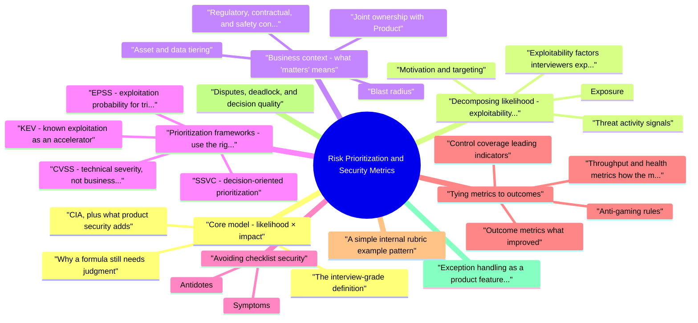

# Risk Prioritization and Security Metrics revision map

I keep this Risk Prioritization and Security Metrics map for the night before a screen, when five markdown files is too many clicks. Built from Critical Clarification Risk Prioritization and Security Metrics Misconceptions.md, Risk Prioritization and Security Metrics - Comprehensive Guide.md, Risk Prioritization and Security Metrics - Interview Questions & Answers.md, Risk Prioritization and Security Metrics - Quick Reference.md. Twenty minutes. Then I close the laptop.

## Core model: likelihood × impact

### The interview-grade definition
- Risk is the expected harm from a threat materializing against an asset, given your controls. A practical working definition:
- Likelihood answers: How plausible is it that an adversary (or failure mode) achieves a meaningful bad outcome in our environment, in a relevant time window?
- Impact answers: If it happens, how bad is it for customers, the business, and obligations we cannot ignore?

### Why a formula still needs judgment
- See the source section `Why a formula still needs judgment` for the worked example.

### CIA, plus what product security adds
- Classic impact dimensions are confidentiality, integrity, and availability. Product and platform security teams also care about:
- Fraud and abuse (wallet drain, account takeover at scale, incentive gaming)
- Safety (where systems affect physical or high-stakes decisions)
- Operator error amplified by automation (misconfiguration at fleet scale)

## Decomposing likelihood: exploitability and more
- Exploitability is how hard it is to turn a weakness into a successful attack in your environment. It is one of the main drivers of likelihood, alongside exposure and threat activity.

### Exposure
- Exposure is where the weakness can be reached from:
- Internet-facing pre-authentication surfaces (highest concern for many classes of bug)
- Authenticated but broadly available features (still serious at scale)
- Internal-only paths that assume a trusted network (dangerous if lateral movement is plausible)
- Supply chain or build paths (one compromise, many deployments)

### Exploitability factors interviewers expect you to name
- Authentication and authorization boundaries (pre-auth RCE vs authenticated IDOR)
- Complexity of the exploit chain (single request vs multiple steps across services)
- Public proof-of-concept or weaponized exploitation
- Reachability in your call graph, dependency tree, and deployment topology
- Compensating controls that actually reduce probability (WAF with known limits, egress restrictions, strong segmentation)-with verification, not policy fiction

### Threat activity signals
- Likelihood rises when the world demonstrates intent and capability:
- CISA KEV (Known Exploited Vulnerabilities catalog) flags CVEs with observed exploitation-often treated as mandatory acceleration in regulated or mature programs.
- EPSS (FIRST EPSS) estimates probability of exploitation in the wild over a short horizon-useful for triage volume, not as a replacement for architectural judgment.
- Abuse telemetry, honeypots, bug bounty noise, and incident patterns from your own fleet are internal likelihood signals that generic scores cannot see.

### Motivation and targeting
- See the source section `Motivation and targeting` for the worked example.

## Business context: what "matters" means

### Asset and data tiering
- Tiering should be documented, owned, and mapped from architecture and data-classification-not invented per ticket.

### Blast radius
- Single-tenant compromise vs cross-tenant data access
- Read vs write vs persistent backdoor
- Customer-visible outage vs internal-only degradation

### Regulatory, contractual, and safety context
- See the source section `Regulatory, contractual, and safety context` for the worked example.

### Joint ownership with Product
- See the source section `Joint ownership with Product` for the worked example.

## Prioritization frameworks: use the right signal for the job

### CVSS: technical severity, not business risk
- See the source section `CVSS: technical severity, not business risk` for the worked example.

### EPSS: exploitation probability for triage at scale
- EPSS helps when you have thousands of CVEs and need a probabilistic sort key alongside severity. It is not a measure of impact on your business. Combine EPSS with asset tier and exposure; never treat it as destiny.

### KEV: known exploitation as an accelerator
- See the source section `KEV: known exploitation as an accelerator` for the worked example.

### SSVC: decision-oriented prioritization
- SSVC (CISA SSVC) frames prioritization around stakeholder-specific decisions-moving teams from "CVSS 9" to action with transparent inputs. It shines when you need repeatable workshops and audit-friendly rationale.

### FAIR and quantitative risk (optional depth)
- See the source section `FAIR and quantitative risk (optional depth)` for the worked example.

### A practical stack many teams describe
- KEV -> immediate escalation path when applicable.
- Asset tier + exposure -> what can actually be hit and what breaks if it is.
- Exploitability evidence -> PoC, EPSS, telemetry.
- CVSS (often environmental where you adjust for your context) -> shared severity vocabulary.
- SSVC or internal rubric -> documented decision for disputes.

## Avoiding checklist security
- Checklist security is prioritization driven by artifact completion rather than risk reduction: "We passed the audit," "training was 100%," "we run scans weekly," while tier-0 weaknesses remain or exceptions age forever.

### Symptoms
- Tool output substitutes for exploit path analysis.
- Framework control status greens the dashboard while authentication or authorization flaws persist in core flows.
- Velocity metrics (tickets closed) improve while incident recurrence in the same component class does not.

### Antidotes
- Anchor reviews on scenarios (abuse cases, threat models) and verification (can we demonstrate the fix works?).
- Map controls to actual attack surfaces, not generic policy text.
- Treat compliance as minimum bar and evidence discipline, not the optimization target.

## Tying metrics to outcomes

### Outcome metrics (what improved)
- Risk burn-down on tier-0 systems (age and count of high-likelihood/high-impact issues).
- Exploit window: time from publish or discovery to remediate for prioritized classes (especially KEV-affected).
- Incident trends: severity, recurrence by root-cause class, mean time to detect and contain for material events.
- Repeat failure prevention: regressions caught by tests, guardrails, or design gates after incidents.

### Throughput and health metrics (how the machine runs)
- SLA adherence by tier, not only by generic severity label.
- Backlog aging and time-in-state (stalled work is often hidden risk).
- Exception debt: count, age, expiry compliance, compensating-control health checks.

### Control coverage (leading indicators)
- Coverage of threat modeling or design review on tier-0 services.
- Percentage of releases with provenance, signed artifacts, or policy checks where they matter.
- Privileged access behind just-in-time, strong MFA, and break-glass discipline.

### Anti-gaming rules
- Metrics go wrong when people optimize the measure:
- Severity inflation or reclassification to meet SLAs without reducing risk.
- Scan volume celebrated instead of validated fixes.
- Zero criticals achieved by renaming or splitting findings.

### Leading versus lagging: balance the portfolio
- See the source section `Leading versus lagging: balance the portfolio` for the worked example.

### Executive narrative without vanity
- A useful leadership storyline for a quarter sounds like:
- Here are the top five risks in plain language, each with an owner and date.
- Here is movement: what closed, what did not, and why (capacity, dependency, accepted risk).
- Here is the evidence that we are not fooling ourselves: spot checks, red-team themes, incident learnings.
- Here is what we are not doing this quarter and the explicit trade-off.

## A simple internal rubric (example pattern)
- Teams often codify a decision matrix so engineers do not re-litigate philosophy per ticket. One readable pattern:
- Priority rises with high tier, high exposure, high exploitability, wide blast radius, and weak controls. The matrix does not replace judgment; it makes assumptions visible when two principals disagree.

## Disputes, deadlock, and decision quality
- When two teams each label an issue P0, facilitation beats authority theater:
- Align on a shared exploit narrative-one paragraph, one diagram-agreed or explicitly marked "disputed."
- List assumptions (reachability, auth model, data path) and pick one experiment or log review to falsify the riskiest assumption quickly.
- Time-box the spike; default to containment if uncertainty remains high on tier-0.
- Record the decision with owners, review date, and metrics that would prove the decision wrong early (for example, unexpected auth traffic to the suspected path).

## Exception handling as a product feature of the program
- Mature programs treat risk acceptance as a governed decision, not a quiet Jira resolution:
- Owner at the right level (service + business).
- Compensating controls with expiry and verification.
- Re-review on a cadence or when architecture, exposure, or threat landscape changes.
- Reporting of exception debt upward-silent debt becomes normal operating procedure.

## How prioritization fails in the real world
- Severity theater: unreachable or fully mitigated issues consume calendar.
- No asset model: everything is "production" until an incident defines reality.
- Permanent exceptions: accepted risk without expiry or compensating controls.
- Siloed backlogs: AppSec, cloud, and supply chain priorities never reconcile against one engineering pool.
- Dashboard overload: beautiful charts, no decision attached.

## Building it safely: an operational sequence
- Inventory tier-0 assets and data classes; map findings to tiers first.
- Publish a triage playbook: KEV handling, EPSS thresholds (if used), escalation paths, evidence requirements for "not applicable here."
- Run joint prioritization with engineering and Product; align on one sequencing language.
- Review exceptions quarterly; report exception debt and SLA misses with owners.
- After incidents, run a prioritization retrospective: which signals were ignored, which assumptions were wrong.

## Verification and continuous improvement
- Sample audits: Do tier-0 issues meet SLA? Are exceptions within expiry? Do compensating controls still exist in production?
- Tabletop exercises: Does leadership understand top five risks and time-to-remediate assumptions?
- Post-incident learning: Update rubrics when real exploitation differed from pre-incident ranking.

## Interview synthesis: phrases that land
- "We separate technical severity from business risk; CVSS is one input."
- "Likelihood here is driven by exposure, exploitability, and what we see in the wild-KEV and EPSS help, but architecture decides."
- "Impact is about blast radius, customer harm, and obligations-not only the CVE description."
- "We measure outcomes-risk burn-down, exploit window, incident recurrence-not activity for its own sake."
- "Exceptions are time-bounded with compensating controls; we track exception debt like technical debt."

## Cross-links
- Security Metrics and OKRs, Vulnerability Management Lifecycle, Threat Modeling, Product Security Assessment Design, Agile Security Compliance, Production Security Incident Response.

## Cheat sheet bits

## Prioritization inputs (stack rank mentally)
- Asset tier (tier-0 crown jewels first)
- Exposure (internet, partner, internal)
- Exploitability (pre-auth, public exploit, KEV)
- Blast radius (single tenant vs multi-tenant; data class)
- Active signals (abuse, incidents, bounty trend)

## External prioritization references (validated)
- EPSS - exploit probability (FIRST EPSS)
- CISA KEV - known exploited CVEs (KEV catalog)
- SSVC - stakeholder-specific prioritization (CISA SSVC)

## Outcome metrics (good)
- Tier-0 risk burn-down
- Incident trend and severity
- Mean time to remediate criticals / KEV items
- Exception debt (count + age + expiry compliance)
- Control coverage (signed artifacts, MFA, JIT, etc.)

## Throughput metrics (health)
- SLA adherence by tier
- Backlog aging
- False-positive rate / analyst capacity

## Pitfalls
- CVSS-only · scan counts · closure rate without tier awareness · dashboards that drive no action

## One-liner
- Prioritize like an investor: tier, exposure, exploit activity, and blast radius-not just CVSS.

## Traps that dump interviews

## "CVSS alone determines priority."
- Reality: Exploitability, asset criticality, data sensitivity, controls, and threat intel change urgency-CVSS is input, not verdict.

## "More closed tickets means lower risk."
- Reality: Volume can improve while crown-jewel exposures or unfixed 0-days remain untracked.

## "Executive dashboards should show every finding."
- Reality: Leadership needs decision-grade top risks, trend, and capacity tradeoffs-not raw scanner exports.

## "EPSS replaces CVSS."
- Reality: EPSS estimates exploitation probability; combine with business context and reachability-they answer different questions.

## "Zero open criticals = secure."
- Reality: Logic bugs, misconfigs, and unknown unknowns won't appear as CVEs; outcome metrics (incidents, mean time to contain) still matter.

## "We should optimize for mean time to patch everything."
- Reality: Uniform SLAs waste capacity; tier assets and align SLAs to blast radius.

## "Security scorecards are objective."
- Reality: Weighting choices embed values; publish methodology and avoid gaming via narrow definitions.

## "Risk registers are compliance theater."
- Reality: When tied to owners, dates, and exec review, they drive acceptance with accountability-theater is stale rows.

## "Low false-positive rate proves good detection."
- Reality: High precision with low recall misses attacks-measure coverage of critical paths, not only noise.

## "We can't measure security, so use gut feel."
- Reality: Leading indicators (coverage, fix SLA adherence, secure SDLC gates) and lagging indicators (incidents) both help-imperfect metrics beat none.

## Prompts I drill out loud

- How do you define risk when prioritizing security work?
- Two findings are both "critical." How do you pick order?
- Why is CVSS alone insufficient for prioritization?
- What role does exploitability play separate from "severity"?
- Frameworks and signals
- What is EPSS, and how would you use it?
- What is the CISA KEV catalog, and why does it matter?
- What is SSVC, and when would you choose it?
- Metrics, leadership, and outcomes
- What security metrics do executives actually care about?
- How do you tie metrics to outcomes instead of activity?
- What metric mistakes create perverse incentives?
- What is exception debt, and why track it?
- Trade-offs, conflict, and scale
- Engineering wants to defer a high-risk fix. What do you do?
- How do you prioritize across AppSec, cloud, and supply-chain backlogs with one engineering pool?
- How do you avoid security becoming a bottleneck?
- Program design and compliance
- What does a strong quarterly security review with leadership include?
- How does risk prioritization interact with compliance?
- How would you measure a threat-modeling or design-review program?
- Curveballs and depth
- Everything is "P0." How do you fix that?
- What is a risk register, and what belongs in it?

## Fundamentals

### Two findings are both "critical." How do you pick order?
- See the source section `Two findings are both "critical." How do you pick order?` for the worked example.

### What role does exploitability play separate from "severity"?
- See the source section `What role does exploitability play separate from "severity"?` for the worked example.

### Everything is "P0." How do you fix that?
- See the source section `Everything is "P0." How do you fix that?` for the worked example.

### How do quantitative approaches like FAIR fit in?
- See the source section `How do quantitative approaches like FAIR fit in?` for the worked example.

## Depth: Interview follow-ups - Risk Prioritization & Metrics
- Authoritative references: FAIR (risk quant-optional); CVSS (severity-limitations); EPSS (exploit probability-FIRST); KEV; SSVC.
- CVSS alone is insufficient - reachability, asset value, compensating controls, blast radius.
- Leading vs lagging metrics for security programs; pairing throughput with outcomes.
- OKRs that avoid gaming (pair vuln counts with tier-0 aging, incident themes, exploit window).

## Sibling folders

- Stay inside this folder for the long guide. Jump only when a section names a sibling topic.
- Cookie Security, CSRF, XSS, JWT, OAuth, and TLS show up as neighbors on a lot of these maps.
