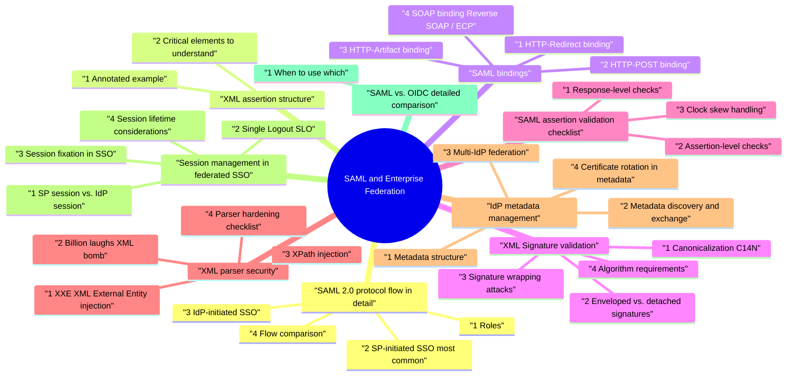

# SAML and Enterprise Federation revision map

Last mock I bounced around the SAML and Enterprise Federation folder. This file is the stop that. Drawn from Critical Clarification SAML and Enterprise Federation Misconceptions.md, SAML and Enterprise Federation - Comprehensive Guide.md, SAML and Enterprise Federation - Interview Questions & Answers.md, SAML and Enterprise Federation - Quick Reference.md. Skim the mermaid, then the outline.

## SAML 2.0 protocol flow in detail

### 1 Roles
- See the source section `1 Roles` for the worked example.

### 2 SP-initiated SSO (most common)
- This is the recommended flow. The user starts at the SP, gets redirected to the IdP, authenticates, and returns with an assertion.
- User visits SP - e.g., https://app.example.com/dashboard. SP detects no active session.
- SP generates AuthnRequest - an XML document containing:
- ID - unique request identifier (used later for InResponseTo correlation).
- IssueInstant - timestamp.
- Issuer - SP's entity ID.
- AssertionConsumerServiceURL - where the IdP should POST the response.
- NameIDPolicy - requested format (e.g., urn:oasis:names:tc:SAML:1.1:nameid-format:emailAddress).

### 3 IdP-initiated SSO
- The user starts at the IdP portal, clicks a tile for the SP, and the IdP sends an unsolicited SAML Response directly.
- User authenticates at IdP - logs into the IdP portal (e.g., Okta dashboard).
- User clicks SP tile - selects "Acme App" from their app catalog.
- IdP constructs unsolicited Response - no InResponseTo field since there was no AuthnRequest.
- Browser POSTs to SP ACS - same auto-submit form mechanism.
- SP validates and creates session - but cannot correlate to a prior request.
- No InResponseTo - replay detection is harder; the SP must rely solely on NotOnOrAfter, assertion ID one-time-use tracking, and Recipient validation.
- CSRF-like attacks - an attacker could force a victim's browser to submit a stolen assertion (the victim ends up in the attacker's account or vice versa).

### 4 Flow comparison
- See the source section `4 Flow comparison` for the worked example.

## XML assertion structure
- A SAML Response typically contains an outer wrapping one or more elements. Understanding the structure is critical for validation.

### 1 Annotated example
- See the source section `1 Annotated example` for the worked example.

### 2 Critical elements to understand
- See the source section `2 Critical elements to understand` for the worked example.

## SAML bindings
- Bindings define how SAML protocol messages are transported between IdP and SP. SAML 2.0 defines several bindings, each with distinct security and operational characteristics.

### 1 HTTP-Redirect binding
- Mechanism: SAML message is deflated (zlib), base64-encoded, URL-encoded, and placed in a query parameter (SAMLRequest or SAMLResponse).
- HTTP method: GET (302 redirect).
- Signature: Query string signature (separate SigAlg and Signature parameters)-the signature covers the query string, not the XML body.
- Size limit: Practical URL length limit (~8KB total URL) means this is only usable for AuthnRequests and LogoutRequests, not full Responses with assertions.
- Use case: SP -> IdP AuthnRequest, LogoutRequest/LogoutResponse.
- Security note: The signature is over the URL parameters (including RelayState), not the XML document itself. Tampering with the URL invalidates the signature.

### 2 HTTP-POST binding
- Mechanism: SAML message is base64-encoded and placed in a hidden HTML form field. The browser auto-submits the form via JavaScript or a submit button.
- HTTP method: POST.
- Signature: XML Signature (enveloped) within the SAML document itself.
- Size limit: No practical size constraint-can carry full assertions with multiple attributes.
- Use case: IdP -> SP SAML Response (primary use), also AuthnRequest when signatures are large.
- Security note: The form auto-submit happens over TLS; the assertion is not in the URL (no referer leakage, no browser history exposure).

### 3 HTTP-Artifact binding
- HTTP method: GET or POST for the artifact; SOAP over HTTPS for resolution.
- Two-phase flow:
- Browser carries artifact from IdP to SP (via redirect or POST).
- SP contacts IdP's Artifact Resolution Service directly (server-to-server HTTPS) to retrieve the assertion.
- Use case: When assertions are too large for browser transport, when you want to avoid exposing assertion content to the browser, or when mutual TLS is required for assertion retrieval.
- Security note: The assertion never transits the browser. The back-channel call can use mutual TLS for strong authentication. Artifacts are single-use and time-limited.
- Downsides: Requires network connectivity from SP to IdP (problematic in some firewall configurations). Adds latency (extra round-trip). More complex to implement and debug.

### 4 SOAP binding (Reverse SOAP / ECP)
- Mechanism: Direct server-to-server SOAP messages over HTTPS. No browser involvement.
- Use case: Enhanced Client or Proxy (ECP) profile for non-browser clients (thick clients, CLI tools, mobile apps that can't do browser redirects).
- Security note: Mutual TLS typically required. Not common in web SSO-mainly used for ECP or Single Logout back-channel.

### 5 Binding comparison
- See the source section `5 Binding comparison` for the worked example.

## XML Signature validation

### 1 Canonicalization (C14N)
- Before signing or verifying, the XML must be canonicalized-transformed into a standard form so that logically equivalent documents produce identical byte sequences.
- Exclusive Canonicalization (exc-c14n): Only renders namespaces that are visibly used within the signed element. This is the standard for SAML and prevents namespace injection attacks.
- Inclusive Canonicalization (c14n): Includes all in-scope namespaces. Rarely used for SAML because it's fragile when documents are embedded or extracted.
- Why it matters: Without canonicalization, insignificant whitespace changes, attribute reordering, or namespace prefix changes would invalidate signatures even though the document is semantically identical.

### 2 Enveloped vs. detached signatures
- The element is a child of the signed element (e.g., inside ).
- The enveloped-signature transform removes the Signature element before computing the digest, avoiding circular reference.
- Most common in SAML. The IdP signs the assertion, and the signature lives inside it.
- The lives outside the signed element, referencing it via the URI attribute.
- Sometimes used when the Response is signed separately from the Assertion.
- The points to the actual assertion being processed (not a decoy).
- The digest of the canonicalized referenced element matches .
- The signature over is valid using the IdP's trusted public key.

### 3 Signature wrapping attacks
- Signature wrapping (XSW) is a class of attacks that exploit the gap between what is signed and what is processed.
- Attacker intercepts a valid signed SAML Response.
- Attacker moves the legitimately signed assertion to a location the SP's signature verification code finds (e.g., a comment node or a second element).
- Attacker inserts a forged assertion at the location the SP's session-creation code reads.
- Signature verification passes (it finds and validates the legitimate signed assertion), but the application logic processes the forged assertion.
- Moving the signed assertion into , wrapping it in , placing it after the response, cloning the response element, etc.
- Strict schema validation: Reject responses with unexpected element positions or duplicate assertions.
- ID-based reference validation: After signature verification, ensure the application processes the exact element that was signed (match Assertion/@ID to Reference/@URI).

### 4 Algorithm requirements
- See the source section `4 Algorithm requirements` for the worked example.

## SAML assertion validation checklist
- Every SP must perform these checks on every SAML Response. Missing any one creates an exploitable vulnerability.

### 1 Response-level checks
- See the source section `1 Response-level checks` for the worked example.

### 2 Assertion-level checks
- See the source section `2 Assertion-level checks` for the worked example.

### 3 Clock skew handling
- Typical tolerance: 30 seconds to 2 minutes in each direction.
- Implementation: current_time + skew_tolerance >= NotBefore AND current_time - skew_tolerance < NotOnOrAfter.
- NTP requirement: Both SP and IdP must run NTP. Monitor clock drift. Alert on time-related validation failures-they often indicate NTP misconfiguration, not attacks.
- Too loose: A 10-minute skew window makes replay attacks trivially easy.
- Too strict: A 0-second tolerance causes intermittent failures across cloud regions.

## XML parser security
- SAML's XML foundation inherits all XML parser vulnerabilities. These are not theoretical-they have been exploited in production SAML implementations.

### 1 XXE (XML External Entity) injection
- Attack: A malicious SAML Response includes an entity declaration that references an external resource:
- Impact: Server-side file read, SSRF to internal services, denial of service.
- Java: `factory.setFeature("http://apache.org/xml/features/disallow-doctype-decl", true)`
- Python (lxml): parser = etree.XMLParser(resolve_entities=False, no_network=True)
- .NET: XmlReaderSettings.DtdProcessing = DtdProcessing.Prohibit

### 2 Billion laughs (XML bomb)
- Attack: Exponential entity expansion creates massive memory consumption:
- Impact: Denial of service via memory exhaustion-a few KB of XML expands to gigabytes.

### 3 XPath injection
- If the SP uses dynamic XPath expressions to locate assertion elements (e.g., using user-controlled data in XPath queries), attackers can manipulate which elements are processed.
- Defense: Use fixed XPath expressions or schema-validated parsing. Never construct XPath from untrusted input.

### 4 Parser hardening checklist
- [ ] Disable external entities (FEATURE_EXTERNAL_ENTITIES = false)
- [ ] Disable DTD processing (FEATURE_DISALLOW_DOCTYPE = true)
- [ ] Set entity expansion limits
- [ ] Set maximum document size limits
- [ ] Use namespace-aware parsing
- [ ] Pin parser library versions and monitor CVEs
- [ ] Fuzz test SAML endpoint with malformed XML regularly

## IdP metadata management

### 1 Metadata structure
- IdP metadata is an XML document describing the IdP's capabilities, endpoints, and certificates:

### 2 Metadata discovery and exchange
- See the source section `2 Metadata discovery and exchange` for the worked example.

### 3 Multi-IdP federation
- When your SP serves hundreds of enterprise customers, each with their own IdP:
- Per-tenant IdP configuration: Store IdP metadata (entity ID, SSO URL, signing certificate, attribute mapping) per tenant.
- IdP discovery: Determine which IdP to redirect to based on email domain, tenant subdomain, or a discovery service (WAYF-"Where Are You From").
- Metadata validation: Validate each IdP's metadata on upload: check certificate validity, required endpoints, supported bindings.
- Isolation: Ensure tenant A's IdP cannot issue assertions accepted for tenant B. The Issuer and Audience checks must be tenant-scoped.

### 4 Certificate rotation in metadata
- IdP certificates expire. Rotating them without downtime requires coordination:
- IdP publishes new cert in metadata alongside the old cert (both listed as ).
- SP refreshes metadata and now trusts both certificates.
- IdP begins signing with new cert - SP validates against either cert.
- Grace period (typically 2-4 weeks) - old cert remains in metadata.
- IdP removes old cert from metadata - SP refreshes and removes old trust.
- SP doesn't auto-refresh metadata -> old cert expires -> SSO breaks.
- IdP rotates immediately without grace period -> all SPs that haven't refreshed break.

## Session management in federated SSO

### 1 SP session vs. IdP session
- A critical concept: SAML creates two independent sessions.

### 2 Single Logout (SLO)
- SLO attempts to terminate both sessions and notify all SPs that share the IdP session.
- IdP sends LogoutRequest to each SP via browser redirects (iframes or redirect chain).
- Fragile: if any SP is slow or down, the chain breaks. Browser pop-up blockers and third-party cookie restrictions interfere.
- IdP sends SOAP LogoutRequest directly to each SP's SLO endpoint.
- More reliable but requires SP to expose a back-channel endpoint accessible from the IdP.
- Logging out of the SP destroys the local session.
- The IdP session persists until its own timeout.
- Critical apps use short SP session lifetimes and re-validate at the IdP on session refresh.

### 3 Session fixation in SSO
- Defense: Always regenerate the SP session identifier after successful SAML assertion validation. Never reuse a pre-authentication session ID for the authenticated session.

### 4 Session lifetime considerations
- Short SP sessions (15-60 minutes) force re-authentication at the IdP more frequently-good for sensitive apps but may cause user friction if the IdP session also requires re-auth.
- Session sliding: Reset SP session timeout on each request vs. absolute timeout. Absolute timeout is more secure.
- Step-up authentication: For sensitive operations, require re-authentication at the IdP even within a valid session. Request specific AuthnContextClassRef (e.g., MFA) in the AuthnRequest.

## SAML vs. OIDC detailed comparison

### 1 When to use which
- Enterprise customers mandate it in their procurement/compliance requirements.
- Integrating with legacy IdPs (ADFS, older PingFederate) that only support SAML.
- Joining an established federation (InCommon, eduGAIN for education).
- B2B contracts already specify SAML metadata exchange.
- Building greenfield applications, especially SPA or mobile.
- You need API authorization (OAuth 2.0 access tokens) alongside identity.
- The IdP supports OIDC (most modern IdPs support both).
- You want simpler implementation with JSON-based tooling.

## Enterprise federation patterns

### 1 Hub-and-spoke
- A central identity broker (hub) mediates between all SPs (spokes) and all IdPs (spokes).
- Advantages: SPs only trust the broker; adding a new IdP doesn't require reconfiguring every SP. Protocol translation (SAML ↔ OIDC) happens at the broker.

### 2 Mesh federation
- Each SP directly trusts each IdP. No central broker.
- Advantages: No single point of failure. No intermediary seeing all traffic.

### 3 Federated identity with a federation operator
- Organizations join a federation (e.g., InCommon for US higher education, eduGAIN globally). The federation operator:
- Aggregates and signs metadata for all members.
- Enforces baseline trust policies (identity proofing, operational security).
- Members trust the federation's metadata signing key and automatically trust all members.

### 4 Identity broker pattern
- An identity broker (Keycloak, Auth0, Okta, Azure AD B2C) acts as both an SP (to upstream IdPs) and an IdP (to downstream applications).
- Protocol translation: Accept SAML from enterprise IdPs, issue OIDC tokens to your applications.
- Claim transformation: Map IdP-specific attributes to your application's expected claim schema.
- MFA augmentation: Add MFA on top of the IdP's authentication if the IdP doesn't provide it.
- Session management: Centralized session with SSO across all downstream applications.

## Multi-tenant SAML

### 1 Per-tenant IdP configuration
- For SaaS products serving multiple enterprises:

### 2 ACS URL routing
- Shared ACS URL: https://app.example.com/saml/acs
- All tenants POST to the same endpoint.
- SP determines the tenant from the assertion's Issuer (IdP entity ID) -> look up tenant by IdP -> validate with that tenant's certificate.
- Simpler to manage but requires solid Issuer -> tenant mapping.
- Tenant identity is in the URL path-no ambiguity.
- Each tenant gets unique SP metadata with their specific ACS URL.
- More explicit but more URLs to manage and register in IdP metadata.

### 3 Tenant discovery
- How to determine which IdP to redirect to before authentication:
- Email domain mapping: User enters email -> SP extracts domain -> looks up IdP. (e.g., @corporate.com -> Corporate IdP).
- Subdomain routing: Tenant uses corporate.app.example.com -> SP maps subdomain to IdP.
- Discovery service (WAYF): SP presents a list of IdPs; user selects theirs.
- Home Realm Discovery (HRD): A dedicated page or API that returns the correct IdP URL based on a hint parameter.

### 4 Multi-tenant security considerations
- Tenant isolation: Never accept an assertion from Tenant A's IdP for Tenant B's account. Cross-tenant assertion acceptance is a critical vulnerability.
- NameID collision: alice@example.com from IdP A and alice@example.com from IdP B are different users. Use (IdP entity ID + NameID) as the unique identifier.
- Attribute trust boundary: Only trust attributes from a tenant's IdP for that tenant's authorization decisions. Don't let Tenant A's IdP assert admin role for your platform globally.

## Certificate rotation

### 1 IdP certificate rotation process
- See the source section `1 IdP certificate rotation process` for the worked example.

### 2 SP certificate rotation
- SPs also have certificates (for signing AuthnRequests and for encryption). The process mirrors IdP rotation:
- SP generates new cert and publishes metadata with both certs.
- IdP refreshes SP metadata and accepts both certs.
- SP switches to signing with new cert.
- After grace period, SP removes old cert from metadata.

### 3 Automated rotation
- Metadata auto-refresh: SP polls IdP metadata URL on a schedule (e.g., hourly) and updates trust store automatically.
- validUntil enforcement: Metadata documents include validUntil timestamps. Reject metadata past this date to prevent using stale trust anchors.
- SCEP/ACME for SAML: Not standardized, but some platforms (Azure AD) automate certificate generation and rotation.

### 4 Monitoring and alerting
- Certificate expiration within 30/14/7 days -> warning/critical alerts.
- Metadata refresh failure -> alert (SP can't update trust store).
- Signature validation failures spike -> likely cert mismatch from uncoordinated rotation.
- Track certificate fingerprint per-assertion in logs for forensic analysis.

## Attribute mapping and provisioning

### 1 Attribute release policies
- IdPs control which attributes are released to which SPs. Security-conscious IdPs implement attribute release policies:
- Minimum necessary: Only release attributes the SP needs (email, name, groups-not SSN, home address).
- Consent: Some federations require user consent before releasing attributes.
- Attribute naming: No universal standard. One IdP sends `http://schemas.xmlsoap.org/ws/2005/05/identity/claims/emailaddress`, another sends email, another sends mail. SPs must maintain per-IdP attribute mappings.

### 2 Just-In-Time (JIT) provisioning
- When a user authenticates via SAML for the first time, the SP automatically creates a local account using attributes from the assertion.
- User authenticates at IdP -> SP receives assertion.
- SP looks up user by (IdP entity ID + NameID). Not found.
- SP creates new user account with attributes from assertion (email, name, groups).
- SP establishes session for the new user.
- Deprovisioning: JIT doesn't handle user removal. When a user is disabled in the IdP, the SP doesn't know unless the user tries to log in and the IdP rejects authentication.
- Attribute updates: Group memberships may change at the IdP but the SP's local copy is stale until next login.
- Account linking: If a user already has a local account (created via invitation/registration), linking it to the SAML identity requires matching logic (typically by email).

### 3 SCIM integration
- SCIM (System for Cross-domain Identity Management) complements SAML by providing a REST API for user lifecycle management:
- Provisioning: IdP pushes user creation to SP via SCIM API (no need to wait for first login).
- Deprovisioning: IdP disables/deletes user in SP via SCIM when they leave the organization.
- Attribute synchronization: Group membership, department, title changes propagated in near-real-time.
- SAML + SCIM together: SCIM handles the user lifecycle; SAML handles authentication. This is the gold standard for enterprise SSO.

## Compliance considerations

### 1 SOC 2 SSO requirements
- Centralized authentication: SSO demonstrates centralized access control.
- MFA enforcement: Auditors look for MFA at the IdP level. SAML AuthnContextClassRef can assert MFA was used.
- Access review: SCIM provisioning + SAML provides auditable access lifecycle.
- Session management: Documented session timeouts and logout procedures.
- Logging: All SAML authentication events logged with timestamp, IdP, SP, NameID (hashed for PII protection), success/failure, and session duration.

### 2 FedRAMP
- FIPS 140-2 validated cryptography: Signature algorithms and key storage must use FIPS-validated modules.
- PIV/CAC authentication: Government IdPs may require certificate-based authentication; SAML assertions must reflect the authentication method.
- Continuous monitoring: SAML endpoints included in vulnerability scanning and penetration testing scope.

### 3 HIPAA SSO considerations
- Access control (§164.312(a)(1)): SSO must enforce unique user identification and emergency access procedures.
- Audit controls (§164.312(b)): Log all SAML authentication events.
- Automatic logoff (§164.312(a)(2)(iii)): SP session timeouts aligned with HIPAA requirements (typically 15-30 minutes of inactivity for clinical systems).
- BAA coverage: SAML IdP service is a business associate if it processes PHI (even user identity may qualify).

## Real-world SAML vulnerabilities

### 1 Golden SAML (SolarWinds, 2020)
- The token-signing certificate's private key was the single root of trust.
- Forged assertions passed all SP validation checks because they were cryptographically valid.
- No visibility into the IdP's authentication events-only the SP's assertion validation.
- Protect IdP signing keys with HSMs-never store on disk.
- Monitor for anomalous assertions: assertions for high-privilege accounts outside normal hours, assertions with unusual attributes.
- Detect impossible travel: assertion claims user is in NYC but was in London 10 minutes ago.
- IdP audit logs are critical: correlate assertion issuance with actual IdP authentication events.
- Certificate rotation after compromise: if the signing key is suspected compromised, rotate immediately and revoke all existing sessions.

### 2 Signature wrapping bypasses
- CVE-2012-6153 (Apache CXF), CVE-2017-11427 (OneLogin), CVE-2018-0489 (Duo):
- Multiple SAML libraries were vulnerable to XML signature wrapping attacks where:
- The signed assertion was moved within the XML document tree.
- An attacker-crafted unsigned assertion was placed where the application logic expected it.
- Signature verification passed (found the signed assertion) but the app processed the unsigned one.

### 3 XML canonicalization bugs
- CVE-2019-0688 (Microsoft ADFS), research by Kelby Ludwig (Duo Labs):
- Discrepancies between how the canonicalization algorithm processed comments and how the application processed the resulting XML allowed attackers to inject content into signed elements:
- XML comments are stripped during canonicalization.
- If the application doesn't strip comments, an attacker could add
- Example: NameID of alice@evil.com

### 4 XXE in SAML implementations
- See the source section `4 XXE in SAML implementations` for the worked example.

## Troubleshooting SAML

### 1 Common failure modes
- See the source section `1 Common failure modes` for the worked example.

### 2 Debugging tools
- See the source section `2 Debugging tools` for the worked example.

### 3 Troubleshooting checklist
- Capture the SAML Response - use SAML Tracer or network inspector.
- Decode and pretty-print - base64 decode the response, format the XML.
- Check the signature - is the assertion signed? With what certificate? Does the SP trust that cert?
- Check the Issuer - does it match the expected IdP entity ID?
- Check Audience - does it match the SP's entity ID?
- Check Destination and Recipient - do they match the ACS URL?
- Check time conditions - is the assertion within its validity window? What's the clock delta?
- Check InResponseTo - does it match a pending AuthnRequest?

## Operational reality

### 1 Vendor quirks
- ADFS often sends responses with the signature on the Response element only (not the Assertion). Your SP must handle both configurations.
- Okta sends SessionNotOnOrAfter in the AuthnStatement; some SPs ignore it, leading to session lifetime mismatches.
- Azure AD (Entra ID) uses specific claim URIs (http://schemas.microsoft.com/...) that require per-IdP attribute mapping.
- PingFederate supports multiple signing algorithms and binding combinations that may differ from what your SP expects.
- Google Workspace as IdP has limited SAML attribute customization-you may need to work around attribute limitations.

### 2 Support and operations
- Runbooks: Document common failures and resolution steps per major IdP vendor.
- Onboarding automation: Provide metadata upload UI, SP metadata download, and a test authentication flow that validates the integration before going live.
- Monitoring: SSO error rates by IdP, signature failure rates, authentication latency at ACS, certificate expiration dashboards.

### 3 Conformance testing
- Maintain a test suite that validates your SP against:
- Multiple IdP implementations (ADFS, Okta, Azure AD, PingFederate, Shibboleth).
- Edge cases: clock skew, large assertions, multiple attribute values, encrypted assertions, SLO flows.
- Negative cases: tampered assertions, wrong Audience, expired assertions, replayed assertions.

## Verification
- Negative tests: tampered assertion, wrong Audience, replayed response, expired assertion, signature wrapping attempt, XXE payload.
- IdP rotation drills: metadata update with rollback plan; verify that both old and new certs work during grace period.
- Monitoring: SSO error rates by IdP, signature failures, authentication latency at ACS endpoint, certificate expiration countdown.
- Penetration testing: Include SAML endpoints in scope. Test for XSW, XXE, unsigned assertion acceptance, and relay state open redirect.

## Advanced hardening and failure modes

### 1 RelayState integrity and redirect safety
- RelayState is frequently abused as an open redirect carrier after successful SSO.
- Accept only relative paths or strict allowlisted destinations.
- Bind RelayState to the AuthnRequest ID (or sign/encrypt it server-side).
- Enforce length and character limits to prevent parser/log injection edge cases.

### 2 Metadata trust and key rollover race windows
- Operational failures often happen during certificate rotation:
- SP fetches stale metadata from cache while IdP has already switched certs.
- Overlap windows are too short, creating intermittent signature failures.
- Emergency rollback re-enables deprecated algorithms accidentally.
- Signed metadata validation with explicit trust anchor pinning.
- Two-cert overlap policy with monitored cutover checkpoints.
- Automated expiry alerts plus dry-run validation before production activation.

### 3 Golden SAML and assertion forgery detection posture
- If IdP signing keys are compromised, protocol-level validation can still pass.
- Behavioral anomaly detection (new geos/devices/impossible travel after SSO).
- Sudden shifts in Issuer patterns, session volume, or role elevation rates.
- Correlation between IdP admin actions (key changes, federation config edits) and SSO spikes.
- Fast containment runbook: key rotation, trust reset, session invalidation, and high-risk action review.

## Interview clusters
- Fundamentals: "Walk me through SP-initiated SSO flow." "What does the SP validate in a SAML Response?"
- Mid-level: "How do you prevent assertion replay?" "What's the difference between HTTP-Redirect and HTTP-POST bindings?"
- Senior: "Explain signature wrapping attacks and how to defend against them." "How do you handle certificate rotation across 200 customer IdPs?"

## Cross-links
- OAuth 2.0, JWT, Cross-Origin Authentication, TLS, XXE, IAM and Least Privilege, Zero Trust Architecture, SCIM, PKI and Certificate Management.

## Flags I check in 90 seconds

## Message flow (IdP -> SP)
- AuthnRequest (SP-init) -> IdP auth -> Response POST to ACS -> SP validates signature + conditions -> session established

## Validation checklist (high signal)

## Parser / XML hygiene
- Disable DTD / external entities · size limits · schema-aware parsing - mitigates XXE / billion laughs class issues

## Attack names to recognize
- XSW (XML Signature Wrapping) · metadata poisoning · IdP misconfiguration exposing unsigned assertions (implementation bug class)

## Specs (bookmark, don't memorize page numbers)
- SAML 2.0 core · Bindings · Profiles (Web SSO)

## Tools / ops
- SAML-tracer (browser) · openssl / xmllint for debug (careful with secrets) · vendor IdP simulators in lower envs

## Cross-read
- OAuth · JWT · TLS · XXE · Authorization and Authentication

## One-liner

## Misreads that still sneak in

## "SAML login means the app is authorized"

## "If XML is signed, we're safe"
- Truth: You must verify signatures with the correct IdP key, validate Audience, Recipient, timestamps, and InResponseTo-signature without correct constraints still breaks security.

## "We should build our own SAML parser"
- Truth: Use mature libraries; XML parsing and crypto are easy to get wrong-also mind XXE if parsers are misconfigured.

## Clusters from the Q&A file

- Walk me through the SP-initiated SAML SSO flow step-by-step.
- Why is IdP-initiated SSO considered less secure than SP-initiated?
- What is the complete validation checklist an SP must perform on a SAML Response?
- Explain the four SAML bindings and when each is used.
- What is a signature wrapping (XSW) attack and how do you defend against it?
- How does XML canonicalization work and why does it matter for SAML?
- How do you protect SAML endpoints against XXE and XML bomb attacks?
- How do you handle certificate rotation across hundreds of customer IdPs without breaking SSO?
- What is Golden SAML and what lessons does the SolarWinds incident teach us?
- Compare SAML 2.0 and OpenID Connect across key dimensions and advise on selection.
- How do you design multi-tenant SAML for a SaaS product serving 500 enterprise customers?
- Explain the difference between SP sessions and IdP sessions and the challenges of Single Logout.
- What are the enterprise federation patterns and when would you use each?
- How do you handle attribute mapping when different IdPs use different attribute names and formats?
- What is SCIM and how does it complement SAML in enterprise SSO?
- You see a spike in "Invalid signature" errors for a specific customer's SSO integration. How do you troubleshoot?
- How do you prevent session fixation in the context of SAML SSO?
- What compliance considerations apply to SAML SSO in regulated environments?
- A customer reports users are getting logged out of your app but can immediately log back in without re-entering credentials. What's happening?
- How would you implement RelayState securely and what attacks target it?
- Depth: Interview follow-ups - SAML and Enterprise Federation

## Depth: Interview follow-ups - SAML and Enterprise Federation
- Authoritative references: OASIS SAML 2.0 (technical overview); OWASP SAML Security (cheat sheet); XML External Entity Prevention; Duo Labs SAML Research (XSW/canonicalization bugs).
- Signature validation deep dive: canonicalization, enveloped vs. detached, XSW variants, algorithm requirements.
- XML parser security: XXE, billion laughs, entity expansion limits, per-language hardening.
- Multi-tenant architecture: per-tenant IdP config, ACS routing, tenant discovery, isolation guarantees.
- Certificate lifecycle: coordinated rotation, grace periods, monitoring stale metadata, automated refresh.
- SAML vs OIDC trade-offs: protocol mechanics, mobile support, API authorization, enterprise adoption.
- Real-world attacks: Golden SAML, signature wrapping bypasses, canonicalization bugs.
- Session management: SP vs IdP sessions, SLO reliability, session fixation, ForceAuthn.

## Cross-links I actually follow

- Stay inside this folder for the long guide. Jump only when a section names a sibling topic.
- Cookie Security, CSRF, XSS, JWT, OAuth, and TLS show up as neighbors on a lot of these maps.
