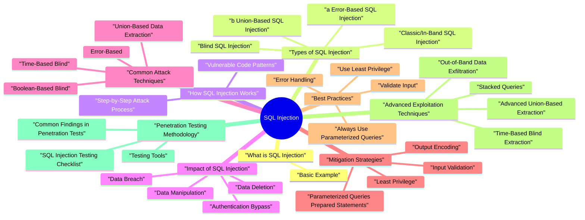

# SQL Injection revision map

I keep this SQL Injection map for the night before a screen, when five markdown files is too many clicks. Built from Critical Clarification SQL Injection Misconception.md, SQL Injection - Comprehensive Guide.md, SQL Injection - Interview Questions & Answers.md, SQL Injection - Quick Reference.md, SQL Injection - VAPT Methodology.md. Twenty minutes. Then I close the laptop.

### What SQL Injection is Used For
- SQL Injection attacks are used by attackers to:
- Bypass authentication mechanisms
- Extract sensitive data from databases
- Modify or delete data in databases
- Execute arbitrary commands on database servers
- Perform privilege escalation
- Access internal network resources (in some cases)

### Why SQL Injection is Dangerous
- High Impact: Can lead to complete database compromise
- Common: Found in many applications
- Easy to Exploit: Basic attacks require minimal technical skill
- Hard to Detect: May not show obvious errors
- Persistent: Still prevalent despite awareness

## What is SQL Injection

### Basic Example
- The -- comments out the password check, allowing login without a password!

## Types of SQL Injection

### Classic/In-Band SQL Injection
- Description: The attacker receives the results directly in the application's response.

### a) Error-Based SQL Injection
- Exploits database error messages
- Errors reveal database structure
- Example: ' OR 1=1--

### b) Union-Based SQL Injection
- Uses UNION to combine queries
- Extracts data from other tables
- Example: ' UNION SELECT username, password FROM users--

### Blind SQL Injection
- Description: The attacker doesn't see direct results but infers information from application behavior.

### a) Boolean-Based Blind
- Uses true/false conditions
- Observes different responses
- Example: ' AND 1=1-- vs ' AND 1=2--

### b) Time-Based Blind
- Uses time delays to infer data
- Example: '; WAITFOR DELAY '00:00:05'--

### Second-Order SQL Injection
- Description: Malicious input is stored and executed later when used in another query.

### Out-of-Band SQL Injection
- Description: Uses alternative channels (DNS, HTTP) to extract data.

## How SQL Injection Works

### Step-by-Step Attack Process
- Identify Input Points:
- URL parameters
- Form fields
- HTTP headers
- Test for Vulnerability:
- Determine Database Type:
- Extract Database Schema:
- Extract Data:

### Vulnerable Code Patterns
- See the source section `Vulnerable Code Patterns` for the worked example.

## Impact of SQL Injection

### Data Breach
- Extract all user data
- Access sensitive information
- Read configuration files
- Access encrypted data

### Authentication Bypass
- Login without credentials
- Access any user account
- Escalate privileges

### Data Manipulation
- Modify user data
- Change prices
- Alter records
- Delete data

### Data Deletion
- Delete entire tables
- Drop databases
- Truncate data

### Remote Code Execution
- Execute OS commands
- Access file system
- Install backdoors
- Pivot to other systems

### Server Compromise
- Complete system control
- Access internal network
- Install persistent access
- Use as attack platform

## Common Attack Techniques

### Union-Based Data Extraction
- See the source section `Union-Based Data Extraction` for the worked example.

### Boolean-Based Blind
- See the source section `Boolean-Based Blind` for the worked example.

### Time-Based Blind
- See the source section `Time-Based Blind` for the worked example.

### Error-Based
- See the source section `Error-Based` for the worked example.

### Second-Order
- See the source section `Second-Order` for the worked example.

## Mitigation Strategies

### Parameterized Queries (Prepared Statements)
- See the source section `Parameterized Queries (Prepared Statements)` for the worked example.

### Input Validation
- See the source section `Input Validation` for the worked example.

### Least Privilege
- See the source section `Least Privilege` for the worked example.

### Output Encoding
- See the source section `Output Encoding` for the worked example.

### WAF (Web Application Firewall)
- Deploy WAF as additional layer
- Configure SQL injection rules
- Monitor and alert on attacks
- Note: WAF is not a substitute for secure coding

## Best Practices

### Always Use Parameterized Queries
- Rule: Never concatenate user input into SQL queries.

### Validate Input
- Rule: Validate all user input before using it.

### Use Least Privilege
- Rule: Database users should have minimal required privileges.

### Error Handling
- Rule: Don't expose database errors to users.

### Regular Security Testing
- Code reviews
- Penetration testing
- SAST/DAST scanning
- Bug bounty programs

## Advanced Exploitation Techniques

### Advanced Union-Based Extraction
- See the source section `Advanced Union-Based Extraction` for the worked example.

### Time-Based Blind Extraction
- See the source section `Time-Based Blind Extraction` for the worked example.

### Out-of-Band Data Exfiltration
- See the source section `Out-of-Band Data Exfiltration` for the worked example.

### Stacked Queries
- Note: Not all databases/drivers support stacked queries.

### Boolean-Based Blind with Subqueries
- See the source section `Boolean-Based Blind with Subqueries` for the worked example.

## Penetration Testing Methodology

### SQL Injection Testing Checklist
- See the source section `SQL Injection Testing Checklist` for the worked example.

### Testing Tools
- SQL injection scanner
- Manual testing
- Intruder for fuzzing
- Repeater for payload testing

### Common Findings in Penetration Tests
- Finding: User input directly concatenated into SQL
- Risk: Critical
- Evidence: ' OR '1'='1 bypasses authentication
- Finding: Stored input executed later
- Risk: High
- Evidence: Malicious username stored, exploited during login
- Finding: Time-based or boolean-based injection
- Evidence: Delayed responses or different behaviors

## Threat Modeling (STRIDE Framework)

### Spoofing
- Threat: Attacker impersonates legitimate users via SQL injection.
- Authentication bypass
- Session hijacking via SQL injection
- Privilege escalation
- Parameterized queries
- Input validation
- Proper authentication

### Tampering
- Threat: Attacker modifies data via SQL injection.
- UPDATE statements
- DELETE statements
- Data manipulation
- Parameterized queries
- Least privilege
- Audit logging

### Repudiation
- Threat: Attacker denies actions (no audit trail).
- Delete audit logs
- Modify timestamps
- Bypass logging
- Immutable audit logs
- Database triggers
- External logging

### Information Disclosure
- Threat: Attacker extracts sensitive data.
- SELECT statements
- UNION-based extraction
- Error-based disclosure
- Parameterized queries
- Error handling
- Data encryption

### Denial of Service
- Threat: Attacker causes service disruption.
- Heavy queries
- DROP statements
- Resource exhaustion
- Query timeouts
- Resource limits
- Input validation

### Elevation of Privilege
- Threat: Attacker gains unauthorized access.
- Authentication bypass
- Privilege escalation
- Admin access
- Parameterized queries
- Least privilege
- Access controls

### Attack Tree: SQL Injection Data Extraction
- See the source section `Attack Tree: SQL Injection Data Extraction` for the worked example.

## Real-World Case Studies

### Case Study 1: Authentication Bypass in E-Commerce Platform
- Background: During a penetration test of an e-commerce platform, we discovered a critical SQL injection vulnerability in the login functionality.
- Confidentiality: Critical - Access to all user accounts
- Integrity: Critical - Ability to modify orders, prices
- Availability: High - Could delete user accounts
- Business Impact: Critical - Complete platform compromise
- Direct string concatenation
- No input validation
- No parameterized queries

### Case Study 2: Union-Based Data Extraction
- Background: Security assessment revealed SQL injection in search functionality.
- Confidentiality: Critical - All user passwords exposed
- Integrity: High - Could modify user data
- Business Impact: Critical - GDPR violation, data breach
- No input validation
- No output encoding
- No parameterized queries

### Case Study 3: Time-Based Blind SQL Injection
- Background: Application showed no errors but was vulnerable to blind SQL injection.
- Confidentiality: Critical - Slow but complete data extraction
- Business Impact: High - Persistent data breach
- No input validation
- No parameterized queries
- No query timeouts

## Advanced Mitigations

### Defense in Depth Strategy
- See the source section `Defense in Depth Strategy` for the worked example.

### Query Timeouts
- See the source section `Query Timeouts` for the worked example.

### Input Sanitization (Secondary Defense)
- See the source section `Input Sanitization (Secondary Defense)` for the worked example.

### Safe Dynamic SQL for Identifiers (Advanced)
- Parameterized queries protect values, but not dynamic identifiers like table/column/order clauses. Unsafe pattern:
- User-controlled sort or column injected into ORDER BY / projection
- Dynamic table name built from request parameter
- Map user input to a strict allowlist of known identifiers.
- Build SQL from internal constants only.
- Reject unknown keys with explicit errors (no fallback to raw input).

### ORM/Query Builder Injection Pitfalls
- ORMs reduce risk but do not eliminate it:
- Raw query helpers (raw, text, createNativeQuery) bypass escaping guarantees.
- String interpolation inside query-builder filters reintroduces SQLi.
- Dynamic filter DSLs can pass attacker-controlled operators into raw fragments.
- Ban raw SQL helpers except approved wrappers.
- Code review checks for string interpolation in query construction.
- Centralize complex query composition in vetted repository/service layer.

### Blast-Radius Reduction with Data-Layer Controls
- Assume one query path eventually fails; limit consequence:
- Row-Level Security (RLS) for tenant boundaries where supported.
- Separate DB roles for read, write, admin, background jobs.
- Disable dangerous DB capabilities (COPY PROGRAM, file writes, xp_cmdshell-like primitives) unless explicitly required.
- Per-query timeouts and resource governor limits to reduce time-based extraction/DoS impact.

## SAST/DAST Detection

### SAST (Static Application Security Testing)
- See the source section `SAST (Static Application Security Testing)` for the worked example.

### DAST (Dynamic Application Security Testing)
- Direct SQL injection in login forms
- Union-based injection in search
- Blind SQL injection in filters
- Second-order injection in registration
- Error message disclosure

## Risk Assessment

### Risk Matrix
- See the source section `Risk Matrix` for the worked example.

### Risk Calculation
- Common vulnerability
- Easy to exploit
- Often found in login forms
- Complete system access
- All user accounts compromised
- Data breach
- Financial: Data breach fines (GDPR: up to 4% revenue)
- Reputation: Loss of customer trust

### Risk Prioritization
- Authentication bypass
- Data extraction
- Remote code execution
- Data manipulation
- Privilege escalation
- Second-order injection
- Error message disclosure
- Information leakage

## Interview clusters
- Fundamentals: "Parameterized query vs escaping?" "Second-order SQLi?"
- Senior: "ORM still SQLi-how?" "Blind SQLi detection in logs?"
- Staff: "Secure multi-tenant DB access pattern for SaaS."

## Cross-links
- Parameterized Queries topic, OWASP Injection, Secure Source Code Review, IDOR (often paired in APIs).

## Offensive testing additions (advanced)
- Beyond classic form fields, modern SQLi testing often includes:
- API and JSON filters: injection through nested filters/sort fields in REST/GraphQL payloads.
- Second-order SQLi: payload stored safely at first, executed unsafely later in another workflow.
- WAF bypass patterns: obfuscation and encoding tricks that exploit parser gaps.
- Cloud/data-plane pivots: impact on managed DB environments and metadata access paths where misconfigured.
- ORM unsafe APIs: misuse of raw query helpers even in frameworks marketed as safe-by-default.

## Cheat sheet bits

## Common Payloads

### Authentication Bypass
- See the source section `Authentication Bypass` for the worked example.

### Union-Based
- See the source section `Union-Based` for the worked example.

### Time-Based Blind
- See the source section `Time-Based Blind` for the worked example.

### Boolean-Based Blind
- See the source section `Boolean-Based Blind` for the worked example.

### Error-Based
- See the source section `Error-Based` for the worked example.

## Database Fingerprinting

### MySQL
- See the source section `MySQL` for the worked example.

### MSSQL
- See the source section `MSSQL` for the worked example.

### PostgreSQL
- See the source section `PostgreSQL` for the worked example.

## Schema Enumeration

## Prevention Checklist
- Use parameterized queries (prepared statements)
- Validate all input
- Use least privilege for database users
- Don't expose database errors
- Implement defense in depth
- Regular security testing
- Keep databases updated

## Vulnerable Patterns

## Secure Patterns

## Risk Levels

## Tools
- SQLMap: Automated SQL injection tool
- Burp Suite: Manual testing and scanning
- OWASP ZAP: Automated scanning
- Custom Scripts: Targeted testing

## Practice links
- Labs map: ../Practice & Exercises/Labs Mapping.md
- Payload references: ../Practice & Exercises/Payload References.md
- Code examples: ../examples/sql-injection/

## Traps that dump interviews

## ️ Common Misconceptions

### "SQL injection only affects old applications"
- Truth: SQL injection vulnerabilities exist in modern applications and are still one of the top security risks (OWASP Top 10).
- SQL injection is #3 in OWASP Top 10 2021
- Still found in modern frameworks
- Occurs when developers bypass parameterized queries
- Can affect any application using SQL databases

### "Only string concatenation causes SQL injection"
- Truth: SQL injection can occur through multiple vectors, not just string concatenation.
- String Concatenation:
- Template Literals:
- String Formatting:
- Dynamic Query Building:

### "Input validation prevents SQL injection"
- Truth: Input validation helps but does NOT prevent SQL injection. Only parameterized queries (prepared statements) prevent SQL injection.

### "SQL injection only affects SELECT queries"
- Truth: SQL injection affects ALL SQL operations: SELECT, INSERT, UPDATE, DELETE, and even DDL statements.

### "WAF (Web Application Firewall) prevents SQL injection"
- Truth: WAFs help detect and block SQL injection attempts, but they are NOT a substitute for secure coding practices.
- Can be bypassed with encoding/obfuscation
- May have false positives/negatives
- Doesn't fix the root cause
- Can be disabled or misconfigured
- Primary: Parameterized queries (secure coding)
- Secondary: Input validation
- Tertiary: WAF (detection/blocking)

### "NoSQL databases are immune to SQL injection"
- Truth: NoSQL databases have different injection attacks (NoSQL injection), not traditional SQL injection.
- SQL databases: SQL injection
- NoSQL databases: NoSQL injection (different syntax, same concept)
- Both require parameterized queries/prepared statements

## Key Takeaways

### Understanding
- SQL injection affects modern applications - not just legacy code
- Multiple attack vectors - not just string concatenation
- Input validation is not enough - need parameterized queries
- Affects all SQL operations - SELECT, INSERT, UPDATE, DELETE
- WAF is not sufficient - need secure coding practices
- NoSQL has similar issues - NoSQL injection

### Common Mistakes
- Thinking SQL injection is only in old code
- Relying only on input validation
- Thinking WAF is sufficient protection
- Only protecting SELECT queries
- Using string concatenation for SQL
- Thinking NoSQL is immune

## Summary Table
- Remember: SQL injection is prevented by parameterized queries (prepared statements), not by input validation or WAFs alone!

## How I would test it

## Scope & Pre‑Engagement
- Understand the application:
- Authentication flows (login, registration, password reset)
- Data‑heavy features (search, filters, reports, exports)
- Administrative / privileged functionality
- Clarify testing boundaries:
- Allowed environments (staging, pre‑prod, production)
- Data sensitivity and constraints (PII, payments, health data)
- Whether denial‑of‑service‑like testing (heavy queries) is allowed

## Discovery - Finding Potentially Vulnerable Entry Points
- Look for any place where user‑controlled data could influence SQL queries:
- Input vectors:
- Query parameters, form fields (search boxes, filters, sort options)
- Path parameters (e.g., /users/123, /orders/2024/01)
- Headers: custom headers, X- headers, User-Agent, etc.
- Cookies and session‑stored values that are echoed back to the DB
- Bulk inputs: CSV/Excel uploads, JSON bodies, batch APIs
- Code / design indicators (white‑box or gray‑box):

## Assessment Strategy (Black‑Box / Gray‑Box / White‑Box)
- Black‑box focus:
- Treat the app as a black box and observe only HTTP requests/responses
- Use an intercepting proxy (e.g., OWASP ZAP, Burp Suite) to:
- Systematically replay and modify requests
- Send unusual numeric, string, and special‑character inputs
- Look for error messages or anomalous behavior
- Gray‑box focus:
- Combine black‑box testing with knowledge of:

## Dynamic Testing - What to Look For (High Level)
- When sending crafted variations of input (without using destructive payloads), look for:
- Error‑based indicators:
- Database error messages in responses
- HTTP 500 errors that correlate with specific altered inputs
- Stack traces or SQL snippets leaked in debug pages
- Behavioral indicators:
- Different response structure or content when you alter syntax‑relevant characters
- Unexpected changes in number of rows returned (too many or none)

## Common Risk Areas
- Authentication & session flows:
- Login, password reset, account lookup by email/username
- Access‑controlled resources:
- "View details" pages that take an ID (e.g., /user?id=123)
- Data exports, advanced search, reporting dashboards
- Multi‑tenant logic:
- Endpoints that filter results by tenant, organization, or customer ID
- Background processing:

## Tooling & Automation (Safely Used)
- Interception / DAST:
- OWASP ZAP, Burp Suite for:
- Crawling & discovering endpoints
- Running active scans focused on injection categories
- Configure scanners to:
- Respect rate limits and agreed testing windows
- Avoid payloads that could lock tables, drop data, or cause heavy load
- Source analysis (SAST / SCA):

## Verification & Exploitability (Without Causing Impact)
- Once indicators suggest a possible SQL injection:
- Confirm the behavior safely:
- Focus on non‑destructive checks:
- Does the number of returned records change in a predictable way with different benign inputs?
- Can you influence sorting or filtering logic in ways the UI doesn't expose?
- Do harmless syntactic variations lead to consistent response differences?
- Avoid destructive operations:
- Do not attempt data deletion, schema modifications, or privilege escalation in shared or production systems.

## Triaging & Reporting
- When you believe SQL injection is present, capture:
- Affected endpoint and HTTP method
- Parameters involved and business context (what data is at risk)
- Observation details:
- What type of anomalies you observed and how they are reproducible
- Any relevant logs or screenshots (excluding sensitive data)
- Impact assessment (in a controlled environment):
- Data exposure possibilities

## Remediation Guidance (What to Recommend)
- Use parameterized / prepared statements everywhere:
- Ensure all dynamic queries bind parameters properly.
- Avoid dynamic SQL string concatenation:
- Especially for WHERE clauses, ORDER BY, LIMIT/OFFSET, and JOIN conditions.
- Enforce strong input validation:
- Type checks (numeric vs string)
- Length and format validation
- Reject unexpected characters for constrained fields

## Re‑Testing Checklist
- [ ] Re‑run all previous test cases on affected endpoints.
- [ ] Confirm that:
- [ ] Inputs are properly validated and normalized.
- [ ] Responses no longer show DB errors or anomalous behavior.
- [ ] Logs show safe handling of malformed inputs.
- [ ] Execute focused regression tests for related features.
- [ ] Update documentation:
- [ ] Coding guidelines (mandatory parameterization, safe patterns)

## Prompts I drill out loud

- Fundamental Questions
- What is SQL Injection and how does it work?
- What are the main types of SQL Injection?
- What is the difference between error-based and blind SQL injection?
- Types and Techniques
- How would you exploit a UNION-based SQL injection?
- Explain time-based blind SQL injection with an example.
- What is second-order SQL injection?
- What is the impact of SQL injection?
- How can SQL injection lead to remote code execution?
- Mitigation Questions
- How do you prevent SQL injection?
- What is the difference between parameterized queries and input sanitization?
- Can input validation alone prevent SQL injection?
- Scenario-Based Questions
- You discover SQL injection in a login form. How would you exploit it?
- How would you test for blind SQL injection?
- How would you bypass WAF (Web Application Firewall) for SQL injection?
- Explain how SQL injection can be used for SSRF (Server-Side Request Forgery).
- Penetration Testing Questions
- How would you test for SQL injection during a penetration test?
- What tools would you use for SQL injection testing?
- How would you report a SQL injection vulnerability?
- Depth: Interview follow-ups - SQL Injection

## Security Questions

## Advanced Questions

## Depth: Interview follow-ups - SQL Injection
- Authoritative references: OWASP SQL Injection; SQL Injection Prevention Cheat Sheet; CWE-89.
- Second-order SQLi: Stored payload executed later-how do you test?
- ORM isn't automatic safety: Raw queries, string concat in migrations, reporting DBs.
- Blind techniques: timing/boolean inference-impact on prioritization.

## Flagship Mock Question Ladder - SQL Injection
- Primary competency axis: injection root cause, exploit classes, defensive query construction.

### Junior (Fundamental clarity)
- What causes SQL injection at code level?
- Why are parameterized queries the primary fix?
- What is the difference between error-based and blind SQLi?

### Senior (Design and trade-offs)
- How can SQLi still happen in ORM-heavy codebases?
- How would you triage a suspected second-order SQLi report?
- What database permissions model limits SQLi blast radius?

### Staff (Strategy and scale)
- How do you reduce SQLi class recurrence across hundreds of repos?
- Which SDL gate should block release for injection regressions?
- How do you quantify SQLi risk reduction for leadership?

### 10-minute mock drill format
- 3 min: Pick one Junior prompt and answer with definition, mechanism, and one mitigation.
- 4 min: Pick one Senior prompt and answer with trade-offs and implementation caveats.
- 3 min: Pick one Staff prompt and answer with architecture/policy plus measurement plan.

### Answer quality rubric (quick score)
- Accuracy (facts and mechanism)
- Depth (trade-offs and failure modes)
- Practicality (implementable controls)
- Verification (tests/telemetry proving success)

## Sibling folders

- Stay inside this folder for the long guide. Jump only when a section names a sibling topic.
- Cookie Security, CSRF, XSS, JWT, OAuth, and TLS show up as neighbors on a lot of these maps.
