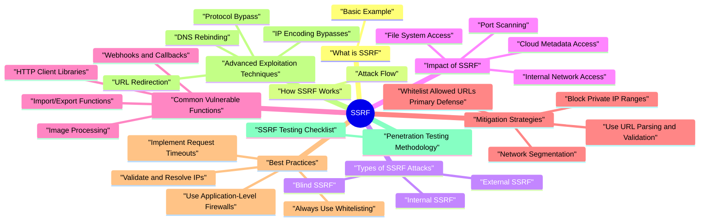

# SSRF revision map

This is the SSRF spine I actually use. Types, failures, fixes, traps. Sources: Critical Clarification SSRF Misconceptions.md, SSRF (Server-Side Request Forgery) - Comprehensive.md, SSRF - Interview Questions & Answers.md, SSRF - Quick Reference.md, SSRF - VAPT Methodology.md. I do not treat it as a second textbook.

### What SSRF is Used For
- Access internal services not exposed to the internet
- Read files from the server filesystem
- Access cloud metadata APIs
- Perform port scanning of internal networks
- Bypass network security controls (firewalls, WAFs)
- Exfiltrate data from internal systems

### Why SSRF is Dangerous
- Critical Impact: Can lead to internal network access
- Bypasses Security: Request originates from trusted server
- Hard to Detect: Appears as legitimate server request
- Widespread Impact: Can access entire internal network
- Complex Mitigation: Requires multiple layers of defense

## What is SSRF
- SSRF (Server-Side Request Forgery) occurs when an application makes network requests based on user-supplied input without proper validation, allowing attackers to make requests to arbitrary destinations from the server.

### Basic Example
- Result: Server makes HTTP request to cloud metadata API (AWS instance metadata)

## How SSRF Works

### Attack Flow
- Finds endpoint that makes network requests
- Identifies user input controlling request destination
- Application receives user input
- Makes HTTP request to provided URL
- Request originates from server IP (not attacker IP)
- Sees request from trusted server
- Grants access to internal resources
- Returns sensitive data

## Types of SSRF Attacks

### Internal SSRF
- Description: Attacker targets resources accessible only from internal network.
- Internal APIs (http://localhost:8080/admin)
- Internal services (http://192.168.1.1:3306)
- Cloud metadata APIs (http://169.254.169.254)
- Internal file system (file:///etc/passwd)

### External SSRF
- Description: Attacker targets external resources using server IP to bypass restrictions.
- Bypass IP-based whitelisting
- Access services restricted to specific IPs
- Perform attacks with trusted server IP

### Blind SSRF
- Description: Attacker cannot see response but can infer success from timing or behavior.
- Time delays
- DNS lookups
- Error messages
- Out-of-band channels

## Impact of SSRF

### Internal Network Access
- Access to internal services
- Bypass network segmentation
- Access services not exposed to internet
- Internal APIs
- Database servers
- Admin panels
- Internal file shares

### Cloud Metadata Access
- Access to cloud metadata APIs
- Extract credentials, tokens, keys
- Access instance metadata
- AWS: 169.254.169.254
- Azure: 169.254.169.254
- GCP: 169.254.169.254

### File System Access
- Read files from server filesystem
- Access configuration files
- Extract sensitive data
- file:///etc/passwd
- file:///var/www/config.php
- file:///proc/self/environ

### Port Scanning
- Scan internal network ports
- Identify internal services
- Map internal network topology

## Common Vulnerable Functions

### HTTP Client Libraries
- See the source section `HTTP Client Libraries` for the worked example.

### Image Processing
- See the source section `Image Processing` for the worked example.

### Webhooks and Callbacks
- See the source section `Webhooks and Callbacks` for the worked example.

### Import/Export Functions
- See the source section `Import/Export Functions` for the worked example.

## Mitigation Strategies

### Whitelist Allowed URLs (Primary Defense)
- See the source section `Whitelist Allowed URLs (Primary Defense)` for the worked example.

### Block Private IP Ranges
- See the source section `Block Private IP Ranges` for the worked example.

### Use URL Parsing and Validation
- See the source section `Use URL Parsing and Validation` for the worked example.

### Network Segmentation
- Isolate application servers from internal network
- Use separate network for application servers
- Restrict outbound connections
- Implement firewall rules

### Disable URL Schemes
- See the source section `Disable URL Schemes` for the worked example.

## Best Practices

### Always Use Whitelisting
- See the source section `Always Use Whitelisting` for the worked example.

### Validate and Resolve IPs
- See the source section `Validate and Resolve IPs` for the worked example.

### Use Application-Level Firewalls
- Network-level firewalls
- Application-level filtering
- Request validation middleware

### Implement Request Timeouts
- See the source section `Implement Request Timeouts` for the worked example.

## Advanced Exploitation Techniques

### IP Encoding Bypasses
- Decimal encoding: http://2130706433/ (127.0.0.1)
- Hex encoding: http://0x7f.0x00.0x00.0x01/
- Octal encoding: http://0177.0.0.1/
- IPv6: http://[::1]/ or http://[::ffff:127.0.0.1]/
- Always resolve hostnames and validate IPs
- Block all private IP ranges regardless of encoding

### DNS Rebinding
- Attacker controls DNS server
- First request resolves to allowed IP
- Subsequent requests resolve to private IP
- Bypasses validation
- Resolve hostname once and cache IP
- Validate resolved IP, not hostname

### URL Redirection
- Provide URL that redirects to internal resource
- First request validates external URL
- Redirect points to internal resource
- Follow redirects and validate each hop
- Block redirects to private IPs

### Protocol Bypass
- Use alternative protocols (gopher://, dict://, ldap://)
- Protocol-relative URLs
- URL encoding
- Whitelist allowed protocols (http, https only)
- Strict URL parsing

## Penetration Testing Methodology

### SSRF Testing Checklist
- Find endpoints making network requests
- Identify user input controlling destination
- Map all input points
- Control DNS server
- First resolves to allowed IP
- Subsequent resolves to private IP
- Monitor DNS lookups
- Use time delays

## Threat Modeling (STRIDE Framework)

### Spoofing
- Threat: Attacker spoofs internal network requests via SSRF.
- Whitelist allowed URLs
- Block private IP ranges
- Network segmentation

### Tampering
- Threat: Attacker modifies request destination via SSRF.
- Input validation
- Whitelisting
- URL parsing

### Repudiation
- Threat: SSRF requests cannot be attributed to attacker.
- Comprehensive logging
- Request correlation
- Audit trails

### Information Disclosure
- Threat: Attacker accesses internal resources via SSRF.
- Block private IPs
- Network segmentation
- Whitelisting

### Denial of Service
- Request timeouts
- Rate limiting
- Resource limits

### Elevation of Privilege
- Threat: Attacker gains access to internal resources via SSRF.
- Network segmentation
- Least privilege
- Access controls

## Real-World Case Studies

### Case Study 1: Cloud Metadata Access
- Background: Penetration test discovered SSRF in image processing endpoint.
- Confidentiality: Critical - Cloud credentials extracted
- Integrity: High - Could modify cloud resources
- Business Impact: Critical - Complete cloud account compromise

## Advanced Mitigations

### Defense in Depth Strategy
- Isolate application servers
- Restrict outbound connections
- Firewall rules
- Application-level firewalls
- Request validation middleware
- Timeout limits

## SAST/DAST Detection

### SAST (Static Application Security Testing)
- See the source section `SAST (Static Application Security Testing)` for the worked example.

### DAST (Dynamic Application Security Testing)
- Find endpoints making network requests
- Test all user input points
- Check for internal data in responses
- Monitor DNS lookups
- Check timing differences

## Risk Assessment

### Risk Matrix
- See the source section `Risk Matrix` for the worked example.

### Risk Calculation
- Requires network request functionality
- Common vulnerability pattern
- Internal network access
- Cloud metadata access
- Complete system compromise
- Financial: Data breach, cloud resource abuse
- Reputation: Loss of customer trust
- Legal: Regulatory violations, liability

## Cloud-Native SSRF Hardening

### Metadata service hardening by cloud
- Basic IP blocking is not enough for cloud workloads. Add platform controls:
- AWS: Require IMDSv2 tokens, disable IMDS where unnecessary, set restrictive hop limits.
- Azure: Enforce metadata request header validation and block metadata routes from application egress paths.
- GCP: Require metadata flavor headers and restrict service account scopes to least privilege.

### Egress segmentation and policy enforcement
- Use network controls so app servers cannot reach arbitrary destinations:
- Namespace/workload egress policies (Kubernetes NetworkPolicy / CNI policy).
- Service mesh egress gateways with explicit domain allowlists.
- Separate outbound proxies for high-risk fetch features (webhooks, URL preview, image fetchers).

### URL parser and DNS TOCTOU safety
- Validation must be done on canonicalized targets:
- Parse URL with a hardened library.
- Resolve hostname once via trusted resolver.
- Validate resolved IP against deny/allow policy.
- Connect only to the validated IP (not a re-resolved hostname).
- Re-validate every redirect hop.

## Blind SSRF Detection and Response
- Blind SSRF usually has weak direct response evidence, so telemetry matters:
- Correlate outbound DNS/HTTP from app workers with inbound user requests.
- Alert on requests to link-local, RFC1918, and cloud metadata address ranges.
- Track unusual protocols (gopher://, dict://, file://) at parser and proxy layers.
- Capture per-request egress decision logs (allowed domain, resolved IP, policy rule hit).
- Disable vulnerable fetch path or enforce emergency egress deny rules.
- Rotate potentially exposed credentials/tokens (especially cloud metadata-derived credentials).
- Review logs for lateral movement from compromised internal targets.

## The one-pager, exploded

## SSRF Attack Types

### Internal SSRF
- See the source section `Internal SSRF` for the worked example.

### External SSRF
- See the source section `External SSRF` for the worked example.

### Blind SSRF
- See the source section `Blind SSRF` for the worked example.

## Common Vulnerable Functions
- HTTP client libraries (requests, urllib, http)
- Image processing
- Webhooks and callbacks
- Import/export functions
- RSS/feed readers

## SSRF Protection Checklist
- Whitelist allowed URLs (primary defense)
- Block private IP ranges
- Validate and resolve IPs
- Disable dangerous URL schemes (file://, gopher://)
- Use network segmentation
- Implement request timeouts
- Follow redirects and validate each hop

## IP Encoding Bypasses
- Decimal: http://2130706433/ (127.0.0.1)
- Hex: http://0x7f.0x00.0x00.0x01/
- Octal: http://0177.0.0.1/
- IPv6: http://[::1]/

## Cloud Metadata Services
- AWS: 169.254.169.254
- Azure: 169.254.169.254
- GCP: 169.254.169.254

## Risk Levels

## Practice links
- Labs map: ../Practice & Exercises/Labs Mapping.md
- Payload references: ../Practice & Exercises/Payload References.md
- Code examples: ../examples/ssrf/

## What people get wrong

## ️ Common Misconceptions

### "SSRF only affects HTTP/HTTPS requests"
- Truth: SSRF can exploit multiple protocols and services, not just HTTP.
- HTTP/HTTPS
- file:// (file system access)
- gopher://
- Various cloud provider protocols

### "WAF or firewall prevents SSRF"
- Truth: WAFs and firewalls provide limited protection against SSRF. The attack originates from the server itself, which often has network access.
- Request originates from server (trusted source)
- Server has network access (bypasses firewall)
- WAF sees legitimate server request, not attack

### "SSRF only affects internal networks"
- Truth: SSRF can target both internal and external resources, depending on network configuration.
- Access internal services (databases, APIs)
- Access cloud metadata services
- Port scanning internal networks
- Access external resources with server IP
- Bypass IP-based restrictions
- Perform attacks from trusted server

### "URL validation prevents SSRF"
- Truth: URL validation is difficult and often insufficient. Many bypass techniques exist.
- IP encoding (decimal, hex, octal)
- Domain obfuscation (subdomains, redirects)
- URL encoding
- DNS rebinding
- IPv6 addresses
- Alternative protocols

### "SSRF only affects servers making HTTP requests"
- Truth: SSRF affects any functionality that makes network requests based on user input, not just HTTP clients.
- HTTP client libraries (requests, curl, wget)
- File operations (file_get_contents in PHP)
- Image processing (fetching remote images)
- Webhooks and callbacks
- Import/export functionality
- RSS/feed readers

### "Cloud metadata services are always accessible"
- Truth: Cloud metadata services have various access restrictions depending on provider and configuration.
- AWS: 169.254.169.254
- Azure: 169.254.169.254
- GCP: 169.254.169.254
- DigitalOcean: 169.254.169.254
- Some require specific headers
- May be restricted by instance configuration
- Network policies may block access

## Key Takeaways

### Understanding
- SSRF affects multiple protocols, not just HTTP
- WAFs/firewalls provide limited protection (request from server)
- SSRF can target internal and external resources
- URL validation is difficult and often insufficient
- SSRF affects any network request functionality
- Cloud metadata access varies by provider/configuration

### Common Mistakes
- Assuming only HTTP is vulnerable
- Relying on WAFs/firewalls
- Only checking for internal networks
- Using weak URL validation
- Missing non-HTTP request functions
- Assuming cloud metadata is always accessible

## Summary Table
- Remember: SSRF vulnerabilities occur when servers make network requests based on user input. Use whitelisting and network segmentation, not just URL validation!

## VAPT steps already in the folder

## Scope & Architecture Overview
- Understand how the application makes outbound requests:
- HTTP clients or SDKs used (e.g., fetch, axios, requests, cloud SDKs).
- Features that fetch remote resources (webhooks, URL previews, file imports, metadata fetches).
- Integrations with internal services (microservices, metadata endpoints, cloud metadata services).
- Identify trust zones:
- Public internet vs internal network segments.
- Metadata services, admin backends, management APIs.
- Storage services (S3‑like, blob storage) and their access paths.

## Mapping SSRF‑Relevant Functionality
- Look for features that allow users to influence:
- Target URL or host:
- URL preview (e.g., link unfurling).
- Webhooks or callback URLs.
- Remote file imports (from a URL).
- Health checks or "test connection" features.
- Request parameters:
- Host, port, path components.

## Assessment Strategy (High‑Level)
- When you find SSRF‑prone features, your objective is to determine whether the server can be coerced into making unintended requests, especially to:
- Internal services not meant to be user‑accessible.
- Cloud metadata endpoints or management APIs.
- Other sensitive applications behind firewalls.
- Connectivity exploration:
- Observe whether the server can reach:
- External URLs you control (for safety and visibility).
- Internal hostnames/IP ranges (only in dedicated test environments).

## Dynamic Testing - What to Look For
- Using only safe, non‑destructive targets:
- External server you control:
- Configure a simple endpoint that logs:
- All incoming requests (method, headers, body).
- Source IPs and user agents (within legal/ethical bounds).
- Use this as a target to:
- Confirm that the application server makes outbound requests.
- Understand how it constructs those requests.

## High‑Risk Targets (for Design Review & Lab Testing)
- Conceptually, SSRF is especially dangerous when it can reach:
- Internal application services:
- Admin backends, management endpoints, debug interfaces.
- Cloud provider metadata services:
- Instance metadata that can expose credentials or configuration.
- Network infrastructure:
- Services bound to localhost or private IPs.
- Focus on design review and configuration analysis to identify whether such services are reachable in principle.

## Tooling & Analysis Aids
- Proxy tooling:
- Record how requests to SSRF‑prone features are constructed.
- Replay with different URL patterns to see validation behavior.
- Controlled endpoints:
- A test HTTP server (in a lab) to log and observe:
- Request details.
- Network paths (as seen from server‑side).
- Configuration review:

## Verifying Exploitability Safely
- To establish SSRF risk without causing harm:
- Demonstrate that the server can:
- Reach an external endpoint you control and:
- Attach internal headers, tokens, or identifying information.
- Use unexpected source IPs (indicating traversal through private networks).
- Follow redirects you serve, within scope.
- Reason about internal reachability:
- Using architecture/network diagrams.

## Reporting & Risk Assessment
- Feature and endpoint involved.
- Degree of control over outbound requests (URL, method, headers, body).
- Observed behavior:
- Whether requests reach external or internal‑like destinations.
- How responses are handled (returned to user, stored, used internally).
- Potential impact, considering the production architecture:
- Access to internal APIs or management planes.
- Exposure of metadata or credentials.

## Remediation Guidance
- Strict outbound URL validation:
- Use allow‑lists of domains or networks where possible.
- Prevent access to:
- Private IP ranges (RFC1918, link‑local, loopback).
- Cloud metadata addresses.
- Validate both hostname and resolved IPs (to mitigate DNS tricks).
- Limit response exposure:
- Avoid returning full responses from internal services to untrusted users.

## Re‑Testing Checklist
- [ ] Confirm that SSRF‑prone features:
- [ ] Reject disallowed URLs and IP ranges.
- [ ] Do not follow redirects to blocked internal destinations.
- [ ] Log blocked attempts appropriately.
- [ ] Verify that:
- [ ] Outbound network controls enforce the intended allow‑lists.
- [ ] Metadata and management endpoints are unreachable where not explicitly required.
- [ ] Re‑exercise features against controlled external endpoints to:

## Questions that showed up in mocks

- What is SSRF, and why is the server's perspective dangerous
- What is blind SSRF, and how do you still prove impact
- Walk through the classic cloud metadata attack. What actually gets stolen
- What is the high-level difference between AWS, Azure, and GCP metadata exposure in SSRF discussions
- Why do blocklists of "private IPs" fail against serious SSRF bypasses
- Explain DNS rebinding in the SSRF context and how teams defeat it
- How do open redirects and SSRF protections interact
- What URL parser issues create "split validation" bugs
- Describe defense in depth for a feature that must fetch user-supplied URLs
- Your service must render thumbnails from arbitrary HTTPS image URLs. What is the safest pattern
- How does IMDSv2 change exploitation, and what mistakes remain
- How can IPv6 and "special" addresses sneak past naive filters
- What is the "@" hostname confusion attack, and how do you parse safely
- When would you use an egress proxy or "network broker" instead of in-app checks alone
- How do you detect SSRF in production logs and metrics
- Compare SSRF to XXE and request smuggling in how you explain "server as client."
- What is your closing advice when an exec asks, "Are we safe from SSRF?"
- Depth: Interview follow-ups - SSRF
- Flagship Mock Question Ladder - SSRF
- Junior (Fundamental clarity)
- Senior (Design and trade-offs)
- Staff (Strategy and scale)
- 10-minute mock drill format
- Answer quality rubric (quick score)

## Beginner

### What is SSRF, and why is the server's perspective dangerous
- See the source section `What is SSRF, and why is the server's perspective dangerous` for the worked example.

## Intermediate

### Why do blocklists of "private IPs" fail against serious SSRF bypasses
- See the source section `Why do blocklists of "private IPs" fail against serious SSRF bypasses` for the worked example.

### What URL parser issues create "split validation" bugs
- See the source section `What URL parser issues create "split validation" bugs` for the worked example.

## Advanced

### How can IPv6 and "special" addresses sneak past naive filters
- See the source section `How can IPv6 and "special" addresses sneak past naive filters` for the worked example.

### What is the "@" hostname confusion attack, and how do you parse safely
- See the source section `What is the "@" hostname confusion attack, and how do you parse safely` for the worked example.

### When would you use an egress proxy or "network broker" instead of in-app checks alone
- See the source section `When would you use an egress proxy or "network broker" instead of in-app checks alone` for the worked example.

### Compare SSRF to XXE and request smuggling in how you explain "server as client."
- See the source section `Compare SSRF to XXE and request smuggling in how you explain "server as client."` for the worked example.

### What is your closing advice when an exec asks, "Are we safe from SSRF?"
- See the source section `What is your closing advice when an exec asks, "Are we safe from SSRF?"` for the worked example.

## Depth: Interview follow-ups - SSRF
- Authoritative references: OWASP SSRF; CWE-918; SSRF Prevention Cheat Sheet.
- Blind SSRF: OOB channels, timing, second-order fetches, legal/safe proof in assessments.
- Cloud metadata: link-local addressing, provider headers, IMDSv2, container hop limits.
- Bypasses: redirects, DNS rebinding, numeric IP forms, IPv6, parser differentials, scheme abuse.
- Defense in depth: allowlists, redirect policy, IP pinning, egress controls, broker pattern, minimal IAM.
- URL parsers: one canonical parse path, reject userinfo, compare hosts as structured data-not regex alone.

## Flagship Mock Question Ladder - SSRF
- Primary competency axis: server-side outbound request abuse and trust boundary escape.

## If I only open two more topics

- Stay inside this folder for the long guide. Jump only when a section names a sibling topic.
- Cookie Security, CSRF, XSS, JWT, OAuth, and TLS show up as neighbors on a lot of these maps.
