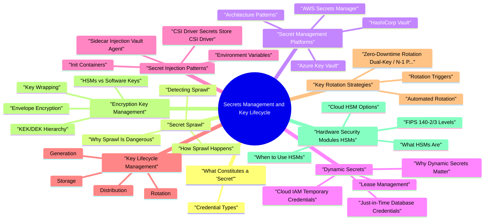

# Secrets Management and Key Lifecycle revision map

Secrets Management and Key Lifecycle in one sitting. That is the deal. I mined Critical Clarification Secrets Management and Key Lifecycle Misconceptions.md, Secrets Management and Key Lifecycle - Comprehensive Guide.md, Secrets Management and Key Lifecycle - Interview Questions & Answers.md, Secrets Management and Key Lifecycle - Quick Reference.md. The outline keeps every H2 I cared about from those files.

## What Constitutes a "Secret"
- Understanding the full taxonomy of secrets is essential because each type has different issuance mechanisms, rotation constraints, and blast radii when compromised.

### Credential Types
- The client_secret used in OAuth 2.0 confidential client flows. If compromised, an attacker can impersonate the application to the authorization server, potentially gaining access to user data across the entire user base.
- Environment variables containing secrets:

## Secret Sprawl

### How Sprawl Happens
- Credentials in ~/.aws/credentials, ~/.ssh/, browser password managers, notes apps, and local .env files. When a developer's laptop is lost, stolen, or compromised, every secret on it is exposed.
- Terraform stores resource attributes - including passwords, keys, and tokens - in plaintext in state files. If state files are stored in unencrypted S3 buckets or local disks, every secret Terraform manages is exposed.

### Why Sprawl Is Dangerous
- Unknown blast radius: When a breach occurs, you cannot determine what was exposed if you do not know where secrets live.
- Impossible rotation: You cannot rotate a secret if you do not know every system that uses it.
- Stale credentials: Sprawled secrets are never rotated because no one owns them.
- Audit failure: Compliance frameworks (PCI DSS, SOC 2, HIPAA) require demonstrable control over credential lifecycle - sprawl makes this impossible.
- Lateral movement: A single leaked secret provides an entry point; sprawled secrets provide a map for lateral movement.

### Detecting Sprawl
- Integrate secret detection into CI pipelines as a blocking check. Tools like GitGuardian, Semgrep, and GitHub Advanced Security's secret scanning analyze every commit and pull request for exposed credentials.

## Secret Management Platforms

### Architecture Patterns
- Pull vs push: Does the application pull secrets from the store, or does an agent push secrets to the application?
- Static vs dynamic: Are secrets pre-provisioned and stored, or generated on-demand with automatic expiration?
- Sidecar vs library: Is secret retrieval handled by a sidecar process or an application-embedded SDK?
- Single-tenant vs multi-tenant: Does each team/environment get its own namespace, or is there a shared flat store?

### HashiCorp Vault
- Vault is the most widely deployed open-source secrets management platform. It provides a unified interface to manage secrets, encryption, and identity across infrastructure.
- Vault supports numerous authentication backends that map external identities to Vault policies:
- Token: Direct token authentication (bootstrap method).
- AppRole: Role-based auth for machines and services. Provides a role ID (like a username) and a secret ID (like a password) that together yield a Vault token.
- Kubernetes: Validates Kubernetes service account JWTs, binding pod identity to Vault policies.
- AWS/GCP/Azure: Uses cloud provider instance identity to authenticate workloads running on those platforms without any pre-shared secret.
- OIDC/JWT: Integrates with any OIDC-compliant identity provider (Okta, Auth0, Azure AD).
- LDAP/GitHub/RADIUS: For human operator authentication.

### AWS Secrets Manager
- Strengths: deep AWS integration, managed rotation for AWS databases, no infrastructure to operate.
- Limitations: AWS-only (vendor lock-in), limited secret engine types compared to Vault, no dynamic credential generation beyond rotation.

### Azure Key Vault
- Strengths: native Azure integration, built-in HSM tier, certificate lifecycle management.
- Limitations: Azure-centric, less flexible policy language than Vault, no dynamic secret generation.

### GCP Secret Manager
- Strengths: simple API, IAM integration, regional replication.
- Limitations: GCP-only, fewer features than Vault, no built-in dynamic credentials.

### CyberArk
- Strengths: deep PAM capabilities, session management, compliance reporting, enterprise support.
- Limitations: complex deployment, significant licensing cost, less developer-friendly than Vault or cloud-native options.

### Platform Comparison
- See the source section `Platform Comparison` for the worked example.

## Dynamic Secrets

### Why Dynamic Secrets Matter
- Static secrets suffer from an inherent lifecycle problem: they exist indefinitely, are shared across consumers, and must be manually rotated. Dynamic secrets eliminate this by:
- No standing credentials: The credential does not exist until it is needed and ceases to exist after the TTL expires.
- Unique per consumer: Each workload or user gets its own credential, making audit trails specific to the consumer. If a credential is misused, you know exactly which consumer was compromised.
- Automatic expiration: Credentials have a built-in TTL (e.g., 1 hour). When the lease expires, Vault revokes the credential. No manual rotation needed.
- Blast radius containment: A leaked dynamic secret is useful only for its remaining TTL and only has the permissions granted to that specific credential.

### Just-in-Time Database Credentials
- Vault's database secret engine generates temporary database users on-demand:
- An administrator configures a database connection and a role template defining the SQL statements to create and revoke users.
- When a service requests credentials, Vault connects to the database, creates a user with the specified permissions, and returns the credentials with a lease.
- The service uses the credentials for the lease duration.
- When the lease expires (or is explicitly revoked), Vault connects to the database and drops the user.

### Cloud IAM Temporary Credentials
- Vault's AWS, GCP, and Azure secret engines generate temporary cloud credentials:
- GCP: Vault generates OAuth2 access tokens or service account keys for specific GCP service accounts.
- Azure: Vault creates Azure AD service principals with assigned roles and deletes them on lease expiration.

### Lease Management
- Every dynamic secret has a lease - a contract specifying the secret's lifetime:
- Lease ID: Unique identifier for tracking and managing the lease.
- Lease duration (TTL): How long the secret is valid.
- Renewable: Whether the lease can be extended without generating new credentials.
- Max TTL: The absolute maximum lifetime, regardless of renewals.

## Secret Injection Patterns
- How secrets reach the consuming application is as important as how they are stored. The injection pattern determines the security boundary, operational complexity, and developer experience.

### Sidecar Injection (Vault Agent)
- A sidecar process runs alongside the application container, authenticates to Vault, retrieves secrets, and renders them into files or environment variables accessible to the application.
- Advantages: No application code changes, automatic renewal, works with any language.

### Init Containers
- An init container runs before the application container, authenticates to the secret store, writes secrets to a shared volume, and exits. The application container reads secrets from the volume at startup.
- Advantages: Simpler than a sidecar (no ongoing process), lower resource consumption.

### CSI Driver (Secrets Store CSI Driver)
- Advantages: Kubernetes-native, supports multiple providers, optional sync to Kubernetes Secrets for env var consumption.
- Disadvantages: Requires CSI driver deployment, limited to Kubernetes, provider-specific configuration.

### Environment Variables
- Advantages: Simple, universally supported, no code changes.
- Disadvantages: Visible in process listings (/proc/*/environ), leaked in crash dumps and debug logs, accessible to any process in the container, no automatic rotation without restart, inherited by child processes.

### Mounted Volumes (tmpfs)
- Secrets written to an in-memory filesystem (tmpfs) mounted into the container. The secrets exist only in memory, not on disk.
- Advantages: Not persisted to disk, cleared on pod restart, compatible with sidecar renewal.

### API-Based Retrieval
- The application directly calls the secrets manager API to retrieve secrets at runtime. The application handles authentication, caching, renewal, and error handling.
- Advantages: Most flexible, enables fine-grained caching and error handling, supports dynamic secrets natively.

## Key Lifecycle Management
- Cryptographic key lifecycle management is the structured process of managing encryption keys from creation through destruction, ensuring keys are strong, properly protected, and retired when no longer needed.

### Generation
- Keys must be generated using cryptographically secure random number generators (CSPRNGs). Key generation should occur within a trust boundary - ideally inside an HSM or KMS that never exposes raw key material.
- Use the key size recommended for the algorithm and security level (AES-256, RSA-3072+, ECDSA P-256).
- Generate keys on the platform where they will be used (never on a developer workstation for production use).
- For HSM-backed keys, generation and all operations occur within the HSM boundary - the key never exists in extractable form.
- Document key purpose, owner, creation date, and intended lifetime at generation time.

### Distribution
- Key distribution - getting keys to the systems that need them - is one of the hardest problems in cryptography.
- KMS-based: Keys are generated and stored in a KMS (AWS KMS, Azure Key Vault, GCP KMS). Applications call the KMS API for encrypt/decrypt operations. The key never leaves the KMS.
- Key wrapping: Similar to envelope encryption, but can occur between any two systems with a shared wrapping key.
- Out-of-band delivery: For initial key provisioning, keys may be delivered through a separate channel (physical delivery, separate network) from the data they protect.

### Storage
- Keys at rest must be encrypted or stored within tamper-resistant hardware:
- HSM: Hardware that stores keys internally with physical tamper protection.
- KMS: Cloud-managed service that stores keys in HSMs operated by the cloud provider.
- Encrypted at rest: Keys stored in filesystems, databases, or secret managers must themselves be encrypted (by a KEK).
- Never: Keys should never be stored in plaintext in configuration files, environment variables, source code, or unencrypted databases.

### Rotation
- Key rotation replaces an active key with a new one. The old key may be retained (for decryption of existing data) but is no longer used for new operations.
- Scheduled: Regular rotation on a defined cadence (e.g., 90 days, annually) based on policy and compliance requirements.
- Incident-driven: Immediate rotation after suspected or confirmed compromise.
- Personnel change: Rotation when individuals with key access leave the organization.
- Crypto-period expiration: Keys have a defined cryptographic period based on algorithm strength and data sensitivity (NIST SP 800-57).

### Revocation
- Revocation immediately invalidates a key, preventing further use for any operation (encryption, decryption, signing, verification). Revocation is the emergency action when compromise is confirmed or strongly suspected.
- Revocation must propagate quickly across all systems - cached copies of the key must be invalidated.
- Data encrypted with a revoked key may become inaccessible. Plan for data re-encryption with a new key before revoking.
- Certificate revocation (CRL, OCSP) follows its own mechanisms with propagation delays.
- Certificate revocation remains one of the hardest problems in PKI:
- CRL (Certificate Revocation List): CA publishes a list of revoked serial numbers. Clients must download and check. CRLs grow large and are often not checked.
- OCSP (Online Certificate Status Protocol): Real-time per-certificate status queries to the CA. Adds latency and leaks browsing history.
- OCSP Stapling: The server fetches its own OCSP response and includes it in the TLS handshake. Eliminates the client-CA round-trip.

### Destruction
- Key destruction permanently removes all copies of a key so that data encrypted with it can never be decrypted.
- Cryptographic erasure: Destroying the key effectively destroys all data encrypted under it, even if the encrypted data persists. This is a common approach for decommissioning data stores.
- HSM key destruction: The HSM securely zeroes the key material from its tamper-resistant storage.
- Media destruction: For software-stored keys, all copies on all media (including backups) must be identified and securely erased.
- Compliance documentation: Record key destruction with timestamp, method, authorizer, and reason for audit purposes.

## Key Rotation Strategies

### Zero-Downtime Rotation (Dual-Key / N-1 Pattern)
- The most critical operational requirement for key rotation is avoiding service disruption. The dual-key pattern ensures continuity:
- Generate new key: Create a new key version (key N+1).
- Encrypt with new, decrypt with both: All new encryption operations use key N+1. Decryption attempts key N+1 first, then falls back to key N (and potentially older versions).
- Re-encrypt existing data: Gradually re-encrypt data stored under key N using key N+1 (can be done as a background migration or on-access).
- Decommission old key: Once all data is re-encrypted, mark key N as decrypt-only, then eventually destroy it.

### Automated Rotation
- Automated rotation eliminates the human error and delay inherent in manual rotation:
- AWS Secrets Manager: Supports automatic rotation via Lambda functions. AWS provides rotation templates for RDS, Redshift, and DocumentDB. Custom Lambda functions handle arbitrary secret types.
- Vault: Dynamic secrets are inherently auto-rotating (new credentials on every request). For static secrets, Vault supports rotation via API calls triggered by external schedulers or Vault's own rotation policies.
- Kubernetes: External secrets operators (External Secrets Operator, Vault Secrets Operator) sync secrets from external stores and can trigger pod restarts on rotation.

### Rotation Triggers
- See the source section `Rotation Triggers` for the worked example.

## Encryption Key Management

### KEK/DEK Hierarchy
- Enterprise encryption architectures use a hierarchy of keys to balance security with operational efficiency:
- The key that directly encrypts the data. Each data object (file, database column, S3 object) may have its own DEK. DEKs are generated per-object or per-partition and are typically symmetric (AES-256).

### Envelope Encryption
- Envelope encryption is the standard pattern for encrypting data at scale:
- Generate a random DEK locally.
- Encrypt the data with the DEK using a symmetric algorithm (AES-256-GCM).
- Send the DEK to the KMS for encryption (wrap) with the KEK.
- Store the encrypted data alongside the wrapped (encrypted) DEK.
- Discard the plaintext DEK from memory.
- Retrieve the wrapped DEK from storage.
- Send the wrapped DEK to the KMS for decryption (unwrap).

### Key Wrapping
- Key wrapping is the cryptographic operation of encrypting one key with another. Standards include:
- AES Key Wrap (RFC 3394): Purpose-built algorithm for wrapping keys. Provides integrity protection plus confidentiality.
- AES-GCM: Authenticated encryption that can wrap keys while providing integrity verification.
- RSA-OAEP: Asymmetric wrapping where a public key encrypts the DEK, and only the private key holder can unwrap it. Useful for key distribution between parties that do not share a symmetric key.

### HSMs vs Software Keys
- See the source section `HSMs vs Software Keys` for the worked example.

## Hardware Security Modules (HSMs)

### What HSMs Are
- See the source section `What HSMs Are` for the worked example.

### FIPS 140-2/3 Levels
- FIPS 140 is the US government standard for cryptographic module validation:
- FIPS 140-3 (effective 2019, mandatory for new validations since 2021) adds requirements for non-invasive attack resistance (side-channel attacks), enhanced self-testing, and lifecycle assurance.

### Cloud HSM Options
- AWS CloudHSM: Dedicated single-tenant HSMs in AWS (FIPS 140-2 Level 3). You manage the HSMs; AWS manages the hardware. Supports PKCS#11, JCE, and OpenSSL interfaces. Clusters of 2+ HSMs for HA.
- AWS KMS: Multi-tenant HSM-backed key management. Keys are stored in HSMs, but you do not manage the HSMs directly. More cost-effective for standard use cases. FIPS 140-2 Level 2 (Level 3 in some regions).
- Azure Dedicated HSM: Single-tenant Thales Luna HSMs (FIPS 140-2 Level 3). Full administrative control.
- Azure Key Vault Premium/Managed HSM: HSM-backed keys within Key Vault. Managed HSM provides single-tenant, FIPS 140-2 Level 3 validated HSMs fully managed by Azure.
- GCP Cloud HSM: HSM-backed keys within Cloud KMS (FIPS 140-2 Level 3). Managed by Google - you interact through the Cloud KMS API.

### When to Use HSMs
- Regulatory requirements mandate hardware-protected keys (PCI DSS for PIN encryption, eIDAS for qualified signatures, FedRAMP for government systems).
- You are protecting root CA private keys, master encryption keys, or signing keys where compromise would be catastrophic.
- You need non-repudiation guarantees - proving that a specific key could only have been used within the HSM.
- Compliance auditors require FIPS 140-2/3 Level 3 validation for key storage.
- Application-level DEKs (use KMS envelope encryption instead).
- Development and staging environments.
- Secrets that are not cryptographic keys (API tokens, database passwords - use a secrets manager).

## Certificate Lifecycle

### Issuance
- Certificate issuance follows one of several validation levels:
- Domain Validation (DV): CA verifies control over the domain (DNS record, HTTP challenge, email). Automated, fast, and sufficient for most web applications.
- Organization Validation (OV): CA verifies the organization's legal existence plus domain control.
- Extended Validation (EV): CA performs thorough vetting of the organization, including legal identity, physical address, and operational existence.

### Renewal
- Certificates expire. Failure to renew causes outages - often catastrophic ones, because expired certificate errors are rarely handled gracefully.
- Notable certificate expiration incidents:
- Microsoft Teams (2020): An expired authentication certificate caused a multi-hour outage for millions of users.
- Ericsson/O2 (2018): An expired certificate in Ericsson's SGSN-MME software caused a nationwide cellular outage in the UK affecting 32 million customers.
- Equifax (2017): An expired certificate on a network inspection device meant Equifax could not detect the exfiltration of 147 million records for 76 days.

### Automated Certificate Management (ACME / Let's Encrypt)
- The ACME (Automatic Certificate Management Environment) protocol automates certificate issuance and renewal:
- The ACME client generates a key pair and sends a CSR to the CA.
- The CA returns domain validation challenges (HTTP-01, DNS-01, TLS-ALPN-01).
- The client completes the challenge to prove domain control.
- The CA issues the certificate.
- The client installs the certificate and schedules renewal (typically at 60 days for 90-day certificates).

## Secret Scanning and Detection

### Pre-Commit Hooks
- Prevents committing AWS credentials and other configurable secret patterns. Installs as a git hook and scans staged changes before commit.

### CI Pipeline Scanning
- Integrate secret scanning as a blocking pipeline step:
- GitHub Advanced Security: secret scanning alerts and push protection for 200+ secret types.
- GitLab Secret Detection: built-in CI template that scans for secrets in commits.
- Semgrep: supports secret detection rules alongside SAST analysis.
- GitGuardian: real-time monitoring of commits across GitHub, GitLab, and Bitbucket with extensive secret pattern coverage.

### Runtime Detection
- Log monitoring: Scan application logs for patterns matching API keys, tokens, or passwords. Secrets in logs indicate a code-level issue (insufficient redaction).
- Memory scanning: Detect secrets persisted in memory beyond their expected lifetime.
- Cloud posture management: CSPM tools (Prisma Cloud, Wiz, Orca) detect secrets in cloud storage, container images, and infrastructure configurations.

### SAST Integration
- Static Application Security Testing tools can detect hardcoded secrets in source code during development:
- Semgrep rules for detecting hardcoded credentials, API keys, and private keys.
- SonarQube/SonarCloud secret detection rules.
- Checkmarx and Fortify include credential detection in their SAST scans.

## Incident Response for Secret Exposure
- When a secret is exposed, the response must be immediate, systematic, and thorough. The goal is to minimize the window of exploitation while understanding the full scope of potential compromise.

### Response Timeline
- Revoke or disable the exposed credential immediately. Do not wait for investigation.
- If the credential cannot be revoked instantly (e.g., a TLS private key), deploy compensating controls (network restrictions, WAF rules, service shutdown if necessary).
- Notify the incident response team.
- Determine what the compromised credential can access. Map the full scope of permissions, systems, and data reachable with this credential.
- Check audit logs for unauthorized use of the credential since the estimated exposure time.
- Identify all systems and consumers that use this credential.
- Determine how the credential was exposed (Git commit, log leak, insider, compromised system).
- Generate a new credential with equivalent (or narrower) permissions.

### Forensics
- Preserve audit logs before they are overwritten.
- Correlate the compromised credential's usage against known legitimate access patterns.
- Check for credential stuffing - if one credential was exposed, were others exposed through the same vector?
- Examine whether the attacker pivoted from the compromised credential to other systems.

## Compliance Requirements

### PCI DSS Key Management
- PCI DSS Requirements 3.5-3.7 mandate specific key management practices for cryptographic keys used to protect cardholder data:
- Keys must be generated using strong cryptographic methods (3.6.1).
- Secure key distribution - keys must never be transmitted in the clear (3.6.2).
- Secure key storage - keys must be encrypted with a KEK or stored within a secure cryptographic device (3.6.3).
- Key rotation at the end of the defined crypto-period or after suspected compromise (3.6.4, 3.6.5).
- Dual control and split knowledge for manual key management operations - no single person possesses the complete key (3.6.6).
- Prevention of unauthorized key substitution (3.6.7).
- Key custodians must formally acknowledge their responsibilities (3.6.8).

### SOC 2 Secret Handling
- SOC 2 Trust Services Criteria relevant to secrets management:
- CC6.1: Logical and physical access controls - secrets must be protected by access controls with audit logging.
- CC6.7: Restriction of data movement - secrets should not be transmitted via insecure channels.
- CC7.1: Detection of changes - unauthorized modifications to secret stores must trigger alerts.
- CC8.1: Change management - secret rotation and credential changes must follow change management procedures.

### HIPAA Encryption Requirements
- Access controls (§164.312(a)): Technical policies to allow access only to authorized persons - directly applicable to secret store access controls.
- Transmission security (§164.312(e)): Encryption of ePHI in transit - requires proper TLS certificate and key management.
- Encryption (§164.312(a)(2)(iv)): Encryption of ePHI at rest - requires proper encryption key lifecycle management.

### NIST SP 800-57
- The foundational key management standard that most other frameworks reference:
- Defines crypto-periods (the time span during which a specific key is authorized for use) based on algorithm, key type, and data sensitivity.
- Specifies key states: pre-activation, active, deactivated, compromised, destroyed.
- Recommends key transition plans when algorithms or key lengths become insufficient.

## Common Failures
- Understanding how secrets management fails is as important as understanding how it should work. These failures are consistently found in security assessments and are frequently discussed in interviews.

### Hardcoded Secrets in Git History
- See the source section `Hardcoded Secrets in Git History` for the worked example.

### Long-Lived API Keys
- See the source section `Long-Lived API Keys` for the worked example.

### Shared Credentials Across Environments
- See the source section `Shared Credentials Across Environments` for the worked example.

### No Rotation Policy
- See the source section `No Rotation Policy` for the worked example.

### Secrets in Logs
- See the source section `Secrets in Logs` for the worked example.

### Over-Privileged Service Accounts
- See the source section `Over-Privileged Service Accounts` for the worked example.

### Break-Glass Becoming Standard Operations
- See the source section `Break-Glass Becoming Standard Operations` for the worked example.

### Secrets Shared via Side Channels
- See the source section `Secrets Shared via Side Channels` for the worked example.

### No Centralized Secret Inventory
- See the source section `No Centralized Secret Inventory` for the worked example.

## Operational Reality

### Latency and Availability
- If every application request requires a KMS or HSM call, latency and availability become critical concerns:
- Caching: Cache decrypted DEKs in memory with a bounded TTL. This reduces KMS calls but means plaintext key material exists in application memory.
- Outage behavior: Design for secret store unavailability. Should the application fail closed (refuse to serve requests) or degrade (use cached secrets)? The answer depends on the data sensitivity and the secret's TTL.
- Regional deployment: Deploy secret store replicas close to consumers. Vault supports performance replication; cloud KMS services provide multi-region keys.

### Developer Experience
- If the secrets management system is painful to use, developers will bypass it. The security team must invest in developer experience:
- Local development: Provide a local Vault dev server, mock secrets for testing, or a development-specific secrets manager. Do not force developers to use production credentials locally.
- Self-service: Let teams manage their own namespaces and secrets without filing tickets.
- Templates and libraries: Provide standard SDKs, Helm chart snippets, and Terraform modules for common secret consumption patterns.
- Documentation: Maintain clear, up-to-date documentation for how to add, rotate, and consume secrets.

### Multi-Cloud and Mergers
- Organizations operating across multiple cloud providers or acquiring companies face secret management fragmentation:
- Multiple KMS vendors with different APIs, key types, and access control models.
- Vault provides a consistent abstraction across clouds, but adds operational complexity.
- Mergers require credential inventory, access reconciliation, and potential system integration - all while maintaining security during the transition.
- Federation between identity providers and secret stores must be established to avoid duplicating credentials across environments.

### Cost
- Secret management has real cost implications:
- Cloud KMS: $1-3/month per key + $0.03 per 10,000 API calls.
- AWS Secrets Manager: $0.40/secret/month + $0.05 per 10,000 API calls.
- Cloud HSM: $1,000-5,000/month per HSM instance.
- Vault Enterprise: per-node licensing.
- At scale (thousands of secrets, millions of API calls), costs are significant. Batch operations, caching, and right-sizing key hierarchies help control costs.

## Interview Clusters

### Junior/Mid
- "Why not put API keys in environment variables in Docker images?"
- Environment variables in images are baked into layers and accessible to anyone who pulls the image. They appear in process listings, crash dumps, and child processes. Use runtime secret injection instead.
- "What is key rotation and why does it matter?"
- "Name three types of secrets and where you would store them."

### Senior
- "How do CI pipelines authenticate to AWS without long-lived keys?"
- "How would you respond to a leaked JWT signing key?"
- "Compare dynamic secrets vs static secrets with rotation."

### Staff
- "Design secret management for 500 microservices and multi-region DR."
- "How do you govern break-glass access without creating permanent privilege?"

## Cross-links
- IAM and Least Privilege - Access controls for who can read, write, and administer secrets.
- Zero Trust Architecture - Workload identity and short-lived credentials are foundational to zero trust.
- Secure CI/CD - Pipeline secret handling, OIDC federation, and build-time secret injection.
- Software Supply Chain Security - Signing key management, Sigstore, and artifact integrity.
- Encryption vs Hashing - Understanding the cryptographic primitives that secrets protect.
- TLS - Certificate and private key lifecycle management.
- Container Security - Kubernetes secrets, sidecar injection, and pod-level secret isolation.
- Digital Signatures - Signing key lifecycle, HSMs, and key compromise response.

## Pocket list

## One-line definition
- Central store, short-lived credentials, audited access, rotation and revocation-no secrets in repos, images, or tickets.

## Lifecycle
- create -> distribute -> use -> rotate -> revoke -> delete

## Do / Don't

## Hot interview phrases
- "Short-lived by default" - federation beats static keys.
- "Blast radius" - one leaked signing key vs one read-only DB user.
- "Emergency rotation" - dual-signing window, customer comms if needed.

## Checklist (ship / incident)
- [ ] No high-entropy strings committed; pre-commit + scanner.
- [ ] CI uses OIDC (or scoped tokens), not decade-old access keys.
- [ ] Break-glass is time-bound, audited, alerted.
- [ ] Tabletop: "signing key leaked"-owners, order of rotation, verification.

## Cross-links
- IAM and Least Privilege, Secure CI/CD, Encryption vs Hashing, Zero Trust.

## The clarification file, compressed

## "Deploying Vault/AWS Secrets Manager solves secrets."
- Reality: Rotation, IAM to the vault, break-glass, audit review, and client library discipline still fail without process.

## "Long-lived API keys are fine for internal services."
- Reality: Insider threats, repo leaks, and lateral movement love static keys-prefer OIDC workload identity and short-lived tokens.

## "Annual rotation is enough."
- Reality: Rotation cadence should match blast radius and exposure (public edge, admin scopes -> weeks or event-driven).

## "Encryption at rest in KMS means secrets are safe in logs."
- Reality: Logs often capture plaintext by mistake; KMS protects storage, not developer errors.

## "Developers can keep .env files locally-prod is locked down."
- Reality: Laptops are targets; prod parity secrets on disk enable supply chain and theft-use ephemeral dev credentials.

## "One HSM/KMS key for everything simplifies security."
- Reality: Blast radius balloons; separate keys by tenant, environment, or data class with clear rotation plans.

## "Git secret scanning replaces vault discipline."
- Reality: Scanners miss encoded secrets and non-Git paths; prevent commit hooks + vault patterns together.

## "Third-party SaaS API keys aren't crown jewels."
- Reality: Keys often equal full tenant admin-tier them like production database creds.

## "Key rotation without app support is security's job alone."
- Reality: Dual-sign keys, blue/green consumers, and coordination windows need engineering ownership-ops runbooks required.

## "BYOK absolves the cloud provider of liability."
- Reality: Compliance posture may improve, but your key usage policy and access logging remain your problem.

## Oral prompts worth repeating

- What qualifies as a "secret" and why does the definition matter?
- What is secret sprawl and how do you detect and prevent it?
- Compare HashiCorp Vault, AWS Secrets Manager, and Azure Key Vault. When would you choose each?
- Explain Vault's seal/unseal mechanism and why it exists.
- What are dynamic secrets and why are they superior to static credentials with rotation?
- Describe the secret injection patterns for Kubernetes workloads and their trade-offs.
- Walk through the complete lifecycle of a cryptographic key from generation to destruction.
- Explain the KEK/DEK hierarchy and envelope encryption. Why not encrypt everything with a single key?
- What is zero-downtime key rotation and how does the N-1 pattern work?
- What are Hardware Security Modules (HSMs), and when are they necessary?
- How do you handle automated certificate lifecycle management in a microservices environment?
- What tools and strategies do you use for secret scanning, and where in the pipeline do you place them?
- A developer accidentally commits an AWS access key to a public GitHub repository. Walk through your incident response.
- How do CI/CD pipelines authenticate to cloud providers without long-lived static keys?
- Explain the difference between key rotation and key revocation. When do you use each?
- What compliance requirements apply to secret and key management, and how do you demonstrate compliance?
- How do you design secrets management for a multi-cloud, multi-region environment?
- What are the risks of storing secrets in environment variables, and what alternatives exist?
- How do you prevent secrets from appearing in application logs?
- Describe the Vault Transit engine and when you would use encryption-as-a-service instead of application-level encryption.
- Depth: Interview Follow-ups - Secrets & Key Lifecycle

## Depth: Interview Follow-ups - Secrets & Key Lifecycle
- Authoritative references: NIST SP 800-57 Part 1 (key management); NIST SP 800-130 (key management framework); cloud KMS docs (AWS KMS / Azure Key Vault / GCP KMS); HashiCorp Vault documentation.
- Dynamic vs static secrets: Be prepared to explain the operational and security differences, and when each is appropriate. Know that dynamic secrets eliminate standing credentials but add availability dependency.
- OIDC federation for CI/CD: Understand the JWT exchange flow and how claim mapping controls which pipelines can assume which roles.
- Envelope encryption internals: Be able to diagram the KEK/DEK hierarchy and explain why re-wrapping DEKs is cheaper than re-encrypting data.
- HSM vs KMS decision tree: Know the FIPS 140-2/3 levels, when hardware protection is mandatory (PCI PIN, qualified signatures), and when KMS is sufficient.
- Vault architecture: Seal/unseal, auth methods, secret engines, policy language. Be prepared to draw the request flow from application to secret retrieval.
- Incident response timing: Have a concrete timeline for secret exposure response - revoke, assess, rotate, remediate, prevent.

## What sits next to this topic

- Stay inside this folder for the long guide. Jump only when a section names a sibling topic.
- Cookie Security, CSRF, XSS, JWT, OAuth, and TLS show up as neighbors on a lot of these maps.
