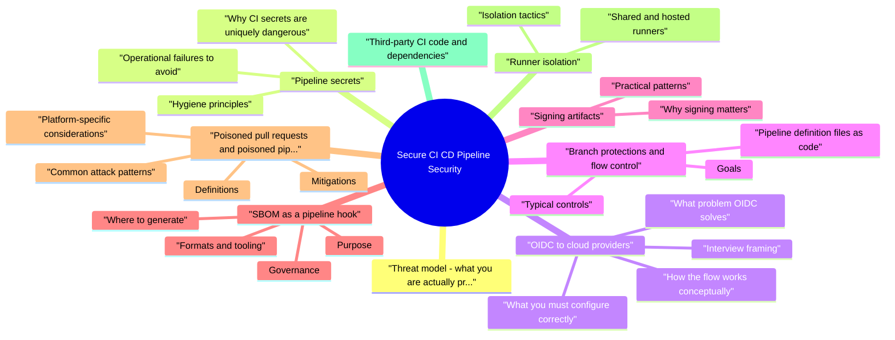

# Secure CI CD Pipeline Security revision map

Secure CI CD Pipeline Security in one sitting. That is the deal. I mined Critical Clarification Secure CI CD Pipeline Security Misconceptions.md, Secure CI CD Pipeline Security - Comprehensive Guide.md, Secure CI CD Pipeline Security - Interview Questions & Answers.md, Secure CI CD Pipeline Security - Quick Reference.md. The outline keeps every H2 I cared about from those files.

## Threat model: what you are actually protecting
- Assets: source repositories, pipeline definitions, build caches, artifact registries, deployment targets, cloud roles, signing keys, and observability data about builds.

## Pipeline secrets

### Why CI secrets are uniquely dangerous
- See the source section `Why CI secrets are uniquely dangerous` for the worked example.

### Hygiene principles
- Minimize inventory. Every secret in CI should have a named owner, rotation procedure, and documented scope. Remove unused credentials quarterly.
- Prefer federation over static keys. Where the cloud supports OIDC, eliminate repository-stored cloud access keys for standard flows. Reserve static keys for break-glass automation with heavy monitoring.

### Operational failures to avoid
- See the source section `Operational failures to avoid` for the worked example.

## OIDC to cloud providers

### What problem OIDC solves
- See the source section `What problem OIDC solves` for the worked example.

### How the flow works (conceptually)
- A job requests an OIDC token from the CI identity provider (for example GitHub's OIDC issuer for Actions).
- The job presents that token to the cloud STS-style endpoint.
- The cloud validates issuer, audience, and subject claims, then issues temporary cloud credentials bound to an IAM role (AWS), workload identity (GCP), or federated credential (Azure).

### What you must configure correctly
- Audience (aud) must match what the cloud expects; mismatches are a common integration failure and sometimes a confused-deputy class mistake if multiple audiences are accepted without care.
- Least privilege on the role. The federated role should only allow ECR push for one registry, S3 put to one artifact bucket, or deploy to one workload account-not AdministratorAccess.

### Interview framing
- See the source section `Interview framing` for the worked example.

## Branch protections and flow control

### Goals
- Ensure no single actor can land arbitrary code on a release or default branch without review, and that sensitive paths-including pipeline definitions-require explicit approval from owners who understand the blast radius.

### Typical controls
- Signed commits or signed merges where policy demands non-repudiation; pair with branch rules that verify signatures if your toolchain supports it.
- Merge queues (or equivalent) so rapid merges cannot bypass checks through race conditions.

### Pipeline definition files as code
- See the source section `Pipeline definition files as code` for the worked example.

## Signing artifacts

### Why signing matters
- See the source section `Why signing matters` for the worked example.

### Practical patterns
- Binaries and packages: Sign release artifacts; publish checksums alongside signatures; verify in downstream pipelines or package managers that support it.
- Key management: Prefer OIDC-bound signing (keyless) for open pipelines where policy allows; use KMS-backed keys when regulations require custodial control and clear key ceremony.

## SBOM as a pipeline hook

### Purpose
- See the source section `Purpose` for the worked example.

### Where to generate
- See the source section `Where to generate` for the worked example.

### Formats and tooling
- See the source section `Formats and tooling` for the worked example.

### Governance
- See the source section `Governance` for the worked example.

### Pitfalls
- See the source section `Pitfalls` for the worked example.

## Poisoned pull requests and poisoned pipeline execution (PPE)

### Definitions
- Poisoned pipeline execution means an attacker manipulates CI configuration or build scripts so that trusted automation runs attacker-controlled steps-often to steal secrets, pivot to production, or modify artifacts.
- Poisoned PR often refers to untrusted code from forks or new contributors running in CI. The danger is combined with secrets and write tokens available to workflows triggered by pull_request events.

### Common attack patterns
- See the source section `Common attack patterns` for the worked example.

### Platform-specific considerations
- GitLab: Merge request pipelines and fork behavior depend on project settings; protected branches and protected variables limit what untrusted pipelines see.
- General: Any trigger that runs privileged jobs on untrusted ref content must be treated as remote code execution with whatever identity the job holds.

### Mitigations
- Default-deny: no secrets on fork-driven pipelines; use label-gated or manual approval to run full integration for external contributors when needed.
- Require CODEOWNERS review for workflow and CI script directories.
- Use separate low-privilege workflows for fork PRs and promote only after maintainer merge to a trusted branch.
- Pin third-party actions to full commit SHAs; review updates like application dependencies.
- Monitor for new workflow files, sudden curl | bash steps, and unexpected outbound destinations from runners.

## Runner isolation

### Shared and hosted runners
- See the source section `Shared and hosted runners` for the worked example.

### Isolation tactics
- Ephemeral runners: provision a fresh VM or container per job where feasible; destroy after completion. Auto-scaling groups that recycle instances reduce persistence.
- Separate runner pools for untrusted versus trusted workloads; never run fork PR jobs on runners that mount production kubeconfigs or cloud metadata roles intended for release.

## Third-party CI code and dependencies

## Logging, detection, and metrics

## Balancing velocity and control

## Interview positioning (senior / staff)

## Cross-links
- Pair this module with Secrets Management, IAM and Least Privilege, Software Supply Chain / SLSA, Security Observability, and Vulnerability Management in this repository.

## Primary references
- OWASP Top 10 CI/CD Security Risks (v1.0)
- SLSA - supply-chain integrity levels and provenance
- Cloud OIDC integration guides from AWS, Google Cloud, and Microsoft Azure for your chosen CI platform

## Pocket list

## Canonical list
- OWASP Top 10 CI/CD Security Risks - v1.0 stable October 2022; cites SolarWinds, Codecov, dependency confusion, and compromised packages in intro.

## CICD-SEC-1 ... 10 (short labels)
- Flow control - 2. IAM - 3. Dependency chain - 4. Poisoned pipeline execution - 5. PBAC - 6. Credential hygiene - 7. Misconfiguration - 8. Third-party services - 9. Artifact integrity - 10. Logging/visibility

## High-signal controls

## Related standards
- SLSA - artifact/source integrity
- Sigstore - signing for containers/attestations

## One-liner
- Treat CI as production IAM that can ship code-protect flow control, credentials, and artifact integrity.

## The clarification file, compressed

## "SAST/DAST green means the pipeline is secure."
- Reality: Pipeline identity, runner trust, secret handling, artifact signing, and deployment gates are orthogonal to app scanning.

## "Self-hosted runners are always safer than cloud runners."
- Reality: Poorly patched pets with broad network egress and shared workspaces increase blast radius vs ephemeral cloud builders.

## "One broken gate means we should bypass forever."
- Reality: Bypass needs time-bound approval, ticket, and remediation SLA-permanent exceptions become norm.

## "Fork PRs can't steal secrets."
- Reality: Misconfigured workflow triggers and cache poisoning patterns have leaked credentials-restrict GHA permissions and use OIDC.

## "Immutable artifacts remove supply chain risk."
- Reality: Immutability helps integrity; you still must verify provenance and scan before promotion.

## "Admin access to CI is low risk-it's internal."
- Reality: CI is production for software; compromise equals code signing and deploy keys-PAM and MFA required.

## "We don't need network segmentation for build agents."
- Reality: Lateral movement from compromised dev workstations targets builders-isolate build VLANs/peering.

## "Third-party GitHub Actions at @main is fine."
- Reality: Tag pinning and hash pinning reduce supply chain surprises from moving action repos.

## "Secrets in CI variables are encrypted, so we're done."
- Reality: Logs, debug artifacts, and dump env steps expose them-minimal scope and runtime secret injection patterns help.

## "Dev and prod pipelines can share the same service accounts."
- Reality: Cross-environment identity ties test code paths to prod deploy authority-split identities and trust policies.

## Oral prompts worth repeating

- Fundamentals and threat model
- Why is CI/CD described as a "control plane," and what fails if you only run SAST in the pipeline?
- How does OWASP CI/CD Top 10 help in an interview answer without sounding like a checklist?
- What are the main ways secrets leak from CI besides committing them to Git?
- How should production deploy credentials differ from credentials used on feature branches?
- Explain OIDC from CI to AWS (or another cloud) at a level you could whiteboard.
- What goes wrong if the OIDC trust policy is too broad?
- Branch protections and governance
- Which files should be treated as security-sensitive alongside application auth code?
- What is the difference between "required status checks" and a merge queue for security?
- Signing artifacts and integrity
- Why pin container deployments by digest and still sign the image?
- Where should signature verification happen-CI, CD, or runtime?
- Where in the pipeline should you generate an SBOM, and what do you do with it?
- What mistake makes SBOMs misleading for container images?
- Poisoned PRs and PPE
- What is poisoned pipeline execution (PPE), and give one example?
- On GitHub Actions, why is pull_request_target discussed as high risk?
- How do you safely run integration tests for external contributors' forks?
- What is the main security downside of self-hosted runners compared to hosted ephemeral runners?
- Why does mounting the Docker socket into a CI job matter for security?
- Operations and depth
- What metrics show CI/CD security is improving, not just "more tools"?
- How does SLSA relate to your CI/CD story in one minute?

### Why is CI/CD described as a "control plane," and what fails if you only run SAST in the pipeline?
- See the source section `Why is CI/CD described as a "control plane," and what fails if you only run SAST in the pipeline?` for the worked example.

## Pipeline secrets

## OIDC to cloud

### What is the difference between "required status checks" and a merge queue for security?
- See the source section `What is the difference between "required status checks" and a merge queue for security?` for the worked example.

### Where should signature verification happen-CI, CD, or runtime?
- See the source section `Where should signature verification happen-CI, CD, or runtime?` for the worked example.

## SBOM

### How do you safely run integration tests for external contributors' forks?
- See the source section `How do you safely run integration tests for external contributors' forks?` for the worked example.

## Runner isolation

### What metrics show CI/CD security is improving, not just "more tools"?
- See the source section `What metrics show CI/CD security is improving, not just "more tools"?` for the worked example.

### You discover a leaked repository secret that had broad cloud access. What do you do first in the pipeline context?
- See the source section `You discover a leaked repository secret that had broad cloud access. What do you do first in the pipeline context?` for the worked example.

## Cross-read
- Comprehensive Guide (this topic), Secrets Management, IAM and Least Privilege, Software Supply Chain / SLSA, Security Observability.

## What sits next to this topic

- Stay inside this folder for the long guide. Jump only when a section names a sibling topic.
- Cookie Security, CSRF, XSS, JWT, OAuth, and TLS show up as neighbors on a lot of these maps.
