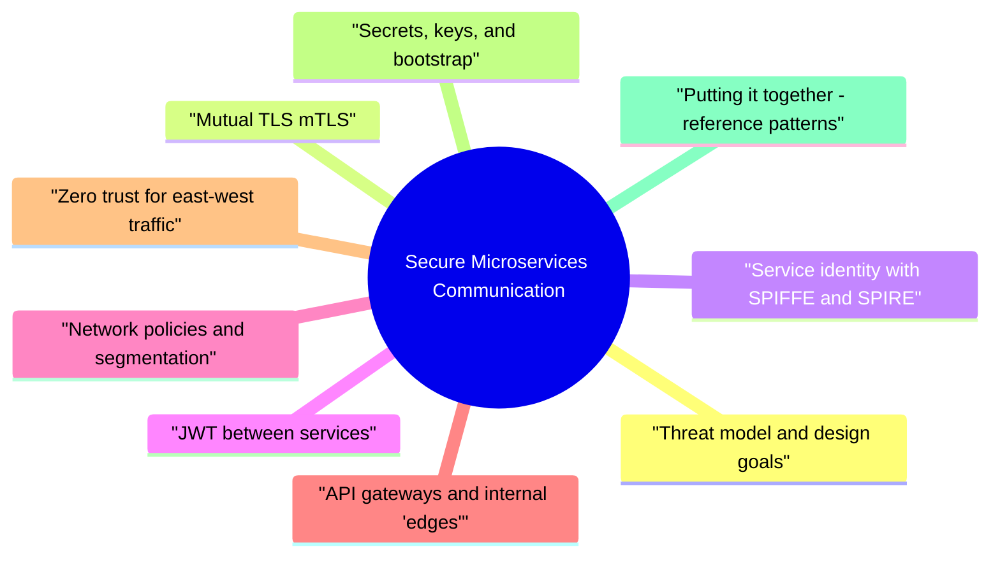

# Secure Microservices Communication revision map

Last mock I bounced around the Secure Microservices Communication folder. This file is the stop that. Drawn from Critical Clarification Secure Microservices Commun.md, Secure Microservices Communication - Comprehensive.md, Secure Microservices Communication - Interview Que.md, Secure Microservices Communication - Quick Referen.md. Skim the mermaid, then the outline.

## Threat model and design goals
- A compromised workload reading or calling other services from "inside" the network.
- Stolen long-lived secrets replayed across environments.
- Lateral movement after a container escape or stolen kubeconfig.
- Operator mistakes: wide security groups, allow all namespaces, debug endpoints exposed cluster-wide.
- Supply-chain and runtime drift: a malicious or vulnerable dependency that starts probing internal DNS names and open ports.
- Authenticate the caller (service identity), not only the human user.
- Encrypt in transit end-to-end for sensitive paths; at minimum, TLS everywhere on service ports.
- Authorize every call with explicit policy (which service may call which API, which methods).

## Mutual TLS (mTLS)
- What it is. Normal TLS proves the server to the client. Mutual TLS also proves the client to the server using an X.509 client certificate. Both peers negotiate cipher suites and verify chains against trusted CAs.
- TCP connect, ClientHello with supported versions and cipher suites.
- ServerHello, server certificate chain, CertificateRequest (for mTLS).
- Client sends its certificate chain; both sides prove possession of private keys (CertificateVerify).
- Derived session keys; application data flows with AEAD ciphers (TLS 1.3) or negotiated legacy ciphers (TLS 1.2).
- Cryptographic identity bound to a key pair, not just an IP or pod name.
- Channel integrity and confidentiality for TCP-based protocols (HTTP/gRPC, many queues' TLS modes).
- Fits service mesh data planes (Envoy, etc.) that terminate TLS and forward identity to apps via headers or metadata when configured.

## Service identity with SPIFFE and SPIRE
- Problem. IPs and pod names are ephemeral. API keys in config maps are secrets, not identities. You want a stable, attestable identity per workload that security policy can reference.
- SPIFFE (Secure Production Identity Framework for Everyone) defines:
- A SPIFFE ID (URI like spiffe://trust.domain/ns/production/sa/payments-api).
- SVIDs (SPIFFE Verifiable Identity Documents), typically X.509 certificates or JWT-SVIDs, issued to workloads.
- Operators define registration entries: which attestation attributes map to which SPIFFE IDs.
- Attestation examples
- Kubernetes: service account token + node attestation.
- Cloud: instance identity documents matched to node metadata.

## JWT between services
- Cross-cluster or cross-trust-domain calls where a single mesh CA is not shared.
- Application-layer propagation of caller context to downstream services (subject, tenant, scopes).
- Bridging to OAuth2/OIDC-style patterns for APIs that already speak bearer tokens.
- iss / sub: who issued the token and the subject; pin expected issuers in verifiers.
- aud: intended recipient; every service should reject tokens not aimed at itself (or its logical API audience).
- exp / iat / nbf: clock skew windows should be explicit (e.g., ±60s) and monitored.
- jti: helps replay detection for very short-lived tokens when you keep a replay cache-usually only at high-risk endpoints due to state cost.
- Token exchange (RFC 8693 pattern): trade an incoming token for a downstream token with tighter aud and scopes-reduces confused deputy risk compared to blind forwarding.

## Network policies and segmentation
- Network controls complement identity; they do not replace it.
- Default allow-all east-west is common; explicit deny-by-default requires a CNI that enforces policies.
- Express who may talk to whom using pod selectors, namespaces, ports, and IP blocks (for legacy dependencies).
- Default deny ingress to sensitive namespaces, then allow only from known caller labels (for example app=checkout -> app=orders on tcp/8080).
- Combine with namespace per team/env, dedicated nodes for sensitive tiers, and egress restrictions to limit exfiltration and surprise dependencies (block raw Internet except via egress proxy if policy requires).
- Tighten ingress to load balancers and admin planes only.
- For service-to-service on VPC networks, use security groups referencing security groups instead of /0 ranges.
- Separate data-plane subnets from management subnets; avoid sharing broad "internal" SGs across every tier.

## API gateways and internal "edges"
- North-south gateway: users and partners hit TLS here; WAF, bot defense, OAuth/OIDC, rate limits, routing.
- Backend-for-frontend (BFF): shapes aggregates for a specific client; still should not become a god service with excess privilege-scope tokens and service accounts tightly.
- East-west gateway (less common as a single choke point): can centralize mTLS, JWT validation, and quota for legacy services that cannot be meshed quickly-watch for latency and SPoF.
- Do not turn the gateway into a universal trust broker that strips security context-preserve or re-issue identity for downstream hops.
- Authenticate early, authorize close to data: gateways enforce coarse policy; services enforce fine-grained rules.
- Idempotency keys, request size limits, and timeouts belong at the edge to protect backends during abuse or retries storms.
- mTLS between gateway and mesh ingress is a common pattern: the gateway presents a client cert trusted by the cluster ingress; user OAuth remains at the edge.
- Ensure gateways support needed features (trailers, streaming, graceful GOAWAY) or terminate at mesh sidecars instead.

## Zero trust for east-west traffic
- Identity: SPIRE-issued SVIDs; mesh maps certs to source.principal.
- Transport: STRICT mTLS in the mesh data plane.
- Policy: L4/L7 authorization (who can call checkout from cart only on POST /orders).
- Secrets: Vault or cloud secret stores for bootstrap tokens and signing keys-not for every inter-service hop if SVIDs cover identity.
- Observability: access logs with principal, trace_id, decision, and rule ID.
- Strong identity: SPIFFE ID / mesh principal on every request path you care about.
- Least privilege: allowlists, not "same VPC."
- Assume breach: segmentation plus detect unusual lateral movement.

## Secrets, keys, and bootstrap
- Workload identity secrets: SVID private keys, kube service account tokens (prefer short-lived, projected volumes where available).
- Signing keys for service-issued JWTs: asymmetric keys in KMS/HSM, published via JWKS.
- Symmetric keys for HMAC (avoid wide distribution; prefer asymmetric for multi-service verification).
- Data-layer credentials: DB passwords, API keys for SaaS-scoped, rotated, never checked into Git.
- Secret manager (Vault, AWS Secrets Manager, GCP Secret Manager, Azure Key Vault) with IAM scoped to the workload identity.
- Kubernetes: encrypt etcd at rest; restrict RBAC on Secret objects; prefer CSI secret drivers over env vars for files when possible.
- Envelope encryption: data encryption keys wrapped by KMS; limits blast radius if a pod secret leaks.
- Databases: prefer short-lived users or IAM database auth patterns over one static DB_PASSWORD per environment.

## Putting it together - reference patterns
- SPIRE or mesh CA issues certs; STRICT mTLS; L7 authz in mesh; apps trust localhost sidecar.
- Best when most services are on Kubernetes and speak HTTP/gRPC.
- TLS to service; validate OAuth2 service tokens or internally signed JWTs; optional mTLS for highest assurance.
- Common when integrating SaaS, multi-cloud, or brownfield services.
- Edge gateway for external auth; internal mesh for east-west mTLS and policy; gateway forwards minimal, signed context.

## Operational metrics, testing, and incidents
- Certificate expiry dashboards per trust domain; SLOs on renewal success rate.
- Authz deny rate anomalies (sudden spikes may indicate attack or mis-deploy).
- TLS handshake error rate by workload version.
- JWKS fetch failures and signature verification errors.
- Chaos tests: revoke a trust bundle, drain nodes, verify backoff and failover without global outage.
- Policy regression tests: CI applies NetworkPolicy and mesh manifests to a kind/cluster and asserts expected connectivity matrix.
- Tabletop exercises for stolen SVID or leaked signing key: disable issuance, rotate roots, invalidate sessions.
- If a workload identity is compromised, treat all tokens and certs issued under that registration entry as suspect; narrow blast radius with immediate authz denies for that principal while you rotate.

## Extra local write-ups

## Fundamentals

### How do you secure communication between microservices end to end?
- See the source section `How do you secure communication between microservices end to end?` for the worked example.

### What is mTLS and why use it between services?
- See the source section `What is mTLS and why use it between services?` for the worked example.

### How does SPIFFE/SPIRE help compared to "each service gets an API key"?
- See the source section `How does SPIFFE/SPIRE help compared to "each service gets an API key"?` for the worked example.

### When would you use JWTs between services instead of-or plus-mTLS?
- See the source section `When would you use JWTs between services instead of-or plus-mTLS?` for the worked example.

### What is zero trust in the context of internal (east-west) microservice calls?
- See the source section `What is zero trust in the context of internal (east-west) microservice calls?` for the worked example.

## Design and architecture

### How do Kubernetes NetworkPolicies fit with mTLS and service mesh?
- See the source section `How do Kubernetes NetworkPolicies fit with mTLS and service mesh?` for the worked example.

### What responsibilities belong at an API gateway versus inside each service?
- See the source section `What responsibilities belong at an API gateway versus inside each service?` for the worked example.

### What is the difference between mesh mTLS and application mTLS?
- See the source section `What is the difference between mesh mTLS and application mTLS?` for the worked example.

### How do you prevent a compromised service from calling every other service?
- See the source section `How do you prevent a compromised service from calling every other service?` for the worked example.

## Implementation and operations

### Walk through how you would roll out STRICT mTLS without taking down production.
- See the source section `Walk through how you would roll out STRICT mTLS without taking down production.` for the worked example.

### What do you store in a secret manager for microservices, and what should not live there as a primary pattern?
- See the source section `What do you store in a secret manager for microservices, and what should not live there as a primary pattern?` for the worked example.

### How do you rotate JWT signing keys without breaking all services?
- See the source section `How do you rotate JWT signing keys without breaking all services?` for the worked example.

### What certificate fields matter when using client certs for service identity?
- See the source section `What certificate fields matter when using client certs for service identity?` for the worked example.

## Threats and edge cases

### What is a "confused deputy" risk with JWTs in microservice chains?
- See the source section `What is a "confused deputy" risk with JWTs in microservice chains?` for the worked example.

### How do you handle multi-cluster or multi-cloud service calls securely?
- See the source section `How do you handle multi-cluster or multi-cloud service calls securely?` for the worked example.

### What observability signals prove that security controls are actually enforced?
- See the source section `What observability signals prove that security controls are actually enforced?` for the worked example.

## Trade-offs and judgment

### mTLS everywhere vs selective mTLS-how do you decide?
- See the source section `mTLS everywhere vs selective mTLS-how do you decide?` for the worked example.

### Can network segmentation replace strong service identity?
- See the source section `Can network segmentation replace strong service identity?` for the worked example.

### How do gRPC and HTTP/2 change your gateway and security posture?
- See the source section `How do gRPC and HTTP/2 change your gateway and security posture?` for the worked example.

### How do you secure asynchronous messaging (queues, event buses) between services?
- See the source section `How do you secure asynchronous messaging (queues, event buses) between services?` for the worked example.

## Depth: Interview follow-ups - Secure Microservices Communication
- Authoritative references: NIST SP 800-204 series for microservices security themes; SPIFFE specifications; mesh documentation (Istio, Linkerd) for mTLS and authorization resources.
- STRICT mTLS migration - canary strategy, rollback ethics, and measuring handshake failure rates.
- SPIFFE trust bundle federation - roots of trust across clusters and organizational boundaries.
- JWT aud design - per-service audiences vs shared API audience; trade-offs for fan-out calls.
- Policy-as-code - testing NetworkPolicy and mesh rules in CI before deploy.

## Zero-Trust Principles
- Never trust network location
- Authenticate all communication
- Authorize every request
- Encrypt all traffic
- Monitor and audit

## Authentication Methods

## Service-to-Service Security Checklist
- Authenticate all service-to-service communication
- Encrypt all traffic (TLS/mTLS)
- Service identity verification
- Least privilege authorization
- Secret management for credentials
- Service mesh for policy enforcement (optional)
- Monitoring and audit logging

## Service Mesh Benefits
- Automatic mTLS encryption
- Service-to-service authentication
- Traffic policy enforcement
- Observability
- Load balancing

## Common Service Mesh Solutions

## Secret Management

## Key Principles
- Zero-trust architecture
- Encrypt everything (including internal traffic)
- Authenticate every request
- Service identity for all services
- Defense in depth

## Misreads that still sneak in

## ️ Common Misconceptions

### "Network isolation is sufficient for microservices security"
- Truth: Network isolation is one layer - zero-trust principles require authentication and authorization for all communication.
- Never trust network location
- Authenticate all service-to-service communication
- Authorize every request
- Encrypt all traffic
- Monitor and audit all communication

### "API keys are sufficient for service-to-service authentication"
- Truth: API keys are weak authentication - mutual TLS (mTLS) or JWT tokens are preferred for microservices.
- Static and long-lived (higher risk if compromised)
- No encryption (unless combined with TLS)
- Limited revocation capabilities
- No fine-grained permissions
- mTLS: Strong authentication, built-in encryption
- JWT tokens: Short-lived, scoped permissions, easier rotation

### "All microservices should trust each other by default"
- Truth: Microservices should follow zero-trust model - authenticate and authorize every request.
- Verify explicitly (authenticate all requests)
- Use least privilege access
- Assume breach (monitor and audit)

### "Service mesh handles all security automatically"
- Truth: Service mesh provides security infrastructure but requires proper configuration and doesn't handle application-level security.
- mTLS encryption
- Service-to-service authentication
- Traffic policy enforcement
- Observability
- Application-level authentication/authorization
- Input validation
- Business logic security

### "Internal microservices don't need encryption"
- Truth: All traffic should be encrypted, including internal service-to-service communication.
- Defense in depth
- Protection against insider threats
- Compliance requirements
- Protection against network attacks
- Future-proofing (if network is compromised)

## Key Takeaways
- Zero-Trust: Never trust network location, authenticate and authorize all communication
- Strong Authentication: Use mTLS or JWT, not just API keys
- Verify Everything: Don't assume trust between services
- Service Mesh is Infrastructure: Requires proper configuration, doesn't handle app-level security
- Encrypt Everything: All traffic, including internal, should be encrypted

## Cross-links I actually follow

- Stay inside this folder for the long guide. Jump only when a section names a sibling topic.
- Cookie Security, CSRF, XSS, JWT, OAuth, and TLS show up as neighbors on a lot of these maps.
