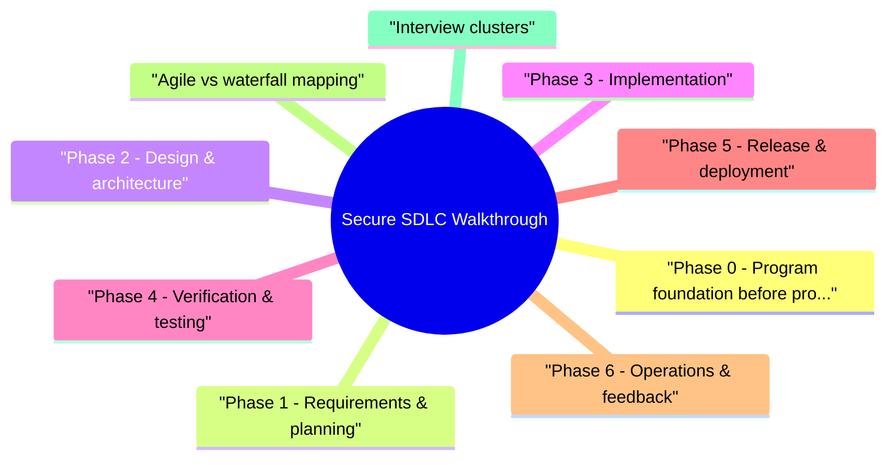

# Secure SDLC Walkthrough revision map

When a Secure SDLC Walkthrough follow-up lands, I want one page that still has the misconception and the VAPT step. I pulled headings from Critical Clarification Secure SDLC Walkthrough Misconceptions.md, Secure SDLC Walkthrough - Comprehensive Guide.md, Secure SDLC Walkthrough - Interview Questions & Answers.md, Secure SDLC Walkthrough - Quick Reference.md. If a heading is here, the guide still owns the detail.

## Phase 0 - Program foundation (before projects)

## Phase 1 - Requirements & planning
- Security user stories / acceptance criteria:
- Data classification (PII, PCI, PHI) documented.
- Compliance drivers (SOC 2, HIPAA) -> non-functional requirements.
- Abuse cases for fraud, admin misuse, tenant isolation.

## Phase 2 - Design & architecture
- Outputs: threat model doc, mitigation backlog linked to Jira, security sign-off for Tier 1 changes.
- Cross-read Threat Modeling, System-design-for-security.

## Phase 3 - Implementation
- Agile adaptation: security tasks in same sprint as feature; no "security sprint" that never happens.

## Phase 4 - Verification & testing
- Release gate example (Tier 1): no Critical/High open findings without exception; 100% authZ test pass; threat model mitigations closed.

## Phase 5 - Release & deployment
- Change management with security reviewer for Tier 1.
- Immutable artifacts + SBOM + provenance (SLSA-oriented).
- Config review: IAM, TLS, security groups, feature flags for risky features default off.
- Canary with security metrics (auth errors, 403 spikes).

## Phase 6 - Operations & feedback
- Vulnerability management SLAs on production findings.
- Incident response runbooks; postmortems feed back to threat models.
- Metrics: MTTR, defect density, repeat findings, scanner noise ratio.
- Retire/decommission assets-shadow IT creates vulns.

## Agile vs waterfall mapping

## Interview clusters

## Cross-links
- Threat Modeling · Secure CI CD Pipeline Security · Building an AppSec Program · False Positive Management and Tool Rationalization

## Recall list from Quick Reference

## Phase map

## Agile equivalents
- DoD security items · Sprint-0 arch review · CI gates · Exception workflow

## Frameworks

## Interview one-liner

## Corrections I keep repeating

## "Security is a phase before release."
- Wrong. Shift-left means continuous activities; a single pre-release scan is too late for design flaws.

## "More scanners = more secure."
- Wrong. Overlapping tools without dedupe and tuning creates noise, not safety.

## "Threat modeling is only for big projects."
- Wrong. Small features can introduce critical authZ bugs-scope modeling by risk, not headcount.

## "Developers don't do security."
- Wrong. AppSec enables developers with standards, tools, and champions-they write the code.

## "Compliance equals secure SDLC."
- Wrong. SOC 2 checkboxes without effective gates still produce vulns.

## "Pen test replaces SAST/DAST."
- Wrong. They are complementary-automation catches regressions; pen test finds logic chains.

## What I answer in 90 seconds

- When do you threat model?
- What belongs in CI vs annual pen test?
- How do you gate releases without blocking all teams?
- Authoritative references

## 60-second answer

## Nearby reading in this repo

- Stay inside this folder for the long guide. Jump only when a section names a sibling topic.
- Cookie Security, CSRF, XSS, JWT, OAuth, and TLS show up as neighbors on a lot of these maps.
