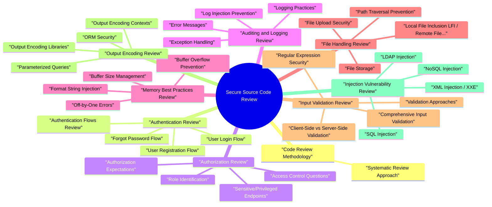

# Secure Source Code Review revision map

When a Secure Source Code Review follow-up lands, I want one page that still has the misconception and the VAPT step. I pulled headings from Critical Clarification Secure Source Code Review.md, Secure Source Code Review - Comprehensive Guide.md, Secure Source Code Review - Interview Questions &.md, Secure Source Code Review - Quick Reference.md, Online References for Secure Source Code Review To.md. If a heading is here, the guide still owns the detail.

### Objectives of Security Code Review
- Identify security vulnerabilities before deployment
- Understand application security posture
- Verify security controls are properly implemented
- Identify design and architecture flaws
- Ensure compliance with security standards

### Core Software Security Best Practices
- When reviewing code, focus on these fundamental security best practices:
- Input Validation
- Verify values match expected type or format
- Use allow list (whitelist) approach instead of deny list (blacklist)
- Reduce attack surface through comprehensive validation
- Parameterized Statements
- Pass input as arguments to command processors (not string concatenation)
- Prevent SQL Injection and Command Injection

## Code Review Methodology

### Systematic Review Approach
- Preparation Phase
- Understand application architecture and technology stack
- Review documentation and security requirements
- Identify critical data flows and components
- Set up review environment and tools
- Discovery Phase
- Map authentication and authorization flows
- Identify all input entry points

## Authentication Review

### Authentication Flows Review
- See the source section `Authentication Flows Review` for the worked example.

### User Login Flow
- [ ] Authentication endpoint properly validates credentials
- [ ] Failed login attempts are logged
- [ ] Account lockout after failed attempts (brute force protection)
- [ ] Rate limiting on login endpoint
- [ ] No user enumeration through error messages
- [ ] Credentials transmitted over HTTPS/TLS only
- [ ] Session created only after successful authentication
- [ ] Session identifier is cryptographically random

### User Registration Flow
- [ ] Email/username uniqueness validation
- [ ] Strong password policy enforcement
- [ ] Password confirmation matching
- [ ] Email verification required
- [ ] Registration rate limiting
- [ ] CAPTCHA or bot protection
- [ ] No sensitive information in registration confirmation

### Forgot Password Flow
- [ ] Token generation is cryptographically random
- [ ] Token has reasonable expiration (e.g., 1 hour)
- [ ] Token is single-use
- [ ] No user enumeration (same message for valid/invalid users)
- [ ] Password reset requires current password or 2FA for high-security accounts
- [ ] New password meets strength requirements
- [ ] Password reset link sent via secure channel (HTTPS email)

### User Identification
- [ ] What information identifies users? (username, email, ID)
- [ ] User identifiers are not predictable or sequential
- [ ] User enumeration prevention
- [ ] User identifiers don't leak in URLs or error messages

### Password Policies
- [ ] Minimum password length enforced (12+ characters recommended)
- [ ] Password complexity requirements (mixed case, numbers, symbols)
- [ ] Password history (prevent reuse of recent passwords)
- [ ] Password expiration policies (if applicable)
- [ ] Password strength meter guidance (not enforcement)
- [ ] No password requirements that reduce entropy (e.g., "must contain word from dictionary")

### Password Hashing
- [ ] Uses strong hashing algorithm (bcrypt, Argon2, PBKDF2, scrypt)
- [ ] Salt is unique per password
- [ ] Sufficient iterations/rounds (bcrypt: 10+ rounds, PBKDF2: 100,000+ iterations)
- [ ] Not using MD5, SHA1, or SHA256 alone (without key derivation)
- [ ] Password hash stored securely in database

### Timing Attacks
- [ ] Username/password comparison uses constant-time functions
- [ ] HMAC verification uses constant-time comparison
- [ ] Token comparison uses constant-time functions
- [ ] No early returns in comparison loops

### Two-Factor Authentication (2FA)
- [ ] TOTP (Time-based One-Time Password) implementation is correct
- [ ] Backup codes generated securely
- [ ] 2FA required for sensitive operations
- [ ] 2FA bypass requires additional verification
- [ ] Rate limiting on 2FA verification
- [ ] 2FA device management (add/remove)

### User Enumeration
- [ ] Login error messages don't reveal if username exists
- [ ] Registration error messages don't reveal existing users
- [ ] Password reset doesn't reveal if email exists
- [ ] Timing differences don't reveal user existence
- [ ] API responses don't leak user existence

### Brute Force Protection
- [ ] Rate limiting on authentication endpoints
- [ ] Account lockout after N failed attempts
- [ ] Lockout duration is reasonable (not permanent)
- [ ] CAPTCHA after failed attempts
- [ ] Progressive delays between attempts
- [ ] IP-based rate limiting

### Session Management
- See the source section `Session Management` for the worked example.

### Session Fixation
- [ ] New session ID generated after login
- [ ] Old session invalidated after login
- [ ] Session ID not accepted from URL parameters
- [ ] Session ID regenerated after privilege change

### Session Destruction
- [ ] Session properly destroyed on logout
- [ ] All session data cleared on logout
- [ ] Session cookie deleted on logout
- [ ] Server-side session data removed

### Session Length
- [ ] Absolute session timeout (max session duration)
- [ ] Idle timeout (session expires after inactivity)
- [ ] Reasonable timeout values (e.g., 1-8 hours absolute, 30 min idle)
- [ ] Session timeout warnings for users
- [ ] Option to extend session with re-authentication

### Session Security
- [ ] Session ID is cryptographically random
- [ ] Session ID has sufficient entropy (128+ bits)
- [ ] Session stored server-side (preferred) or secure client-side token (JWT)
- [ ] Session cookie has Secure flag (HTTPS only)
- [ ] Session cookie has HttpOnly flag (not accessible via JavaScript)
- [ ] Session cookie has SameSite attribute (CSRF protection)
- [ ] Session data doesn't contain sensitive information

### Service-to-Service Authentication
- [ ] Uses strong authentication (mTLS, JWT, API keys)
- [ ] Constant-time comparison for HMAC/token verification
- [ ] HMAC uses secure algorithm (SHA256+, not SHA1/MD5)
- [ ] Requests occur over SSL/TLS
- [ ] SSL/TLS verification not disabled (verify certificates)
- [ ] Reasonable TTL (Time To Live) for tokens (1 hour or less)
- [ ] Accounts for time skew in token validation
- [ ] Shared secrets stored in vault (not hardcoded)

## Authorization Review

### Role Identification
- [ ] All user roles are identified and documented
- [ ] Role hierarchy is defined (if applicable)
- [ ] Roles have clear permission boundaries
- [ ] Role assignments are auditable

### Sensitive/Privileged Endpoints
- [ ] All administrative endpoints identified
- [ ] Financial transaction endpoints identified
- [ ] Data modification endpoints identified
- [ ] Sensitive data access endpoints identified
- [ ] All privileged endpoints require appropriate authorization

### Authorization Expectations
- [ ] Business-specific authorization requirements understood
- [ ] Authorization checks align with business rules
- [ ] Separation of duties enforced
- [ ] Least privilege principle applied

### Access Control Questions
- [ ] Can non-privileged users view other accounts? (Should be: No, or only public data)
- [ ] Can non-privileged users add accounts? (Should be: Only with appropriate permissions)
- [ ] Can non-privileged users alter accounts? (Should be: Only their own or with permissions)
- [ ] Can users add accounts with higher access than their own? (Should be: No)
- [ ] How is separation of duties handled?

### Authorization Functions/Filters
- [ ] Authorization functions are identified
- [ ] Authorization checks use tokens, cookies, or framework mechanisms correctly
- [ ] Authorization is enforced on every request
- [ ] Authorization logic is centralized (not scattered throughout code)
- [ ] Authorization filters are applied correctly

### Broken Access Control
- [ ] Horizontal privilege escalation (user A accessing user B's data)
- [ ] Vertical privilege escalation (regular user accessing admin functions)
- [ ] Missing authorization checks
- [ ] Authorization bypass vulnerabilities

### Insecure Direct Object Reference (IDOR)
- [ ] Direct object references (IDs in URLs, parameters)
- [ ] Authorization checks verify object ownership
- [ ] No reliance on "hidden" parameters for security
- [ ] Indirect object references where appropriate
- find_by(id), find(id), findOne(id), findAll() - Check for authorization
- Direct ID in URL parameters
- Object retrieval without ownership verification

### Missing Function Level Access Control
- [ ] All functions/endpoints have authorization checks
- [ ] Administrative functions require admin role
- [ ] Sensitive operations require appropriate permissions
- [ ] API endpoints enforce authorization
- [ ] No reliance on client-side authorization only

### Authorization Filter Verification
- [ ] Authorization filters are applied consistently
- [ ] Filters cannot be bypassed
- [ ] Filter ordering is correct
- [ ] Default deny (require explicit authorization)

### Generic Authorization Flaws
- [ ] Race conditions in authorization
- [ ] Cached authorization decisions invalidated properly
- [ ] Authorization checks happen before business logic
- [ ] No authorization bypass through parameter manipulation

### CSRF Protection
- [ ] CSRF tokens on all state-changing operations
- [ ] CSRF tokens validated server-side
- [ ] CSRF tokens are unique per session
- [ ] SameSite cookie attribute used
- [ ] Origin/Referer header validation (if used)

### Critical Operations Re-Authentication
- [ ] Password changes require current password
- [ ] Email changes require verification
- [ ] Account deletion requires confirmation + password
- [ ] Financial transactions require 2FA or re-authentication
- [ ] High-privilege actions require re-authentication

## Auditing and Logging Review

### Exception Handling
- [ ] Application fails securely on exceptions
- [ ] Sensitive resources released on exception
- [ ] Transactions rolled back on exception
- [ ] Error handling doesn't expose sensitive information
- [ ] Error messages are generic for users
- [ ] Detailed errors logged but not displayed

### Error Messages
- [ ] Error messages don't reveal sensitive application details
- [ ] Stack traces not displayed to end users
- [ ] Framework and system errors not displayed
- [ ] Component errors logged but not exposed
- [ ] Generic error messages for users
- [ ] Detailed errors logged server-side

### Logging Practices
- [ ] Relevant user details logged (user ID, timestamp, action)
- [ ] System actions logged (authentication, authorization, data access)
- [ ] Sensitive input is not written to logs
- Credit card numbers
- Social Security Numbers
- Passwords
- API keys and secrets
- PII (Personally Identifiable Information)

### Log Injection Prevention
- [ ] User-controlled data validated/sanitized before logging
- [ ] Newline characters prevented in log entries
- [ ] Log injection attacks prevented

### Logging Configuration
- [ ] Logging configuration in config files (not hardcoded)
- [ ] Log levels configurable via environment variables
- [ ] Log destinations configurable
- [ ] Log rotation configured
- [ ] Log retention policies defined

## Memory Best Practices Review
- Memory-related vulnerabilities are very dangerous and can lead to buffer overflows, code execution, and system compromise. Review code for safe memory management practices.

### Buffer Overflow Prevention
- [ ] Safe functions used that control data read into memory
- [ ] Unsafe functions avoided (gets, strcpy, sprintf, etc.)
- [ ] Buffer size validation before reading
- [ ] Input size validation
- [ ] Constants used for buffer sizes (not magic numbers)
- [ ] Buffer size consistency (declaration matches read size)
- gets() - No buffer size limit
- strcpy() - No buffer size check

### Buffer Size Management
- [ ] Buffer size declared matches read size
- [ ] No buffer size mismatches
- [ ] Constants used for buffer sizes
- [ ] Null terminator space accounted for
- [ ] Buffer size calculations are correct

### Off-by-One Errors
- [ ] Comparison operators checked carefully
- [ ] [ ] < vs <= used correctly
- [ ] Null terminator space accounted for
- [ ] Array bounds checking correct
- [ ] Loop termination conditions correct
- Use < instead of <= when accounting for null terminators
- Verify loop conditions don't cause off-by-one overflows

### Format String Injection
- [ ] User input not used directly in format strings
- [ ] Format specifiers used correctly
- [ ] No user-controlled format strings
- [ ] Generic error messages (no user input in format)

### Memory Management Best Practices
- [ ] Memory allocated properly
- [ ] Memory freed after use (no memory leaks)
- [ ] No use-after-free vulnerabilities
- [ ] Double-free prevented
- [ ] Null pointer checks before dereferencing
- [ ] Bounds checking on array access

## File Handling Review

### File Upload Security
- [ ] File type validation (whitelist approach preferred)
- [ ] File size restrictions
- [ ] File name sanitization
- [ ] Malicious file detection
- [ ] Virus/malware scanning
- [ ] Files stored outside web root
- [ ] Direct access prevented
- [ ] Access control on file retrieval

### File Storage
- [ ] Files stored outside web-accessible directory
- [ ] Files served through application (not direct URL access)
- [ ] File access requires authentication
- [ ] File access requires authorization (user owns file or has permission)
- [ ] File paths don't contain user input without validation

### Path Traversal Prevention
- [ ] User input not used directly in file paths
- [ ] Path traversal prevented (../, ..\\, etc.)
- [ ] Absolute paths prevented
- [ ] Path normalization and validation

### Local File Inclusion (LFI) / Remote File Inclusion (RFI)
- [ ] No file inclusion using user input
- [ ] If file inclusion necessary, use whitelist
- [ ] Remote file inclusion disabled
- [ ] File inclusion uses absolute paths from configuration

## Input Validation Review

### Comprehensive Input Validation
- [ ] All user input is validated
- [ ] No input sources are missed:
- Form fields
- URL parameters
- HTTP headers (User-Agent, Referer, etc.)
- File uploads
- API request bodies
- WebSocket messages

### Validation Approaches
- [ ] Whitelist validation (preferred) - allow known good values
- [ ] Blacklist validation (avoid) - block known bad values
- [ ] Type validation (integer, date, email, etc.)
- [ ] Format validation (regex, pattern matching)
- [ ] Length validation (min/max length)
- [ ] Range validation (for numeric input)

### Client-Side vs Server-Side Validation
- [ ] Server-side validation is always present (security)
- [ ] Client-side validation improves UX but isn't security
- [ ] Client and server validations are consistent
- [ ] Server validation doesn't rely on client validation

### Regular Expression Security
- [ ] Regular expressions use whitelist approach (when possible)
- [ ] Regex patterns don't have bypasses
- [ ] ReDoS (Regular Expression Denial of Service) vulnerabilities considered
- [ ] Complex regex patterns tested for performance
- [ ] Input sanitization before regex matching (if needed)

### Numeric Input Validation
- [ ] Numeric input validated by type (integer, float)
- [ ] Range validation (min/max values)
- [ ] Unexpected input rejected (non-numeric strings, negative where not allowed)
- [ ] Integer overflow considered (if applicable to language)

### Input Length Validation
- [ ] Maximum length enforced
- [ ] Minimum length enforced (where applicable)
- [ ] Database column size considered
- [ ] Buffer overflow prevention (if applicable to language)
- [ ] Truncation vs rejection decision (prefer rejection)

### Data/Command Separation
- [ ] Strong separation between data and commands
- [ ] Injection attack prevention:
- SQL injection (parameterized queries)
- Command injection (no shell commands with user input)
- LDAP injection (parameterized queries)
- XML injection (parameterized/sanitized)
- Template injection (context escaping)

### Data/Client-Side Script Separation
- [ ] User input not directly inserted into JavaScript
- [ ] Output encoding for JavaScript context
- [ ] JSON encoding used for data in scripts
- [ ] CSP (Content Security Policy) headers used

### HTTP Header Validation
- [ ] User-Agent header validated (if used for logic)
- [ ] Referer header validated (if used for security)
- [ ] Origin header validated (for CORS)
- [ ] Custom headers validated
- [ ] Header values not trusted blindly

## Output Encoding Review

### Parameterized Queries
- [ ] All database queries use parameterized queries/prepared statements
- [ ] No string concatenation in SQL queries
- [ ] ORM (Object-Relational Mapping) used correctly
- [ ] Raw SQL queries use parameter binding

### ORM Security
- [ ] ORM functions used safely
- [ ] [ ] .raw() or equivalent functions avoided (or properly sanitized)
- [ ] Query builders used correctly
- [ ] Mass assignment vulnerabilities prevented

### Output Encoding Contexts
- [ ] HTML context: HTML entity encoding
- [ ] JavaScript context: JavaScript encoding
- [ ] URL context: URL encoding
- [ ] CSS context: CSS encoding
- [ ] XML context: XML encoding

### Output Encoding Libraries
- [ ] Output encoding libraries are up-to-date
- [ ] Libraries are patched for known vulnerabilities
- [ ] Proper encoding functions used for each context
- [ ] Framework-provided encoding used when available

### Encoding Routine Weaknesses
- [ ] Regular expressions in encoding are secure
- [ ] No blind spots in encoding routines
- [ ] Encoding covers all dangerous characters
- [ ] Double encoding issues considered

## Injection Vulnerability Review

### SQL Injection
- [ ] All SQL queries use parameterized queries
- [ ] No string concatenation in SQL
- [ ] Dynamic SQL construction avoided (or sanitized)
- [ ] Stored procedures use parameters
- [ ] ORM used correctly (no raw SQL)
- String concatenation with SQL: +, &, .format(), %, f-strings
- execute() with string formatting
- query() with string concatenation

### NoSQL Injection
- [ ] NoSQL queries use parameter binding
- [ ] Operator injection prevented ($ne, $gt, $regex, etc.)
- [ ] JavaScript injection in MongoDB prevented
- [ ] Key-value store manipulation prevented (memcached, Redis)

### LDAP Injection
- [ ] LDAP queries use parameter binding
- [ ] LDAP special characters escaped
- [ ] Input validated before LDAP queries

### XML Injection / XXE
- [ ] XML parsers configured securely
- [ ] External entity processing disabled
- [ ] DTD processing disabled (if possible)
- [ ] XXE (XML External Entity) attacks prevented

### Command Injection
- [ ] No shell command execution with user input
- [ ] If shell commands necessary, input validated/sanitized
- [ ] Command arguments passed as array (not string)
- [ ] Least privilege for command execution

### Template Injection
- [ ] Template engines configured securely
- [ ] User input escaped in templates
- [ ] Code execution in templates disabled
- [ ] Template sandboxing enabled (if available)

## Configuration Review

### Configuration Files
- [ ] Identify all configuration files
- [ ] Configuration files don't contain secrets
- [ ] Secrets in environment variables or vault
- [ ] Configuration files not committed to version control
- [ ] Different configurations for dev/staging/prod

### Endpoint Protection
- [ ] All endpoints have authentication
- [ ] All endpoints have authorization
- [ ] Admin/debug endpoints disabled in production
- [ ] Health check endpoints don't leak sensitive info

### Framework Security Configuration
- [ ] Framework security features enabled
- [ ] CSRF protection enabled
- [ ] XSS protection enabled
- [ ] Security headers configured
- [ ] Session security configured

### Language and Framework Versions
- [ ] Language version up-to-date (no known CVEs)
- [ ] Framework version up-to-date (no known CVEs)
- [ ] Dependencies up-to-date (no known CVEs)
- [ ] Security patches applied

### Security Headers
- [ ] Content-Security-Policy (CSP) configured
- [ ] X-Frame-Options set
- [ ] X-Content-Type-Options: nosniff
- [ ] Strict-Transport-Security (HSTS) configured
- [ ] Referrer-Policy configured
- [ ] Permissions-Policy configured

## Cryptographic Review

### Cryptographic Libraries
- [ ] Standard, well-maintained crypto libraries used
- [ ] No custom crypto implementations
- [ ] Libraries are up-to-date and patched
- [ ] Libraries have good security track record

### Hashing Functions
- [ ] Password hashing uses strong algorithms (bcrypt, Argon2, PBKDF2, scrypt)
- [ ] Not using MD5, SHA1, or SHA256 alone for passwords
- [ ] Sufficient iterations/rounds
- [ ] Unique salt per hash
- [ ] Cryptographic signing uses SHA256+ (not SHA1/MD5)
- Password hashing: bcrypt (12+ rounds), Argon2, PBKDF2 (100,000+ iterations), scrypt
- Cryptographic signing: SHA256, SHA384, SHA512 (not MD5, SHA1)

### Encryption Functions
- [ ] Encryption uses strong algorithms (AES-256, ChaCha20-Poly1305)
- [ ] Authenticated encryption used (GCM mode, not CBC alone)
- [ ] IVs/nonces are random and unique
- [ ] Keys are properly managed
- [ ] Encryption context is appropriate (data at rest vs. in transit)
- Minimum: AES-256
- Mode: GCM (authenticated encryption) preferred over CBC
- Not: RC4, DES, 3DES, AES-128 (for new systems)

### Cipher Strength Standards
- [ ] Encryption strength meets industry standards:
- Minimum 256-bit encryption for symmetric
- Minimum 2048-bit RSA keys
- Minimum 256-bit ECC keys
- [ ] No weak ciphers:
- No MD5/SHA1 for password hashing
- No RC4 stream ciphers
- No DES/3DES

### SSL/TLS Configuration
- [ ] TLS 1.2+ required (TLS 1.3 preferred)
- [ ] TLS 1.0 and 1.1 disabled
- [ ] SSL disabled
- [ ] Strong cipher suites only
- [ ] Certificate validation enabled
- [ ] Certificate pinning used (if applicable)

### Key and Secret Protection
- [ ] Private keys stored securely (vault, key management service)
- [ ] Keys not hardcoded in source code
- [ ] Keys not in configuration files
- [ ] Keys rotated regularly
- [ ] Key access logged and monitored
- [ ] Secrets use secret management (not environment variables in production)

## Practical Code Examples: Vulnerable vs. Secure Patterns
- This section provides concrete code examples showing vulnerable patterns and their secure counterparts across different security areas.

### Input Validation: Allow List Approach
- Vulnerable Pattern (Blacklist - Insecure):
- Secure Pattern (Whitelist - Recommended):

### Parameterized Statements: Command Injection Prevention
- Key Lesson: Pass command arguments as separate parameters rather than concatenating strings.

### Parameterized Statements: SQL Injection Prevention
- Key Lesson: Always use prepared statements with parameter binding instead of string concatenation for SQL queries.

### Memory Best Practices: Buffer Overflow Prevention
- Key Lesson: Use functions that control the amount of data read into memory (fgets instead of gets, strncpy instead of strcpy).

### Memory Best Practices: Buffer Size Calculation
- Key Lesson: Use constants for buffer sizes and ensure consistency between buffer declaration and read size.

### Memory Best Practices: Off-by-One Errors
- Key Lesson: Pay attention to comparison operators (use < instead of <=) when accounting for null terminators.

### Memory Best Practices: Format String Injection
- Key Lesson: Avoid using user input in format strings. Use generic messages or proper format specifiers with arguments.

### Protecting Data: Password Storage
- Key Lesson: Use one-way salted hashes with key derivation functions (PBKDF2, bcrypt, Argon2) and multiple iterations for password storage.

### Protecting Data: Secure Transmission
- Key Lesson: Always use HTTPS/TLS for data transmission, and use POST requests (not GET) for credentials.

### Protecting Data: Data Encryption at Rest
- Key Lesson: Encrypt sensitive data at rest using strong algorithms (AES-256-GCM) and store encryption keys in a Key Management Service (KMS).

### Preventing Cross-Site Scripting (XSS): HTML Encoding
- Key Lesson: Always HTML encode user input when rendering in HTML context to prevent XSS.

### Preventing XSS: Context-Specific Encoding
- Key Lesson: Use context-specific encoding. HTML encoding is insufficient for JavaScript contexts - use JSON encoding or JavaScript string escaping.

### Preventing XSS: Safe DOM Manipulation
- Key Lesson: Use textContent or innerText instead of innerHTML. Always validate URLs before setting src attributes.

### Preventing XSS: JavaScript Parameterized Statements
- Key Lesson: Pass parameters as function arguments instead of string concatenation/template literals in JavaScript.

### Preventing XSS: React Safe Rendering
- Key Lesson: Modern frameworks like React automatically escape content. Only use dangerouslySetInnerHTML when absolutely necessary and after sanitization.

### Indirect Object References: Path Traversal Prevention
- Key Lesson: Use indirect object references (IDs, GUIDs) instead of direct user-provided paths. Map IDs to actual resources server-side.

### Indirect Object References: Open Redirect Prevention
- Key Lesson: Never redirect to user-provided URLs directly. Use indirect references (IDs) mapped to allowed URLs, or validate URLs against an allow list.

### Indirect Object References: Benefits
- Secure Data Transmission: Avoids sensitive data in URLs (e.g., userEmailId=52 instead of userEmail=john.doe@company.com)
- Simplified Input Validation: Easier to validate numeric IDs or GUIDs compared to complex data types
- Authorization Control: Limits access to a pre-approved set of objects
- Prevents Path Traversal: No direct file paths from user input
- Prevents Open Redirect: No direct URLs from user input

## SAST Tools and Automation

### SAST Tool Integration
- [ ] SAST tools integrated into CI/CD
- [ ] SAST scans run automatically on code changes
- [ ] SAST findings reviewed and prioritized
- [ ] False positives documented and filtered
- [ ] SAST tools kept up-to-date

### Manual Review vs. Automated Tools
- [ ] Automated tools for known patterns
- [ ] Manual review for business logic
- [ ] Manual review for complex vulnerabilities
- [ ] Combination of both for comprehensive coverage

### Common SAST Tools
- SonarQube
- Checkmarx
- Veracode
- Bandit (Python)
- ESLint security plugins
- Brakeman (Ruby)

## Interview clusters
- Fundamentals: "Manual vs SAST?" "What do you look for first in a PR?"
- Senior: "How do you scope a review for a large change?" "Business logic-how found?"
- Staff: "Build a review program with SLAs-without blocking all shipping."

## Cross-links
- OWASP categories, SQL Injection, XSS, IDOR, deserialization topics, Product Security Real-World Scenarios.

## Recall list from Quick Reference

## Authentication Review Checklist

### Authentication Flows
- [ ] User login flow security
- [ ] User registration security
- [ ] Password reset/forgot password flow
- [ ] Two-factor authentication (2FA) implementation

### Password Security
- [ ] Strong password policy (12+ chars, complexity)
- [ ] Password hashing: bcrypt/Argon2/PBKDF2/scrypt
- [ ] Unique salt per password
- [ ] Sufficient rounds (bcrypt: 12+, PBKDF2: 100k+)
- [ ] NOT using MD5/SHA1/SHA256 alone
- [ ] Constant-time password comparison

### Security Controls
- [ ] Brute force protection (rate limiting, lockout)
- [ ] User enumeration prevention
- [ ] Timing attack prevention
- [ ] HTTPS/TLS for credential transmission

### Session Management
- [ ] Session ID cryptographically random (128+ bits)
- [ ] Session fixation prevention (regenerate after login)
- [ ] Session timeout (absolute and idle)
- [ ] Secure cookies (Secure, HttpOnly, SameSite)
- [ ] Server-side session storage (preferred)

### Service-to-Service Auth
- [ ] Strong authentication (mTLS, JWT, secure API keys)
- [ ] Constant-time HMAC/token comparison
- [ ] SHA256+ for HMAC (not SHA1/MD5)
- [ ] SSL/TLS with certificate verification
- [ ] Reasonable TTL (1 hour or less)
- [ ] Time skew accounted for
- [ ] Secrets in vault (not hardcoded)

## Authorization Review Checklist

### Access Control
- [ ] All roles identified
- [ ] Sensitive/privileged endpoints identified
- [ ] Authorization checks on all sensitive operations
- [ ] Horizontal privilege escalation prevented
- [ ] Vertical privilege escalation prevented

### IDOR (Insecure Direct Object Reference)
- [ ] Object ownership verified
- [ ] Authorization check before object access
- [ ] Patterns to check: find_by(id), find(id), findOne(id)
- [ ] Indirect object references where appropriate

### Authorization Implementation
- [ ] Centralized authorization logic
- [ ] Authorization before business logic
- [ ] Function-level access control
- [ ] Business logic authorization verified
- [ ] CSRF protection on state-changing operations

### Critical Operations
- [ ] Re-authentication for password changes
- [ ] Re-authentication for account deletion
- [ ] 2FA or re-auth for financial transactions
- [ ] Re-auth for high-privilege actions

## Input Validation Checklist

### Comprehensive Validation
- [ ] All input validated (forms, URLs, headers, cookies, files, APIs)
- [ ] Whitelist validation (preferred)
- [ ] Type validation (integer, date, email)
- [ ] Format validation
- [ ] Length validation (min/max)

### Client vs. Server
- [ ] Server-side validation present (security)
- [ ] Client-side validation for UX only
- [ ] Client and server validations consistent

### Regular Expressions
- [ ] Whitelist patterns preferred
- [ ] No ReDoS vulnerabilities (avoid nested quantifiers)
- [ ] Patterns tested for bypasses

### HTTP Headers
- [ ] User-Agent validated (if used for logic)
- [ ] Referer validated (if used for security)
- [ ] Origin validated (for CORS)
- [ ] Custom headers validated

## Output Encoding Checklist

### Database Queries
- [ ] Parameterized queries used (all SQL)
- [ ] No string concatenation in SQL
- [ ] ORM used correctly (no .raw() with user input)

### Context-Specific Encoding
- [ ] HTML context: HTML entity encoding
- [ ] JavaScript context: JavaScript encoding
- [ ] URL context: URL encoding
- [ ] CSS context: CSS encoding
- [ ] XML context: XML encoding

### Encoding Libraries
- [ ] Libraries up-to-date
- [ ] Proper encoding for each context
- [ ] Framework encoding used when available

## Injection Vulnerability Checklist

### SQL Injection
- [ ] All queries parameterized
- [ ] No string concatenation: +, &, .format(), %, f-strings
- [ ] ORM used correctly
- [ ] Dynamic SQL sanitized (if used)

### NoSQL Injection
- [ ] Type validation on input
- [ ] Operator injection prevented ($ne, $gt, etc.)
- [ ] JavaScript injection prevented (MongoDB)
- [ ] Key-value store manipulation prevented

### Other Injections
- [ ] LDAP injection prevented (parameterized)
- [ ] XML injection/XXE prevented (external entities disabled)
- [ ] Command injection prevented (no shell with user input)
- [ ] Template injection prevented (input escaped)

## Memory Best Practices Checklist

### Buffer Overflow Prevention
- [ ] Safe functions used (fgets, strncpy, snprintf)
- [ ] Unsafe functions avoided (gets, strcpy, sprintf)
- [ ] Buffer size validation
- [ ] Input size validation
- [ ] Constants for buffer sizes
- [ ] Buffer size consistency

### Buffer Size Management
- [ ] Buffer size matches read size
- [ ] No buffer size mismatches
- [ ] Null terminator space accounted for

### Off-by-One Errors
- [ ] Correct comparison operators (< vs <=)
- [ ] Null terminator space considered
- [ ] Array bounds checking correct

### Format String Injection
- [ ] No user input in format strings
- [ ] Format specifiers used correctly
- [ ] Generic error messages

## File Handling Checklist

### File Upload Security
- [ ] File type validation (whitelist preferred)
- [ ] File size restrictions
- [ ] Filename sanitization
- [ ] Files stored outside web root
- [ ] Access control on file retrieval
- [ ] Antivirus scanning (if applicable)

### Path Traversal Prevention
- [ ] User input not used directly in file paths
- [ ] Path traversal prevented (../, ..\\, etc.)
- [ ] Absolute paths prevented
- [ ] Path normalization and validation

### LFI/RFI Prevention
- [ ] No file inclusion with user input
- [ ] Whitelist for file inclusion (if needed)
- [ ] Remote file inclusion disabled

## Auditing and Logging Checklist

### Exception Handling
- [ ] Fail-secure on exceptions
- [ ] Resources released on exception
- [ ] Transactions rolled back on exception
- [ ] Generic error messages to users
- [ ] Detailed errors logged (not displayed)

### Logging Security
- [ ] Sensitive data not logged (CC#, SSN, passwords, keys, PII)
- [ ] User actions logged (user ID, timestamp, action)
- [ ] Security events logged (failed logins, unauthorized access)
- [ ] Log injection prevented (input sanitized)
- [ ] Logs sufficient for audit reconstruction

### Logging Configuration
- [ ] Configuration in files (not hardcoded)
- [ ] Log levels configurable
- [ ] Log rotation configured
- [ ] Log retention policies

## Configuration Review Checklist

### Configuration Files
- [ ] No secrets in configuration files
- [ ] Secrets in environment variables or vault
- [ ] Configuration files not in version control
- [ ] Different configs for dev/staging/prod

### Framework Configuration
- [ ] Framework security features enabled
- [ ] CSRF protection enabled
- [ ] XSS protection enabled
- [ ] Security headers configured
- [ ] Session security configured

### Version and Dependencies
- [ ] Language version up-to-date (no known CVEs)
- [ ] Framework version up-to-date (no known CVEs)
- [ ] Dependencies up-to-date (no known CVEs)

### Security Headers
- [ ] Content-Security-Policy (CSP)
- [ ] X-Frame-Options
- [ ] X-Content-Type-Options: nosniff
- [ ] Strict-Transport-Security (HSTS)
- [ ] Referrer-Policy
- [ ] Permissions-Policy

## Cryptographic Review Checklist

### Password Hashing
- [ ] bcrypt (12+ rounds), Argon2, PBKDF2 (100k+), or scrypt
- [ ] NOT MD5, SHA1, SHA256 alone
- [ ] Unique salt per password
- [ ] Sufficient iterations/rounds

### Encryption
- [ ] AES-256 or ChaCha20-Poly1305
- [ ] GCM mode (authenticated encryption)
- [ ] Random, unique IVs/nonces
- [ ] NOT RC4, DES, 3DES
- [ ] NOT AES-128 for new systems

### Key Management
- [ ] Keys in vault (not hardcoded)
- [ ] Keys not in configuration files
- [ ] Keys rotated regularly
- [ ] Key access logged

### SSL/TLS
- [ ] TLS 1.2+ required (TLS 1.3 preferred)
- [ ] TLS 1.0 and 1.1 disabled
- [ ] Strong cipher suites only
- [ ] Certificate validation enabled

### Cipher Strength
- [ ] Minimum 256-bit encryption (symmetric)
- [ ] Minimum 2048-bit RSA keys
- [ ] Minimum 256-bit ECC keys
- [ ] No certificates with < 2048-bit keys

## Code Patterns to Search For

### Input Validation Patterns
- See the source section `Input Validation Patterns` for the worked example.

### SQL Injection Patterns
- See the source section `SQL Injection Patterns` for the worked example.

### Command Injection Patterns
- See the source section `Command Injection Patterns` for the worked example.

### Memory Safety Patterns
- See the source section `Memory Safety Patterns` for the worked example.

### XSS Prevention Patterns
- See the source section `XSS Prevention Patterns` for the worked example.

### Password Storage Patterns
- See the source section `Password Storage Patterns` for the worked example.

### Indirect Object Reference Patterns
- See the source section `Indirect Object Reference Patterns` for the worked example.

### IDOR Patterns
- See the source section `IDOR Patterns` for the worked example.

### Timing Attack Patterns
- See the source section `Timing Attack Patterns` for the worked example.

### Hardcoded Secrets
- See the source section `Hardcoded Secrets` for the worked example.

## Common Vulnerabilities Summary

## Review Methodology
- Preparation: Understand architecture, identify critical components
- Authentication: Review auth flows, password security, sessions
- Authorization: Review access control, IDOR, privilege escalation
- Input Validation: Review all input points, validation approaches
- Output Encoding: Review encoding, parameterized queries
- Security Features: Review crypto, configuration, file handling
- Documentation: Document findings, prioritize, provide remediation

## SAST Tools
- SonarQube
- Checkmarx
- Veracode
- Bandit (Python)
- ESLint security plugins
- Brakeman (Ruby)

## Side documents I still need

## Primary Resources

### OWASP Code Review Guide
- URL: https://owasp.org/www-project-code-review-guide/ PDF: https://owasp.org/www-project-code-review-guide/assets/OWASP_Code_Review_Guide_v2.pdf
- Code review methodology
- Authentication and session management review
- Authorization review
- Input validation review
- Output encoding review
- Injection vulnerability review
- Error handling and logging

### OWASP Top 10
- URL: https://owasp.org/www-project-top-ten/ Latest Version: https://owasp.org/Top10/
- Broken Access Control (Authorization)
- Cryptographic Failures
- Injection (SQL, NoSQL, Command, LDAP, XPath, etc.)
- Insecure Design
- Security Misconfiguration
- Vulnerable and Outdated Components
- Authentication and Session Management Failures

### OWASP Secure Coding Practices Quick Reference Guide
- URL: https://owasp.org/www-project-secure-coding-practices-quick-reference-guide/
- Input validation
- Output encoding
- Authentication and password management
- Session management
- Access control
- Cryptographic practices
- Error handling and logging

### CWE (Common Weakness Enumeration)
- Key CWE Categories Relevant to Code Review:
- CWE-287: Improper Authentication
- CWE-384: Session Fixation
- CWE-613: Insufficient Session Expiration
- CWE-798: Use of Hard-coded Credentials
- CWE-521: Weak Password Requirements
- CWE-284: Improper Access Control
- CWE-639: Authorization Bypass Through User-Controlled Key

### OWASP Authentication Cheat Sheet
- URL: https://cheatsheetseries.owasp.org/cheatsheets/Authentication_Cheat_Sheet.html
- Password storage (hashing, salting, key derivation)
- Password complexity requirements
- Session management
- Multi-factor authentication
- Password reset flows
- Account lockout
- User enumeration prevention

### OWASP Session Management Cheat Sheet
- URL: https://cheatsheetseries.owasp.org/cheatsheets/Session_Management_Cheat_Sheet.html
- Session ID generation
- Session fixation prevention
- Session timeout
- Session destruction
- Secure cookie attributes
- Session storage

### OWASP Access Control Cheat Sheet
- URL: https://cheatsheetseries.owasp.org/cheatsheets/Access_Control_Cheat_Sheet.html
- Role-based access control (RBAC)
- Attribute-based access control (ABAC)
- Broken access control prevention
- IDOR prevention
- Function-level access control
- CSRF protection

### OWASP Input Validation Cheat Sheet
- URL: https://cheatsheetseries.owasp.org/cheatsheets/Input_Validation_Cheat_Sheet.html
- Whitelist vs blacklist validation
- Type validation
- Format validation
- Length validation
- Range validation
- Regular expression security (ReDoS prevention)

### OWASP XSS Prevention Cheat Sheet
- URL: https://cheatsheetseries.owasp.org/cheatsheets/Cross_Site_Scripting_Prevention_Cheat_Sheet.html
- Context-specific output encoding
- HTML encoding
- JavaScript encoding
- URL encoding
- CSS encoding
- DOM-based XSS prevention

### OWASP SQL Injection Prevention Cheat Sheet
- URL: https://cheatsheetseries.owasp.org/cheatsheets/SQL_Injection_Prevention_Cheat_Sheet.html
- Parameterized queries
- Prepared statements
- ORM security
- Stored procedures
- Input validation for SQL injection

### OWASP Cryptographic Storage Cheat Sheet
- URL: https://cheatsheetseries.owasp.org/cheatsheets/Cryptographic_Storage_Cheat_Sheet.html
- Password hashing (bcrypt, Argon2, PBKDF2, scrypt)
- Encryption algorithms (AES-256, ChaCha20-Poly1305)
- Key management
- Salt generation
- IV/nonce generation
- TLS/SSL configuration

### OWASP Logging Cheat Sheet
- URL: https://cheatsheetseries.owasp.org/cheatsheets/Logging_Cheat_Sheet.html
- What to log (security events, errors, user actions)
- What NOT to log (passwords, credit cards, PII)
- Log injection prevention
- Log sanitization
- Log retention policies

### OWASP File Upload Cheat Sheet
- URL: https://cheatsheetseries.owasp.org/cheatsheets/File_Upload_Cheat_Sheet.html
- File type validation
- File size restrictions
- File name sanitization
- Malware scanning
- Secure file storage
- Path traversal prevention

### OWASP Secure Headers Cheat Sheet
- URL: https://cheatsheetseries.owasp.org/cheatsheets/HTTP_Headers_Cheat_Sheet.html
- Content-Security-Policy (CSP)
- X-Frame-Options
- X-Content-Type-Options
- Strict-Transport-Security (HSTS)
- Referrer-Policy
- Permissions-Policy

### OWASP Command Injection Prevention Cheat Sheet
- URL: https://cheatsheetseries.owasp.org/cheatsheets/OS_Command_Injection_Defense_Cheat_Sheet.html
- Command injection prevention
- Parameterized command execution
- Input validation for commands
- Least privilege execution

### OWASP XML External Entity (XXE) Prevention Cheat Sheet
- URL: https://cheatsheetseries.owasp.org/cheatsheets/XML_External_Entity_Prevention_Cheat_Sheet.html
- XXE prevention
- XML parser configuration
- External entity processing
- DTD processing

### OWASP Path Traversal Cheat Sheet
- URL: https://cheatsheetseries.owasp.org/cheatsheets/File_Upload_Cheat_Sheet.html
- Path traversal prevention
- File path validation
- Indirect object references
- Secure file access

### OWASP CSRF Prevention Cheat Sheet
- URL: https://cheatsheetseries.owasp.org/cheatsheets/Cross-Site_Request_Forgery_Prevention_Cheat_Sheet.html
- CSRF token implementation
- SameSite cookie attribute
- Origin/Referer header validation
- Double-submit cookie pattern

## Additional Resources

### NIST Secure Software Development Framework (SSDF)
- URL: https://csrc.nist.gov/publications/detail/sp/800-218/final
- Secure software development lifecycle
- Secure coding practices
- Security requirements
- Secure design principles
- Security testing
- Vulnerability management

### NIST SP 800-63B: Digital Identity Guidelines
- URL: https://pages.nist.gov/800-63-3/sp800-63b.html
- Authentication requirements
- Password requirements
- Multi-factor authentication
- Session management
- Identity proofing

### OWASP Secure Coding Practices
- URL: https://owasp.org/www-project-secure-coding-practices-quick-reference-guide/
- Secure coding principles
- Memory management
- Buffer overflow prevention
- Input validation
- Error handling

### CERT Secure Coding Standards (overview)
- URL: https://cmu-sei.github.io/secure-coding-standards/
- C: https://cwe.mitre.org/
- C++: https://cwe.mitre.org/
- Java: https://cwe.mitre.org/
- Python: https://cwe.mitre.org/
- Memory management
- Buffer overflow prevention
- Format string vulnerabilities

### Microsoft Secure Coding Guidelines
- URL: https://learn.microsoft.com/en-us/dotnet/standard/security/secure-coding-guidelines
- Input validation
- Authentication and authorization
- Cryptography
- Exception handling
- Memory management
- Thread safety

### Google Application Security
- URL: https://sites.google.com/site/bughunteruniversity/nonvuln
- Secure coding practices
- Common vulnerabilities
- Security best practices

### PCI DSS Secure Coding Requirements
- URL: https://www.pcisecuritystandards.org/
- Secure coding for payment applications
- Data protection
- Access control
- Cryptographic practices

## SAST Tools and Automation

### OWASP Source Code Analysis Tools
- URL: https://owasp.org/www-community/Source_Code_Analysis_Tools
- SonarQube
- Checkmarx
- Veracode
- Bandit (Python)
- Brakeman (Ruby)
- ESLint security plugins

### SonarQube Security Rules
- URL: https://www.sonarsource.com/products/sonarqube/
- Security vulnerability detection
- Code quality rules
- Security hotspots

### Semgrep Rules
- Security vulnerability patterns
- Language-specific rules
- Custom rule creation

### CodeQL Security Queries
- URL: https://codeql.github.com/docs/codeql-overview/
- Security vulnerability detection
- Custom query creation
- Multi-language support

## Memory Management Resources

### OWASP Buffer Overflow
- URL: https://owasp.org/www-community/vulnerabilities/Buffer_Overflow
- Buffer overflow prevention
- Safe memory functions
- Buffer size management

### CERT C Secure Coding: Memory Management
- URL: https://cwe.mitre.org/data/definitions/120.html
- Memory allocation
- Memory deallocation
- Use-after-free prevention
- Double-free prevention

## Additional Specialized Resources

### OWASP API Security Top 10
- URL: https://owasp.org/www-project-api-security/
- API authentication
- API authorization
- API input validation
- API rate limiting

### OWASP Mobile Security Testing Guide
- URL: https://owasp.org/www-project-mobile-security-testing-guide/
- Mobile app code review
- Mobile-specific vulnerabilities
- Secure mobile coding practices

### OWASP Web Security Testing Guide
- URL: https://owasp.org/www-project-web-security-testing-guide/
- Web application security testing
- Code review for web apps
- Vulnerability identification

## Quick Reference Links

### All OWASP Cheat Sheets
- URL: https://cheatsheetseries.owasp.org/

### OWASP Projects
- See the source section `OWASP Projects` for the worked example.

### CWE Top 25 Most Dangerous Software Weaknesses
- See the source section `CWE Top 25 Most Dangerous Software Weaknesses` for the worked example.

### NIST Cybersecurity Framework
- URL: https://www.nist.gov/cyberframework

## Corrections I keep repeating

## ️ Common Misconceptions

### "Automated SAST tools can replace manual code review"
- Truth: Automated SAST tools and manual code review are complementary - both are essential for comprehensive security assessment.
- Good for finding known vulnerability patterns
- Efficient for large codebases
- Consistent coverage
- Limited to what they're programmed to find
- Many false positives
- Finds business logic flaws
- Understands context and intent

### "Input validation alone prevents injection attacks"
- Truth: Input validation is one layer of defense - defense in depth with parameterized queries and output encoding is required.
- Input validation (whitelist preferred)
- Parameterized queries (SQL injection prevention)
- Output encoding (XSS prevention)
- Least privilege database access
- WAF as additional layer

### "Cryptographic libraries are always secure by default"
- Truth: Cryptographic libraries must be used correctly - misconfiguration or improper usage can create vulnerabilities.
- Using weak algorithms (MD5, SHA1, RC4)
- Improper key management
- Weak random number generation
- Misconfigured TLS/SSL
- Reusing nonces/IVs inappropriately

### "Client-side validation is sufficient for security"
- Truth: Client-side validation is for user experience only - security must always be enforced server-side.
- Can be bypassed (browser dev tools, proxies)
- Attacker controls client environment
- Client code can be modified
- No guarantee validation runs

### "Code review only needs to check for common vulnerabilities"
- Truth: Code review should evaluate architecture, design, and business logic plus common vulnerabilities.
- Common vulnerabilities (OWASP Top 10)
- Business logic flaws
- Architecture and design issues
- Configuration problems
- Cryptographic implementation
- Error handling and logging

## Key Takeaways
- Automated + Manual: Both SAST tools and manual review are needed
- Defense in Depth: Multiple layers of security controls
- Correct Crypto Usage: Libraries must be configured and used properly
- Server-Side Security: Client-side validation is UX, not security
- full Review: Beyond common vulnerabilities, review architecture and business logic

## What I answer in 90 seconds

- Fundamental Questions
- What is your approach to conducting a secure source code review?
- How do you balance automated SAST tools with manual code review?
- Authentication Review Questions
- What are the different authentication flows you review?
- How do you review password hashing mechanisms?
- How do you test for timing attacks in authentication code?
- What do you check in service-to-service authentication?
- Authorization Review Questions
- How do you identify and review authorization issues?
- How do you review for IDOR (Insecure Direct Object Reference) vulnerabilities?
- Input Validation Questions
- What is your approach to reviewing input validation?
- How do you review regular expression usage for security?
- Injection Vulnerability Questions
- How do you review code for SQL injection vulnerabilities?
- How do you review for NoSQL injection vulnerabilities?
- Cryptographic Review Questions
- What do you check when reviewing cryptographic implementation?
- Process and Methodology Questions
- Walk me through how you would review authentication code for security issues.
- How do you prioritize findings in a code review?
- Depth: Interview follow-ups - Secure Source Code Review

## Depth: Interview follow-ups - Secure Source Code Review
- Authoritative references: OWASP Code Review Guide (project-verify latest structure); ASVS as requirement taxonomy.
- Threat-led vs checklist-led - how you prioritize files (auth, parsers, crypto).
- Tooling + human judgment - when SAST/semgrep rules miss business logic.
- Secure defaults in libraries - framework-specific pitfalls.

## Nearby reading in this repo

- Stay inside this folder for the long guide. Jump only when a section names a sibling topic.
- Cookie Security, CSRF, XSS, JWT, OAuth, and TLS show up as neighbors on a lot of these maps.
