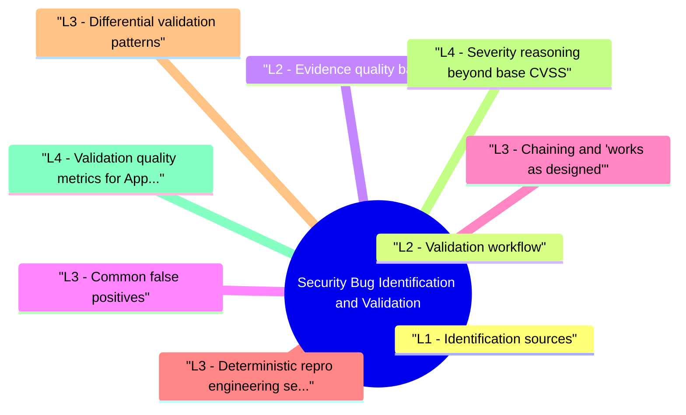

# Security Bug Identification and Validation revision map

Last mock I bounced around the Security Bug Identification and Validation folder. This file is the stop that. Drawn from Critical Clarification Security Bug Identification and Validation Misconceptions.md, Security Bug Identification and Validation - Comprehensive Guide.md, Security Bug Identification and Validation - Interview Questions & Answers.md, Security Bug Identification and Validation - Quick Reference.md, Security Bug Identification and Validation - VAPT Methodology.md. Skim the mermaid, then the outline.

## L1 - Identification sources

## L2 - Validation workflow
- Understand claimed behavior (read code, trace request).
- Reproduce on controlled build; capture evidence (HTTP, screenshots, logs).
- Minimize steps; remove attacker assumptions that aren't realistic.
- Assess impact: CIA, authZ, users affected, data classes.
- Check mitigations: WAF, CSP, network segmentation-real or paper?
- Score severity with environmental context (not CVSS alone).
- File ticket with owner, SLA, retest criteria.

## L2 - Evidence quality bar
- Strong: curl commands, Burp project excerpt, git commit hash, test account role documented.
- Weak: "maybe XSS" without browser context; screenshot only with no HTTP.

## L3 - Common false positives
- Self-XSS presented as stored.
- Issues blocked by default framework behavior (CSRF token already there).
- Dependency CVE not reachable (dead code).
- Intended behavior misread as bug (public blog is public).

## L3 - Chaining and "works as designed"
- Low severity finding + second bug may be Critical-document chains carefully.
- Risk acceptance requires named owner and expiry-not silent wontfix.

## L3 - Deterministic repro engineering (senior expectation)
- Interviewers usually judge quality by whether your repro can survive handoff to an engineer on a different machine.
- Environment pinning: capture image/tag, feature flags, seed data set, and commit SHA.
- Identity pinning: record exact principal (user, org, role, tenant) and token scope used in repro.
- Time sensitivity: note if exploitability depends on clock skew, race window, TTL, or async workers.
- Artifact bundle: keep a minimal package (request collection, script, test account notes, expected response hashes).
- Stop condition: include a deterministic "fixed" signal (status/behavior/log line), not only "no longer works for me".

## L3 - Differential validation patterns
- For many logic bugs, proof comes from demonstrating an unauthorized or invalid state transition, not from shell-level payloads.
- Define a control case (authorized/expected path).
- Define an attack case that changes only one dimension (identity, object id, state order, timing).
- Capture a machine-verifiable diff (response body hash, DB row delta, audit log event, queue event).
- Repeat 3-5 times to show consistency and remove fluke arguments.

## L4 - Severity reasoning beyond base CVSS
- Treat CVSS as a baseline, then add exploitation reality and blast-radius context:
- This framing helps prevent both severity inflation and under-reporting.

## L4 - Validation quality metrics for AppSec programs
- Staff-level interviews often ask for measurable quality controls:
- Time to confirm (TTC): intake to validated true-positive.
- Reopen rate: issues marked fixed but failing retest.
- False-positive taxonomy: tool noise, scope misunderstanding, duplicate, environmental mismatch.
- Evidence completeness score: percentage of findings with deterministic repro + impact proof + fix criteria.
- Fix verification SLA: median and p95 retest completion after engineering "done".

## Interview clusters

### Junior
- Difference between bug and vulnerability?

### Mid
- What makes a good repro?

### Senior
- How do you push back on inflated severity without damaging trust?

### Staff
- Metrics for validation team quality (reopen rate, time to confirm).

## Authoritative references
- FIRST vulnerability coordination practices
- ISO 29147 themes (disclosure)
- OWASP Testing Guide (validation methodology)

## Cross-links
- Rapid Triage · Vulnerability Management · Risk Prioritization · Secure Code Review · Crash Analysis

## Verification checklist
- [ ] Write one minimal repro from scratch.
- [ ] Explain environmental CVSS in 60 seconds.
- [ ] Close one false positive with respectful language.
- [ ] Build one control vs attack differential proof with repeatable evidence.
- [ ] Define TTC and reopen rate for your current workflow.

## Flags I check in 90 seconds

## Pipeline
- Report -> repro -> impact -> dedupe -> severity -> route -> verify fix

## Evidence checklist
- Build/version · role · steps · HTTP/logs · minimal case · no secrets in ticket

## Confidence labels

## False positive patterns
- Self-XSS · unreachable dep CVE · default mitigation already on · intended behavior

## Severity inputs
- Exploitability · exposure · data · integrity · KEV/EPSS (CVE class)

## Cross-read
- Rapid Triage · Vuln Management · Code Review · Pen Testing

## One-liner

## Misreads that still sneak in

## "If SAST says Critical, it's valid."
- Reality: SAST false positives are common-validate with data flow and repro.

## "No repro means no bug."
- Reality: Some issues (crypto design) need analysis not PoC-still require written argument.

## "Validation is someone else's job after I file."
- Reality: Quality in = quality out-incomplete reports waste cycles.

## "CVSS base score ends discussion."
- Reality: Environmental metrics and business context change priority.

## "Duplicate reports are spam."
- Reality: Duplicates signal confusing UX or docs-merge and improve guidance.

## "Won't fix = secure."
- Reality: Risk acceptance must be explicit and reviewed.

## "Exploit code is required for acceptance."
- Reality: Clear logical proof often suffices; weaponized PoC may be restricted by policy.

## "Fast validation means shallow validation."
- Reality: Templates and rubric speed good work-rushing without criteria creates reopens.

## Lab methodology

## Objective
- Create a repeatable assessment workflow for Security Bug Identification and Validation that produces reproducible evidence and actionable remediation guidance.

## Phase 1 - Scope and preparation
- Confirm in-scope assets, test windows, and prohibited actions.
- Identify critical user journeys and trust boundaries.
- Define severity rubric and evidence requirements before testing.

## Phase 2 - Recon and attack-surface mapping
- Enumerate relevant endpoints, flows, and data paths.
- Document where security checks are expected to happen.
- Mark high-value assets and high-impact paths.

## Phase 3 - Hypothesis-driven testing
- Start with low-risk probes and baseline behavior.
- Test failure hypotheses systematically (one variable at a time).
- Capture request/response artifacts for each finding candidate.

## Phase 4 - Validation and impact proof
- Reproduce findings with clean-state retests.
- Confirm exploitability and practical impact.
- Eliminate false positives; record confidence level.

## Phase 5 - Remediation and verification
- Provide immediate containment + structural fix recommendations.
- Define post-fix verification tests and telemetry checks.
- Re-test after remediation and close with evidence.

## Evidence template
- Asset / endpoint:
- Preconditions:
- Reproduction steps:
- Observed behavior:
- Security impact:
- Business impact:
- Recommended fix:
- Verification result:

## Interview drill
- In 3 minutes, explain how you would run this VAPT workflow for one production-like service and what evidence you need before escalating severity.

## Clusters from the Q&A file

- Q: What if you can't reproduce?
- Q: Minimal repro-why care?
- Q: Reporter says Critical; you disagree. What do you do?
- Q: When is self-XSS not a vuln?
- Q: Duplicate handling?

## 60-second answer
- Q: How do you validate a reported security bug?

## Reproduction

### Q: What if you can't reproduce?
- A: Request missing details (version, role, payload); try adjacent versions; time-box; document attempts-don't guess severity.

### Q: Minimal repro-why care?
- A: Faster fix, clearer root cause, reliable regression test, less debate.

## Severity

## Bug bounty

## Depth: Follow-ups
- Validation automation (CI security tests).
- Cryptographic issues without PoC (how to validate).
- Coordinated disclosure timeline.

## Mock ladder

## Cross-links I actually follow

- Stay inside this folder for the long guide. Jump only when a section names a sibling topic.
- Cookie Security, CSRF, XSS, JWT, OAuth, and TLS show up as neighbors on a lot of these maps.
