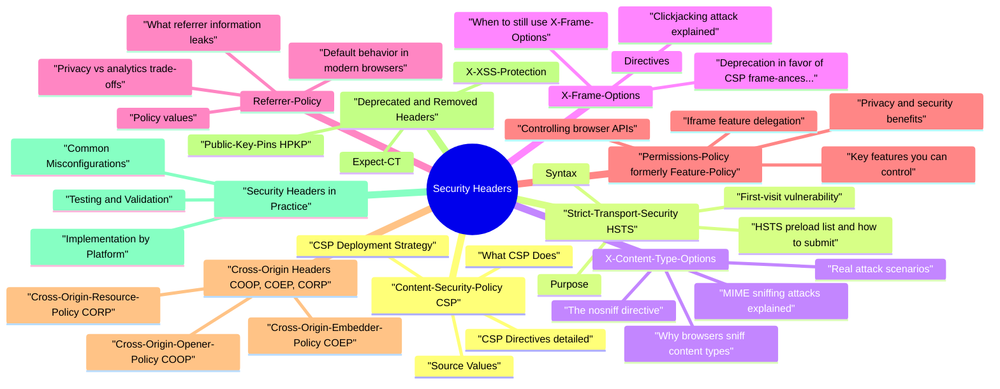

# Security Headers revision map

This is the Security Headers spine I actually use. Types, failures, fixes, traps. Sources: Critical Clarification Security Headers Misconceptions.md, Security Headers Interview Questions Beginner to A.md, Security Headers - Quick Reference.md, Security Headers - Comprehensive Guide.md, Security Headers - VAPT Methodology.md. I do not treat it as a second textbook.

### What are HTTP security headers and why they matter
- Browsers are the execution environment for web applications. A single injected script runs with the full authority of the page's origin.
- Server-side defenses are necessary but not sufficient. Even with perfect output encoding, a misconfigured CDN or third-party widget can introduce scripts. Headers like CSP provide a safety net.
- They are cheap to deploy. Adding a header is a configuration change, not a code rewrite. The security ROI is enormous.
- They are tested in audits and pentests. Missing headers are among the most common findings in security assessments.

### Defense-in-depth: headers as a browser-enforced security layer
- Defense-in-depth means no single control is trusted to stop all attacks. Security headers add a client-side enforcement layer on top of server-side controls:
- If output encoding fails on one page, CSP can still block the injected script. If CSP has a gap, HttpOnly cookies prevent session theft. Each layer compensates for failures in the others.

### Response headers vs request headers in security context
- Response headers (server -> browser): These are the "security headers" we discuss. The server tells the browser what policies to enforce. Examples: Content-Security-Policy, Strict-Transport-Security, X-Frame-Options.

## Content-Security-Policy (CSP)
- CSP is the most powerful and complex security header. It defines a whitelist of trusted content sources that the browser enforces, blocking anything not explicitly allowed.

### What CSP Does
- Controls which resources the browser is allowed to load: scripts, styles, images, fonts, frames, network connections, and more.
- Mitigates XSS: Even if an attacker injects alert(1) into your HTML, the browser refuses to execute it unless inline scripts are explicitly allowed.
- Mitigates data injection: Prevents loading malicious resources from attacker-controlled domains.
- Mitigates clickjacking: The frame-ancestors directive controls who can embed your page, replacing X-Frame-Options.
- Provides violation reporting: CSP can report blocked resources to a server endpoint, giving visibility into attacks and misconfigurations.

### CSP Directives (detailed)
- Each directive controls a specific resource type. If a directive is not specified, it falls back to default-src. If default-src is also missing, the browser allows everything (no protection).

#### default-src
- The fallback for all fetch directives not explicitly listed. Set this to 'self' or 'none' as a baseline and then open specific directives as needed.
- Best practice: Start with default-src 'none' and explicitly allow each resource type. This ensures you don't accidentally permit a resource type you forgot about.

#### script-src
- Controls JavaScript sources. The most security-critical directive because script execution gives full control over the page.
- 'self': Scripts from the same origin.
- Specific domains: https://cdn.example.com.
- Nonces: 'nonce-abc123' allows a specific tag.
- Hashes: 'sha256-base64hash' allows scripts whose content matches the hash.
- script-src-elem: Controls elements specifically.
- script-src-attr: Controls inline event handlers (onclick, onload, etc.).

#### style-src
- Controls CSS sources. CSS injection can be used for data exfiltration (e.g., using attribute selectors to leak CSRF tokens character by character).
- style-src-elem: Controls elements and .
- style-src-attr: Controls inline style="" attributes.

#### img-src
- Controls image sources. Usually more permissive since images have less attack surface, but consider:
- Images from data: URIs can be used for tracking pixels.
- Images can trigger requests to attacker servers (beaconing).

#### font-src
- Controls web font sources. Fonts are typically loaded from CDNs or self-hosted.

#### connect-src
- See the source section `connect-src` for the worked example.

#### media-src
- See the source section `media-src` for the worked example.

#### object-src
- Controls , , and sources. Always set to 'none' unless you specifically need Flash or Java applets (you don't).
- This prevents plugin-based attacks. Flash and Java plugins have been historically massive attack surfaces.

#### frame-src
- Controls sources for and elements. Determines what your page can embed.

#### frame-ancestors
- Controls who can embed your page in an . This is the CSP replacement for X-Frame-Options and is more flexible.
- 'none' = equivalent to X-Frame-Options: DENY
- 'self' = equivalent to X-Frame-Options: SAMEORIGIN
- Specific origins = more flexible than X-Frame-Options: ALLOW-FROM (which only supported one origin)

#### base-uri
- Controls what URLs can be used in . An attacker who can inject a tag can redirect all relative URLs on the page to their server.
- Always set to 'self' or 'none'. This closes the base-uri hijacking attack vector.

#### form-action
- Controls where elements can submit data. Without this, an attacker who injects a form can submit data to their server.

#### navigate-to
- Controls where the document can navigate (via window.location, , , ). Still experimental and not widely supported.

#### worker-src
- Controls sources for Worker, SharedWorker, and ServiceWorker. Workers run in their own context and can make network requests, so they need their own policy.
- Falls back to child-src, then script-src, then default-src.

#### child-src
- Controls sources for web workers and nested browsing contexts (iframes). In practice, use frame-src and worker-src for more granular control.

#### manifest-src
- Controls sources for application manifests ( ).

### Source Values
- Source values define what each directive allows. Understanding the security trade-offs of each value is critical.

#### 'self'
- Allows resources from the same origin (scheme + host + port). This is the most common starting point for most directives.
- Trade-off: Safe baseline, but doesn't help if your own origin serves user-controlled content (e.g., file upload endpoints that serve HTML).

#### 'none'
- Blocks all resources of this type. Use for object-src, base-uri, and any directive where you don't need the resource type.

#### 'unsafe-inline'
- Allows inline tags, tags, and inline event handlers (onclick, etc.). This largely defeats the purpose of CSP for XSS protection because most XSS payloads are inline scripts.
- When it's used: Legacy applications with thousands of inline scripts where migration is impractical in the short term. Should be treated as technical debt to eliminate.

#### 'unsafe-eval'
- Allows eval(), Function(), setTimeout('string'), and setInterval('string'). These are dangerous because they convert strings to code.
- When it's used: Some template engines and libraries (Angular.js 1.x, some charting libraries) require eval. Consider alternatives or use 'unsafe-eval' only when absolutely necessary.

#### 'unsafe-hashes'
- Allows specific inline event handlers by their hash, without allowing all inline scripts. More targeted than 'unsafe-inline' but only works for event handler attributes.
- This allows if the hash of doSomething() matches, without opening up all inline scripts.

#### 'strict-dynamic'
- Why it matters: Modern applications use bundlers that dynamically load chunks. Without strict-dynamic, you'd need to whitelist every CDN and chunk URL. With it, you only need to nonce the initial tag.
- Behavior: When 'strict-dynamic' is present, host-based allowlists (https://cdn.example.com) and 'self' are ignored for script loading. Only nonces, hashes, and dynamically loaded scripts are trusted.

#### 'nonce-...'
- A server-generated random value that must match between the CSP header and the tag. Each page load must use a new, cryptographically random nonce.

#### 'sha256-...' (hash-based)
- Allows scripts whose content hashes to a specific value. The browser computes the hash of the inline script body and compares it to the allowed hash.

#### data
- Allows data: URIs. Common for inline images ( ) but dangerous for scripts.
- Never use data: in script-src - it allows .

#### blob
- Allows blob: URIs. Needed for workers created from blob URLs and for URL.createObjectURL() patterns.

#### https
- Allows any resource served over HTTPS, regardless of domain. Very broad and should be avoided for script-src (it allows scripts from any HTTPS site).
- May be acceptable for images if you need to embed images from arbitrary HTTPS sources, but not for scripts.

#### Specific domains
- Allows resources from specific origins or domains.
- Wildcards: *.example.com allows all subdomains. Be careful - if any subdomain serves user content, they can host malicious scripts.

### CSP Deployment Strategy
- Deploying CSP on a real application is an iterative process. Flipping on a strict policy immediately will break functionality.

#### Step 1: Report-Only mode
- Start with Content-Security-Policy-Report-Only instead of Content-Security-Policy. This header tells the browser to report violations but not block them. Your application works normally while you collect data.
- Monitor the reports for 1-4 weeks. Every violation represents something your policy would block if enforced.

#### Step 2: report-uri and report-to
- The browser sends a JSON POST to /csp-report with details:
- Use both for maximum browser coverage during the transition period.

#### Step 3: Iterative tightening
- Audit violations: Group by blocked-uri and violated-directive.
- Legitimate resources: Add them to the policy (e.g., your CDN, analytics provider).
- Inline scripts: Refactor to external files, or add nonces/hashes.
- Third-party scripts: Evaluate whether they're necessary. Each one increases your attack surface.
- Enforce: Move from Content-Security-Policy-Report-Only to Content-Security-Policy. Keep report-uri for ongoing monitoring.
- Tighten further: Remove 'unsafe-inline', reduce domain allowlists, adopt 'strict-dynamic'.

#### Nonce-based vs hash-based vs strict-dynamic approaches
- Recommended modern approach (Google's recommended CSP):

#### Common pitfalls
- Inline event handlers (onclick="...") are blocked by CSP unless 'unsafe-inline' is allowed. Refactor to addEventListener().
- Inline styles in JavaScript frameworks (e.g., React's style prop with object literals that use doubled curly braces) may require 'unsafe-inline' in style-src or nonces.
- Third-party scripts (analytics, ads, chat widgets) load additional scripts dynamically. Without strict-dynamic, you'd need to whitelist every domain they load from - and those domains change.
- eval() usage by libraries (e.g., some template engines, Webpack dev mode) requires 'unsafe-eval', which weakens CSP.
- CSP on cached pages: If you cache HTML with a nonce, the nonce in the HTML won't match the nonce in the CSP header of subsequent responses. Use hashes for cached content or configure cache keys to include the nonce.

### CSP Bypass Techniques (for interview awareness)
- Understanding bypasses is critical for senior/staff interviews and for designing solid policies.

#### JSONP endpoints as script sources
- If your CSP allows https://trusted.example.com and that domain has a JSONP endpoint, an attacker can use it to execute arbitrary JavaScript:
- The JSONP response is alert(1)//({"data":"..."}), which is valid JavaScript. Mitigation: Don't whitelist domains that serve JSONP. Use strict-dynamic with nonces instead of domain allowlists.

#### Angular/React template injection within allowed domains
- If a CSP allows a CDN that hosts Angular.js, an attacker can inject Angular template syntax within the page:
- Angular evaluates the double-curly template expression, bypassing CSP because the script came from an allowed domain. Mitigation: Use strict-dynamic with nonces; avoid domain-based allowlists for script-src.

#### base-uri hijacking
- If base-uri is not restricted, an attacker who can inject HTML (but not scripts) can inject:
- All relative script URLs ( ) now resolve to https://attacker.com/app.js. Mitigation: Always set base-uri 'self' or base-uri 'none'.

#### Dangling markup injection
- When an attacker can inject HTML but not execute scripts (due to CSP), they can use "dangling markup" to exfiltrate data:
- If the injected tag is unclosed, the browser includes everything after it (up to the next " or >) as part of the src attribute, sending page content (potentially including CSRF tokens) to the attacker's server.

## Strict-Transport-Security (HSTS)

### Purpose
- See the source section `Purpose` for the worked example.

### Syntax
- See the source section `Syntax` for the worked example.

### HSTS preload list and how to submit
- The HSTS preload list is a list of domains hardcoded into browsers (Chrome, Firefox, Safari, Edge) that are HTTPS-only from the first connection. This eliminates the "first visit vulnerability."
- Serve a valid HSTS header with max-age >= 1 year, includeSubDomains, and preload.
- Serve HTTPS on the bare domain (not just www).
- Redirect all HTTP traffic to HTTPS.
- Submit at hstspreload.org.

### First-visit vulnerability
- This is the basis for SSL stripping attacks (sslstrip tool). The attacker intercepts the HTTP connection, proxies to the real HTTPS site, and the user never sees HTTPS.
- HSTS preloading eliminates this because the browser knows to use HTTPS before ever contacting the server.

### Risks
- Subdomain implications: With includeSubDomains, every subdomain must support HTTPS. If you have a legacy subdomain on HTTP, it becomes inaccessible. Audit all subdomains before enabling.
- Preload is hard to reverse: Removing a domain from the preload list takes months (browser release cycles). Don't preload until you're certain about HTTPS for the entire domain and all subdomains.

### Relationship to certificate pinning (deprecated)
- HPKP (HTTP Public Key Pinning) was a header that pinned specific certificate public keys. It was deprecated and removed because:
- Mistakes could permanently lock users out of a site (a "bricking" attack).
- Attackers who compromised a site could set HPKP to pin their own key, creating a ransom scenario.
- Certificate Transparency (CT) logs provide a better solution for detecting misissued certificates.

## X-Content-Type-Options

### MIME sniffing attacks explained
- See the source section `MIME sniffing attacks explained` for the worked example.

### The nosniff directive
- This tells the browser: "Trust the Content-Type header. Do not sniff." If the server says the content is text/plain, render it as plain text, even if it looks like HTML.
- Script loading when the MIME type is not a JavaScript MIME type.
- Style loading when the MIME type is not a CSS MIME type.

### Why browsers sniff content types
- Historical reasons: early web servers frequently misconfigured Content-Type headers. Browsers sniffed to improve compatibility. Modern servers and frameworks set correct types, making sniffing unnecessary and dangerous.

### Real attack scenarios
- Scenario 1: Image upload with HTML content
- User uploads profile.jpg containing alert(document.cookie) .
- Server stores it and serves it with Content-Type: image/jpeg.
- Browser sniffs the content, determines it's actually HTML, and renders/executes it.
- The script runs in the context of the upload domain - if that's the same origin as the application, it's XSS.
- An API returns JSON: Content-Type: application/json.
- An attacker crafts a JSON response that is also valid JavaScript.
- Without nosniff, a browser navigating directly to the API endpoint might execute the response as a script.

## X-Frame-Options

### Clickjacking attack explained
- Clickjacking (UI redressing) tricks a user into clicking something they didn't intend to by overlaying a transparent iframe of a target site over a decoy page:
- Attacker creates a page with a button: "Click here to win a prize!"
- The attacker overlays a transparent of https://bank.com/transfer?to=attacker&amount=10000 positioned so the "Confirm Transfer" button aligns with the "win a prize" button.
- The user clicks what they think is the prize button but actually clicks the bank's transfer button.
- Because the user is logged into the bank, the request succeeds with their session cookie.

### Directives
- See the source section `Directives` for the worked example.

### Deprecation in favor of CSP frame-ancestors
- ALLOW-FROM only supports a single origin and is not supported by Chrome or Safari.
- It can't express "allow these three specific origins."
- It doesn't support wildcards.

### When to still use X-Frame-Options
- Legacy browser support: Very old browsers (IE11 and earlier) support X-Frame-Options but not CSP frame-ancestors.
- Belt and suspenders: Set both for maximum compatibility:

## Referrer-Policy

### What referrer information leaks
- When a user navigates from page A to page B, the browser sends a Referer header (yes, the misspelling is intentional - it's in the HTTP spec) containing the URL of page A. This can leak:
- URL path: /user/profile/12345 reveals user IDs.
- Query parameters: /search?q=medical+condition reveals search queries.
- Tokens in URLs: /reset-password?token=abc123 leaks password reset tokens.
- Internal URLs: Navigating from an internal admin page to an external link reveals internal URL structure.

### Policy values
- "Full URL" = https://example.com/path?query=value
- "Origin only" = https://example.com
- "No referrer" = Referer header not sent

### Privacy vs analytics trade-offs
- no-referrer: Maximum privacy but breaks analytics (you can't see where traffic comes from) and can break some CSRF protections that check the Referer header.
- unsafe-url: Maximum analytics data but leaks full URLs everywhere, including sensitive paths and query parameters.

### Default behavior in modern browsers
- See the source section `Default behavior in modern browsers` for the worked example.

## Permissions-Policy (formerly Feature-Policy)

### Controlling browser APIs
- Permissions-Policy allows a site to control which browser features and APIs can be used by its own code and by embedded third-party iframes.

### Key features you can control
- See the source section `Key features you can control` for the worked example.

### Iframe feature delegation
- When embedding third-party content in iframes, the iframe inherits the parent page's permissions restrictions. You can also use the allow attribute on iframes:
- If the parent page's Permissions-Policy blocks geolocation, the iframe cannot use it even if the allow attribute permits it. The parent policy is the ceiling.

### Privacy and security benefits
- Reduces attack surface: Even if a third-party script is compromised, it can't access the camera or microphone if the policy blocks it.
- Prevents abuse by embedded content: Ad iframes can't use the vibration API, request payment, or access sensors.
- Defense against future APIs: New browser APIs are designed to respect Permissions-Policy, so setting a restrictive baseline protects against features you haven't heard of yet.

## Cross-Origin Headers (COOP, COEP, CORP)
- These three headers work together to enable cross-origin isolation, which is required for powerful features like SharedArrayBuffer and high-resolution timers (which were restricted after Spectre/Meltdown).

### Cross-Origin-Opener-Policy (COOP)
- See the source section `Cross-Origin-Opener-Policy (COOP)` for the worked example.

#### Browsing context isolation
- COOP breaks this relationship for cross-origin windows, preventing cross-origin pages from referencing your window object.

#### Values
- See the source section `Values` for the worked example.

#### Spectre/Meltdown mitigations
- See the source section `Spectre/Meltdown mitigations` for the worked example.

### Cross-Origin-Embedder-Policy (COEP)
- See the source section `Cross-Origin-Embedder-Policy (COEP)` for the worked example.

#### Values and purpose
- See the source section `Values and purpose` for the worked example.

#### Enabling SharedArrayBuffer
- To use SharedArrayBuffer, a page must be cross-origin isolated, which requires both:
- You can check isolation status in JavaScript:

### Cross-Origin-Resource-Policy (CORP)
- See the source section `Cross-Origin-Resource-Policy (CORP)` for the worked example.

#### Protecting resources from cross-origin reads
- CORP is set on individual resources (images, scripts, etc.) to control who can load them. It's the resource's opt-in that COEP checks.

## Deprecated and Removed Headers

### X-XSS-Protection
- What it did: Activated the browser's built-in XSS filter (XSS Auditor in Chrome, XSS Filter in IE).
- False positives: The filter sometimes blocked legitimate content, breaking sites.
- CSP is strictly superior: CSP provides much more granular and reliable XSS protection.

### Expect-CT
- What it did: Required the server's TLS certificate to appear in Certificate Transparency (CT) logs. If the certificate wasn't logged, the browser would reject the connection.

### Public-Key-Pins (HPKP)
- What it did: Pinned specific public key hashes for the site's certificate chain. The browser would only accept connections using certificates with matching key hashes.
- Self-inflicted DoS: If you lost your pinned key (e.g., CA revoked your cert, HSM failure), users were locked out for the max-age duration. With a max-age of months, this was catastrophic.
- Operational nightmare: Key rotation required careful coordination with the pin list. Many teams got it wrong.

## Security Headers in Practice

### Implementation by Platform
- See the source section `Implementation by Platform` for the worked example.

#### Express.js / Node.js (with helmet.js)
- Helmet is the standard middleware for setting security headers in Express applications.

#### Nginx configuration
- See the source section `Nginx configuration` for the worked example.

#### Apache configuration
- See the source section `Apache configuration` for the worked example.

#### AWS CloudFront / CDN headers
- CloudFront can add security headers via response headers policies (preferred) or Lambda@Edge functions.
- Response headers policy (AWS Console / CloudFormation):

#### Django / Python
- See the source section `Django / Python` for the worked example.

### Common Misconfigurations
- See the source section `Common Misconfigurations` for the worked example.

#### CSP with 'unsafe-inline' defeating the purpose
- This CSP is almost useless for XSS protection. The entire point of CSP is to block inline script execution. With 'unsafe-inline', any injected alert(1) will execute. This is the most common CSP misconfiguration.
- Fix: Replace 'unsafe-inline' with nonces or hashes. Use 'strict-dynamic' for dynamically loaded scripts.

#### HSTS without includeSubDomains
- Without includeSubDomains, an attacker can set up an HTTP connection to any subdomain (e.g., http://anything.example.com) to perform cookie injection or SSL stripping attacks against the parent domain.
- Fix: Always include includeSubDomains after verifying all subdomains support HTTPS.

#### Missing headers on API endpoints
- Many teams only set security headers on HTML pages and forget API endpoints. While some headers (CSP, X-Frame-Options) primarily protect rendered pages, others matter for APIs:
- X-Content-Type-Options: nosniff - prevents browsers from reinterpreting API responses.
- Strict-Transport-Security - should be on every response to keep the HSTS cache fresh.
- Cache-Control - API responses with sensitive data should not be cached by the browser.

#### Setting headers only on some routes
- If your Express app sets helmet middleware only on some routes, or your Nginx config only adds headers in one location block, some responses will lack protection.
- Fix: Apply security headers at the outermost layer (reverse proxy, CDN, or top-level middleware) so every response includes them.

#### Overly permissive Permissions-Policy
- This allows all embedded content to use sensitive APIs. Most applications don't need to grant these permissions to any third-party content.
- Fix: Default to () (deny) for all features and only enable what you need:

### Testing and Validation
- See the source section `Testing and Validation` for the worked example.

#### SecurityHeaders.com
- See the source section `SecurityHeaders.com` for the worked example.

#### Mozilla Observatory
- observatory.mozilla.org provides a more comprehensive scan including security headers, TLS configuration, cookies, and other best practices. Scores from 0-100 with letter grades.

#### CSP Evaluator (Google)
- csp-evaluator.withgoogle.com specifically analyzes your CSP for weaknesses. It identifies:
- Overly broad source lists
- Use of 'unsafe-inline' or 'unsafe-eval'
- Known JSONP bypass endpoints in whitelisted domains
- Missing critical directives (object-src, base-uri)

#### Browser DevTools
- Network tab: Inspect response headers on each request. Verify headers are present and correct.
- Console: CSP violations appear as console errors with detailed messages:
- Application tab -> Frames: Shows the effective CSP and Permissions-Policy for the page.
- Security tab: Shows TLS and certificate details, HSTS status.

#### Automated scanning in CI/CD
- Integrate header checks into your deployment pipeline:

## Advanced Header Governance (Staff+)

### Trusted Types + CSP for DOM XSS reduction
- CSP blocks many script execution paths, but DOM-based XSS can still occur through unsafe DOM sinks if application code writes attacker-controlled HTML/JS into the page.
- Trusted Types (supported in Chromium-based browsers) adds a second control layer:

### Policy-as-code and drift prevention across edge tiers
- Security headers often drift between app, API gateway, CDN, and WAF layers:
- App sends strict CSP, CDN overrides with weaker policy.
- Error pages bypass middleware and ship without headers.
- Canary environment uses different header profile than production.
- Define baseline headers as versioned policy artifacts.
- Validate in CI against representative route classes (HTML, API JSON, error pages, static assets).
- Enforce at the outermost tier (edge/CDN) and verify origin parity.
- Monitor runtime drift with scheduled header scans and alerting.

## How Security Headers Fail
- Even correctly configured headers can fail in practice. Understanding failure modes is critical for senior/staff interviews.

### Headers not applied to all responses
- Security headers are typically set on HTML page responses. But:
- API responses served from the same origin may lack headers. If a browser navigates directly to an API endpoint (e.g., /api/user), missing X-Content-Type-Options or X-Frame-Options could create vulnerabilities.
- Error pages (404, 500) generated by the web server or framework may bypass middleware and lack headers. Nginx's always keyword and Express's error-handling middleware address this.
- Static file servers (e.g., serving uploaded content from a separate path) may have completely different header configurations.

### CDN/proxy stripping headers
- CDN misconfiguration: Some CDNs strip or override response headers. CloudFront, for example, may not forward custom headers from the origin unless configured to do so.
- Load balancers: Adding headers at the origin doesn't help if the load balancer strips them before forwarding to the client. Test from the client's perspective, not the origin server.
- Proxy/WAF interference: Some WAFs add their own CSP or modify existing headers, creating conflicts or weakening the policy.

### Third-party scripts violating CSP
- Third-party scripts (analytics, ads, chat widgets, A/B testing) are the biggest challenge for CSP deployment:
- They load additional scripts from domains you haven't whitelisted.
- They use eval() and inline scripts.
- They change their behavior and domains without notice, breaking your CSP.
- They inject iframes, images, and styles from unknown sources.
- Use 'strict-dynamic' so nonce-trusted bootstrap scripts can load their dependencies.
- Isolate third-party scripts in sandboxed iframes where possible.
- Monitor CSP reports to detect when third-party scripts change their loading patterns.

### Report fatigue
- A strict CSP on a large application generates thousands of violation reports:
- Browser extensions trigger violations (they inject scripts into every page).
- Outdated bookmarklets and browser toolbars.
- Legitimate third-party script changes.
- Users on networks with injecting proxies (hotel WiFi, corporate proxies).
- Use a dedicated CSP report aggregation service (Report URI, Sentry, Datadog).
- Filter out known browser extension patterns.
- Sample reports (only send a percentage to the reporting endpoint).

### False sense of security without server-side defenses
- Security headers supplement but don't replace server-side security:
- CSP does not prevent stored XSS from being stored. It only prevents the browser from executing the payload. If CSP is weakened or bypassed, the stored payload fires.
- HSTS does not fix mixed content. If your page loads an image over HTTP, HSTS on the page won't help - you need to fix the mixed content.
- X-Frame-Options doesn't prevent CSRF. Clickjacking and CSRF are different attacks. You need CSRF tokens independently.
- Headers don't protect non-browser clients. API clients, mobile apps, and curl ignore security headers entirely. Server-side validation remains essential.

## Interview Clusters

### Fundamentals
- See the source section `Fundamentals` for the worked example.

### Senior
- "How would you deploy CSP on a large application with many third-party scripts?"
- Start with Content-Security-Policy-Report-Only and report-uri to collect violation data without breaking anything.
- Audit violations for 2-4 weeks. Categorize: legitimate resources, browser extensions, actual attacks.
- Build the policy iteratively: whitelist legitimate domains, add nonces for inline scripts, use 'strict-dynamic' for dynamically loaded scripts.
- Move from report-only to enforced. Keep reporting on.
- Tighten over time: remove 'unsafe-inline', reduce domain allowlists, pressure third-party vendors for CSP-compatible integrations.
- Set up automated monitoring for policy changes and violation spikes.
- "What security headers would you set for a REST API?"

### Staff
- "Design a security headers strategy for a multi-tenant SaaS with customer-controlled content."
- Customer content (rich text, embedded media, custom HTML templates) needs to render but not execute arbitrary scripts.
- Different tenants may have different integration needs (some embed YouTube, others embed custom dashboards).
- The main application and customer content may share an origin or use separate origins.
- Per-tenant CSP: If tenants customize which third-party integrations they use, generate CSP dynamically per tenant. Store their allowed domains and generate the header on each response.
- Sandboxed iframes: Render customer content in sandboxed iframes (sandbox="allow-scripts allow-same-origin" with a separate origin) to isolate it from the parent application.
- Strict CSP on the application itself: The main SaaS app uses nonce-based CSP with strict-dynamic. Customer content uses a separate, more permissive policy on the sandboxed origin.
- HSTS on all domains: Both the application domain and the user-content domain enforce HTTPS.

## Cross-links
- XSS - CSP is a primary XSS mitigation layer
- XSS vs CSRF - Headers address different aspects of each attack

## The one-pager, exploded

## Critical Headers (Must Have)

### Content-Security-Policy (CSP)
- Purpose: Prevents XSS attacks by controlling resource loading
- Priority: Critical
- Best Practice: Start with report-only mode, then enforce

### Strict-Transport-Security (HSTS)
- Purpose: Forces HTTPS connections
- Priority: Critical
- Best Practice: Use preload for maximum security

### X-Content-Type-Options
- Purpose: Prevents MIME type sniffing
- Priority: Critical
- Best Practice: Always set to nosniff

## Important Headers (Should Have)

### X-Frame-Options
- Purpose: Prevents clickjacking
- Priority: Important
- Alternative: Use CSP frame-ancestors 'none' (preferred)

### Referrer-Policy
- Purpose: Controls referrer information sharing
- Priority: Important
- Options: no-referrer, strict-origin-when-cross-origin, same-origin

### Permissions-Policy
- Purpose: Controls browser feature access
- Priority: Important
- Best Practice: Disable unnecessary features

## Advanced Headers (Consider)

### Cross-Origin-Opener-Policy (COOP)
- Purpose: Isolates browsing context
- Priority: Advanced
- Use Case: When using SharedArrayBuffer

### Cross-Origin-Embedder-Policy (COEP)
- Purpose: Requires cross-origin resources to opt-in
- Priority: Advanced
- Use Case: Advanced isolation features

### Cross-Origin-Resource-Policy (CORP)
- Purpose: Controls resource loading from other origins
- Priority: Advanced
- Use Case: With COEP

## Header Priority Summary

### Critical (Must Have)
- Content-Security-Policy
- Strict-Transport-Security
- X-Content-Type-Options

### Important (Should Have)
- Referrer-Policy
- Permissions-Policy
- X-Frame-Options (or CSP frame-ancestors)

### Advanced (Consider)
- Cross-Origin-Opener-Policy
- Cross-Origin-Embedder-Policy
- Cross-Origin-Resource-Policy

### Deprecated (Avoid)
- X-XSS-Protection
- Expect-CT

## Quick Implementation Examples

### Express.js
- See the source section `Express.js` for the worked example.

### Nginx
- See the source section `Nginx` for the worked example.

### Apache
- See the source section `Apache` for the worked example.

## CSP Directives Quick Reference

## Common CSP Policies

### Strict Policy (Recommended)
- See the source section `Strict Policy (Recommended)` for the worked example.

### With Nonces (Better Security)
- See the source section `With Nonces (Better Security)` for the worked example.

### With Hashes (Best Security)
- See the source section `With Hashes (Best Security)` for the worked example.

## Testing & Validation

### Online Tools
- SecurityHeaders.com
- Mozilla Observatory
- CSP Evaluator

### Command Line
- See the source section `Command Line` for the worked example.

## Key Takeaways
- Start with Critical Headers: CSP, HSTS, X-Content-Type-Options
- Use Report-Only First: Test CSP with Content-Security-Policy-Report-Only
- Test Thoroughly: Use online tools and browser DevTools
- Monitor Violations: Set up CSP reporting
- Keep Updated: Security headers evolve, stay current
- Balance Security & Functionality: Don't break your site with overly strict policies

## Common Mistakes to Avoid
- Using 'unsafe-inline' in script-src (use nonces/hashes instead)
- Missing HSTS on HTTPS sites
- Not testing CSP before enforcing
- Using deprecated headers (X-XSS-Protection)
- Setting headers only on some pages (apply everywhere)
- Ignoring CSP violation reports

## What people get wrong

## "Security headers replace secure coding."
- Reality: Headers are defense in depth; parameterized queries, authZ, and input validation still required.

## "CSP unsafe-inline is fine with HTTPS."
- Reality: TLS doesn't stop XSS; unsafe-inline weakens CSP's main value.

## "HSTS means attackers can't use HTTP."
- Reality: First visit and misconfigured subdomains still matter; preload lists help but aren't universal.

## "X-Frame-Options is obsolete-ignore it."
- Reality: Older clients and some embed scenarios still benefit; frame-ancestors in CSP is modern preference, not instant removal everywhere.

## "Set every header to the strictest value in one PR."
- Reality: Report-Only CSP, staged rollouts, and breakage tests prevent outages.

## "APIs don't need security headers."
- Reality: CORS, HSTS (for browser clients), and CSP (for API docs/Swagger UI) still apply in many designs.

## "Referrer-Policy is a privacy-only header."
- Reality: It also reduces token leakage in Referer URLs.

## "Once set at CDN, origin headers don't matter."
- Reality: Conflicting or missing origin headers confuse browsers; normalize at one choke point.

## "Permissions-Policy is optional everywhere."
- Reality: Disabling powerful features shrinks XSS blast radius on modern browsers.

## "securityheaders.com A+ means we're done."
- Reality: Scanners don't know app logic; validate policy semantics and false positives on real routes.

## VAPT steps already in the folder

## Scope & Application Surface
- Identify key entry points:
- Main application pages (home, login, dashboard).
- Sensitive areas (account settings, admin panels).
- Static asset domains (CDNs, subdomains).
- Determine security goals:
- Mitigations desired (XSS, clickjacking, protocol downgrade, MIME sniffing).
- Compatibility constraints (legacy browsers, embedded widgets, iframes).

## Mapping Headers per Endpoint
- Using a proxy and browser dev tools, record for representative pages:
- Content-Security-Policy (CSP)
- Strict-Transport-Security (HSTS)
- X-Frame-Options (or CSP frame directives)
- X-Content-Type-Options
- Referrer-Policy
- Permissions-Policy (or Feature-Policy)
- Other relevant headers (e.g., Cache-Control, X-XSS-Protection for legacy)

## Assessment Strategy (Configuration Quality)
- Presence vs absence:
- Missing headers that would materially improve security posture.
- Strength of values:
- Is it in report‑only or enforce mode?
- Does it cover relevant sources and contexts (scripts, styles, frames)?
- Duration (max-age), includeSubDomains, and preload (where appropriate).
- X‑Frame‑Options / frame‑related CSP:
- Whether framing is allowed only where needed.

## Dynamic Testing - What to Observe
- Behavior under typical use:
- Confirm headers are present on normal navigations and AJAX/Fetch requests.
- Browser dev tools and console:
- CSP reports or violations (if report endpoints exist).
- Warnings when policies are misconfigured or deprecated.
- Integration scenarios:
- Embedding the app in allowed frames (e.g., internal portals) vs disallowed sites.
- Use of scripts and styles from permitted sources vs blocked ones.

## High‑Risk Scenarios
- Apps that handle sensitive user data:
- Absence of HSTS and weak HTTPS enforcement.
- No CSP or permissive CSP that allows broad script inclusion.
- Admin and privileged interfaces:
- Missing X‑Frame‑Options or equivalent CSP, enabling clickjacking risk.
- Missing nosniff or weak Referrer-Policy leaking sensitive URLs.
- Complex frontends:
- CSP wildcard allowances (*) for scripts or frames where not justified.

## Tooling & Aids
- Proxy tooling:
- Record HTTP responses and headers.
- Compare headers across many endpoints quickly.
- Browser dev tools:
- Inspect effective policies.
- View CSP violations and frame/embed behavior.
- CSP/headers analyzers (where allowed):
- Tools that grade or visualize header configurations.

## Verifying Effectiveness Safely
- To evaluate whether headers are effective:
- For framing protections:
- In a test environment, attempt to embed pages in frames from allowed vs disallowed origins and observe behavior.
- For CSP:
- Confirm that:
- Only intended sources are allowed for scripts/styles.
- Inline scripts/styles are handled according to policy.
- Review CSP reports/logs (if available) for recurring violations.

## Reporting & Risk Assessment
- Affected pages/endpoints.
- Missing or weak headers and current values.
- Application context (e.g., login page, admin console, public landing page).
- Potential impact:
- Increased XSS or injection exposure due to weak CSP.
- Increased clickjacking risk.
- Protocol downgrade or sniffing risks.
- Information leakage via referrer or permissive permissions.

## Remediation Guidance
- Baseline header set for all HTML responses:
- Strong HSTS (where HTTPS is enforced).
- X‑Content‑Type‑Options: nosniff.
- Referrer‑Policy appropriate for privacy and business needs.
- Frame protections via X‑Frame‑Options or CSP.
- Thoughtful CSP design:
- Start in report‑only mode if needed, then move to enforce.
- Minimize wildcards and unsafe directives.

## Re‑Testing Checklist
- [ ] Verify all relevant endpoints return the intended header set.
- [ ] Confirm:
- [ ] HSTS is applied consistently for HTTPS.
- [ ] CSP is enforced and not just report‑only (where intended).
- [ ] Framing and permission behavior matches the design.
- [ ] Monitor:
- [ ] CSP violation reports.
- [ ] Any regressions in features that rely on embedded content or third‑party scripts.

## Questions that showed up in mocks

- Beginner Level Questions
- What are HTTP Security Headers?
- Name at least 5 common security headers.
- What is the purpose of Content-Security-Policy (CSP)?
- What does X-Content-Type-Options: nosniff do?
- Explain HSTS (HTTP Strict Transport Security) in simple terms.
- What is clickjacking and which header prevents it?
- What is the difference between X-Frame-Options: DENY and X-Frame-Options: SAMEORIGIN?
- What does Referrer-Policy control?
- Why should you avoid using 'unsafe-inline' in CSP?
- What happens if you don't set any security headers?
- Intermediate Level Questions
- Explain how CSP nonces work and provide a complete example.
- How do CSP hashes work? When would you use hashes vs nonces?
- Explain the relationship between COOP, COEP, and CORP headers.
- What is the difference between Referrer-Policy: strict-origin-when-cross-origin and origin-when-cross-origin?
- How would you implement a CSP policy that allows Google Analytics but blocks other third-party scripts?
- What are the security implications of using Permissions-Policy: geolocation=()?
- Explain the preload directive in HSTS and its requirements.
- How would you debug CSP violations in production?
- What happens when both X-Frame-Options and CSP frame-ancestors are set?
- Explain the security implications of Clear-Site-Data header.
- Advanced Level Questions
- Design a comprehensive CSP policy for a modern web application that uses React, CDN assets, third-party APIs, and embedded content. Explain each directive.

### What happens if you don't set any security headers?
- Browsers use default, less secure behaviors
- Your site is vulnerable to XSS, clickjacking, MIME sniffing attacks
- No protection against protocol downgrade attacks
- More information may be leaked through referrer headers
- Browser features may be accessible without restriction

### Explain how to implement a secure CSP nonce system in a microservices architecture where HTML is generated by multiple services.
- Multiple services generate HTML fragments, but CSP nonces must be consistent across the entire page response.
- Nonces must be unique per request
- Cache HTML fragments without nonces
- Inject nonces at edge/gateway level
- Use request ID to track nonce across services
- Set short TTL for nonce storage (60 seconds)
- Validate nonce format before use
- Log nonce usage for security auditing

### How would you implement a security header management system that allows different policies for different routes/pages?
- Advanced: Database-Driven Configuration:

### Explain the security implications and implementation challenges of implementing COOP/COEP for enabling SharedArrayBuffer in a production application.
- SharedArrayBuffer requires a secure, isolated browsing context to prevent Spectre-like attacks. Browsers require both COOP and COEP headers to enable SharedArrayBuffer.
- Enables SharedArrayBuffer for high-performance computing
- Creates isolated browsing context
- Prevents cross-origin window access (COOP)
- Requires explicit resource opt-in (COEP)
- CDN resources must support CORP
- Many CDNs don't set CORP by default
- May need to proxy resources through your domain

### Design a security header testing and monitoring system for a large-scale application with multiple environments.
- Automated testing in CI/CD
- Continuous monitoring in production
- Trend analysis and reporting
- Alerting on violations
- Multi-environment support
- Historical data tracking

## Scenario-Based Questions

### Scenario 1: E-Commerce Application
- Question: You're securing an e-commerce application that processes payments. Which security headers are critical and why?
- HSTS with preload - Critical for payment pages to prevent MITM attacks
- CSP with strict policy - Prevents XSS that could steal payment data
- X-Frame-Options: DENY or CSP frame-ancestors 'none' - Prevents clickjacking on payment forms
- Referrer-Policy: no-referrer - Prevents leaking payment URLs
- Permissions-Policy - Disable unnecessary features (geolocation, camera, etc.)
- Clear-Site-Data - On logout to clear session data

### Scenario 2: Content Management System
- Question: A CMS allows users to embed custom HTML/JavaScript. How would you secure it with CSP?
- Use sandboxed iframes for user content
- Implement separate CSP policies for main site vs. user content
- Use nonces for trusted CMS scripts
- Set object-src 'none' to block plugins
- Use report-uri to monitor violations
- Consider CSP Level 3 with 'strict-dynamic' for better third-party script handling

### Scenario 3: API Service
- Question: What security headers should an API service implement?
- CSP: default-src 'none' - APIs shouldn't serve HTML
- X-Content-Type-Options: nosniff - Prevent MIME sniffing
- HSTS - Enforce HTTPS
- CORS headers - Properly configured Access-Control-* headers
- Rate limiting headers - X-RateLimit-* for API consumers
- No X-Frame-Options - Not needed for APIs

## Quick Reference: Header Priority

### Critical (Must Have)
- Content-Security-Policy
- Strict-Transport-Security
- X-Content-Type-Options

### Important (Should Have)
- Referrer-Policy
- Permissions-Policy
- X-Frame-Options (or CSP frame-ancestors)

### Advanced (Consider)
- Cross-Origin-Opener-Policy
- Cross-Origin-Embedder-Policy
- Cross-Origin-Resource-Policy

### Deprecated (Avoid)
- X-XSS-Protection
- Expect-CT

## Depth: Interview follow-ups - Security Headers
- Authoritative references: OWASP Secure Headers Project; MDN security headers overview.
- CSP deployment strategy-report-only first, nonce/hash rollout.
- HSTS preload implications-subdomain coverage, recovery from HTTPS misconfig.
- Clickjacking: frame-ancestors vs legacy headers.

## If I only open two more topics

- Stay inside this folder for the long guide. Jump only when a section names a sibling topic.
- Cookie Security, CSRF, XSS, JWT, OAuth, and TLS show up as neighbors on a lot of these maps.
