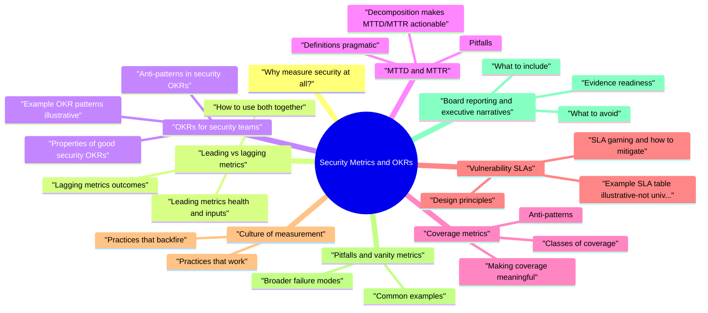

# Security Metrics and OKRs revision map

I keep this Security Metrics and OKRs map for the night before a screen, when five markdown files is too many clicks. Built from Critical Clarification Security Metrics and OKRs Misconceptions.md, Security Metrics and OKRs - Comprehensive Guide.md, Security Metrics and OKRs - Interview Questions & Answers.md, Security Metrics and OKRs - Quick Reference.md. Twenty minutes. Then I close the laptop.

## Why measure security at all?
- Without measurement, security debates devolve into opinion, anecdote, and busywork. Good metrics:
- Align finite capacity to material risk (customer data, availability, fraud).
- Expose whether controls are present, used, and effective-not merely purchased.
- Create accountability with clear owners and systems of record.
- Support audits (SOC 2, ISO 27001), customer diligence, and insurance or regulatory questions.

## Leading vs lagging metrics

### Lagging metrics (outcomes)
- Lagging metrics describe what already happened. They are essential for accountability and learning, but they change after risk materializes.
- Security incidents: count, customer impact, severity distribution, repeat classes of failure (e.g., same auth bug pattern quarter over quarter).
- Mean time to detect (MTTD) and mean time to respond/recover (MTTR) for security-relevant incidents.
- Age of critical/high vulnerabilities in production, especially on tier‑0 paths.
- Mean time to remediate (MTTM) or SLA attainment for prioritized findings.
- Fraud or abuse losses, chargebacks, or account-takeover rates where security contributes.

### Leading metrics (health and inputs)
- Leading metrics are predictive proxies: they signal whether the system is likely to produce good outcomes before incidents spike.
- Coverage: % of repos/services with SAST, dependency scanning, or container scanning in required CI paths; % of builds with SBOM or provenance checks where applicable.
- Identity posture: % of production workloads on managed/workload identity vs long-lived keys; JIT admin usage vs standing broad roles.
- Design assurance: % of tier‑0 features that received threat modeling or secure design review before launch; time from review request to actionable outcome.
- Policy and guardrails: % of orgs/environments where deny rules block public S3 buckets, open security groups, or anonymous admin APIs-with audit trails.
- Detection engineering: rule coverage for crown-jewel data paths; test events run in production-like environments; noise ratio trends for high-severity alerts.

### How to use both together
- A mature program publishes a small set of metrics (often five to eight decision-grade indicators) that include:
- At least one lagging outcome (incidents, critical ageing, SLA performance).
- At least one leading control-health metric per major risk domain (build, identity, data, detection).
- Narrative that explains trade-offs-what you did not do and why.

## OKRs for security teams
- OKRs express intent (Objective) and measurable outcomes (Key Results) on a cadence (commonly quarterly). For security, they work best when they reward risk reduction and capability building, not raw activity counts.

### Properties of good security OKRs
- Outcome-oriented: "Reduce exploitable critical issues in customer auth paths" beats "Run 50 pen tests."
- Co-owned with engineering/product where possible-security rarely ships fixes alone.
- Bounded by scope (tier‑0 services, regulated data, top revenue flows) so teams do not boil the ocean.
- Honest about baselines: if data is messy, the first OKR cycle may include "instrument and reconcile sources of truth."

### Example OKR patterns (illustrative)
- Objective: Shrink the attack surface of production identity for tier‑0 services.
- KR1: ≥95% of new tier‑0 deployments use workload identity (no new long-lived cloud keys).
- KR2: ≥90% reduction in active long-lived production keys compared to quarter start (measured via cloud inventory + IAM analytics).
- KR3: Zero Sev-1 incidents caused by credential leakage from build logs or shared service accounts (binary KR with evidence).
- KR1: ≥95% of P0 findings on tier‑0 assets remediated within SLA (defined below).
- KR2: Median age of reachable critical issues in tier‑0 drops by X% quarter over quarter.
- KR3: 100% of tier‑0 services have dependency scanning on default branch CI with fail-closed policy for known-exploited vulnerabilities (with documented exceptions).
- KR1: MTTD for simulated exfiltration tests on tier‑0 data drops from A to B hours (median).

### Anti-patterns in security OKRs
- Maximize vulnerability count or "find more bugs"-incentivizes noise, severity inflation, and adversarial relationships.
- 100% scan adoption without triage quality, reachability, or asset tier context.
- Close N tickets-drives superficial fixes, won't fix gaming, or documentation theater.
- OKRs that conflict with reliability/SLOs-for example pushing destabilizing emergency patches without rollback plans.
- Pure activity metrics ("deliver 20 training modules") mistaken for risk reduction.

## MTTD and MTTR

### Definitions (pragmatic)
- Terms vary by organization. Define them in your incident policy and measure consistently.
- MTTD (mean time to detect): elapsed time from attack start or control failure to first meaningful detection (alert, report, or automated signal) plus acknowledgment that it is security-relevant.
- MTTR often splits into:
- Mean time to respond: from detection/declare to containment (attack stopped, credential rotated, rule deployed).
- Mean time to recover: to restore normal service and customer impact ended.
- Some teams use MTTR as an umbrella-spell out which "R" you mean.

### Decomposition makes MTTD/MTTR actionable
- Break pipelines into stages with timestamps in a single timeline source:
- T0: earliest evidence (log timestamp, first malicious action).
- T1: alert fired or hunt hypothesis formed.
- T2: alert triaged to security/on-call.
- T3: incident declared and roles assigned.
- T4: containment complete.
- T5: eradication and recovery complete; post-incident review scheduled.

### Pitfalls
- Declaring victory on MTTR while root causes recur-optimize the learning loop, not just closure time.
- Excluding weekends or "non-business hours" without saying so-undermines trust.
- Cherry-picking incidents-report all sev levels or define a consistent scope.
- Confusing operational outages with security incidents; track both, merge only with care.

## Coverage metrics
- Coverage answers: "Is the control present where it matters?" Good coverage metrics are scoped, verifiable, and tied to asset tier.

### Classes of coverage
- Build and release: static analysis, dependency scanning, secret scanning, IaC policy checks, signed artifacts, deployment policies.
- Runtime and network: WAF where appropriate, mTLS/service mesh, egress controls.
- Data: encryption, KMS usage, logging of sensitive access, DLP where justified.
- Identity: SSO, MFA enforcement, privileged access workflows, session policies.
- Application security process: threat modeling, secure code review, bug bounty or pentest touchpoints per tier.

### Making coverage meaningful
- Measure enforcement, not registration: e.g., "required GitHub checks pass on protected branches" vs "tool installed."
- Weight by tier: 100% coverage on tier‑3 experiments matters less than gaps on tier‑0.
- Include quality hooks: percentage of findings triaged within N days; false positive rate trends for static analysis; time-to-onboard new services without security becoming a bottleneck.

### Anti-patterns
- Repo count without mapping to production services.
- Scans that run only weekly on schedules-missing the PR window where fixes are cheapest.
- Exemptions that silently expire or lack owners-coverage looks complete while critical paths bypass controls.

## Vulnerability SLAs
- SLAs translate risk appetite into time boxes for remediation. They should be transparent, tier-aware, and enforceable.

### Design principles
- Severity informed by exploitability, exposure, asset tier, sensitivity, and compensating controls-not CVSS alone.
- Clock start: from confirmed risk (validated finding or vendor advisory affecting your stack), with explicit rules for disputed items.
- Exceptions: time-bound, risk-accepted by a named role, with compensating controls and review dates.
- Escalation: when SLAs breach, who is notified-service owner, VP Eng, customer success for regulated accounts.

### Example SLA table (illustrative-not universal)
- Tune to industry, contractual commitments, and team capacity. Publish how you measure done (deployed to prod, not merely "merged").

### SLA gaming and how to mitigate
- Severity inflation/deflation to hit numbers-use calibrated rubrics, peer review, and spot audits.
- Ticket splitting or duplicate tracking-enforce one system of record per finding.
- Won't fix without risk acceptance-treat unmanaged waivers as debt with interest.
- Closing when vulnerable code still runs in some region or cell-tie closure to inventory truth.

## Culture of measurement
- Metrics stick when they reinforce psychological safety, learning, and shared fate-not blame.

### Practices that work
- Publish definitions and data sources alongside numbers ("here is the query/repo/job").
- Review trends in joint forums (Eng + Security + SRE), not only in security staff meetings.
- Celebrate fixes and control rollouts, not just finding bugs.
- Use RCAs to update metrics and OKRs-if the same class repeats, the program failed, not only the service team.
- Invest in data quality as a first-class OKR when needed; bad data erodes trust faster than no data.

### Practices that backfire
- Leaderboards of "most vulnerabilities" by team-creates fear and underreporting.
- Unilateral SLAs imposed without capacity planning-drives checkbox compliance.
- Surprise escalations to executives for normal engineering trade-offs-burns goodwill.

## Pitfalls and vanity metrics
- Vanity metrics look impressive but do not change decisions or risk.

### Common examples
- Training completion rate as a proxy for secure behavior-use outcomes (e.g., reduction in specific defect classes) or high-signal drills.
- Number of tools purchased or integrated-map to coverage and effectiveness.
- Closed Jira tickets without severity, reachability, or deployment verification.
- "Zero breaches" as a boast-may reflect luck or bad detection; pair with leading health and test results.
- Percentage of apps "scanned" where scans are shallow, excluded vendor code, or non-blocking.

### Broader failure modes
- Spreadsheet metrics that cannot be reproduced at audit time.
- Too many KPIs-no one owns them; everyone argues about definitions.
- Static targets that ignore growth (new services, M&A, regions).
- Misaligned incentives between security and product velocity-solve with shared OKRs where possible.

## Board reporting and executive narratives
- Boards and senior leadership need assurance, materiality, and trajectory-not raw tool output.

### What to include
- Risk posture in plain language: what are the top three cyber risks this quarter, and what changed?
- Outcomes: incidents (if any) at high level, customer impact, regulatory notifications (as appropriate), SLA performance on critical issues.
- Program health: leading indicators-identity posture, coverage on tier‑0, detection drills, third-party risk milestones.
- Initiatives: major migrations (SSO, secrets platform, zero trust), on track / at risk.
- Asks: headcount, capital, priority trade-offs ("we deferred X to ship Y-leftover risk is ...").
- Honesty: known gaps, exceptions, and timeline to close-boards punish surprises, not nuance.

### What to avoid
- Jargon without translation (IDOR, CWE-79) unless the audience is technical.
- Dense vulnerability counts without context.
- Implied guarantees ("we are secure")-use leftover risk framing.

### Evidence readiness
- Maintain an audit trail: queries, dashboards, ticket links, and change records that reconstruct metrics. This supports SOC 2, customer questionnaires, and internal governance.

## How to build the program (practical sequence)
- Inventory systems of record: ticketing, CMDB/service catalog, CI, cloud IAM, SIEM, vulnerability scanners.
- Define asset tiers and risk rubric alignment-metrics must reference the same language as prioritization.
- Pick five to eight decision-grade metrics with named owners and weekly or monthly refresh cadence.
- Automate extraction; minimize manual slides-humans should interpret, not copy/paste.
- Pilot OKRs with one engineering org; refine definitions; then scale.
- Quarterly narrative: trend + top risks + trade-offs + next quarter bets.
- Review for gaming and perverse incentives each quarter; adjust KRs as needed.

## Verification and quality checks
- Reproducibility: Can a second person derive the same numbers from documented sources?
- Spot checks: Sample incidents and vulnerabilities against dashboards-do timelines match?
- Peer review: Product and SRE challenge OKRs for feasibility and alignment with customer promises.
- Drills: Tabletops and purple team exercises validate that MTTD/MTTR improvements are real.

## Operational reality
- Seasonality: launch freezes, holidays, and on-call load distort quarterly metrics-normalize in narrative.
- Politics: metrics surface uncomfortable truths-secure executive sponsorship.
- Cost of reporting: target low-friction automation; expensive manual reporting rots quickly.
- M&A and reorganizations: rebaseline metrics when service ownership or environments change.

## Interview clusters
- Fundamentals: Give examples of leading vs lagging metrics; why both?
- Mid-level: How would you define MTTD/MTTR and improve them?
- Senior: Design OKRs for product security in a B2B SaaS with messy data.
- Staff+: How do you detect and prevent SLA gaming and severity inflation at scale?

## Cross-links

## Traps that dump interviews

## "More findings means better security"
- Truth: High signal findings can rise when detection improves-it's not automatically bad. Judge exploitability, exposure, and trend of material risk-not raw counts.

## "OKRs should be 100% secure"
- Truth: OKRs should be measurable and achievable with trade-offs acknowledged-leftover risk is normal; document it.

## "MTTR alone measures response quality"
- Truth: MTTR without severity and customer impact context can hide sloppy triage-or punish teams for transparent reporting.

## Prompts I drill out loud

- What is the difference between leading and lagging security metrics? Give examples.
- What security metrics would you show to an executive or a VP of Engineering?
- How do you design OKRs for a security team without creating perverse incentives?
- How would you define MTTD and MTTR for security incidents, and how would you improve them?
- What are common pitfalls when using MTTD/MTTR as headline metrics?
- How do you measure "coverage" for application and infrastructure security in a useful way?
- How do vulnerability SLAs relate to metrics, and how do you operationalize them?
- What is "SLA gaming," and how would you detect and prevent it?
- How do security metrics relate to risk prioritization for individual findings?
- What are vanity metrics in security, and why are they dangerous?
- How would you build a culture of measurement that does not feel like blame or surveillance?
- What would you put in a board-level cyber update?
- How many metrics should a security program track, and who owns them?
- How do you align security OKRs with product velocity and business launches?
- What is the difference between KPIs and OKRs in security programs?
- How do you report security metrics during seasonal distortions (holidays, launch freezes, on-call load)?
- How would you verify that your security metrics are accurate and audit-ready?
- Depth: Interview follow-ups - Security Metrics and OKRs

### How do you measure "coverage" for application and infrastructure security in a useful way?
- See the source section `How do you measure "coverage" for application and infrastructure security in a useful way?` for the worked example.

### What is "SLA gaming," and how would you detect and prevent it?
- See the source section `What is "SLA gaming," and how would you detect and prevent it?` for the worked example.

## Depth: Interview follow-ups - Security Metrics and OKRs
- Good vs bad OKRs: reducing repeat incident classes versus maximizing raw bug count.
- Executive narrative: three metrics for a VP-why each matters and what action follows.
- Incentives: when low MTTR masks weak root cause remediation or encourages risky changes.
- Board asks: how you explain leftover risk without sounding evasive.

## Sibling folders

- Stay inside this folder for the long guide. Jump only when a section names a sibling topic.
- Cookie Security, CSRF, XSS, JWT, OAuth, and TLS show up as neighbors on a lot of these maps.
