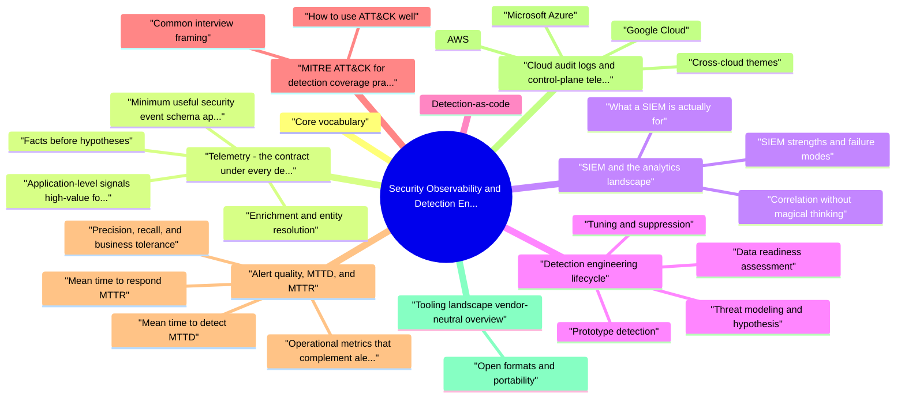

# Security Observability and Detection Engineering revision map

When a Security Observability and Detection Engineering follow-up lands, I want one page that still has the misconception and the VAPT step. I pulled headings from Critical Clarification Security Observability and Detection Engineering Misconceptions.md, Security Observability and Detection Engineering - Comprehensive Guide.md, Security Observability and Detection Engineering - Interview Questions & Answers.md, Security Observability and Detection Engineering - Quick Reference.md. If a heading is here, the guide still owns the detail.

## Core vocabulary

## Telemetry: the contract under every detection

### Facts before hypotheses
- Detections are only as good as the data contract they rely on. Interview answers should separate:
- What happened (action, outcome, resource touched).
- Who did it (human account, service principal, workload identity).
- From where (IP, device, geolocation hints-not perfect, but useful).
- In what context (tenant, environment, session, trace identifiers for correlation).

### Minimum useful security event schema (application layer)
- Product and platform teams should converge on a canonical audit event shape for security-sensitive operations. A practical baseline:
- Identity: actor_id, actor_type (user, service, system), auth_method, session_id or device_binding_id where applicable.
- Authorization: decision (allow/deny), policy_id or role_snapshot, resource_type, resource_id, scope (tenant, project, org).
- Request: http_method, route or RPC name, client_ip, user_agent, api_version.
- Outcome: status_code, error_code, reason (stable machine-readable codes, not free-text stack traces in the primary field).
- Risk and abuse: optional risk_score, challenge_outcome, rate_limit_bucket when your platform emits them.
- Correlation: request_id, trace_id, span_id, deployment_id, region.

### Enrichment and entity resolution
- Raw events rarely stand alone. Production detection pipelines enrich with:
- Asset and service inventory (owner, tier, internet exposure).
- Identity lifecycle state (terminated employee, newly created admin).
- Geo-ASN and threat intelligence (use carefully; false positives abound).
- Business context (customer tier, fraud risk segment).

### Application-level signals high-value for product security
- Beyond infrastructure logs, prioritize instrumenting:
- Authentication anomalies: impossible travel signals, new device, refresh-token abuse, credential stuffing patterns (velocity, failure clustering).
- Authorization probing: bursts of 403/404 on object APIs, cross-tenant access attempts, role or permission enumeration.
- Privileged and break-glass usage: admin consoles, policy editors, key management operations, support impersonation.
- Data exfiltration patterns: bulk export, unusual query shapes, large result pagination, snapshot and backup APIs.
- Integration abuse: OAuth consent changes, webhook registration spikes, API key creation from new geographies.

## SIEM and the analytics landscape

### What a SIEM is actually for
- A Security Information and Event Management system historically combined log aggregation, search, correlation rules, case management, and workflow. In modern architectures, those functions often split:
- Central log store (often cloud-native: OpenSearch, BigQuery, Snowflake, Data Explorer).
- Stream processing (Flink, Spark Streaming, cloud-native stream analytics).
- Detection content expressed as scheduled queries, streaming rules, or detection-as-code deployed into the platform.
- SOAR or ticketing for orchestration.

### SIEM strengths and failure modes
- Single pane for analyst investigation with timelines and entity views.
- Mature content ecosystems (useful for commodity malware and Windows-centric enterprises).
- Retention and legal hold features aligned with investigations.
- Schema soup from uncontrolled log formats-joins and aggregations become unreliable.
- Cost explosion when everything is indexed hot forever.
- Rule sprawl without owners-thousands of brittle correlations nobody trusts.
- Cloud blind spots if you only ingest traditional OS and network logs without cloud control plane and application telemetry.

### Correlation without magical thinking
- See the source section `Correlation without magical thinking` for the worked example.

## Detection engineering lifecycle
- Treat each detection as a mini product with a lifecycle:

### Threat modeling and hypothesis
- Start from abuse cases and attack paths, not from available log fields. Example hypothesis: "Attackers enumerate tenant resources via sequential IDs after stealing a low-privilege session token."

### Data readiness assessment
- See the source section `Data readiness assessment` for the worked example.

### Prototype detection
- Author a query or rule with documented assumptions: population baseline, seasonality, expected benign sources (scanners, health checks).

### Tuning and suppression
- See the source section `Tuning and suppression` for the worked example.

### Response design
- Every high-severity detection needs a playbook: validate, contain, escalate, communicate. If the only step is "page someone," the detection is not finished.

### Release and change control
- Use the same rigor as code: peer review, versioning, rollback, and staged rollout (shadow mode, canary tenants).

### Measurement and review
- See the source section `Measurement and review` for the worked example.

### Purple team and continuous validation
- See the source section `Purple team and continuous validation` for the worked example.

## Detection-as-code
- Detection-as-code applies software engineering practices to detection content:
- Version control (Git) as source of truth; no editing rules only in a UI without export.
- Pull requests with reviewers who understand both threat and data.
- Continuous integration jobs that compile content (where supported), validate syntax, run unit tests against fixture logs, and diff against production.
- Promotion pipelines: dev -> staging -> production with approval gates.
- Metadata: owner, severity, MITRE mapping, data dependencies, runbook link, SLA for tuning.

## MITRE ATT&CK for detection coverage (practical use)
- MITRE ATT&CK is a knowledge base of adversary tactics and techniques. Use it as a structured checklist against your threat model, not as a scorecard to maximize technique count.

### How to use ATT&CK well
- Map telemetry sources to techniques they can support (e.g., CloudTrail for T1078 valid accounts misuse at the control plane; EDR for T1059 execution on endpoints).
- Identify gaps honestly: techniques with no plausible data source need instrumentation investment or compensating controls.
- Distinguish detection from hunting: ATT&CK also guides proactive queries that do not page anyone.
- Align red team scenarios to specific technique chains your product faces (SaaS account takeover vs. Kubernetes cluster compromise differ).

### Common interview framing
- See the source section `Common interview framing` for the worked example.

## Alert quality, MTTD, and MTTR

### Precision, recall, and business tolerance
- Precision (true positives ÷ all alerts) drives analyst trust. Low precision burns capacity and trains people to ignore queues.
- Recall (true positives ÷ all real incidents) captures missed attacks. Perfect recall is unrealistic; executives need explicit risk acceptance for blind spots.
- Tier 0: potential business-critical compromise-tight tuning, 24/7 response, higher cost of false negatives.
- Tier 1: significant risk-business-hours or follow-the-sun with defined SLAs.
- Tier 2: hunting and hygiene-may feed dashboards, not pages.

### Mean time to detect (MTTD)
- Improve MTTD with lower ingestion latency, high-signal chokepoint logging (IdP, SSO, admin APIs), correlation across layers, and behavioral baselines where statistically sound.

### Mean time to respond (MTTR)
- See the source section `Mean time to respond (MTTR)` for the worked example.

### Operational metrics that complement alert rates
- Alerts per analyst hour and queue age (fatigue proxies).
- Time in backlog for severity 1-2.
- Percentage of alerts with linked playbook execution.
- Repeat false positive rate after tuning (signals stale logic or drifting data).
- Coverage notes for top-tier scenarios with "no automated detection-manual hunt only."

## Cloud audit logs and control-plane telemetry
- Cloud environments generate rich management event streams. These are foundational for misconfiguration, persistence, and credential abuse in the control plane.

### AWS
- CloudTrail records API activity across accounts. Organization trails with multi-region aggregation are standard. Important nuances:
- Management vs. data events (S3 object-level logging is optional and costly-select buckets deliberately).
- Integrity: log file validation, immutable storage (S3 Object Lock), separate security account ingestion.
- Integrate CloudTrail with GuardDuty and Security Hub where used for managed detections.

### Google Cloud
- See the source section `Google Cloud` for the worked example.

### Microsoft Azure
- See the source section `Microsoft Azure` for the worked example.

### Cross-cloud themes
- Assume breach of admin roles-monitor role assignment, federation trust, and key lifecycle events aggressively.
- Data exfiltration often involves storage APIs-tune data access logging where risk warrants cost.
- Cross-account and peering changes are high-signal graph edges for lateral movement.

## Tooling landscape (vendor-neutral overview)
- No single tool wins every environment. Typical categories:
- Choose tooling based on data gravity (where logs already live), skill sets, latency requirements, and regulatory constraints-not magazine quadrants.

### Open formats and portability
- See the source section `Open formats and portability` for the worked example.

## Data pipelines: ingestion, latency, and trust

### Pipeline stages
- Typical flow: agent or API -> buffer (Kafka, Kinesis, Event Hub) -> parse and normalize -> enrich -> index or warehouse -> detection engine (scheduled or streaming) -> alerting and ticketing.
- Each stage introduces delay. Near-real-time detections need streaming or short poll intervals; forensic questions may tolerate batch loads into a lake with hourly freshness.

### Schema registry and contracts
- Treat log schemas like API contracts: versioned documents, compatibility rules, and breaking change processes. Security champions in platform teams should review changes that drop security fields or rename join keys.

### Integrity and tampering resistance
- See the source section `Integrity and tampering resistance` for the worked example.

## SOC collaboration and operating model
- Detection engineering sits between product/platform engineering and security operations. Clear interfaces help:
- Service-level objectives for log delivery and search uptime.
- Tier definitions aligned to paging policy and response hours.
- Handoff artifacts: every alert template includes entity links, recommended queries, and containment options vetted with responders.
- Feedback loop: analysts tag false positive reasons in structured fields so engineers can tune with data.

## Anti-patterns (name them in interviews)
- "Log everything." Without schema and retention strategy, you get expensive darkness.
- Undocumented allowlists that silently expire security value.
- Pager as dump for informational detections.
- SIEM-only strategy for pure SaaS abuse that manifests in application logs.
- ATT&CK bingo-mapping hundreds of low-value rules to look mature.
- No owner for detections; rot when the author leaves.

## Verification and governance
- Tabletop each tier-0 detection annually-validate data, runbook, and comms.
- Sampling reviews of closed alerts to estimate precision and find logic bugs.
- Detection unit tests with representative logs for regressions.
- SLOs for log pipeline lag and search availability-silent pipelines are silent failures.

## Interview clusters
- Fundamentals: schema fields, difference between telemetry and detection, basic MTTD definition.
- Senior: tuning strategies, cloud audit log design, multi-tenant app instrumentation.
- Staff: platform architecture for detection-as-code, cross-layer correlation, metrics programs that influence engineering roadmaps.

## Cross-links

## Recall list from Quick Reference

## Pipeline mental model
- Generate telemetry -> normalize (ECS/OTel) -> retain by tier -> detect (rules/ML) -> respond (SOAR/runbooks) -> learn (postmortems -> new content)

## Event fields that pay rent (examples)
- actor.user.id · src.ip / http.request_id · process.executable · cloud.region · auth.mfa bool · normalized outcome (allow/deny)

## Detection priorities (order of thinking)
- Crown-jewel paths (admin, money, data export, secret read)
- Identity abuse (impossible travel, new device, OAuth consent spam)
- Host persistence and lateral movement primitives
- App-layer abuse (rate spikes, coupon abuse signals)

## Metrics to quote in interviews
- MTTD / MTTR · true positive rate · rule coverage vs ATT&CK techniques (honest gaps) · backlog age for tuning tickets

## Tooling buckets (examples)
- SIEM (Splunk, Chronicle, Sentinel) · EDR telemetry · NDR · cloud audit (CloudTrail/AAD/GCP audit logs) · detection-as-code (Sigma, KQL, SPL)

## Quality bar for a new rule
- Test with red atomics / replay · estimate FP rate · owner · version · deprecation date if seasonal

## Cross-read
- Risk Prioritization and Security Metrics · Windows Security Boundaries (for host signals) · IAM and Least Privilege at Scale

## One-liner

## Corrections I keep repeating

## "More logs means better security."
- Reality: Unstructured volume drowns analysts; taxonomy, retention tiers, and parsing quality determine value.

## "SIEM go-live equals detection maturity."
- Reality: Maturity is measured by coverage of attack paths, tuning cycles, and purple validation-not ingestion TB/day.

## "Low false positives prove good detections."
- Reality: Precision without recall misses real attacks-track blind spots and adversary simulation gaps.

## "We can buy detections out of the box."
- Reality: Vendor rules need environment baselines, allow-lists, and correlation with identity context-tuning is mandatory.

## "Detection engineering is just writing Sigma rules."
- Reality: Data model design, on-call runbooks, metrics, false negative postmortems, and stakeholder communication are core work.

## "EDR alerts replace network visibility."
- Reality: Host and network telemetry are complementary; each blinds to some behaviors (e.g., cross-VPC east-west).

## "We should detect everything MITRE lists."
- Reality: Prioritize techniques relevant to your threat model and data assets-breadth without depth burns teams.

## "Retention forever helps investigations."
- Reality: Cost, privacy, and legal hold processes require tiered retention-not infinite storage.

## "If SOC didn't alert, the activity didn't happen."
- Reality: Absence of alerts often means evasion, misconfig, or wrong hypothesis-assume sensor gaps.

## "Automation will eliminate analysts."
- Reality: Automation handles volume; judgment, novel attacks, and cross-domain correlation stay human-in-the loop for years.

## What I answer in 90 seconds

- How do you distinguish security observability from "ordinary" observability?
- What is the difference between telemetry and a detection?
- Walk through your end-to-end detection engineering lifecycle.
- What role does a SIEM play in a modern cloud-native architecture?
- Explain detection-as-code and why it matters.
- How do you use MITRE ATT&CK without turning it into a checkbox exercise?
- How do you measure alert quality, and what targets do you use?
- Define MTTD and MTTR in a way leadership can trust.
- What cloud audit logs do you prioritize, and what attacks do they catch?
- What application-level signals are highest value for detecting abuse in a multi-tenant SaaS product?
- How do you reduce alert fatigue without silently increasing false negatives?
- What fields belong in a canonical security audit event for microservices?
- How do you validate that detections still work after a platform refactor?
- What correlation keys do you standardize across layers, and why?
- When would you choose a data lake or warehouse over traditional SIEM storage?
- How do EDR and SIEM detections complement each other?
- Describe the tooling landscape at a high level and how you would select components.
- What metrics would you present to engineering leadership to justify observability investment?
- Depth: Interview follow-ups - Observability & Detection

## How do you distinguish security observability from "ordinary" observability?

## Depth: Interview follow-ups - Observability & Detection
- Signal quality vs. noise - how you tune without hiding true attacks; role of analyst feedback tags in structured fields.
- Detection-as-code maturity - CI tests, promotion gates, and rollback stories when a rule misfires in production.
- Coverage and purple teaming - mapping exercises to ATT&CK techniques your product actually faces.
- Privacy and compliance - minimizing PII in security logs while preserving investigative utility; regional retention constraints.

## Nearby reading in this repo

- Stay inside this folder for the long guide. Jump only when a section names a sibling topic.
- Cookie Security, CSRF, XSS, JWT, OAuth, and TLS show up as neighbors on a lot of these maps.
