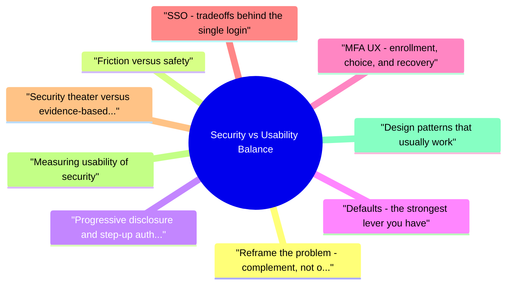

# Security vs Usability Balance revision map

This is the Security vs Usability Balance spine I actually use. Types, failures, fixes, traps. Sources: Critical Clarification Security vs Usability Balan.md, Security vs Usability Balance - Comprehensive Guide.md, Security vs Usability Balance - Interview Questions & Answers.md, Security vs Usability Balance - Quick Reference.md. I do not treat it as a second textbook.

## Reframe the problem: complement, not opposition

## Friction versus safety
- Friction is any extra step, wait, or cognitive load between intent and outcome. Safety is the reduction in abuse likelihood and impact for a given threat model.
- High-value friction ties directly to assurance: step-up before wire transfer, re-auth before adding a new payout destination, explicit consent before broad OAuth scopes.

## Progressive disclosure and step-up authentication
- Progressive disclosure in security UX means showing complexity only when the situation warrants it: a calm default path for routine work, with additional layers for higher sensitivity.
- Define tiers of actions (read, write, privilege, financial, account recovery) and map each to required assurance.
- Keep consistent language ("We need to verify it's you because..."); avoid generic "Session expired" when you mean "Sensitive action."
- Avoid surprise step-ups: if an action always needs MFA, say so before the user invests time in a multi-screen flow.
- Pair step-up with timeouts and cancellation so users are not trapped in half-finished flows.

## Defaults: the strongest lever you have
- Opt-out sensitive protections for high-risk cohorts only when you have measurement and a migration plan.
- Grace periods and in-product reminders beat sudden hard cutoffs for consumer products, provided fraud budgets justify the delay.
- Dangerous defaults (open sharing links, "remember me" on shared devices, permissive API keys) are debt: they are cheap in demos and expensive in incidents.

## MFA UX: enrollment, choice, and recovery
- Multi-factor authentication is where security and usability collide most visibly.
- Show time-to-complete expectations and what happens if the device is lost.
- Support backup codes or account recovery that is resistant to support social engineering (not "mother's maiden name").
- Prefer phishing-resistant factors where feasible; they often reduce long-term support load compared to OTP fatigue.
- Push notification MFA can be fast but trains "tap yes" habits-mitigate with number matching or context display.
- Rate-limit and lockout carefully: aggressive lockout helps attackers deny service to victims.

## SSO: tradeoffs behind the single login
- Single sign-on improves usability (one strong credential, centralized policy) and can improve security (MFA at the IdP, easier offboarding). Tradeoffs to surface in design and interviews:
- Blast radius: Compromise of the IdP or a broadly scoped SSO token may affect many applications. Relying parties should still enforce authorization and least privilege, not trust SSO alone.
- Availability: IdP outage becomes an outage for all dependent apps. Architecture and comms plans matter.
- Lock-in and standards: SAML, OIDC, and SCIM choices affect portability and automation quality.
- Session models: SSO does not remove the need for application session hygiene-timeouts, step-up inside apps, and clear logout semantics (often "logout of this app" versus "logout of org").
- B2C versus workforce: Customer SSO (social login) introduces different fraud and privacy considerations than corporate IdPs.

## Security theater versus evidence-based controls
- Align with modern guidance (e.g., length over complexity, MFA over rotation theater) where it matches your threat model.
- Prefer outcomes over posture: reduced ATO rate, fewer credential stuffing successes, lower support-driven takeovers.
- Explain controls in user copy only when explanation improves compliance; otherwise keep heavy lifting server-side.

## Measuring usability of security
- Treat security UX as a product surface: instrument it.
- Funnel metrics: enrollment completion, MFA success rate, recovery success, abandonment at each step.
- Time-to-task for protected actions versus baselines.
- Support volume tagged to security (lockouts, MFA resets, "can't log in").
- Security outcomes: ATO rate, credential stuffing block rate, policy violations.
- Usability studies on error states (wrong OTP, expired link, new device).
- Content testing of warnings and recovery copy.
- A/B or phased rollouts with guardrail metrics (fraud, chargebacks, abuse) so you do not optimize login ease alone.

## Design patterns that usually work
- Anti-patterns: Mystery errors, unbounded lockouts, unrecoverable accounts, security settings buried five screens deep, conflicting rules between mobile and web, and policies that incentivize workarounds.

## 9a. Accessibility, language, and equity
- Literacy and language: Short sentences, avoid internal jargon ("SAML," "OIDC") in user-facing errors unless the audience is admins. Localize strings; security tone varies by culture.
- Economic and device constraints: Not everyone has a second device for TOTP. SMS may be the realistic floor in some markets-combine with risk limits (caps, alerts) rather than pretending a premium factor exists for all.

## Operating model: who decides the balance
- Escalation should be framed as data: threat likelihood, impact, cost of friction, and adoption metrics-not ideology.

## 10a. Passwords, secrets, and the path to passkeys
- For API and developer flows, personal access tokens with scopes, rotation reminders, and clear revocation UI beat "one immortal API key in .env." Usability for developers means copy once, label clearly, and audit usage.

## The one-pager, exploded

## Key Principles

## Adaptive Authentication

## Security-Usability Trade-offs

## Friction Reduction Techniques
- Single Sign-On (SSO)
- Password managers
- Biometric authentication
- "Remember this device"
- Progressive disclosure
- Security education

## Best Practices

## Common Solutions

## Key Takeaways
- Security and usability can be complementary
- Risk-based approach reduces friction
- Technology can make security easier
- User education improves adoption
- Measure and iterate on security UX

## What people get wrong

## ️ Common Misconceptions

### "Security and usability are always in conflict"
- Truth: Security and usability can be complementary - good security design enhances usability.
- Single sign-on (SSO) improves security and usability
- Password managers enable strong passwords easily
- Biometric authentication is both secure and convenient
- Contextual authentication reduces friction appropriately

### "Maximum security always requires maximum friction"
- Truth: Risk-based approaches can reduce friction while maintaining appropriate security.
- Low-risk actions: Minimal friction (remember device, trusted location)
- Medium-risk actions: Moderate friction (MFA for new device)
- High-risk actions: Higher friction (re-authentication for sensitive operations)

### "Users will always choose convenience over security"
- Truth: Users will choose convenience if security is too burdensome - make security easy and transparent.
- Transparent security (happens in background)
- Clear security messaging (explain why)
- Easy security options (biometrics, password managers)
- Progressive security (increase as risk increases)

### "Security features that reduce usability should be removed"
- Truth: Some security friction is necessary - focus on minimizing unnecessary friction while maintaining security.
- Remove unnecessary friction
- Make necessary friction as smooth as possible
- Explain why friction exists
- Provide alternatives (MFA options: SMS, app, hardware key)

### "One security model fits all users and use cases"
- Truth: Security should be contextual and adaptive based on user, device, location, and action.
- User risk profile
- Device trust status
- Network location (trusted vs. untrusted)
- Action sensitivity (view profile vs. transfer funds)
- Time since last authentication

## Key Takeaways
- Not Always in Conflict: Good security design can enhance usability
- Risk-Based: Match security to risk level, reduce friction appropriately
- Make Security Usable: Design security to be easy and transparent
- Minimize Friction: Remove unnecessary friction, optimize necessary friction
- Contextual Security: Adaptive security based on context provides better balance

## Questions that showed up in mocks

- Is "security vs usability" a real tradeoff or a lazy framing?
- How do you decide when extra friction is justified?
- What is "security UX," and who owns it?
- Explain progressive disclosure in a security context.
- Why are secure defaults more powerful than security settings pages?
- MFA, passwords, and authentication UX
- How would you roll out MFA without tanking conversion or enterprise adoption?
- What MFA usability mistakes create security incidents?
- How do you argue against mandatory password rotation every 90 days?
- SSO, federation, and session models
- What are the main usability and security tradeoffs of SSO?
- SSO is enabled-why do you still care about application sessions?
- Security theater, trust, and communication
- What is security theater, and why is it harmful?
- How do you explain a painful security requirement to users without sounding dismissive?
- Measurement and iteration
- What metrics show you balanced security and usability well?
- How would you run an experiment on a login or MFA flow safely?
- Accessibility, equity, and edge cases
- How do security features fail users with accessibility or device constraints?
- Collaboration and influence
- Tell me about a time security hurt adoption. What did you do?
- How do you resolve a disagreement between security ("block it") and product ("ship it")?
- Design patterns and architecture

## Fundamentals

### Is "security vs usability" a real tradeoff or a lazy framing?
- See the source section `Is "security vs usability" a real tradeoff or a lazy framing?` for the worked example.

### What is "security UX," and who owns it?
- See the source section `What is "security UX," and who owns it?` for the worked example.

### SSO is enabled-why do you still care about application sessions?
- See the source section `SSO is enabled-why do you still care about application sessions?` for the worked example.

### How do you resolve a disagreement between security ("block it") and product ("ship it")?
- See the source section `How do you resolve a disagreement between security ("block it") and product ("ship it")?` for the worked example.

### Name design patterns that usually improve both security and usability.
- See the source section `Name design patterns that usually improve both security and usability.` for the worked example.

### How should "remember this device" be designed so it helps rather than hurts?
- See the source section `How should "remember this device" be designed so it helps rather than hurts?` for the worked example.

### When is CAPTCHA or a hard bot challenge the wrong UX choice?
- See the source section `When is CAPTCHA or a hard bot challenge the wrong UX choice?` for the worked example.

## Depth: Interview follow-ups
- Authoritative references: NIST usable security resources (NIST NICE Framework); MFA guidance (CISA MFA).
- Likely follow-ups: step-up vs static MFA; recovery vs lockout; passkeys / WebAuthn deployment; OAuth consent UX; session fixation and logout; shadow IT when official tools are too painful.

## If I only open two more topics

- Stay inside this folder for the long guide. Jump only when a section names a sibling topic.
- Cookie Security, CSRF, XSS, JWT, OAuth, and TLS show up as neighbors on a lot of these maps.
