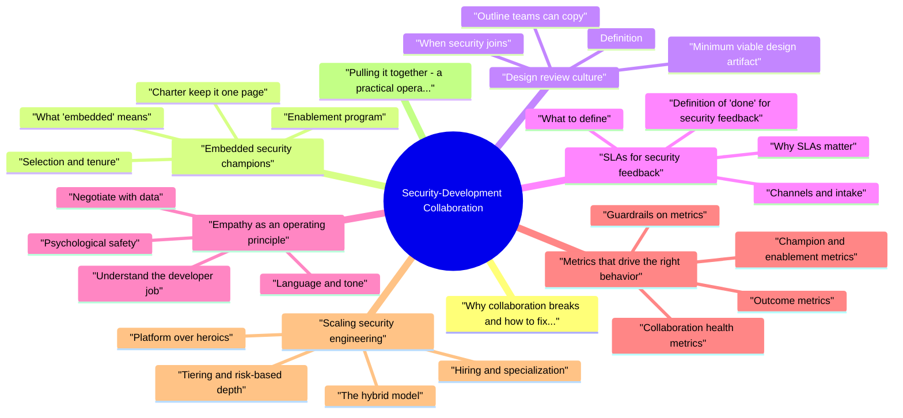

# Security-Development Collaboration revision map

Last mock I bounced around the Security-Development Collaboration folder. This file is the stop that. Drawn from Critical Clarification Security-Development Collab.md, Security-Development Collaboration - Comprehensive.md, Security-Development Collaboration - Interview Que.md. Skim the mermaid, then the outline.

## Why collaboration breaks (and how to fix the pattern)

## Embedded security champions

### What "embedded" means
- See the source section `What "embedded" means` for the worked example.

### Selection and tenure
- See the source section `Selection and tenure` for the worked example.

### Charter (keep it one page)
- See the source section `Charter (keep it one page)` for the worked example.

### Enablement program
- See the source section `Enablement program` for the worked example.

### Governance
- See the source section `Governance` for the worked example.

### Anti-patterns
- See the source section `Anti-patterns` for the worked example.

### Cadence that keeps champions effective
- Give champions a standing agenda item in their team's technical planning forum: "Security-relevant work this sprint" (integrations, auth tweaks, data exports). Five minutes of foresight prevents days of rework.

### RACI snapshot (clarify who decides)
- R = responsible for doing the work, A = accountable for the decision, C = consulted, I = informed. Adjust labels to your governance model; the point is visible decision rights.

### Security liaison versus champion
- See the source section `Security liaison versus champion` for the worked example.

## Design review culture

### Definition
- See the source section `Definition` for the worked example.

### Minimum viable design artifact
- See the source section `Minimum viable design artifact` for the worked example.

### Outline teams can copy
- A repeatable skeleton speeds writers and reviewers:
- Context - user problem, success metrics, launch constraints.
- Architecture - components, dependencies, new vs reused surfaces.
- Data - classes handled, retention, encryption at rest and in transit, who can query what.
- Trust boundaries - internet, partner APIs, internal admin, batch jobs; where credentials live.
- AuthN and AuthZ - identities, scopes, enforcement points, policy storage, admin overrides.
- Failure and abuse - rate limits, fraud hooks, circuit breakers, idempotency.
- Privacy and compliance - notices, consent, regional constraints, logging redaction.

### When security joins
- Tier A (high): new customer-facing auth, payments, regulated data, public APIs, major platform changes-security required in the review.
- Tier B (medium): internal tools with sensitive access, new dependencies with network egress, significant schema changes-security optional but strongly encouraged; champions pre-review.
- Tier C (low): localized UI or internal refactors with no new data-async checklist or self-service rubric.

### Running the meeting
- See the source section `Running the meeting` for the worked example.

### Making culture stick
- See the source section `Making culture stick` for the worked example.

### Relationship to threat modeling
- See the source section `Relationship to threat modeling` for the worked example.

### Async-first and remote-friendly reviews
- See the source section `Async-first and remote-friendly reviews` for the worked example.

### When security and engineering disagree
- Disagreement is normal; process prevents it from becoming personal. Sequence:
- Clarify the claim - restate the security concern as a testable hypothesis ("unauthenticated access is possible via X").
- Align on facts - reproduce, trace code paths, check configs together.
- Generate options - at least two mitigations with cost and latency trade-offs.
- Time-bound experiments - canary with extra logging, shadow mode, or phased rollout.
- Escalate with a crisp brief - one page: risk, options, recommendation, and who must decide if the deadline is immovable.

## SLAs for security feedback

### Why SLAs matter
- Without published response expectations, security becomes a black box. Developers plan around uncertainty; friction rises. SLAs turn collaboration into a service relationship with measurable reliability.

### What to define
- Tune numbers to your team size; under-promise and over-deliver beats the reverse.

### Channels and intake
- See the source section `Channels and intake` for the worked example.

### Definition of "done" for security feedback
- See the source section `Definition of "done" for security feedback` for the worked example.

### Exceptions and overload
- See the source section `Exceptions and overload` for the worked example.

### Internal SLAs for engineering too
- Reciprocity builds trust: define expectations for how quickly teams acknowledge security tickets, patch critical issues, and complete mandatory training. Partnership is two-way.

### Measuring and reporting SLA health
- See the source section `Measuring and reporting SLA health` for the worked example.

### SLAs for automated findings
- See the source section `SLAs for automated findings` for the worked example.

## Empathy as an operating principle

### Understand the developer job
- See the source section `Understand the developer job` for the worked example.

### Language and tone
- See the source section `Language and tone` for the worked example.

### Negotiate with data
- See the source section `Negotiate with data` for the worked example.

### Psychological safety
- See the source section `Psychological safety` for the worked example.

### Empathy without softness
- Empathy does not mean abandoning non-negotiables (e.g., storing passwords in plaintext). It means explaining the line, offering paths to compliance, and escalating clearly when the line is crossed.

## Metrics that drive the right behavior

### Outcome metrics
- Mean time to remediate (MTTR) critical security findings, by severity tier.
- Percentage of high-risk changes that received pre-implementation security input.
- Repeat finding rate per service (signals shallow fixes or architectural debt).
- Incident count attributable to preventable classes (misconfig, missing authZ, secret leak).

### Collaboration health metrics
- SLA attainment for security responses; reason codes for misses.
- Developer satisfaction or lightweight quarterly survey on security usefulness (not popularity-usefulness).
- Time from first security comment to merged fix on representative samples.

### Champion and enablement metrics
- Training completion and advanced module uptake.
- Escalation quality: percentage of champion escalations that were validated high-risk (calibrates judgment).
- Self-service success: deflection rate via docs and templates.

### Guardrails on metrics
- See the source section `Guardrails on metrics` for the worked example.

### Sample dashboard slices
- For a monthly security-engineering steering meeting, bring:
- Coverage: percent of Tier A/B launches with recorded design review or formal waiver.
- Flow: WIP age distribution for security consultations (stuck items are a collaboration bug).
- Quality: percent of production incidents tagged "preventable by earlier review" or "missing control."
- Friction: top three reasons from dev survey free text, grouped thematically.
- Enablement: new golden-path adoptions (auth library, secret backend, policy template).

### OKRs that align rather than punish
- See the source section `OKRs that align rather than punish` for the worked example.

## Scaling security engineering

### The hybrid model
- See the source section `The hybrid model` for the worked example.

### Platform over heroics
- See the source section `Platform over heroics` for the worked example.

### Tiering and risk-based depth
- Not every service deserves the same scrutiny. Use business criticality, data classification, and exposure to allocate deep reviews. Automate baseline controls everywhere; spend human time on high variance decisions.

### Hiring and specialization
- See the source section `Hiring and specialization` for the worked example.

### Knowledge systems
- Maintain living playbooks, annotated past reviews (sanitized), and searchable FAQs. Onboarding for new engineers should include how to work with security, not only compliance slides.

### Executive alignment
- Security scales when VPEng and CISO share language on risk appetite, resourcing, and what ships blocked vs accepted with risk. Without that, every team negotiates ad hoc.

### Automation as collaboration infrastructure
- See the source section `Automation as collaboration infrastructure` for the worked example.

### Vendor and open-source pressure
- See the source section `Vendor and open-source pressure` for the worked example.

### Maturity path (what to add first)
- Stage 1 - Credibility: publish SLAs, fix noisy scanners, respond to every intake ticket with something useful.
- Stage 2 - Reach: stand up champions, require design docs for Tier A, instrument MTTR.

## Pulling it together: a practical operating picture
- Champions extend context and speed local decisions.
- Design reviews catch structural mistakes while changes are cheap.
- SLAs make security predictable and professional.
- Empathy keeps feedback actionable and relationships durable.
- Metrics show whether the system is improving, not whether security is "busy."
- Scaling combines platform, tiering, and hybrid ownership so headcount grows sublinearly with engineering size.

## Extra local write-ups

### How do you describe the relationship between security and engineering in a healthy organization?
- See the source section `How do you describe the relationship between security and engineering in a healthy organization?` for the worked example.

### What is an embedded security champion, and how is that role different from a product security engineer?
- See the source section `What is an embedded security champion, and how is that role different from a product security engineer?` for the worked example.

### How would you stand up or improve a security champions program?
- See the source section `How would you stand up or improve a security champions program?` for the worked example.

### What does a strong design review culture look like, and how do you avoid it becoming theater?
- See the source section `What does a strong design review culture look like, and how do you avoid it becoming theater?` for the worked example.

### How do you decide when security must attend a design review versus async written feedback?
- See the source section `How do you decide when security must attend a design review versus async written feedback?` for the worked example.

### Why publish SLAs for security feedback, and what do you include?
- See the source section `Why publish SLAs for security feedback, and what do you include?` for the worked example.

### A developer says your security SLA is too slow for their launch. How do you respond?
- See the source section `A developer says your security SLA is too slow for their launch. How do you respond?` for the worked example.

### How do you give security feedback that developers actually use?
- See the source section `How do you give security feedback that developers actually use?` for the worked example.

### How do you handle pushback like "security is blocking innovation"?
- See the source section `How do you handle pushback like "security is blocking innovation"?` for the worked example.

### What role does empathy play in product security, without lowering standards?
- See the source section `What role does empathy play in product security, without lowering standards?` for the worked example.

### What metrics would you use to measure security-development collaboration?
- See the source section `What metrics would you use to measure security-development collaboration?` for the worked example.

### How do you scale security engineering when the company doubles in headcount?
- See the source section `How do you scale security engineering when the company doubles in headcount?` for the worked example.

### Centralized security team versus embedded security engineers-what are the trade-offs?
- See the source section `Centralized security team versus embedded security engineers-what are the trade-offs?` for the worked example.

### How do you run effective security office hours or consults?
- See the source section `How do you run effective security office hours or consults?` for the worked example.

### A team skipped design review and shipped; you find a serious issue in production. What do you do?
- See the source section `A team skipped design review and shipped; you find a serious issue in production. What do you do?` for the worked example.

### How do you prioritize competing security requests from multiple teams?
- See the source section `How do you prioritize competing security requests from multiple teams?` for the worked example.

### How do you work with product managers and designers, not only developers?
- See the source section `How do you work with product managers and designers, not only developers?` for the worked example.

### What is your approach to "just this once" exceptions?
- See the source section `What is your approach to "just this once" exceptions?` for the worked example.

## Depth: Interview follow-ups - Security-Development Collaboration
- Authoritative references: OWASP SAMM (governance, education, review); Google SRE - postmortem culture (blameless learning as an analog for partnership).
- Guardrails versus gates - how you decide what is automated versus human, and how you measure friction reduction.
- Embedded versus centralized - trade-offs at different company sizes and how you prevent embedded folks from losing security identity.
- Exceptions and risk registers - who signs, how often you review, and how you detect exception creep.
- Developer experience of security tools - flake handling, local reproduction, and owning the scanner product as an internal customer.

## Misreads that still sneak in

## ️ Common Misconceptions

### "Security team's role is to block insecure code"
- Truth: Security team's role is to enable secure development, not to gatekeep or block.
- Provide tools and frameworks
- Offer guidance and training
- Participate in design reviews
- Support developers, don't block them

### "Developers don't care about security"
- Truth: Developers do care about security but may lack knowledge, tools, or time.
- Security feedback is unclear or too late
- Security tools are cumbersome
- Security processes slow development
- Security team is seen as adversarial

### "Security reviews should happen at the end of development"
- Truth: Security should be integrated throughout SDLC, not added at the end.
- Security in design phase (threat modeling)
- Security in development (secure coding guidelines, libraries)
- Security in CI/CD (automated scanning)
- Security in deployment (security gates)

### "Security issues are always high priority and must be fixed immediately"
- Truth: Security issues should be prioritized based on risk, not treated as all equally urgent.
- Critical: Fix immediately (active exploitation)
- High: Fix in current sprint
- Medium: Fix in next sprint
- Low: Fix in backlog

### "Security training is a one-time event"
- Truth: Security awareness and training should be ongoing and contextual.
- Initial security training for new developers
- Regular security updates and workshops
- Contextual training based on current projects
- Security champions program
- Learning from security incidents

## Key Takeaways
- Enable, Don't Block: Security team enables secure development
- Assume Good Intent: Developers care about security, need support
- Shift-Left: Integrate security throughout SDLC
- Risk-Based Priority: Prioritize security issues based on risk
- Continuous Learning: Ongoing security training and awareness

## Cross-links I actually follow

- Stay inside this folder for the long guide. Jump only when a section names a sibling topic.
- Cookie Security, CSRF, XSS, JWT, OAuth, and TLS show up as neighbors on a lot of these maps.
