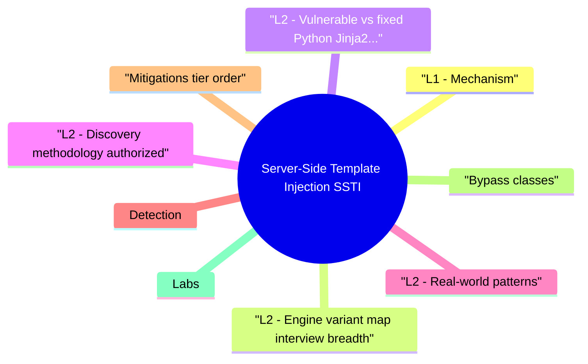

# Server-Side Template Injection (SSTI) revision map

Server-Side Template Injection (SSTI) in one sitting. That is the deal. I mined Critical Clarification Server-Side Template Injection Misconceptions.md, Server-Side Template Injection (SSTI) - Comprehensive Guide.md, Server-Side Template Injection (SSTI) - Interview Questions & Answers.md, Server-Side Template Injection (SSTI) - Quick Reference.md, Server-Side Template Injection (SSTI) - VAPT Methodology.md. The outline keeps every H2 I cared about from those files.

## L1 - Mechanism
- Root cause: treating untrusted strings as part of the template program, not as bound data.
- High risk surfaces: email preview, PDF generation, "custom report" builders, CMS themes, debug endpoints.

## L2 - Engine variant map (interview breadth)
- Exact payloads differ by version and sandbox-learn discovery methodology, not one magic string.

## L2 - Vulnerable vs fixed (Python Jinja2 sketch)
- Vulnerable: user string becomes template.
- Fixed: static template, user data as variable.

## L2 - Discovery methodology (authorized)
- Fuzz template metacharacters: &#123;&#123;77&#125;&#125;, ${77}, .
- Observe 49 vs literal in output -> evaluation confirmed.
- Enumerate engine via errors or behavior; escalate to read/exec primitives per engine docs.
- Prefer OAST (Burp Collaborator) for blind cases where output not returned.

## L2 - Real-world patterns
- Misconfigured sandboxed engines (e.g., dangerous imports left enabled) still appear in disclosures-treat sandbox config as code review surface.
- Log4Shell (CVE-2021-44228) is not classic SSTI (JNDI lookup injection) but reinforces the lesson: don't evaluate untrusted data as active code paths.

## Detection
- App logs: template parse errors with user fragments.
- WAF: may catch obvious &#123;&#123; patterns; easy to encode-fix code first.
- Code review: search for Template(, string concat before render, eval of user strings.

## Mitigations (tier order)
- Never build template source from user input.
- Use logic-less templates for user themes where possible.
- Sandbox engine (limited builtins), disable dangerous methods, least privilege OS user.
- CSP doesn't stop SSTI (server-side); don't confuse with XSS fixes.
- Monitor for spawn patterns after template render in hardened builds.

## Bypass classes
- Nested encodings that evade naive WAF signatures.
- Blind SSTI via side channels (sleep, DNS).
- Mis-sandboxed engines: new gadgets in stdlib.

## Labs
- PortSwigger SSTI labs (gold standard for methodology).
- DVWA/custom VMs-authorized only.

## Toolchain
- Burp Suite, tplmap (legacy but known), code search (grep, semgrep rules for Template( patterns), SAST.

## Interview clusters

## Authoritative references
- OWASP SSTI guidance / testing guide sections.
- CWE-94 (Code Injection) - related; engine-specific CWEs for misconfiguration.
- PortSwigger research on server template injection.

## Cross-links
- RCE · XSS · SQL Injection · WAF Bypass and Defense Evaluation

## Verification checklist
- [ ] Explain two safe patterns for user supplied names in emails.
- [ ] Name blind confirmation techniques you'd use in a pentest scope.

## Pocket list

## Rule
- Never concatenate user input into template source - use context variables only.

## Quick probe (authorized)

## Engines (know names)
- Jinja2 · Twig · Freemarker · Velocity · ERB · Razor

## Fixes
- Static templates · sandbox + least privilege · SAST for Template( patterns · remove debug render endpoints

## Tools
- Burp · PortSwigger labs · semgrep/grep · tplmap (legacy)

## Cross-read

## One-liner

## The clarification file, compressed

## "Auto-escaping prevents SSTI."
- Reality: Escaping targets output encoding for HTML; SSTI is evaluation of template source.

## "Only PHP apps get SSTI."
- Reality: Python, Java, Ruby, .NET engines are all in scope when templates are dynamic.

## "WAF rules make SSTI safe."
- Reality: Encoding and blind channels bypass naive signatures; fix the code.

## "Client-side templates have the same fix."
- Reality: Different deployment; Angular/React issues are usually XSS/CSP territory, not server eval.

## "Sandboxed Jinja2 is always fine."
- Reality: Misconfigurations and dangerous filters reopen surface-validate configs.

## "SSTI requires visible output."
- Reality: Blind SSTI uses timing or OAST callbacks.

## "String templates are okay if input is 'validated'."
- Reality: Allow-lists rarely cover all expression metacharacters-don't build template source from users.

## "Email HTML can't lead to RCE."
- Reality: If the server renders user supplied template syntax in a server engine, RCE is in scope.

## Authorized testing outline

## Objective
- Create a repeatable assessment workflow for Server-Side Template Injection (SSTI) that produces reproducible evidence and actionable remediation guidance.

## Phase 1 - Scope and preparation
- Confirm in-scope assets, test windows, and prohibited actions.
- Identify critical user journeys and trust boundaries.
- Define severity rubric and evidence requirements before testing.

## Phase 2 - Recon and attack-surface mapping
- Enumerate relevant endpoints, flows, and data paths.
- Document where security checks are expected to happen.
- Mark high-value assets and high-impact paths.

## Phase 3 - Hypothesis-driven testing
- Start with low-risk probes and baseline behavior.
- Test failure hypotheses systematically (one variable at a time).
- Capture request/response artifacts for each finding candidate.

## Phase 4 - Validation and impact proof
- Reproduce findings with clean-state retests.
- Confirm exploitability and practical impact.
- Eliminate false positives; record confidence level.

## Phase 5 - Remediation and verification
- Provide immediate containment + structural fix recommendations.
- Define post-fix verification tests and telemetry checks.
- Re-test after remediation and close with evidence.

## Evidence template
- Asset / endpoint:
- Preconditions:
- Reproduction steps:
- Observed behavior:
- Security impact:
- Business impact:
- Recommended fix:
- Verification result:

## Interview drill
- In 3 minutes, explain how you would run this VAPT workflow for one production-like service and what evidence you need before escalating severity.

## Oral prompts worth repeating

- Q: SSTI vs XSS?
- Q: Quick test in a authorized assessment?
- Q: Is auto-escaping enough?
- Q: Sandboxes solve everything?
- Q: How do you scale prevention across microservices?

## 60-second answer
- Q: What is SSTI and how do you prevent it?

## Basics

## Engineering

## Senior

## Mock ladder

## What sits next to this topic

- Stay inside this folder for the long guide. Jump only when a section names a sibling topic.
- Cookie Security, CSRF, XSS, JWT, OAuth, and TLS show up as neighbors on a lot of these maps.
