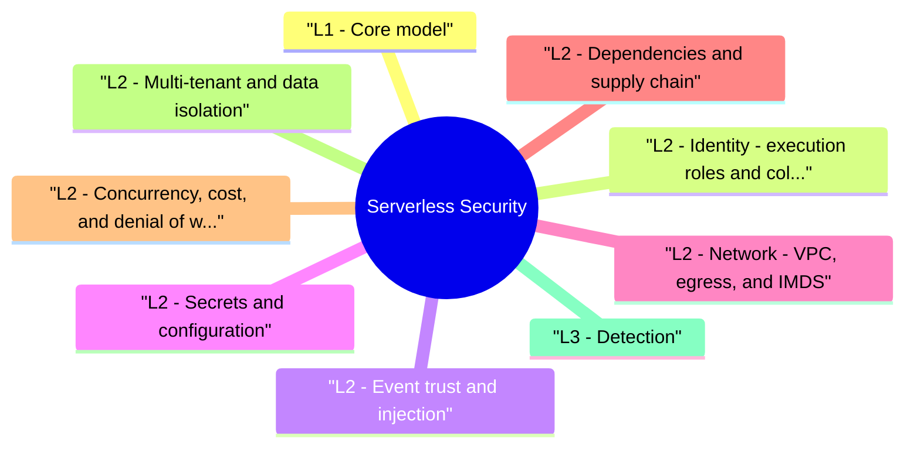

# Serverless Security revision map

When a Serverless Security follow-up lands, I want one page that still has the misconception and the VAPT step. I pulled headings from Critical Clarification Serverless Security Misconceptions.md, Serverless Security - Comprehensive Guide.md, Serverless Security - Interview Questions & Answers.md, Serverless Security - Quick Reference.md. If a heading is here, the guide still owns the detail.

## L1 - Core model
- Shared responsibility: Provider secures hypervisor, runtime patch, isolation; you secure code, IAM, triggers, secrets, dependencies, logging redaction.

## L2 - Identity: execution roles and cold start
- Each function runs as an IAM principal (Lambda execution role). Anti-pattern: one shared admin role for all functions-compromise of a low-risk handler yields **S3:, dynamodb:, secretsmanager:***.
- One role per function (or per trust tier: read-only vs write vs admin).
- Resource-scoped ARNs in policies; condition keys (aws:SourceArn, aws:SourceAccount).
- Permission boundaries for platform teams.
- Avoid wildcard actions; prefer specific API calls needed at runtime.

## L2 - Event trust and injection
- Event injection pattern: Attacker uploads crafted file to S3 -> Lambda parses with vulnerable library -> SSRF or RCE -> IMDS credential theft if role is broad and egress allowed.
- Interview example: Lambda triggered on image upload uses ImageMagick shell delegate -> same class as ImageTragick; combine with IMDSv1 if SSRF exists elsewhere in pipeline.

## L2 - Secrets and configuration
- Lambda Secrets Extension: Fetch at init, cache in memory-ensure no debug dumps and minimal lifetime where possible.

## L2 - Network: VPC, egress, and IMDS
- Public Lambda with 0.0.0.0/0 egress + privileged role = disaster on RCE.
- VPC-attached functions: understand ENI scaling, NAT cost, security groups-still need IMDS hardening on any co-resident EC2 (less direct on Lambda, but SSRF to metadata in code matters).
- IMDSv2 required on EC2; for Lambda, block metadata URLs in outbound fetchers unless required; use scoped credentials via IAM, not long-lived keys in env.

## L2 - Dependencies and supply chain
- Functions bundle dependencies (npm, pip layers)-each deploy is a new image-like artifact.
- Pin versions; lockfiles in CI.
- SCA (Snyk, Dependabot, OSV) on every deploy.
- Minimal layers; remove dev dependencies.
- Provenance / Sigstore for internal packages where applicable.

## L2 - Concurrency, cost, and denial of wallet
- Attackers flood triggers (API Gateway, S3 PUT, SQS) causing runaway invocations and bill shock.
- Controls: Reserved concurrency caps, API throttling, S3 prefix policies, budget alarms, WAF, CAPTCHA on public endpoints, idempotency to reduce duplicate work.

## L2 - Multi-tenant and data isolation
- Serverless does not automatically isolate tenants-shared tables keyed by tenant_id need consistent authZ in every handler.
- Row-level security in database where supported.
- Per-tenant KMS keys for sensitive fields.
- No cross-tenant IDs from event payloads without verification.

## L3 - Detection
- CloudTrail / Activity Log: lambda:InvokeFunction spikes, sts:AssumeRole anomalies.
- GuardDuty / Defender: credential exfil patterns.
- Custom metrics: error rate, duration, concurrent executions, DLQ depth.
- Log insights: unexpected outbound IPs, metadata URL fetches in application logs.

## L3 - Secure SDLC for serverless
- IaC review (SAM, CDK, Terraform): IAM, triggers, env vars.
- Unit + integration tests including malformed events.
- Static analysis: Checkov, tfsec, cfn-nag, Semgrep for deserialization, SSRF, shell.
- Deploy pipelines: OIDC to CI, no long-lived cloud keys in GitHub.

## Interview clusters

## Platform specifics (name in interviews)

## Hands-on / labs
- Serverless Goat (OWASP)
- AWS Well-Architected Serverless Lens
- Rhino Security Labs Lambda privilege escalation posts
- CloudGoat scenarios with Lambda misconfig

## Cross-links
- Cloud Attack Paths · Container Security · Software Supply Chain Security · Secrets Management and Key Lifecycle

## Recall list from Quick Reference

## Top risks
- Over-privileged IAM role
- Unauthenticated / spoofed triggers
- Secrets in env / logs
- Vulnerable dependencies
- Unbounded concurrency / cost abuse
- SSRF + broad cloud API access

## IAM rules
- One role per function (or tier: read/write/admin)
- Resource ARNs, not *
- Condition keys: aws:SourceArn, aws:SourceAccount
- Permission boundaries for platforms

## Events
- Verify webhook signatures (HMAC, timestamp)
- API Gateway: JWT / IAM auth, throttling, WAF
- Treat S3/SQS payloads as untrusted
- DLQ + idempotency for poison messages

## Secrets
- Secrets Manager / Parameter Store + KMS
- Never commit to SAM/CDK/Terraform git
- Redact logs; no secret env dumps on crash

## Network
- Restrict egress; block metadata IP if app fetches URLs
- VPC endpoints for AWS APIs
- No public Function URL without auth

## Supply chain
- Lockfiles, SCA on deploy, minimal layers
- Watch Log4j, pickle, native libs in handlers

## Detection
- Invocations / ConcurrentExecutions spikes
- CloudTrail lambda:*, sts:AssumeRole
- DLQ depth, error rate, unusual outbound in logs

## Tools
- Checkov · tfsec · cfn-nag · Semgrep · GuardDuty

## Cross-reads
- Cloud Attack Paths · IAM and Least Privilege at Scale · Software Supply Chain Security

## Corrections I keep repeating

## "Serverless means no servers, so no patching needed - we're secure."
- Wrong. Provider patches the runtime; you still own code, IAM, events, secrets, and dependencies. Vulnerable npm/pip packages in your deployment bundle are still your RCE surface.

## "One shared Lambda role simplifies operations."
- Wrong. Shared roles create blast-radius amplification. Use per-function or per-tier roles with resource-scoped policies.

## "Environment variables are fine for API keys if the console is locked down."
- Wrong. Env vars appear in CloudFormation/SAM exports, CI logs, crash dumps, and console readers with lambda:GetFunctionConfiguration. Use Secrets Manager with rotation and audit.

## "Internal S3 triggers don't need validation."
- Wrong. Any Principal that can PutObject can inject events. Treat object content as untrusted input-malware, zip bombs, parser exploits.

## "Lambda in a VPC is automatically isolated from the internet."
- Wrong. VPC attachment controls network paths, not IAM. Functions still need egress rules, NAT, and endpoint policies. Misconfigured SGs can expose internal services.

## "Concurrency limits hurt availability so we leave them unlimited."
- Wrong. Unlimited concurrency enables cost abuse and downstream overload. Set reserved/max concurrency per critical functions with alarms.

## "Function URLs are convenient and low risk for internal tools."
- Wrong. Unauthenticated Function URLs are a common data leak vector. Require IAM auth, JWT, or front with API Gateway + WAF.

## "Cold starts don't matter for security."
- Wrong. Init-time secret fetch, global variable caching, and race conditions in warm containers affect credential lifetime and tenant isolation assumptions-document behavior.

## "Serverless eliminates SSRF impact."
- Wrong. Functions often have high IAM and outbound access-SSRF can be worse than in a locked-down monolith if roles are over-privileged.

## "Infrastructure-as-code review is optional for small functions."
- Wrong. IAM and trigger misconfigurations scale with copy-paste IaC-automate policy-as-code checks on every PR.

## What I answer in 90 seconds

- How do you design IAM for a Lambda that processes S3 uploads?
- What is event injection in serverless?
- Where should secrets live in Lambda?
- How do you prevent "denial of wallet" attacks?
- SSRF from a Lambda-special considerations?
- Compare serverless vs containers for security.
- Design guardrails for 100 teams deploying Lambdas.
- Authoritative references

## 60-second answer
- Q: What makes serverless security different from traditional app security?

## Core questions

### SSRF from a Lambda-special considerations?
- See the source section `SSRF from a Lambda-special considerations?` for the worked example.

## Senior follow-ups

## Depth - follow-ups
- Explain Lambda resource policy vs execution role trust.
- EventBridge cross-account misconfiguration example.
- Cold start implications for secret caching.
- Lambda layer supply-chain risk.

## Nearby reading in this repo

- Stay inside this folder for the long guide. Jump only when a section names a sibling topic.
- Cookie Security, CSRF, XSS, JWT, OAuth, and TLS show up as neighbors on a lot of these maps.
