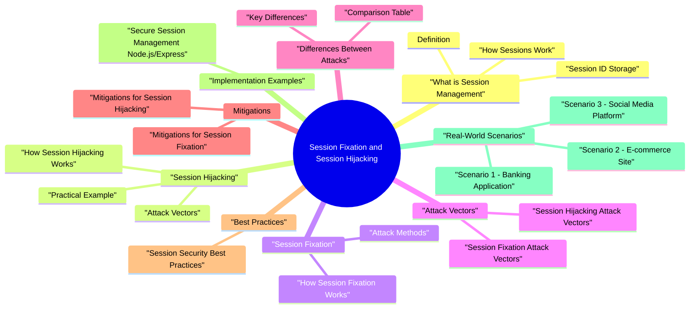

# Session Fixation and Session Hijacking revision map

Last mock I bounced around the Session Fixation and Session Hijacking folder. This file is the stop that. Drawn from Critical Clarification Session Fixation vs Session.md, Session Fixation and Session Hijacking - Comprehen.md, Session Fixation and Session Hijacking - Interview.md, Session Fixation and Session Hijacking - Quick Ref.md, Session Fixation and Session Hijacking - VAPT Methodology.md. Skim the mermaid, then the outline.

## What is Session Management

### Definition
- Session management is the process of maintaining user state across multiple HTTP requests. Since HTTP is stateless, web applications use sessions to track authenticated users.

### How Sessions Work
- User logs in -> Server creates session
- Server generates session ID -> Unique identifier
- Session ID sent to client -> Cookie, URL, or form field
- Client sends session ID -> With each request
- Server validates session ID -> Retrieves session data
- Session expires -> After timeout or logout

### Session ID Storage
- See the source section `Session ID Storage` for the worked example.

## Session Hijacking

### How Session Hijacking Works
- See the source section `How Session Hijacking Works` for the worked example.

### Attack Vectors
- Intercepting session IDs over unencrypted connections (HTTP)
- Attacker uses packet sniffer to capture session cookies
- Mitigation: Use HTTPS
- Attacker injects malicious JavaScript
- Script steals session cookies via document.cookie
- Mitigation: HttpOnly cookies, input validation
- Attacker guesses or brute-forces session IDs
- Weak session ID generation makes this possible

### Practical Example
- See the source section `Practical Example` for the worked example.

## Session Fixation

### How Session Fixation Works
- See the source section `How Session Fixation Works` for the worked example.

### Attack Methods
- See the source section `Attack Methods` for the worked example.

## Attack Vectors

### Session Hijacking Attack Vectors
- Intercepting unencrypted HTTP traffic
- Capturing session cookies
- Risk: High on unencrypted networks
- Mitigation: HTTPS
- Injecting malicious JavaScript
- Stealing cookies via document.cookie
- Risk: High if XSS vulnerability exists
- Mitigation: HttpOnly cookies, input validation

### Session Fixation Attack Vectors
- Session ID in URL parameter
- Attacker sends link with predetermined ID
- Risk: High if session ID in URL
- Mitigation: Don't use URL-based session IDs
- Setting cookie via XSS
- Forcing user to use attacker's session ID
- Risk: High if XSS vulnerability exists
- Mitigation: HttpOnly cookies, session ID regeneration

## Differences Between Attacks

### Comparison Table
- See the source section `Comparison Table` for the worked example.

### Key Differences
- Session Hijacking: After authentication (session active)
- Session Fixation: Before/during authentication
- Session Hijacking: Stealing existing session ID
- Session Fixation: Forcing user to use attacker's session ID
- Session Hijacking: XSS, network sniffing, prediction
- Session Fixation: Social engineering, URL manipulation
- Session Hijacking: Protect session ID (HttpOnly, HTTPS)
- Session Fixation: Regenerate session ID after login

## Mitigations

### Mitigations for Session Hijacking
- See the source section `Mitigations for Session Hijacking` for the worked example.

### Mitigations for Session Fixation
- See the source section `Mitigations for Session Fixation` for the worked example.

## Best Practices

### Session Security Best Practices
- All session-related communication over HTTPS
- Secure flag on cookies
- Prevents network sniffing
- Prevents JavaScript access
- Protects from XSS attacks
- Essential for session security
- HTTPS-only transmission
- Prevents interception over HTTP

## Implementation Examples

### Secure Session Management (Node.js/Express)
- See the source section `Secure Session Management (Node.js/Express)` for the worked example.

## Real-World Scenarios

### Scenario 1: Banking Application
- See the source section `Scenario 1: Banking Application` for the worked example.

### Scenario 2: E-commerce Site
- See the source section `Scenario 2: E-commerce Site` for the worked example.

### Scenario 3: Social Media Platform
- Threat: Session hijacking via network sniffing

## Advanced Session Defense Patterns

### Sender-Constrained Sessions and Token Replay Resistance
- Classic session cookies are bearer artifacts: anyone who gets the value can replay it. For higher assurance environments, add sender constraints:
- mTLS-bound access tokens or DPoP-like proof-of-possession for API flows
- Refresh token rotation with reuse detection (if old refresh token is reused, revoke token family)
- Session binding to device signals (risk-based, not brittle hard lock to single IP)

### Session Telemetry and Anomaly Detection
- Detection controls matter as much as cookie flags:
- Impossible travel / geo-velocity anomalies
- Sudden user-agent or device fingerprint shifts
- Parallel active sessions from abnormal networks
- Privilege escalation shortly after new session issuance

### Distributed Revocation and Logout Semantics
- In microservice and multi-region systems, revocation is often the weak link:
- Logout in one service but stale session remains valid at another edge node
- Cache propagation delay allows short replay window
- "Log out all sessions" action misses long-lived refresh artifacts
- Central revocation state with short cache TTLs.
- Session versioning (session_version / token_version) checked by all relying services.
- Explicit incident mode to force global re-auth for affected cohorts.

### Key Points
- Session Hijacking = Stealing existing active session
- Session Fixation = Forcing user to use predetermined session ID
- Different attacks require different mitigations
- HTTPS alone is not enough - need multiple layers
- Regenerate session ID after login (critical for fixation)
- HttpOnly cookies prevent XSS-based hijacking
- Strong session IDs prevent prediction attacks
- Short expiration reduces attack window

### Complete Mitigation Checklist
- HTTPS for all communication
- HttpOnly cookies (XSS protection)
- Secure cookies (HTTPS only)
- SameSite attribute (CSRF protection)
- Strong, random session IDs
- Session ID regeneration after login
- Session ID regeneration after security events
- Short session expiration

## Fundamental Questions

### What is session hijacking and how does it work?
- Network sniffing (unencrypted connections)
- XSS (Cross-Site Scripting)
- Session prediction (weak session IDs)
- Man-in-the-Middle attacks
- Session replay

### What is session fixation and how does it work?
- URL-based (session ID in URL)
- Cookie-based (via XSS)
- Social engineering (phishing)

### What is the difference between session hijacking and session fixation?
- See the source section `What is the difference between session hijacking and session fixation?` for the worked example.

## Comparison Questions

### How do the attack vectors differ between session hijacking and session fixation?
- Network Sniffing:
- Intercepting unencrypted HTTP traffic
- Capturing session cookies
- Mitigation: HTTPS
- XSS (Cross-Site Scripting):
- Injecting malicious JavaScript
- Stealing cookies via document.cookie
- Mitigation: HttpOnly cookies

### Why is HTTPS alone not sufficient to prevent session hijacking?
- Network sniffing (session ID interception over network)
- Man-in-the-middle attacks (if properly configured)
- Session ID exposure in transit
- XSS attacks (JavaScript can still access cookies)
- Session fixation (if session ID not regenerated)
- Session prediction (weak session IDs)
- Client-side attacks (malware, keyloggers)
- HTTPS (protects in transit)

## Attack Vector Questions

### How does XSS lead to session hijacking?
- XSS (Cross-Site Scripting) allows attackers to inject malicious JavaScript into web pages, which can then steal session cookies.
- Input validation and sanitization
- Output encoding
- Content Security Policy (CSP)
- HttpOnly cookies

### How does session fixation work with URL-based session IDs?
- Application accepts session ID from URL
- User uses attacker's predetermined session ID
- After login, session becomes authenticated
- Attacker uses same session ID (now authenticated)

## Mitigation Questions

### How does session ID regeneration prevent session fixation?
- Session ID regeneration changes the session identifier after authentication, making any predetermined session ID invalid.
- Old session ID becomes invalid
- Only new session ID works
- Attacker's predetermined ID no longer works
- Must be done after authentication

### What are the complete mitigations for session hijacking?
- See the source section `What are the complete mitigations for session hijacking?` for the worked example.

### When should you regenerate session IDs?
- Session ID should be regenerated after any significant security event:
- Always regenerate after login (prevents session fixation)
- Regenerate after security events
- Regenerate after logout
- ️ Periodic regeneration is optional

## Implementation Questions

### How would you implement secure session management to prevent both attacks?
- HttpOnly cookies (XSS protection)
- Secure cookies (HTTPS only)
- SameSite attribute (CSRF protection)
- Strong session IDs (prevents prediction)
- Session ID regeneration after login (prevents fixation)
- Short expiration (reduces attack window)
- Inactivity timeout (reduces attack window)
- IP validation (additional security)

## Depth: Interview follow-ups - Session Fixation and Session Hijacking
- Authoritative references: OWASP Session Management Cheat Sheet; OWASP Session Fixation (community page-verify current).
- Regenerate session ID on privilege change - where exactly in your framework?
- Transport: Why HTTPS + Secure cookies are table stakes; what HttpOnly does not fix (CSRF).
- Fixation delivery: Attacker-supplied session id in URL-mitigations?

## ️ Critical Clarification
- Session Fixation and Session Hijacking are NOT the same!
- Session Hijacking = Stealing existing active session
- Session Fixation = Forcing user to use predetermined session ID
- Different attacks require different mitigations

## Quick Comparison

### Session Hijacking
- See the source section `Session Hijacking` for the worked example.

### Session Fixation
- See the source section `Session Fixation` for the worked example.

## Complete Mitigation Checklist

### For Session Hijacking
- [ ] Use HTTPS for all communication
- [ ] HttpOnly cookies (prevents XSS)
- [ ] Secure cookies (HTTPS only)
- [ ] SameSite attribute (CSRF protection)
- [ ] Strong, random session IDs
- [ ] Short session expiration
- [ ] Inactivity timeout
- [ ] IP address validation (optional)

### For Session Fixation
- [ ] Regenerate session ID after login (CRITICAL)
- [ ] Regenerate after password change
- [ ] Regenerate after privilege escalation
- [ ] Don't accept session IDs from URL
- [ ] Don't allow users to set session IDs
- [ ] Validate session creation

## Secure Session Configuration

### Node.js/Express
- See the source section `Node.js/Express` for the worked example.

### Session ID Regeneration
- See the source section `Session ID Regeneration` for the worked example.

## Common Mistakes

### Wrong: No Session ID Regeneration
- See the source section `Wrong: No Session ID Regeneration` for the worked example.

### Correct: Regenerate After Login
- See the source section `Correct: Regenerate After Login` for the worked example.

### Wrong: Accepting Session ID from URL
- See the source section `Wrong: Accepting Session ID from URL` for the worked example.

### Correct: Only Use Cookies
- See the source section `Correct: Only Use Cookies` for the worked example.

### Wrong: No HttpOnly Flag
- See the source section `Wrong: No HttpOnly Flag` for the worked example.

### Correct: HttpOnly Cookies
- See the source section `Correct: HttpOnly Cookies` for the worked example.

## Decision Tree
- Use HTTPS
- HttpOnly cookies
- Secure cookies
- Strong session IDs
- Short expiration
- Regenerate session ID after login
- Don't accept session IDs from URL
- Regenerate after security events

## Key Takeaways
- Session Hijacking = Stealing existing active session
- Session Fixation = Forcing user to use predetermined session ID
- HTTPS alone is not enough - need multiple layers
- Regenerate session ID after login (critical for fixation)
- HttpOnly cookies prevent XSS-based hijacking
- Strong session IDs prevent prediction attacks
- Short expiration reduces attack window
- Defense-in-depth approach is essential

## Misreads that still sneak in

## ️ Common Misconceptions

### "Session fixation and session hijacking are the same thing"
- Truth: Session fixation and session hijacking are different attacks that target sessions at different stages of the session lifecycle.
- Session Hijacking: Attacker steals an existing, active session
- Session Fixation: Attacker forces user to use a predetermined session ID

### "Session hijacking only happens over unencrypted connections"
- Truth: Session hijacking can occur through multiple attack vectors, not just network sniffing.
- Network Sniffing (Unencrypted Connections)
- Intercepting session IDs over HTTP
- Mitigation: Use HTTPS
- Cross-Site Scripting (XSS)
- Stealing session cookies via JavaScript
- Mitigation: HttpOnly cookies, input validation
- Man-in-the-Middle (MitM) Attacks

### "Session fixation only works if session ID is in the URL"
- Truth: Session fixation can work with session IDs in cookies, URLs, or hidden form fields. The attack vector depends on how the application handles session IDs.
- Session fixation works regardless of where session ID is stored
- The vulnerability is not regenerating session ID after login
- Mitigation: Always regenerate session ID after authentication

### "HTTPS completely prevents session hijacking"
- Truth: HTTPS helps prevent network-based session hijacking, but does NOT prevent all forms of session hijacking.
- Network sniffing (session ID interception over network)
- Man-in-the-middle attacks (if properly configured)
- Session ID exposure in transit
- XSS attacks (JavaScript can still access cookies)
- Session fixation (if session ID not regenerated)
- Session prediction (weak session IDs)
- Client-side attacks (malware, keyloggers)

### "Session ID regeneration is only needed after login"
- Truth: Session ID should be regenerated after any significant security event, not just login.
- After Authentication (Login)
- Prevents session fixation
- Most critical time
- After Password Change
- Prevents attacker from using old session
- Ensures only new session is valid
- After Privilege Escalation

### "Short session expiration prevents all session attacks"
- Truth: Short session expiration reduces the attack window, but does NOT prevent session hijacking or fixation.
- Reduces time window for attack
- Limits damage if session is compromised
- Forces re-authentication
- Session hijacking (attacker can still steal active session)
- Session fixation (attack happens during login)
- XSS attacks (can steal session immediately)
- Short expiration (reduces window)

### "Session hijacking and fixation are the same as CSRF"
- Truth: These are different attacks with different attack vectors and mitigations.
- Attack: Stealing user's session ID
- Goal: Impersonate user
- Method: XSS, network sniffing, prediction
- Mitigation: HttpOnly cookies, HTTPS, strong session IDs
- Attack: Forcing user to use attacker's session ID
- Goal: Gain access after user authenticates
- Method: Social engineering, URL manipulation

## Key Takeaways

### Understanding
- Session Hijacking = Stealing existing active session
- Session Fixation = Forcing user to use predetermined session ID
- Different attack vectors for each
- Different mitigations required
- HTTPS alone is not enough - need multiple layers
- Regenerate session ID after security events
- Use defense-in-depth approach

### Common Mistakes
- Thinking they're the same attack
- Relying only on HTTPS
- Not regenerating session ID after login
- Not regenerating after password change
- Using weak session IDs
- Not using HttpOnly cookies
- Confusing with CSRF attacks

## Summary Table
- Remember: Session hijacking steals sessions, session fixation forces sessions. Both require different mitigations!

## Lab methodology

## Scope & Session Model
- Understand how the application manages sessions:
- Session mechanism (cookies, JWTs, opaque tokens, etc.).
- Where session identifiers are stored (cookies, local storage, headers).
- Session lifetime and renewal behavior (login, logout, timeout).
- Identify sensitive session‑bound actions:
- Authentication and logout flows.
- Privileged operations (admin consoles, account management).
- Cross‑device or cross‑browser session use cases.

## Mapping Session Identifiers
- Locate session identifiers:
- Names and properties of cookies (e.g., HttpOnly, Secure, SameSite).
- Any tokens in headers or HTML (hidden fields, meta tags).
- Storage in local/session storage (for SPAs).
- Observe lifecycle events:
- On login: how and when the session is created or updated.
- On privilege change (e.g., normal user -> admin or role change).
- On logout: whether session tokens are invalidated server‑side.

## Session Fixation - Assessment Strategy
- Goal: determine whether an attacker can set or influence a victim's session identifier and have that identifier accepted after the victim logs in.
- Pre‑login vs post‑login session behavior:
- Does the app issue a session ID before login (e.g., for anonymous browsing)?
- After login, is the session ID:
- Regenerated?
- External control of session ID:
- Does the app ever:
- Accept session IDs from URLs or request parameters.

## Session Hijacking - Assessment Strategy
- Goal: understand how hard it would be for an attacker to steal or misuse an existing session.
- Transport security:
- Is HTTPS enforced for all authenticated interactions?
- Are cookies marked Secure to prevent transmission over plain HTTP?
- Cookie attributes:
- HttpOnly to reduce exposure to client‑side scripts.
- SameSite to limit cross‑site cookie sending.
- Exposure points:

## Dynamic Testing - What to Observe
- Multiple clients:
- Log in from one browser and observe the session ID.
- Log in from another browser with the same account:
- Check whether the session IDs differ.
- Check server behavior (e.g., whether multiple concurrent sessions are allowed).
- Login and privilege transitions:
- Confirm that:
- Session IDs are regenerated after login.

## High‑Risk Scenarios
- Shared computers and public environments:
- "Remember me" or "keep me logged in" features.
- Auto‑login links and magic links.
- Privilege escalation flows:
- Normal user -> admin or elevated roles.
- Support tools that can impersonate users or switch identities.
- Token transport and storage:
- Tokens stored in places accessible to XSS.

## Tooling & Aids
- Proxy tooling:
- Track session identifiers across requests.
- Replay requests with and without certain cookies to observe behavior.
- Browser dev tools:
- Inspect cookies and local/session storage.
- Observe changes to session‑related values during navigation.
- Configuration and code review:
- Identify how sessions are generated, validated, and invalidated.

## Verifying Exploitability Safely
- Fixation indicators:
- Show that a pre‑login session identifier is reused after login rather than regenerated.
- Highlight any mechanism that could let an attacker specify or plant a session ID (e.g., via URL, parameter, or unsecured cookie).
- Hijacking indicators:
- Identify weaknesses that could expose session tokens in principle:
- Lack of HTTPS or Secure flag.
- Tokens in JavaScript‑accessible storage in apps vulnerable to XSS.
- Tokens appearing in URLs or logs.

## Reporting & Risk Assessment
- Mechanism affected (cookie‑based session, JWT, custom token).
- Where and how the session ID is created, updated, and destroyed.
- Observed behavior:
- Session not regenerated on login/privilege change.
- Session IDs remaining valid after logout or expiration.
- Session identifiers exposed via insecure transport or storage.
- Potential impact:
- Account takeover risk.

## Remediation Guidance
- Strong session lifecycle controls:
- Regenerate session identifiers on login and privilege changes.
- Invalidate sessions on logout and after reasonable inactivity.
- Secure cookie settings:
- Secure for HTTPS deployments.
- HttpOnly to reduce script access where feasible.
- Appropriate SameSite values to match application needs.
- Avoid unsafe token locations:

## Re‑Testing Checklist
- [ ] Confirm session IDs:
- [ ] Change on login and privilege elevation.
- [ ] Are invalidated on logout and after the configured timeout.
- [ ] Validate cookie attributes:
- [ ] Secure, HttpOnly, and SameSite as per design.
- [ ] Re‑exercise multi‑client scenarios:
- [ ] Sessions behave as expected across browsers/devices.
- [ ] No unexpected persistence of compromised sessions.

## Cross-links I actually follow

- Stay inside this folder for the long guide. Jump only when a section names a sibling topic.
- Cookie Security, CSRF, XSS, JWT, OAuth, and TLS show up as neighbors on a lot of these maps.
