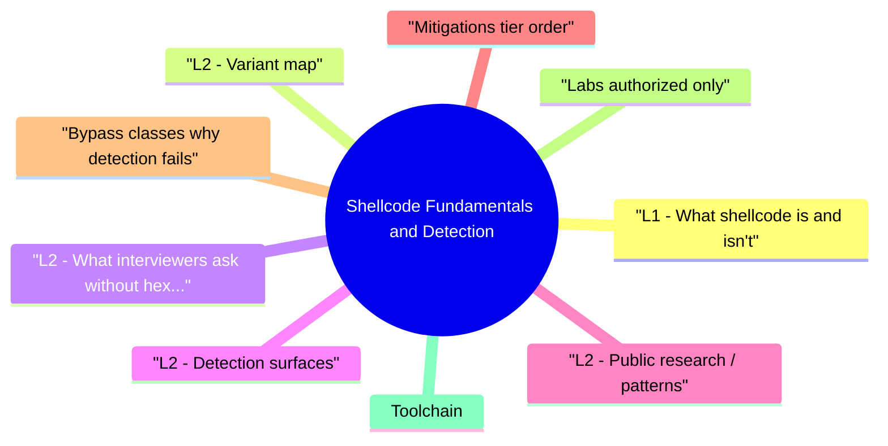

# Shellcode Fundamentals and Detection revision map

Shellcode Fundamentals and Detection in one sitting. That is the deal. I mined Critical Clarification Shellcode Fundamentals and Detection Misconceptions.md, Shellcode Fundamentals and Detection - Comprehensive Guide.md, Shellcode Fundamentals and Detection - Interview Questions & Answers.md, Shellcode Fundamentals and Detection - Quick Reference.md. The outline keeps every H2 I cared about from those files.

## L1 - What shellcode is (and isn't)
- Machine bytes that self-locate (often via GetPC tricks on x86) and call sensitive APIs.
- Not the same as a full PE; often a bootstrap that downloads a larger implant (stager).
- Constraints: NULL bytes, size limits, DEP/ASLR force ROP then VirtualProtect patterns on Windows.

## L2 - Variant map

## L2 - What interviewers ask (without hex dumps)
- Defensive focus: sequence of VirtualAlloc -> Write -> Protect -> CreateThread-style APIs from unexpected modules.

## L2 - Detection surfaces

## L2 - Public research / patterns
- Meterpreter / Cobalt Strike stagers are common signatures in YARA rules-shape and decode stubs recur.
- CVE-class memory corruptions often end in ROP chains that allocate executable memory-behavioral detections target that pattern, not a single byte signature.

## Mitigations (tier order)
- Eliminate the vulnerability (bounds checks, safe languages for new code).
- Hardware/software mitigations: DEP, ASLR, CFG/ACG, CET.
- EDR memory scanning and kernel telemetry with tuning for FP.
- Application allow-listing (where feasible) for child processes and DLL loads.

## Bypass classes (why detection fails)
- Living-off-the-land without classic shellcode (.NET assembly in memory).
- Encrypted stagers with per-campaign keys.
- Blind spots: unhooking, manual syscalls, BYOVD-see EDR module.

## Labs (authorized only)
- SANS / offensive courses with isolated ranges.
- Flare-on style challenges for encoding recognition (personal study).

## Toolchain
- YARA, pe-sieve / moneta (memory scanning concepts), Sysmon (Event ID 8/10/11 patterns), debugger disassembly for triage.

## Interview clusters

## Authoritative references
- MITRE ATT&CK T1055 (Process Injection) - related behaviors.
- Microsoft documentation on DEP, CFG, ACG, CET.
- CWE-94 (Code Injection) - conceptual cousin.

## Cross-links
- Exploit Development · Windows Exploit Mitigations · EDR Evasion Awareness and Defense · Malware Analysis Fundamentals

## Verification checklist
- [ ] Explain why RWX is suspicious without naming a specific exploit.
- [ ] List three APIs commonly monitored in injection chains.

## Pocket list

## Definitions
- PIC · stager/stageless · badchars · ROP under DEP

## Detection signals
- RWX / unexpected RX · alloc->write->protect->thread · unbacked memory · ETW/EDR API telemetry

## Mitigations
- DEP · ASLR · CFG/ACG · CET · fix the vuln

## Tools (examples)
- YARA · memory scanners · Sysmon · debuggers for triage

## Cross-read
- Exploit Development · Windows Exploit Mitigations · EDR Evasion Awareness

## One-liner

## The clarification file, compressed

## "Shellcode always touches disk."
- Reality: Many chains are fileless-memory-only injection is common.

## "Antivirus signatures stop modern intrusions."
- Reality: Encoding, encryption, and LOLBins bypass static AV; behavior and memory telemetry matter more.

## "RWX pages are always malware."
- Reality: Some JIT runtimes legitimately use RW->RX transitions; context and module provenance matter (FP risk).

## "Shellcode == Metasploit."
- Reality: Custom implants and nation-state tools vary; primitives (allocate/protect/thread) recur.

## "DEP alone stops shellcode."
- Reality: ROP to VirtualProtect / NtProtectVirtualMemory is a classic evasion of W^X assumptions.

## "Kernel shellcode is the same as user shellcode."
- Reality: Privilege, calling conventions, and exploit constraints differ; detection surfaces differ (PatchGuard, HVCI context).

## "EDR sees everything if hooks are on."
- Reality: Unhooking, direct syscalls, and BYOVD challenge user-mode visibility.

## "Studying shellcode is unethical."
- Reality: Authorized training and defensive analysis are essential-misuse is the problem.

## Oral prompts worth repeating

- Q: Staged vs stageless?
- Q: Why encode shellcode?
- Q: Name two behavioral signals stronger than static YARA on disk.
- Q: What breaks pure signature detection?
- Q: Interviewer asks for exact shellcraft bytes-what do you do?

## 60-second answer
- Q: What is shellcode, and how do defenders detect it?

## Concepts

## Detection

## Ethics / scope

### Q: Interviewer asks for exact shellcraft bytes-what do you do?
- A: Decline weaponized detail; offer conceptual stages, mitigations, and detection tradeoffs-appropriate for defensive roles.

## Mock ladder

## What sits next to this topic

- Stay inside this folder for the long guide. Jump only when a section names a sibling topic.
- Cookie Security, CSRF, XSS, JWT, OAuth, and TLS show up as neighbors on a lot of these maps.
