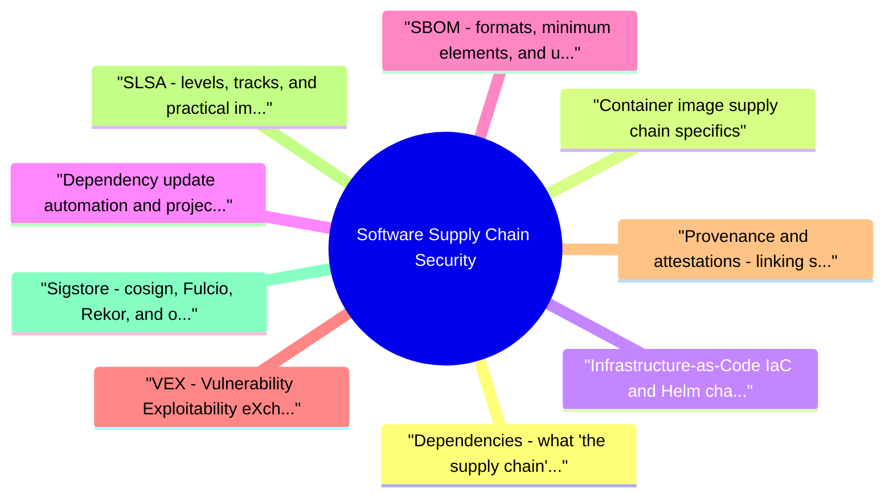

# Software Supply Chain Security revision map

Last mock I bounced around the Software Supply Chain Security folder. This file is the stop that. Drawn from Critical Clarification Software Supply Chain Security Misconceptions.md, Software Supply Chain Security - Comprehensive Guide.md, Software Supply Chain Security - Interview Questions & Answers.md, Software Supply Chain Security - Quick Reference.md. Skim the mermaid, then the outline.

## Dependencies: what "the supply chain" actually is

## Container image supply chain specifics
- Container images form a critical supply chain inside the overall flow. Beyond scanning and signing, a solid program addresses:

## Infrastructure‑as‑Code (IaC) and Helm chart supply chain
- Infrastructure definitions are code, and they bring their own dependency trees. This area is often overlooked in supply chain discussions:
- Policy‑as‑code for IaC: Scan Terraform, Helm, and Kubernetes manifests in CI with tools like Checkov, tfsec, Kubescape, or Kyverno CLI to catch misconfigurations before they become supply chain risks.

## Dependency update automation and project health signals
- Automated updates reduce manual toil but must be governed:
- Update grouping: Group related updates (e.g., all @angular/* packages) into a single PR to reduce noise and test interactions.

## SBOM: formats, minimum elements, and using them for real
- Generating an SBOM is table stakes; consuming it is the job:
- Join SBOM fields with vulnerability databases and reachability (does vulnerable code path execute?).
- Enforce license policy for distribution and SaaS obligations.
- Route findings to owners with SLAs tied to asset tier and exposure.
- Store SBOMs with releases (immutable association with version or image digest), not only as ad‑hoc exports.

## VEX: Vulnerability Exploitability eXchange
- Integration point: VEX documents should be generated and stored alongside SBOMs and consumed by vulnerability management platforms. This turns an uncurated list of CVEs into an actionable, risk‑based view.
- Regulatory importance: The NTIA and emerging regulations (EU Cyber Resilience Act, US Executive Order) are pushing for VEX alongside SBOMs to avoid "compliance scanning without context."

## Provenance and attestations: linking source to binary

## SLSA: levels, tracks, and practical implementation
- SLSA vs SBOM: SBOM describes contents; SLSA‑style provenance describes provenance and build integrity. They are complementary.
- Implementing SLSA Build Level 3 (example sketch):
- Hermetic builds: All dependencies declared upfront; no network access during build except to trusted, pinned registries.
- Isolated builders: Ephemeral, fresh VM or container per build; no build‑job reuse.
- Provenance generation: Use a tool like the SLSA GitHub Generator or a custom OIDC‑based builder that signs an in‑toto attestation with a short‑lived key.
- Consumer verification: Admission controllers or deploy scripts check the provenance signature and fields (builder ID, source repo, commit) against allowlists.

## Sigstore: cosign, Fulcio, Rekor, and operational reality
- Pair with: organizational controls for who can mint identities, rotation when CI systems change, and break‑glass if verification services are unavailable (documented exception paths, not silent disable).

## Vendor plugins, marketplace extensions, and "third‑party code in the factory"
- Risk pattern: a popular plugin is sold or compromised, or a name collision / typosquatted extension is installed. The blast radius is your pipeline and secrets, not only a single app dependency.
- Allowlist approved plugins and versions; require security review for new entries.
- Prefer pinning to commit SHAs for CI actions and vendoring critical scripts where policy allows.
- Use least‑privilege tokens scoped to single repos; prefer OIDC federation over long‑lived PATs.
- Fork or mirror critical actions internally if you need stability and supply chain control.
- Monitor plugin updates like application dependencies: breaking changes and malicious releases happen in this channel too.

## AI/ML supply chain considerations
- For products incorporating machine learning, the supply chain extends beyond code:
- Model provenance: Signed attestations that link a trained model to its training code, dataset, and hyperparameters.
- Serialized model risks: Many model formats (pickle, PyTorch, TensorFlow) can execute arbitrary code on load. Treat model files as untrusted executables; use safetensors or similar formats, and scan for embedded code.
- Data pipeline dependencies: Training data ingestion pipelines pull from external sources that could be poisoned, influencing model behavior.
- Inference dependencies: Runtime serving stacks (Triton, TF Serving) have their own dependency graphs; include them in SBOMs and vulnerability management.

## Threat model (compact)
- Map detailed scenarios to OWASP Top 10 CI/CD Security Risks (project page), especially dependency chain abuse and improper artifact integrity validation.

## Practical program: what "good" looks like
- Inventory: Repos, languages, registries, build systems, artifact types, IaC modules, and named owners per domain.
- Dependency hygiene: Mandatory lockfiles where the ecosystem supports them; approved upstream policy; block or quarantine known‑bad packages at the proxy when possible.
- Build integrity: Short‑lived credentials via OIDC; minimal IAM for CI; segregation between build and deploy roles; scanning for secrets in history.
- Signing and provenance: Generate SLSA‑aligned provenance attestations where tooling allows; sign container images and IaC artifacts; verify before production promotion.
- SBOM + VEX in the release record: Attach SPDX or CycloneDX to each versioned deliverable; produce VEX statements for non‑exploitable findings; connect to vuln and license policy with ticketing to owners.
- Automated updates: Renovate/Dependabot with policies for auto‑merge, grouping, and project‑health checks (Scorecard) for new dependencies.
- Plugin and module governance: Same rigor as runtime dependencies for anything that runs in CI or with repo tokens.
- External binary onboarding: Formal process for accepting vendor‑supplied executables or containers that you cannot rebuild; require SBOM, signature, and a time‑limited exception review cycle.

## Metrics and verification
- Integrity coverage: Percentage of production deploys where signatures and/or provenance were verified automatically.
- SBOM + VEX coverage: Percentage of release artifacts with stored SBOMs and policy evaluation results; percentage of findings covered by VEX statements.
- Remediation SLAs: Age of tier‑0 dependency issues by asset tier; repeat incident rate by root‑cause class.
- Exception debt: Count and age of policy waivers; trend should be flat or down.
- Update freshness: Average age of direct dependencies (ideal: within X days of patch release).

## How programs fail (say this credibly in senior interviews)
- Verification only at build: Attackers swap artifacts after CI; consumers must verify at deploy.
- Scanner‑driven culture: Blocking on CVSS without reachability, exposure, or business context burns engineering trust.
- Orphan dependencies: No owner means no timely patch path when a zero‑day hits a transitive library.
- Uncontrolled plugins: The main application graph is pristine while CI runs unaudited third‑party code with admin tokens.
- SBOM without VEX: Drowning in uncurated alerts; teams ignore the entire system.
- Ignoring IaC supply chain: A compromised Terraform module can backdoor your entire cloud infrastructure.

## Interview clusters
- Fundamentals: SBOM vs provenance vs VEX; what a lockfile does; define typosquatting.
- Mid‑level: Where to verify signatures; how dependency confusion works; OIDC vs long‑lived CI keys; base image update strategy.
- Senior: Designing registry and CI architecture for a large polyglot org; integrating VEX into deployment gates; securing the Helm chart supply chain.

## Cross‑links

## Flags I check in 90 seconds

## Must-cite standards

## OWASP CI/CD Top 10 (memorize pattern)
- CICD-SEC-1 Flow control · 2 IAM · 3 Dependency chain · 4 Poisoned pipeline execution · 5 PBAC · 6 Credential hygiene · 7 Misconfiguration · 8 Third-party services · 9 Artifact integrity · 10 Logging/visibility

## Program checklist
- Lockfiles + pins + digests for prod artifacts
- Private registries / approved upstreams where possible
- SBOM per release artifact + owner + SLA
- SLSA-style provenance where feasible; verify at deploy
- Signing (e.g., cosign) + admission/deploy verification
- Triage: EPSS/exploit intel + reachability + tier-not CVSS-only
- Incident playbook for malicious package or compromised pipeline

## One-liners
- "SBOM answers what; SLSA/provenance answers how; deploy verification answers whether we run it."
- "Dependency risk is an ownership and economics problem, not a scanner problem."

## Misreads that still sneak in

## "An SBOM secures the supply chain."

## "Only open‑source dependencies are risky."

## "Signing once in CI is enough."

## "SLSA level on paper equals SLSA in practice."

## "Dependabot / Renovate fixes supply chain risk."

## "Private registries are implicitly trusted."

## "We don't ship containers, so supply chain is a dev problem."

## "Checksum pinning in lockfiles stops attacks."

## "Annual third‑party review is sufficient."

## "Air‑gapped builds eliminate supply chain risk."

## Bonus: Visual Contrast - What the Misconception Misses
- Use this diagram as a whiteboard sketch in interviews to explain why "we scan in CI" isn't enough.

## Clusters from the Q&A file

- In one paragraph, what is software supply chain security?
- How do package managers decide which package gets installed, and where does trust actually sit?
- What is an SBOM, and what is it not?
- How do SBOM, provenance, VEX, and SLSA differ?
- What is typosquatting, and how do you reduce risk?
- Explain dependency confusion and how organizations prevent it.
- Why are lockfiles (and image digests) a supply chain control?
- Where should signature and provenance verification happen, and why not only in CI?
- What is Sigstore, and how do cosign, Fulcio, and Rekor fit together?
- Summarize SLSA for an executive without jargon lock‑in.
- How are vendor CI plugins and marketplace actions a supply chain risk?
- A malicious version of a popular library is published. What do you do first?
- What does "reachability" mean when triaging dependency CVEs?
- How would you design registry strategy for a polyglot company?
- What SBOM fields or practices matter most for procurement and compliance?
- Why prefer OIDC federation for CI over long‑lived cloud keys?
- What is build cache poisoning, and why does it belong in this conversation?
- What metrics would you show leadership for supply chain security?
- How does NIST SSDF relate to supply chain security programs?
- Compare "signing a container image" with "shipping an SBOM" for the same release.
- Staff & Senior Add‑On Questions (New)
- How do you secure the container image supply chain beyond scanning?
- Explain VEX and its role in vulnerability management for supply chain.
- How do you integrate VEX into deployment gates?

## Fundamentals

### What does "reachability" mean when triaging dependency CVEs?
- See the source section `What does "reachability" mean when triaging dependency CVEs?` for the worked example.

### Compare "signing a container image" with "shipping an SBOM" for the same release.
- See the source section `Compare "signing a container image" with "shipping an SBOM" for the same release.` for the worked example.

### How would you design an automated dependency update strategy with trust signals?
- Answer: Use Renovate/Dependabot with tiered policies:
- Patch updates: auto‑merge if CI passes (tests + lint + security).
- Minor updates: require human review.
- Major updates: require security review and canary rollout.
- Before adoption: new direct dependencies must pass OpenSSF Scorecard threshold (active maintenance, signed releases, good practices). Add Scorecard check as a CI gate on PRs that introduce new packages.

### How do you securely onboard a vendor‑supplied binary or container that you can't rebuild?
- Require vendor to provide an SBOM and signature (if possible).
- Generate your own SBOM from the image.
- Scan for vulnerabilities and produce a VEX for any un‑exploitable findings.
- Sign the image with your own Cosign key to indicate "approved for internal use."
- Set an expiration date and review cycle; the exception is tracked in a governance system.

### What is exception governance in supply chain, and why does it matter?
- See the source section `What is exception governance in supply chain, and why does it matter?` for the worked example.

### How do you secure Infrastructure as Code (IaC) dependencies like Terraform modules and Helm charts?
- Terraform: Pin modules to exact commit SHAs; use a private registry proxy; enable provider checksum lock files; scan configurations with Checkov/tfsec.
- Helm: Store charts in private OCI repos; sign with helm package --sign; verify signatures before deploy; enforce chart source in GitOps (ArgoCD/Flux).
- Treat these as supply chain artifacts just like containers: verify provenance and integrity at deploy time.

### How does the AI/ML model supply chain differ from traditional software supply chain?
- See the source section `How does the AI/ML model supply chain differ from traditional software supply chain?` for the worked example.

### Walk through an incident narrative for a compromised signing key or package.
- Detection: Anomaly in Rekor log or unexpected signature appears on an image that was not built by CI.
- Containment: Revoke the compromised key/identity; update key authorities in admission controllers.
- Inventory: Query all artifacts signed with that key; identify deployed instances.
- Remediation: Re‑sign with a new key from a clean build; redeploy all affected services; rotate any secrets that could have been exposed.
- Post‑incident: Strengthen identity federation (OIDC, short‑lived keys), add monitoring on Rekor, and review who can trigger signing.

### What does a good supply chain security program look like end‑to‑end? (Staff)
- Answer: It weaves controls through the entire lifecycle:
- A staff candidate should be able to draw this and explain the trust boundaries at each step.

## Cross-links I actually follow

- Stay inside this folder for the long guide. Jump only when a section names a sibling topic.
- Cookie Security, CSRF, XSS, JWT, OAuth, and TLS show up as neighbors on a lot of these maps.
