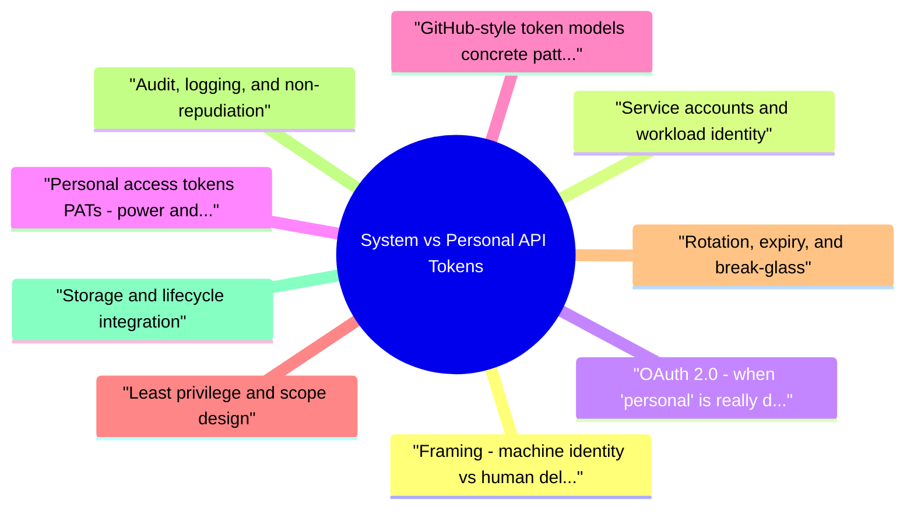

# System vs Personal API Tokens revision map

When a System vs Personal API Tokens follow-up lands, I want one page that still has the misconception and the VAPT step. I pulled headings from Critical Clarification System vs Personal API Toke.md, System vs Personal API Tokens - Comprehensive Guide.md, System vs Personal API Tokens - Interview Question.md, System vs Personal API Tokens - Quick Reference.md. If a heading is here, the guide still owns the detail.

## Framing: machine identity vs human delegation

## Service accounts and workload identity
- Ownership: A team or service owns the account; access is granted through IAM, not through someone's employee record alone.
- Credential shape: Prefer short-lived credentials obtained at runtime (OIDC federation from CI to cloud, instance metadata, workload identity) over long-lived static keys when the platform supports it.
- Blast radius: One compromised workload should not imply org-wide keys. Separate accounts per environment (dev/stage/prod) and per bounded function where cost is acceptable.
- Rotation story: Static keys need calendar rotation and break-glass revocation. Ephemeral credentials rotate by construction but need clock skew, token lifetime policy, and retry behavior when renewal fails.

## OAuth 2.0: when "personal" is really delegation
- OAuth is often described as "user authorization," but it matters which grant you mean:
- Device code, refresh tokens, and downstream API calls: Long-lived refresh tokens behave like secrets; compromise equals ongoing access until revocation.

## Personal access tokens (PATs): power and peril
- A personal access token is typically minted in a user's settings and used like a password for APIs. Risks interviewers expect you to name:
- Permission inheritance: The token may carry everything the user can do, unless the platform offers fine-grained PATs or resource-scoped alternatives.
- Offboarding: If engineers use PATs in cron jobs or shared jump boxes, disabling the user can break production-or worse, orphan secrets nobody rotates.
- Attribution ambiguity in shared systems: The same PAT used from a shared runner makes audit logs say "Alice" when the action was really whoever had shell on that host.
- Phishing and exfiltration: PATs are high-value static strings; they appear in tickets, chat, and leaked .env files.
- Supply chain: CI that echoes masked secrets, flaky redaction in logs, or "temporary" PATs checked into scripts become durable compromise paths.

## GitHub-style token models (concrete pattern language)
- GitHub is a common interview example because it exposes multiple credential types side by side:
- Fine-grained personal access tokens: Tied to a user, but limited to specific repositories and explicit permissions (contents, metadata, actions, etc.). Lower blast radius than legacy broad PATs when configured carefully.
- Classic PATs: Often broad; orgs frequently restrict or ban them for members via policy.
- OAuth Apps: Used for user delegation flows; access tokens represent user-granted scopes. Good when the integration must act as the user; requires solid redirect and secret handling.

## Least privilege and scope design
- Least privilege for tokens is not "read-only everywhere." It is the smallest set of operations on the smallest set of resources that still lets the job complete.
- Split tokens by function: A deploy token should not also administer billing or user management.
- Environment separation: Staging credentials must not work against production APIs.
- Just-in-time elevation: Where platforms support it, obtain elevated scopes for a single operation window instead of keeping them permanent.
- ABAC/RBAC at the API: Even a perfect token fails safely if the API enforces resource-level checks (tenant ID, repo ID, project ID) and not only "valid token."

## Rotation, expiry, and break-glass
- Rotation reduces how long a stolen token remains useful. For static secrets:
- Automate dual-write or grace periods where old and new tokens both work briefly during cutover.
- Track consumers in a registry so you know which pipeline to update.
- Prefer cryptographic key IDs or token prefixes in logs so you can identify which secret leaked from a blob of redacted output.

## Audit, logging, and non-repudiation
- Audit answers should connect token type to what you can prove afterward:
- Personal tokens often map cleanly to a user ID in access logs-useful until the token is used from a shared system.
- Service tokens should map to a service principal ID, client ID, or installation ID, not merely to "backend." Include correlation IDs across services.
- Log authentication method, token fingerprint or key id (not the secret), scopes used, resource, result (allow/deny), and source IP / device where meaningful.

## Storage and lifecycle integration
- System secrets belong in secret managers (Vault, cloud secret stores) with:
- Access policies tied to workload identity, not individual developers' laptops.
- Versioning and automatic rotation hooks where supported.
- Encryption with customer-managed keys when required.

## Decision guide: which credential type?

## Organizational policy checklist
- Inventory: Automated discovery of known secret patterns in repos; token metadata tables in the identity provider.
- Policy: Block or restrict broad PATs; require SSO or enterprise-managed integrations where available.
- Education: "No PATs in CI" posters are crude but reflect real incident patterns.
- Offboarding: Disable user tokens on HR events; run jobs that flag API activity from departed principals.
- Incident response: Pre-stepped revocation order (user sessions, PATs, OAuth grants, service keys) and customer communication if tokens were exposed.

## Common interview traps
- "Service tokens are safer." Only if scoped, stored, and rotated better than personal ones. A privileged service key in a pod spec is not safer.
- "We use JWT so we're fine." JWTs are bearer tokens. Theft still wins unless you add binding (mTLS, DPoP), very short lifetimes, and strong audience checks.
- "Audit logs show the user." Shared PATs and forwarded requests break that story-design for service principals in automation paths.

## CI/CD: why PATs on runners fail audits
- Continuous integration is the highest-risk place for personal credentials because jobs are shared infrastructure: ephemeral VMs, reused caches, fork PR workflows, and logs that accidentally print environment variables.

## Enterprise SSO, managed users, and PAT governance
- Many SaaS platforms integrate with corporate identity providers. Security outcomes you should describe:
- SSO enforcement: Users authenticate through the IdP; the SaaS honors session policies (MFA, conditional access, session length).
- Managed or enterprise accounts: The organization owns member accounts; suspension in the IdP or admin console can cascade to SaaS access.

## GitHub Apps vs OAuth Apps (deeper comparison)
- Installed into an org or selected repos; admins approve requested permissions.
- Uses installation access tokens that expire quickly (typically on the order of an hour). Your service refreshes them as needed.
- Can act as the app itself or impersonate a user only through explicit flows-default automation is non-user oriented.
- Webhooks are first-class; you verify delivery with shared secrets or signatures and treat those secrets like API tokens.
- Drives OAuth authorization for users; access tokens represent user grants.
- Refresh tokens may be long-lived; storage and rotation are critical.
- Good when the product experience is "log in with GitHub and let our SaaS access your repos."

## API keys, JWT access tokens, and opaque bearer tokens
- Interviewers sometimes blur terminology; clarify briefly:
- Opaque API token / PAT: Random secret; authorization server or resource API looks it up in a database or cache. Simple, but database hot paths and revocation lists matter at scale.
- mTLS or DPoP: Ways to bind a token to a client or key, reducing bearer-token replay from passive network observers. Not everywhere supported, but good to mention for "defense in depth" questions.

## Secret scanning, inventory, and operational metrics
- Detection: Central logging of token creation events, anomalous API usage (geo, volume, new user agents), and failed auth spikes.
- Count of active long-lived tokens per org, age distribution, and percentage with expiry.
- Mean time to revoke after employee termination.
- Percentage of CI workloads using federated identity vs static secrets.

## Incident response: credential exposure
- Assume a token appears in a public repo or paste site:
- Revoke immediately at the issuer; rotate downstream secrets if the token could have been used to read them.
- Pull audit logs for the token id or user principal during the exposure window.
- Hunt for similar patterns (same user, same repo, other leaked env files).
- Root cause: Was it a fork workflow, a misconfigured logger, or a developer workaround? Fix the workflow, not only the credential.

## Further reading (authoritative)
- RFC 6749 - The OAuth 2.0 Authorization Framework - grants, roles of resource owner, client, authorization server, resource server.
- Provider documentation for fine-grained PATs, GitHub Apps, OAuth Apps, and enterprise managed accounts - patterns differ; cite the concepts, not only one vendor's names.

## Recall list from Quick Reference

## Key Differences

## Use Cases

### System-Level Tokens
- Service-to-service authentication
- CI/CD pipelines
- Scheduled jobs
- Backend service communication

### Personal-Level Tokens
- User's personal scripts
- Third-party app authorization
- CLI tools
- Local development

## Security Checklist
- Cryptographically random token generation
- Secure storage (secret management for system tokens)
- HTTPS/TLS for all API communication
- Token scoping (principle of least privilege)
- Regular token rotation
- Token monitoring and audit
- Immediate revocation if compromised
- Never store tokens in code or config files

## Storage Best Practices

## Token Rotation

## Best Practices
- Use appropriate token type for use case
- Store tokens securely
- Scope tokens to minimum necessary permissions
- Rotate tokens regularly
- Monitor token usage

## Corrections I keep repeating

## ️ Common Misconceptions

### "System-level and personal-level API tokens work the same way"
- Truth: System-level and personal-level API tokens have fundamentally different use cases, security models, and management requirements.
- Used by services, applications, or automated systems
- Often long-lived or rotated programmatically
- Typically have broader permissions
- Managed at infrastructure/system level
- Associated with individual users
- Used for user-initiated API access
- Scoped to user's permissions

### "Personal tokens are less secure than system tokens"
- Truth: Security depends on how tokens are managed, not just the type. Both can be secure or insecure depending on implementation.
- Token generation (cryptographically random)
- Token storage (secure storage, never in code)
- Token scoping (principle of least privilege)
- Token rotation (regular rotation policies)
- Token monitoring (audit and anomaly detection)

### "System tokens should have all permissions for convenience"
- Truth: System tokens should follow the principle of least privilege - only grant minimum necessary permissions.
- Limits blast radius if compromised
- Enables better audit trails
- Supports security best practices
- Makes token purpose clear

### "Token rotation is only for personal tokens"
- Truth: Both system and personal tokens should be rotated regularly, though rotation strategies may differ.
- User-initiated or automatic expiration
- Often tied to password changes
- Shorter rotation intervals common
- Automated rotation preferred
- May use longer intervals
- Requires coordination with consuming systems
- Often uses token versioning during transition

### "Token storage in environment variables is always secure"
- Truth: Environment variables are one option but have limitations and aren't always the most secure approach.
- Environment variables (good for local dev, risks in production)
- Secret management systems (AWS Secrets Manager, HashiCorp Vault)
- Hardware Security Modules (HSMs) for high-security use cases
- Token management services
- Environment variables can leak (logs, process lists, core dumps)
- Secret management systems provide encryption, rotation, audit
- Different storage for different environments

## Key Takeaways
- Different Use Cases: System tokens for services, personal tokens for users
- Both Need Security: Both token types require proper security controls
- Least Privilege: Limit token permissions to minimum necessary
- Regular Rotation: Both token types benefit from rotation policies
- Secure Storage: Use appropriate storage mechanisms (secret management systems for production)

## What I answer in 90 seconds

- Fundamental questions
- What is the difference between a "system" API token and a "personal" one?
- When would you choose a service account or workload identity instead of a developer's PAT?
- How does OAuth client credentials differ from an authorization code flow from a security perspective?
- What are the main risks of personal access tokens (PATs) in production systems?
- How would you design least privilege for API tokens at scale?
- What does a solid token rotation program look like for system secrets?
- What should audit logs capture for token-based API access?
- Compare GitHub fine-grained PATs, GitHub Apps, and OAuth Apps in an interview-friendly way.
- Why is storing a PAT in CI secrets considered an anti-pattern, and what do you use instead?
- How does enterprise SSO interact with PAT and API security?
- What is the blast-radius difference between org-wide and resource-scoped tokens?
- How do JWT access tokens change your revocation and logging story?
- What operational metrics would you use to govern API tokens?
- Walk through your response if a production API token is found in a public GitHub repository.
- When is it acceptable for a third-party integration to use a user's PAT instead of OAuth?
- How do you prevent "shared bot accounts" from undermining accountability?
- What is token binding (e.g., mTLS, DPoP) and when does it matter?
- How would you explain the tradeoff between opaque API tokens and JWTs to an engineering lead?
- Depth: Interview follow-ups - System vs Personal API Tokens

### What is the difference between a "system" API token and a "personal" one?
- See the source section `What is the difference between a "system" API token and a "personal" one?` for the worked example.

### When would you choose a service account or workload identity instead of a developer's PAT?
- See the source section `When would you choose a service account or workload identity instead of a developer's PAT?` for the worked example.

### When is it acceptable for a third-party integration to use a user's PAT instead of OAuth?
- See the source section `When is it acceptable for a third-party integration to use a user's PAT instead of OAuth?` for the worked example.

### How do you prevent "shared bot accounts" from undermining accountability?
- See the source section `How do you prevent "shared bot accounts" from undermining accountability?` for the worked example.

## Depth: Interview follow-ups - System vs Personal API Tokens
- Authoritative references: Provider docs (GitHub, Azure DevOps, etc.) for fine-grained PATs vs GitHub Apps/OAuth apps patterns-cite generically in interview; OAuth 2.0 for delegation model.
- Non-repudiation / audit: personal tokens tie actions to humans; system tokens need service identity + rotation.
- Blast radius: org-wide PAT vs repo-scoped token.
- Rotation & offboarding - what breaks when someone leaves?

## Nearby reading in this repo

- Stay inside this folder for the long guide. Jump only when a section names a sibling topic.
- Cookie Security, CSRF, XSS, JWT, OAuth, and TLS show up as neighbors on a lot of these maps.
