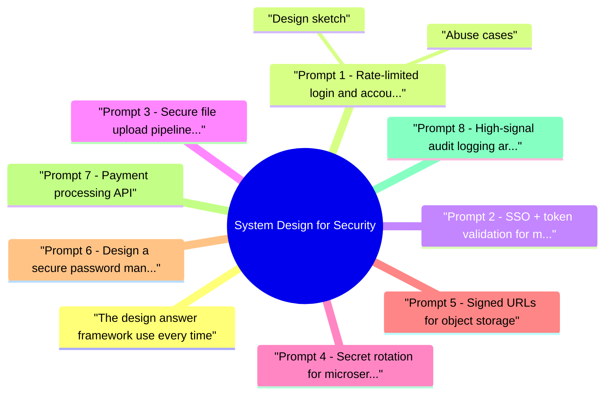

# System Design for Security revision map

Last mock I bounced around the System Design for Security folder. This file is the stop that. Drawn from Critical Clarification System-design-for-security Misconceptions.md, System-design-for-security - Comprehensive Guide.md, System-design-for-security - Interview Questions & Answers.md, System-design-for-security - Quick Reference.md. Skim the mermaid, then the outline.

## The design answer framework (use every time)
- Clarify scope - users, scale (QPS, data size), SLA, compliance (PCI, HIPAA), online/offline.
- Assets & trust boundaries - what must stay confidential/integrity/authentic?
- Top 3 abuse cases - attacker goals, not features first.
- Architecture - components, data flows, crypto at boundaries.
- Controls by layer - identity, transport, app, data, ops, detection.
- Failure modes - safe degradation, break-glass, IdP down.
- Verification - metrics, tests, chaos/red-team hooks.
- Rollout - phased enablement, feature flags, backwards compatibility.

## Prompt 1: Rate-limited login and account lockout

### Abuse cases
- Credential stuffing, password spraying, user enumeration, lockout DoS on victims.
- Token replay, cross-tenant ID confusion, IdP misconfiguration, stale session after offboarding.
- Malware hosting, web shell upload, SSRF via image processors, storage cost abuse, zip slip.
- Long-lived DB passwords in env vars, leaked secrets in logs, rotation causing outage.
- URL sharing beyond intent, parameter tampering, indefinite access, hotlinking cost.
- HMAC-SHA256 over method, path, expiry, optional IP; short TTL (minutes-hours).
- Single-use tokens for sensitive downloads where needed.
- Separate signing key per tenant; key rotation with dual verification window.

### Design sketch
- Constant-time auth responses; generic error messages (anti-enumeration).
- Rate limits: per-IP, per-username, exponential backoff; stricter on auth endpoints.
- Lockout: prefer soft lock + CAPTCHA/MFA step-up over permanent lock (avoid attacker-triggered DoS).
- Breach password list (HIBP k-anonymity API or local bloom filter).
- MFA for anomalous logins; device cookies with rotation.
- OIDC with PKCE for public clients; strict aud/iss validation.
- Tenant ID in token claims mapped to partition key; never trust client-supplied tenant header alone.
- JWKS cache with key rotation support; short access token TTL + refresh rotation.

## Prompt 2: SSO + token validation for multi-tenant SaaS

## Prompt 3: Secure file upload pipeline at scale

## Prompt 4: Secret rotation for microservices

## Prompt 5: Signed URLs for object storage

## Prompt 6: Design a secure password manager (E2E encrypted)

## Prompt 7: Payment processing API

## Prompt 8: High-signal audit logging architecture

## Prompt 9: Third-party webhook ingestion

## Prompt 10: IdP outage resilience

## What interviewers score

## Cross-links
- Threat Modeling · Rate Limiting and Abuse Prevention · Authorization and Authentication · Secrets Management and Key Lifecycle

## Practice drills
- Time yourself 15 minutes each on prompts 1, 3, and 6. Record and review against the framework above.

## Flags I check in 90 seconds

## 5-step answer
- Scope -> abuse cases -> layered controls -> failure modes -> metrics/verification

## Must-cover dimensions
- Identity · authorization · data boundaries · secrets · telemetry · response

## Strong design prompts
- Secure login · SSO · file upload · secret rotation · signed URLs · audit logs

## Cross-read
- Threat Modeling · IAM and Least Privilege at Scale · Secure CI CD Pipeline Security

## Misreads that still sneak in

## "Security design is just adding WAF and MFA."
- Reality: Design quality depends on threat boundaries, authorization model, and data flow controls.

## "A perfect architecture can skip incident planning."
- Reality: Detection, response, and rollback paths are core design components.

## "Compliance architecture equals secure architecture."
- Reality: Compliance can be necessary but not sufficient for real abuse resistance.

## "Zero trust means zero usability."
- Reality: Risk-adaptive controls can preserve UX while reducing exposure.

## "One design works for all tenants."
- Reality: Multi-tenant isolation and policy granularity vary by risk and product model.

## "Logging everything solves observability."
- Reality: Structured, high-signal telemetry and response playbooks matter more than volume.

## "System design questions are theoretical."
- Reality: Interviewers evaluate production realism, migration strategy, and measurable outcomes.

## "Security team alone owns architecture decisions."
- Reality: Platform, product, legal, and operations co-own key constraints.

## Clusters from the Q&A file

- Q: What if security controls hurt UX?
- Q: How do you prove the design works?
- Q: What do you do during IdP outage?
- Q: How do you prioritize roadmap items?

## 60-second answer
- Q: How do you approach a security system design interview?
- A: I clarify scope and assets, define top abuse cases, propose layered controls with clear trust boundaries, then discuss operational tradeoffs, telemetry, and rollout verification.

## Mock ladder

## Cross-links I actually follow

- Stay inside this folder for the long guide. Jump only when a section names a sibling topic.
- Cookie Security, CSRF, XSS, JWT, OAuth, and TLS show up as neighbors on a lot of these maps.
