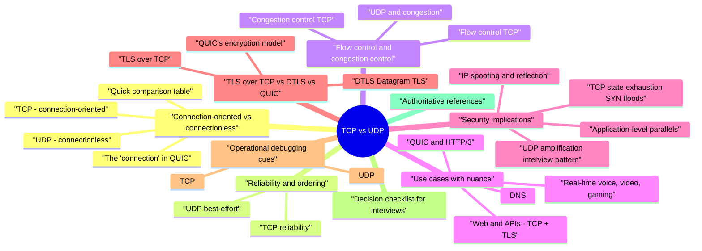

# TCP vs UDP revision map

I keep this TCP vs UDP map for the night before a screen, when five markdown files is too many clicks. Built from Critical Clarification TCP vs UDP Misconceptions.md, TCP vs UDP - Comprehensive Guide.md, TCP vs UDP - Interview Questions & Answers.md, TCP vs UDP - Quick Reference.md, TCP vs UDP.md. Twenty minutes. Then I close the laptop.

## Connection-oriented vs connectionless

### TCP: connection-oriented
- See the source section `TCP: connection-oriented` for the worked example.

### UDP: connectionless
- Why it matters: Lower setup latency and simpler servers for request/response workloads-but also no transport-level backpressure contract unless you build one.

### The "connection" in QUIC
- See the source section `The "connection" in QUIC` for the worked example.

### Quick comparison table
- See the source section `Quick comparison table` for the worked example.

## Reliability and ordering

### TCP reliability
- Sequence numbers and acknowledgments so the receiver can detect loss and duplicates.
- Retransmissions after timeout or duplicate ACK patterns (modern stacks also use variants of fast retransmit / recovery).
- Checksum coverage of TCP header and payload (integrity at the segment level; it is not a substitute for TLS).

### UDP best-effort
- Interview framing: choose UDP when timeliness beats completeness (late video frame is worthless), or when statelessness and simplicity dominate.

## Flow control and congestion control

### Flow control (TCP)
- TCP's sliding window prevents a fast sender from overwhelming a slow receiver's buffers. Receivers advertise rwnd (receive window); senders must respect it.

### Congestion control (TCP)
- See the source section `Congestion control (TCP)` for the worked example.

### UDP and congestion
- See the source section `UDP and congestion` for the worked example.

## Use cases (with nuance)

### DNS
- See the source section `DNS` for the worked example.

### Web and APIs: TCP + TLS
- HTTPS is overwhelmingly TLS over TCP (with ALPN negotiating h2 or http/1.1). The connection is reliable and ordered, which matches file-like resource fetch and RPC semantics.

### QUIC and HTTP/3
- See the source section `QUIC and HTTP/3` for the worked example.

### Real-time voice, video, gaming
- VoIP and interactive games frequently prefer UDP (or QUIC's unreliable datagram extensions in newer designs) because:
- Retransmitting old audio/video frames can waste bandwidth and increase jitter.
- PLC (packet loss concealment), FEC, and adaptive bitrate handle loss at the application layer.

### File transfer and messaging
- See the source section `File transfer and messaging` for the worked example.

### NAT, firewalls, and UDP longevity
- Interview angle: choosing UDP for a new product means planning for enterprise egress, UDP blocking, and TURN/TCP fallback in WebRTC-style architectures-not only raw performance.

## Security implications

### IP spoofing and reflection
- Common reflectors: misconfigured DNS, NTP, SSDP, memcached, CLDAP, etc. Defenses include BCP 38 / uRPF-style ingress filtering, disable unnecessary services, response rate limiting, RRL for DNS, and edge scrubbing.

### UDP amplification (interview pattern)
- Attacker -> (small UDP query, spoofed src = victim) -> open resolver/service -> large UDP response -> victim.
- Mitigation themes: do not run open resolvers on the public Internet unless engineered for it, cap response sizes, authenticate where feasible, and monitor abnormal query/response ratios.

### TCP state exhaustion (SYN floods)
- In SYN flood attacks, attackers send many SYN segments (often from spoofed sources), forcing the server to hold half-open state until timeouts expire. If tables fill, legitimate handshakes fail.
- Mitigations: SYN cookies (encode state in sequence numbers so memory is not reserved until ACK), tune backlogs, SYN proxies at load balancers, firewall/ratelimit SYNs, DDoS appliances / cloud scrubbing.

### Application-level parallels
- See the source section `Application-level parallels` for the worked example.

## TLS over TCP vs DTLS vs QUIC

### TLS over TCP
- Interview point: TLS provides confidentiality, integrity, and identity between endpoints; it does not fix application authZ bugs.

### DTLS (Datagram TLS)
- Contrast: DTLS must be careful about path MTU; DTLS 1.3 improves handshake efficiency and aligns more closely with TLS 1.3 concepts.
- Interview sound bite: "TLS needs TCP's reliability; DTLS brings a datagram-safe handshake and record layer so keys and counters stay consistent when packets reorder or disappear."

### QUIC's encryption model
- See the source section `QUIC's encryption model` for the worked example.

## Operational debugging cues

### TCP
- Wireshark: SYN/SYN-ACK/ACK, retransmissions, duplicate ACKs, RST storms, zero-window probes.
- Symptoms: stalls with good link but lossy Wi-Fi, proxy timeouts, MTU black holes (PMTUD issues manifest as TCP weirdness).

### UDP
- Wireshark: gaps in RTP sequence numbers, ICMP port unreachable, fragmentation.
- Symptoms: "works on LAN, flaky on Internet" often means missing congestion control, MTU/fragmentation, or NAT behavior with long UDP flows.

## Decision checklist (for interviews)
- Choose TCP (or QUIC reliable streams) when:
- You need in-order, complete delivery and want standard congestion behavior.
- You expose a service on the public Internet without a specialized media stack.
- Latency and timeliness dominate and controlled loss is acceptable.
- You are implementing a carefully engineered protocol (media, games, DNS-like patterns) with explicit rate limits and security controls.

## Authoritative references
- RFC 9293 - Transmission Control Protocol (TCP)
- RFC 768 - User Datagram Protocol
- RFC 9000 - QUIC: A UDP-Based Multiplexed and Secure Transport
- RFC 9147 - The Datagram Transport Layer Security (DTLS) Protocol Version 1.3
- IANA Service Name and Transport Protocol Port Number Registry

## Cross-reads in this repo
- Pair with TLS, DDoS and Resilience, Rate Limiting and Abuse Prevention, and Cloud / network architecture notes for full-stack interview depth.

## Appendix: handshake and teardown (TCP mental model)
- Client -> Server: SYN (pick ISN).
- Server -> Client: SYN-ACK (pick ISN, acknowledge client's ISN+1).
- Client -> Server: ACK (acknowledge server's ISN+1).

## Appendix: UDP header and semantics (interview facts)

## Appendix: SCTP and "TCP vs UDP" in the wild

## Appendix: measurement and SRE hooks
- For UDP services, monitor query-to-response size ratios, unique source entropy (spoofed floods look different from organic clients), and ICMP unreachable spikes that may indicate scanning or misdirected traffic.

## Cheat sheet bits

## TCP (Transmission Control Protocol)
- Connection-oriented · reliable, ordered byte stream · flow control + congestion control
- Use when: HTTP/1.1, SMTP, SSH, DB protocols needing reliable delivery
- Watch for: stream reassembly, TIME-WAIT, SYN floods, middlebox tampering

## UDP (User Datagram Protocol)
- Connectionless datagrams · best-effort · no ordering/retransmission in the protocol
- Use when: DNS, VoIP, gaming, QUIC/HTTP3 stack
- Watch for: amplification, spoofing, app-level reliability needed elsewhere

## QUIC / HTTP/3 note
- QUIC runs over UDP but adds encryption, streams, multiplexing without HOL blocking-not "raw UDP".

## Interview framing

## Cross-read
- TLS · HTTP Request Smuggling (shared edge protocol literacy)

## One-liner

## Other notes sitting in the folder

## In this folder
- TCP vs UDP - Interview Questions & Answers - Condensed Q&A for interview practice.

## Cross-reads
- Pair with TLS, DDoS and Resilience, and Rate Limiting and Abuse Prevention elsewhere in this repo for edge and abuse context.

## Traps that dump interviews

## "UDP is always less secure than TCP."
- Reality: Security comes from TLS, app crypto, and auth-UDP transports (QUIC) can be as strong as TCP + TLS when properly implemented.

## "TCP guarantees message boundaries."
- Reality: TCP is a byte stream; framing is application responsibility (length prefix, delimiters).

## "Firewalls block UDP, so UDP services are safe."
- Reality: Exposed UDP services (DNS, NTP, VPN) are common amplification and spoofing targets.

## "No handshake means UDP cannot be scanned."
- Reality: Probes and error responses still reveal state; OS fingerprinting uses both protocols.

## "Reliable delivery is free with TCP."
- Reality: Head-of-line blocking and bufferbloat hurt latency; some apps prefer QUIC/UDP patterns.

## "SYN flood only affects TCP."
- Reality: UDP floods and stateless reflection attacks are parallel DoS classes.

## "Port numbers imply encryption."
- Reality: 443 often carries TLS, but protocol negotiation defines security-not the port magic number.

## "UDP is only for DNS and video."
- Reality: HTTP/3 over QUIC is UDP-based-major web traffic shift.

## "Connectionless means stateless server."
- Reality: Servers track sessions above UDP; state exists in app memory or DB.

## "Choosing TCP vs UDP is purely a performance decision."
- Reality: Threat model (spoofing, replay, NAT binding) feeds into transport choice and whether you add TLS/custom integrity.

## Prompts I drill out loud

- In one minute, what is the fundamental difference between TCP and UDP?
- How does TCP provide reliability, and what are its limits?
- How does TCP preserve ordering, and what is head-of-line blocking?
- What is the difference between flow control and congestion control?
- Why is TCP described as "network friendly," and why does naive UDP worry operators?
- What problem does QUIC solve relative to TCP plus TLS plus HTTP/2?
- Why does DNS traditionally use UDP, and when does it switch to TCP or encrypted transports?
- Why are UDP-based services associated with amplification and reflection attacks?
- How do SYN floods exploit TCP, and how do defenders mitigate them?
- Compare TLS over TCP with DTLS over UDP.
- Can you run "plain" TLS records directly over UDP without DTLS or QUIC?
- When would you choose UDP (or QUIC datagrams) for a real-time product, and what must you still build?
- Is video always UDP?
- When would you insist on TCP or QUIC reliable streams for an internal API?
- How do you debug intermittent loss differently for TCP-heavy vs UDP-heavy services?
- How does NAT behavior differ for long-lived TCP vs UDP flows?
- What operational metrics should you watch on TCP-heavy vs UDP-heavy frontends?
- What is BCP 38, and why do security engineers care on UDP abuse threads?
- References and follow-ups

## Why is TCP described as "network friendly," and why does naive UDP worry operators?

## Can you run "plain" TLS records directly over UDP without DTLS or QUIC?

## Sibling folders

- Stay inside this folder for the long guide. Jump only when a section names a sibling topic.
- Cookie Security, CSRF, XSS, JWT, OAuth, and TLS show up as neighbors on a lot of these maps.
