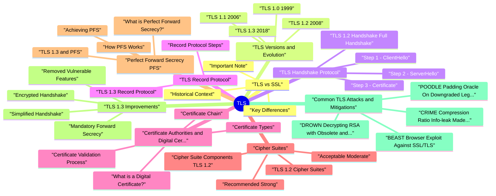

# TLS revision map

I keep this TLS map for the night before a screen, when five markdown files is too many clicks. Built from Critical Clarification TLS Misconceptions.md, TLS (Transport Layer Security) - Comprehensive Gui.md, TLS - Interview Questions & Answers.md, TLS - Quick Reference.md. Twenty minutes. Then I close the laptop.

### What is TLS?
- See the source section `What is TLS?` for the worked example.

### Core Security Properties
- TLS provides three fundamental security properties:
- Confidentiality: Data is encrypted and cannot be read by unauthorized parties
- Integrity: Data cannot be modified or tampered with during transmission
- Authenticity: The identity of the communicating parties is verified

### Why TLS Matters
- Protects sensitive data: Login credentials, credit card numbers, personal information
- Prevents eavesdropping: Encrypts data in transit
- Prevents tampering: Ensures data hasn't been modified
- Establishes trust: Verifies server identity through certificates
- Regulatory compliance: Required by GDPR, PCI-DSS, HIPAA, and other regulations

### Common Use Cases
- HTTPS: Secure web browsing (HTTP over TLS)
- Email: SMTP, IMAP, POP3 with TLS
- VoIP: Secure voice communications
- File Transfers: FTPS (FTP over TLS)
- VPN: Secure remote access
- API Communications: REST APIs over HTTPS
- Database Connections: Encrypted database connections

## TLS vs SSL

### Historical Context
- SSL (Secure Sockets Layer): Developed by Netscape in the 1990s
- SSL 1.0: Never released (had security flaws)
- SSL 2.0: Released 1995, deprecated due to vulnerabilities
- SSL 3.0: Released 1996, deprecated in 2015 (RFC 7568)
- TLS (Transport Layer Security): Successor to SSL, standardized by IETF
- TLS 1.0 (1999): Based on SSL 3.0, now deprecated
- TLS 1.1 (2006): Enhanced CBC protection, now deprecated
- TLS 1.2 (2008): Widely used, still supported

### Key Differences
- See the source section `Key Differences` for the worked example.

### Important Note
- Despite the technical distinction, people often use "SSL" and "TLS" interchangeably. When someone says "SSL certificate," they typically mean a TLS certificate. However, SSL itself should never be used in production.

## TLS Versions and Evolution

### TLS 1.0 (1999)
- Based on SSL 3.0
- Support for various cipher suites
- Basic certificate validation
- BEAST attack (2011)
- Weak cipher suites
- No forward secrecy by default

### TLS 1.1 (2006)
- Protection against CBC attacks
- Improved IV handling
- Still vulnerable to various attacks
- Weak cipher suites
- No forward secrecy by default

### TLS 1.2 (2008)
- Support for authenticated encryption (AEAD)
- SHA-256 and SHA-384 hash functions
- Galois/Counter Mode (GCM) cipher modes
- Optional forward secrecy (with DHE/ECDHE)
- ChaCha20-Poly1305 (in some implementations)

### TLS 1.3 (2018)
- Simplified Handshake: Reduced from 2 round-trips to 1 (or 0 with resumption)
- Mandatory Forward Secrecy: All cipher suites provide PFS
- Removed Vulnerable Features:
- Compression (CRIME attack vector)
- Renegotiation
- Weak cipher suites
- Static RSA key exchange
- MD5 and SHA-1 hash functions

## TLS Handshake Protocol
- The TLS handshake is the process by which a client and server establish a secure connection. It involves several steps to negotiate cryptographic parameters, authenticate the server, and establish session keys.

### TLS 1.2 Handshake (Full Handshake)
- See the source section `TLS 1.2 Handshake (Full Handshake)` for the worked example.

### Step 1: ClientHello
- The client initiates the handshake by sending a ClientHello message containing:
- Key Difference: Client sends its key share immediately, reducing round-trips.

### Step 2: ServerHello
- The server responds with a ServerHello message containing:

### Step 3: Certificate
- The server sends its digital certificate chain:
- Server's public key
- Server's domain name (CN or SAN)
- Issuer (Certificate Authority)
- Validity period
- Digital signature

### Step 4: ServerKeyExchange (if needed)
- For cipher suites using ephemeral key exchange (DHE/ECDHE), the server sends:

### Step 5: ServerHelloDone
- The server indicates it has finished sending its handshake messages.

### Step 6: ClientKeyExchange
- See the source section `Step 6: ClientKeyExchange` for the worked example.

### Step 7: ChangeCipherSpec
- Both parties send this message to indicate they will now use the negotiated cipher suite.

### Step 8: Finished
- Both parties send encrypted Finished messages containing:
- Hash of all previous handshake messages
- Verification that the handshake was successful

### TLS 1.3 Handshake (Simplified)
- TLS 1.3 simplifies the handshake significantly:

### Step 3: EncryptedExtensions
- Server sends additional extensions (encrypted).

### Step 4: Certificate
- Server sends its certificate (encrypted).

### Step 5: CertificateVerify
- Server proves it owns the private key (encrypted).

### Step 6: Finished
- Server sends Finished message (encrypted).

### Step 7: Client Finished
- Client sends Finished message (encrypted).
- Result: Secure connection established in 1 round-trip (vs 2 in TLS 1.2).

### Key Exchange Methods
- See the source section `Key Exchange Methods` for the worked example.

### RSA Key Exchange (TLS 1.2 only, removed in TLS 1.3)
- Client generates pre-master secret
- Client encrypts pre-master secret with server's public key
- Client sends encrypted pre-master secret to server
- Server decrypts with its private key
- No forward secrecy
- If server's private key is compromised, all past sessions can be decrypted
- Removed in TLS 1.3

### Diffie-Hellman (DH/DHE)
- Client and server agree on parameters (p, g)
- Client generates private key a, computes A = g^a mod p
- Server generates private key b, computes B = g^b mod p
- Client sends A to server
- Server sends B to client
- Both compute shared secret: s = B^a mod p = A^b mod p
- Provides forward secrecy (ephemeral keys)
- Computationally expensive

### Elliptic Curve Diffie-Hellman (ECDH/ECDHE)
- Client and server agree on elliptic curve parameters
- Client generates private key a, computes public key A = a * G
- Server generates private key b, computes public key B = b * G
- Client sends A to server
- Server sends B to client
- Both compute shared secret: S = a B = b A
- Provides forward secrecy
- More efficient than regular DH (smaller keys, faster computation)

### Master Secret and Session Keys
- After key exchange, both parties derive keys:
- Pre-Master Secret: Generated from key exchange
- Master Secret: Derived from pre-master secret + client random + server random
- Session Keys: Derived from master secret for:
- Client write encryption key
- Server write encryption key
- Client write MAC key
- Server write MAC key

## TLS Record Protocol
- Once the handshake is complete, the TLS Record Protocol handles secure data transmission.

### Record Protocol Steps
- Fragmentation: Data is split into manageable chunks (max 16KB for TLS 1.2, 16KB for TLS 1.3)
- Compression (TLS 1.2 only, removed in TLS 1.3):
- Optional compression
- Removed due to CRIME attack vulnerability
- MAC Calculation (TLS 1.2 with non-AEAD ciphers):
- Message Authentication Code computed
- Ensures integrity
- Encryption:

### TLS 1.3 Record Protocol
- TLS 1.3 uses Authenticated Encryption with Associated Data (AEAD):
- Fragmentation: Split into chunks
- AEAD Encryption: Single operation that provides both encryption and authentication
- Record Header: Added
- Transmission: Sent over network
- More efficient (single operation)
- Stronger security guarantees
- Simpler implementation

## Certificate Authorities and Digital Certificates

### What is a Digital Certificate?
- A digital certificate is an electronic document that binds a public key to an identity (domain, organization, etc.). It's issued by a Certificate Authority (CA) and contains:
- Subject: Entity the certificate identifies (domain name, organization)
- Public Key: The public key associated with the entity
- Issuer: Certificate Authority that issued it
- Validity Period: Start and expiration dates
- Digital Signature: CA's signature proving authenticity
- Extensions: Additional information (SAN, key usage, etc.)

### Certificate Chain
- Root CAs are kept offline for security
- Intermediate CAs handle day-to-day certificate issuance
- If intermediate CA is compromised, only it needs to be revoked

### Certificate Validation Process
- When a client receives a server certificate, it validates:
- Certificate Chain: Verifies chain up to trusted root CA
- Expiration: Checks if certificate is within validity period
- Revocation: Checks if certificate has been revoked (OCSP/CRL)
- Domain Match: Verifies certificate matches the requested domain (CN or SAN)
- Signature: Verifies CA's digital signature
- Key Usage: Ensures certificate can be used for TLS

### Certificate Types
- See the source section `Certificate Types` for the worked example.

### Domain Validation (DV)
- Validation: Only domain ownership verified
- Use Case: Basic websites, blogs
- Issuance Time: Minutes to hours
- Cost: Low/Free (Let's Encrypt)

### Organization Validation (OV)
- Validation: Domain + organization verified
- Use Case: Business websites
- Issuance Time: Days
- Cost: Moderate

### Extended Validation (EV)
- Validation: Extensive verification of organization
- Use Case: High-trust websites (banks, e-commerce)
- Issuance Time: Days to weeks
- Cost: High
- Note: Modern browsers no longer show EV indicators prominently

### Certificate Pinning
- Certificate pinning involves associating a host with its expected certificate or public key.
- Certificate Pinning: Pin specific certificate
- Public Key Pinning: Pin public key (allows certificate renewal)
- Prevents MITM attacks even with compromised CA
- Additional layer of security
- Certificate expiration/rotation issues
- Hard to maintain
- Can break applications if not managed properly

### Certificate Transparency (CT)
- Certificate Transparency is a framework that:
- Logs all certificates issued by CAs
- Allows monitoring for unauthorized certificates
- Helps detect mis-issuance
- Required by browsers for certain certificate types

## Cipher Suites
- A cipher suite is a combination of cryptographic algorithms used to secure a TLS connection.

### Cipher Suite Components (TLS 1.2)
- A cipher suite name like TLS_ECDHE_RSA_WITH_AES_256_GCM_SHA384 breaks down as:
- Key Exchange: ECDHE (Elliptic Curve Diffie-Hellman Ephemeral)
- Authentication: RSA (RSA signature)
- Encryption: AES_256_GCM (AES-256 in GCM mode)
- MAC/Hash: SHA384 (SHA-384 hash function)

### TLS 1.2 Cipher Suites
- See the source section `TLS 1.2 Cipher Suites` for the worked example.

### Recommended (Strong)
- TLS_ECDHE_RSA_WITH_AES_256_GCM_SHA384
- TLS_ECDHE_RSA_WITH_AES_128_GCM_SHA256
- TLS_ECDHE_ECDSA_WITH_AES_256_GCM_SHA384
- TLS_ECDHE_ECDSA_WITH_AES_128_GCM_SHA256
- TLS_ECDHE_RSA_WITH_CHACHA20_POLY1305_SHA256
- TLS_ECDHE_ECDSA_WITH_CHACHA20_POLY1305_SHA256

### Acceptable (Moderate)
- TLS_DHE_RSA_WITH_AES_256_GCM_SHA384
- TLS_DHE_RSA_WITH_AES_128_GCM_SHA256

### Weak (Avoid)
- TLS_RSA_WITH_AES_256_CBC_SHA256 (no forward secrecy)
- TLS_RSA_WITH_AES_128_CBC_SHA256 (no forward secrecy)
- TLS_RSA_WITH_3DES_EDE_CBC_SHA (weak encryption)

### TLS 1.3 Cipher Suites
- TLS 1.3 only supports these strong cipher suites:
- TLS_AES_128_GCM_SHA256
- TLS_AES_256_GCM_SHA384
- TLS_CHACHA20_POLY1305_SHA256
- TLS_AES_128_CCM_SHA256
- TLS_AES_128_CCM_8_SHA256
- No key exchange algorithm in name (always ephemeral)
- No authentication algorithm in name (handled separately)

### Choosing Cipher Suites
- Prioritize Forward Secrecy: Use ECDHE or DHE
- Use AEAD Ciphers: GCM, CCM, or ChaCha20-Poly1305
- Avoid Weak Algorithms: RC4, 3DES, MD5, SHA-1
- Prefer ECDHE over DHE: More efficient
- Use TLS 1.3: Simplifies cipher suite selection

## Perfect Forward Secrecy (PFS)

### What is Perfect Forward Secrecy?
- See the source section `What is Perfect Forward Secrecy?` for the worked example.

### How PFS Works
- See the source section `How PFS Works` for the worked example.

### Achieving PFS
- PFS is achieved through ephemeral key exchange:
- DHE (Diffie-Hellman Ephemeral): New DH parameters for each session
- ECDHE (Elliptic Curve Diffie-Hellman Ephemeral): New EC key pair for each session

### TLS 1.3 and PFS
- All cipher suites use ephemeral key exchange
- Static RSA key exchange removed
- Forward secrecy guaranteed for all connections

### Why PFS Matters
- Long-term key compromise
- Government surveillance
- Data retention requirements
- Compliance (some regulations require PFS)
- Attacker records encrypted traffic
- Months later, server's private key is compromised
- Attacker can decrypt all recorded traffic
- Sensitive data exposed retroactively

## TLS 1.3 Improvements

### Simplified Handshake
- Reduced latency (especially important for mobile networks)
- Faster connection establishment
- Better user experience

### Mandatory Forward Secrecy
- All TLS 1.3 cipher suites provide PFS
- Static RSA key exchange removed
- Ephemeral key exchange only

### Removed Vulnerable Features
- Compression (CRIME attack vector)
- Renegotiation (complex, potential vulnerabilities)
- Weak cipher suites (RC4, 3DES, etc.)
- Static RSA key exchange
- MD5 and SHA-1 hash functions
- CBC mode ciphers (except for compatibility)
- Export-grade ciphers

### Encrypted Handshake
- TLS 1.2: Most handshake messages in plaintext
- Server certificate visible
- Server name visible (SNI)
- Negotiated parameters visible
- Server certificate encrypted (after initial key exchange)
- Better privacy protection
- Hides more metadata

### 0-RTT (Zero Round-Trip Time Resumption)
- TLS 1.3 supports 0-RTT for resumed connections:
- Client and server establish initial connection
- Server provides session ticket
- On subsequent connection, client can send data immediately with 0-RTT
- Server can respond before handshake completes
- 0-RTT data is vulnerable to replay attacks
- Should only be used for idempotent operations
- Server must implement replay protection

### Improved Cipher Suite Selection
- Only AEAD ciphers (authenticated encryption)
- Simplified cipher suite names
- Better performance
- Stronger security guarantees

## Common TLS Attacks and Mitigations

### BEAST (Browser Exploit Against SSL/TLS)
- Attack Type: Chosen-plaintext attack against CBC mode
- Exploits predictable IVs in CBC mode
- Allows decryption of encrypted data
- Requires attacker to be on same network
- Use TLS 1.2 or higher
- Use GCM mode instead of CBC
- Use TLS 1.3 (CBC removed)

### CRIME (Compression Ratio Info-leak Made Easy)
- Attack Type: Compression-based side-channel attack
- Exploits compression in TLS (TLS 1.2)
- Measures compressed size to infer plaintext
- Can extract cookies, authentication tokens
- Disable compression (TLS 1.3 removes it entirely)
- Use compression-resistant data formats

### POODLE (Padding Oracle On Downgraded Legacy Encryption)
- Forces downgrade to SSL 3.0
- Exploits padding oracle vulnerability in SSL 3.0
- Allows decryption of data
- Disable SSL 3.0
- Use TLS 1.2 or higher
- Use TLS 1.3 (CBC removed)

### DROWN (Decrypting RSA with Obsolete and Weakened eNcryption)
- Exploits SSLv2 servers sharing RSA key with TLS server
- Uses SSLv2 weakness to decrypt TLS connections
- Requires SSLv2 to be enabled
- Disable SSLv2 completely
- Use separate keys for SSLv2 and TLS
- Use TLS 1.3 (different key exchange)

### FREAK (Factoring RSA Export Keys)
- Attack Type: Man-in-the-middle downgrade attack
- Forces use of export-grade RSA keys (512-bit)
- Weak keys can be factored
- Allows decryption
- Disable export-grade ciphers
- Use TLS 1.2 or higher
- Use TLS 1.3 (export ciphers removed)

### Logjam
- Attack Type: Man-in-the-middle downgrade attack
- Forces use of weak Diffie-Hellman parameters
- Pre-computes discrete log for common parameters
- Allows decryption
- Use strong, unique DH parameters (2048+ bits)
- Use ECDHE instead of DHE
- Use TLS 1.3

### Heartbleed
- Attack Type: Buffer over-read vulnerability
- Exploits OpenSSL heartbeat extension bug
- Allows reading server memory
- Can leak private keys, session data
- Update OpenSSL to patched version
- Replace compromised certificates
- Rotate private keys

### Lucky 13
- Attack Type: Timing attack against MAC verification
- Exploits timing differences in MAC verification
- Allows decryption of data
- Requires many requests
- Use constant-time MAC verification
- Use GCM mode (AEAD)
- Use TLS 1.3

### RC4 Attacks
- Attack Type: Statistical bias in RC4 keystream
- Exploits statistical biases in RC4
- Allows partial plaintext recovery
- Requires large amount of data
- Disable RC4 completely
- Use AES or ChaCha20
- Use TLS 1.3 (RC4 removed)

### Renegotiation Attack
- Attack Type: Man-in-the-middle during renegotiation
- Attacker injects data during renegotiation
- Server treats attacker's data as part of original session
- Allows request injection
- Use secure renegotiation extension
- Disable renegotiation if not needed
- Use TLS 1.3 (renegotiation removed)

### General Mitigation Strategies
- Use Latest TLS Version: Prefer TLS 1.3, minimum TLS 1.2
- Disable Old Protocols: Disable SSL 3.0, TLS 1.0, TLS 1.1
- Strong Cipher Suites: Use only strong, modern cipher suites
- Forward Secrecy: Ensure PFS is enabled
- Keep Software Updated: Regularly update TLS libraries
- Proper Configuration: Follow security best practices
- Regular Testing: Use tools like SSL Labs, testssl.sh
- Certificate Management: Proper certificate lifecycle management

## TLS Configuration Best Practices

### Server Configuration
- See the source section `Server Configuration` for the worked example.

### Protocol Versions
- See the source section `Protocol Versions` for the worked example.

### Cipher Suite Selection
- TLS 1.3 (automatic, only strong ciphers):
- No configuration needed (all supported ciphers are strong)
- Prefer strong cipher suites
- Avoid weak algorithms
- Let server choose from client's list

### Certificate Configuration
- Use certificates from trusted CAs
- Include Subject Alternative Names (SAN) for all domains
- Keep certificates up to date (auto-renewal recommended)
- Use strong key sizes (RSA 2048+ or ECDSA P-256+)
- Enable OCSP stapling
- Implement certificate pinning (if appropriate)

### OCSP Stapling
- What it is: Server includes OCSP response with certificate
- Faster validation (no separate OCSP request)
- Better privacy (OCSP server doesn't know which sites user visits)
- Reduced load on OCSP servers

### HSTS (HTTP Strict Transport Security)
- What it is: HTTP header telling browsers to always use HTTPS
- Prevents downgrade attacks
- Forces HTTPS for all connections
- Protects against cookie theft over HTTP

### Session Management
- Session Timeout: Set appropriate timeout (e.g., 1 hour)
- Session Resumption: Enable for performance
- Session IDs (TLS 1.2)
- Session tickets (TLS 1.2, TLS 1.3)

### Client Configuration
- See the source section `Client Configuration` for the worked example.

### Protocol Support
- Support TLS 1.3 (preferred)
- Support TLS 1.2 (fallback)
- Do not support deprecated versions

### Certificate Validation
- Certificate chain
- Certificate expiration
- Certificate revocation (OCSP/CRL)
- Domain name match
- Certificate signature
- Skip certificate validation (even in development)
- Accept self-signed certificates without user warning
- Ignore certificate errors

### Testing and Validation
- See the source section `Testing and Validation` for the worked example.

### Tools
- SSL Labs SSL Test: https://www.ssllabs.com/ssltest/
- Comprehensive TLS configuration analysis
- Grades from A+ to F
- Detailed recommendations
- testssl.sh: Command-line TLS testing tool
- Tests various TLS aspects
- Checks for vulnerabilities
- Provides detailed reports

### Checklist
- [ ] TLS 1.3 enabled (or TLS 1.2 minimum)
- [ ] Old protocols disabled (SSL 3.0, TLS 1.0, TLS 1.1)
- [ ] Strong cipher suites only
- [ ] Forward secrecy enabled
- [ ] Valid, trusted certificates
- [ ] OCSP stapling enabled
- [ ] HSTS configured
- [ ] Certificate auto-renewal configured

## Real-World Scenarios

### Scenario 1: E-Commerce Website
- Secure payment processing
- Customer data protection
- PCI-DSS compliance
- Good performance
- Maximum security for sensitive transactions
- Compliance with PCI-DSS requirements
- Strong authentication (EV/OV certificate)
- Performance optimization (OCSP stapling, session resumption)

### Scenario 2: API Server
- High performance
- Low latency
- Secure API communications
- Mobile app support
- Performance critical (0-RTT for idempotent requests)
- TLS 1.3 reduces latency
- Session resumption improves performance
- DV certificate sufficient (no user-facing browser)

### Scenario 3: Internal Service
- Internal network only
- High security
- Certificate management simplicity
- Internal CA acceptable (controlled environment)
- Certificate pinning adds security
- mTLS for mutual authentication
- Still use strong protocols (defense in depth)

### Scenario 4: Legacy System Migration
- Support legacy clients
- Gradual migration
- Maintain compatibility
- Gradual migration approach
- Support legacy while migrating
- Clear migration timeline
- Monitor legacy client usage

### Scenario 5: High-Security Application (Banking)
- Maximum security
- Regulatory compliance
- Audit requirements
- Defense in depth
- Maximum security posture
- No compromise on security
- Multiple layers of protection
- Short sessions reduce exposure window

### Key Takeaways
- TLS provides three core security properties: Confidentiality, Integrity, Authenticity
- TLS 1.3 is the current standard: Simplified handshake, mandatory PFS, only strong ciphers
- Always use TLS 1.3 or TLS 1.2 minimum: Never use SSL 3.0, TLS 1.0, or TLS 1.1
- Forward Secrecy is critical: Use ephemeral key exchange (ECDHE/DHE)
- Proper certificate management: Valid certificates, auto-renewal, OCSP stapling
- Defense in depth: Combine TLS with HSTS, certificate pinning, proper configuration
- Regular testing: Use SSL Labs, testssl.sh, and other tools
- Keep software updated: Regularly update TLS libraries and configurations

### Essential TLS Configuration
- Remember: TLS is just one layer of security. Always implement defense-in-depth with proper authentication, authorization, input validation, and other security measures.

## Cheat sheet bits

## Roles
- Confidentiality + integrity + server auth (and optionally client auth) for application layer data over TCP (or QUIC for TLS 1.3 profiles in HTTP/3 contexts).

## Handshake (conceptual)
- ClientHello (ciphers, key_shares) -> ServerHello + cert chain -> key agreement -> Finished -> AEAD record layer

## Modern defaults (interview vocabulary)
- TLS 1.2+ minimum; prefer 1.3 · AEAD only (AES-GCM, ChaCha20-Poly1305) · disable SSLv3/TLS1.0/1.1 in greenfield

## Certificates
- Leaf + intermediate chain to trusted root · SAN matches hostname · EKU for serverAuth · watch expiry and rotation automation

## Termination patterns
- Edge terminate (CDN) vs end-to-end to origin vs re-encrypt at LB-each changes trust boundaries and logging

## Key refs
- RFC 8446 (TLS 1.3) · RFC 5280 ( PKIX profile, conceptual) · Mozilla SSL Config Generator (operational baseline)

## Cross-read
- MITM Attack · HTTP Request Smuggling · mTLS patterns in Cloud Security Architecture

## One-liner

## Traps that dump interviews

## "TLS encrypts, so the app is secure."
- Reality: TLS protects on-the-wire confidentiality/integrity between endpoints; authZ, XSS, and business logic bugs remain.

## "Certificate validity means the server is trustworthy."
- Reality: DV certs only prove domain control; trust decisions need pinning, CT monitoring, and org process for internal CAs.

## "TLS 1.3 made downgrade attacks impossible."
- Reality: Misconfigurations, legacy clients, and middlebox interference still force weak paths in some fleets-test end-to-end.

## "Terminate TLS at the CDN and call it a day."
- Reality: Origin trust and header spoofing risk shift; you need mTLS or signed origin requests when threat model requires end-to-end identity.

## "Cipher suite strings are security theater."
- Reality: Wrong suites enable legacy crypto (RC4, export grade); modern stacks should default AEAD and disable known weak algorithms.

## "mTLS means mutual authentication of humans."
- Reality: mTLS usually authenticates services/devices with client certs-different from user SSO.

## "OCSP stapling removes all revocation problems."
- Reality: Clients vary; short-lived certs (e.g. Let's Encrypt style) reduce revocation dependence but don't solve all incident scenarios.

## "TLS fingerprinting is only for attackers."
- Reality: Defenders use JA3/similar for bot detection and fraud-privacy tradeoffs exist.

## "Self-signed is fine on internal APIs."
- Reality: Without pinned trust anchors, self-signed enables trivial MITM inside compromised networks-use private CA + rotation.

## "Perfect Forward Secrecy is automatic everywhere."
- Reality: Cipher choice and key exchange matter; audit configs, don't assume PFS.

## Prompts I drill out loud

- Handshake and key agreement
- What problem does TLS solve, and what does it explicitly not solve?
- Walk through the TLS 1.2 full handshake at a level you could whiteboard.
- How does the TLS 1.3 handshake differ from 1.2 in ways interviewers care about?
- At a high level, what is the TLS record layer and why does it matter?
- Certificates, validation, and PKI
- How does a TLS client validate a server certificate end-to-end?
- What are OCSP, OCSP stapling, and CRLs, and what trade-offs do they create?
- What is certificate pinning, where is it appropriate, and what goes wrong?
- Downgrades, HTTP policy, and ecosystem attacks
- What is a TLS downgrade attack, and how do modern versions defend against it?
- What is HSTS, and what are its limits?
- Why is mixed content still a TLS topic in interviews?
- Ciphers, versions, and operations
- What cipher-suite posture would you expect on a public HTTPS API in 2026?
- What is mTLS, and when is it worth the complexity?
- Explain TLS termination and the trust boundary mistakes teams make.
- Detection, compliance, and senior scenarios
- You get a "weak cipher" or "TLS 1.0 enabled" finding-how do you triage it?
- Describe a realistic scenario where "TLS was correct" but the system remained exploitable.
- How does TLS show up in compliance conversations (PCI, HIPAA-style) without drowning in checklists?
- What is SNI, and why do privacy and multi-tenant routing discussions mention it?
- How would you verify TLS posture before and after a change?

### You get a "weak cipher" or "TLS 1.0 enabled" finding-how do you triage it?
- See the source section `You get a "weak cipher" or "TLS 1.0 enabled" finding-how do you triage it?` for the worked example.

### Describe a realistic scenario where "TLS was correct" but the system remained exploitable.
- Another pattern: mTLS from service A to B, but B authorizes every caller as admin because CN parsing is wrong and defaults to allow-all on verify failure. Channel crypto worked; identity binding did not.

## Sibling folders

- Stay inside this folder for the long guide. Jump only when a section names a sibling topic.
- Cookie Security, CSRF, XSS, JWT, OAuth, and TLS show up as neighbors on a lot of these maps.
