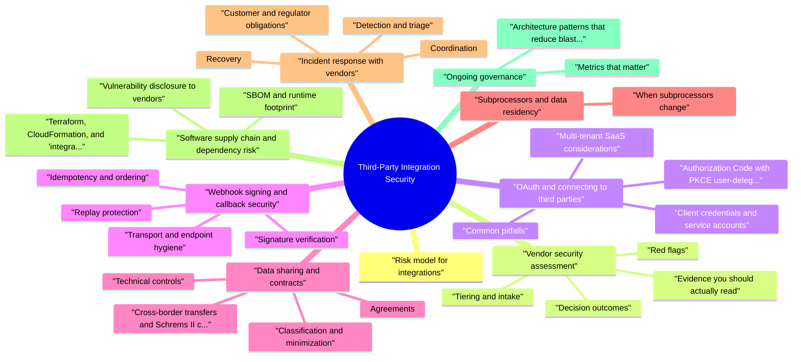

# Third-Party Integration Security revision map

Third-Party Integration Security in one sitting. That is the deal. I mined Critical Clarification Third-Party Integration Sec.md, Third-Party Integration Security - Comprehensive G.md, Third-Party Integration Security - Interview Quest.md, Third-Party Integration Security - Quick Reference.md. The outline keeps every H2 I cared about from those files.

## Risk model for integrations
- Credential theft or misuse - Leaked API keys, OAuth tokens, or signing secrets let attackers impersonate your product or the vendor.
- Data exposure - Over-collection, weak transit or storage controls, or vendor breach affecting your customer data.
- Abuse of integration channels - Webhooks or callbacks become SSRF vectors, replay attack surfaces, or denial-of-service amplifiers.
- Dependency and availability - Vendor outage, breaking API changes, or malicious package updates disrupt security properties or operations.
- Compliance and contractual gaps - Missing DPAs, unclear subprocessors, or inadequate breach notification clauses create legal and regulatory exposure.

## Vendor security assessment

### Tiering and intake
- Business and data mapping - What data flows in each direction? Who are the subjects? Is the vendor a processor, subprocessor, or separate controller?
- Security questionnaire - Policies, org structure, access control, encryption, logging, vulnerability management, incident response, subprocessors, and subprocessors' change notification.
- Technical review - API auth model, webhook security, IP allowlists, mTLS options, key management, and whether the vendor supports SSO for their admin console.
- Operational fit - Uptime SLAs, support tiers, change management, deprecation policy, and geographic deployment (data residency).

### Red flags
- No clear incident notification timeline or security contact.
- Weak default auth (shared passwords, long-lived unscoped tokens only).
- Inability to describe encryption at rest and key custody.
- Opaque subprocessors or refusal to commit to subprocessors list updates.
- History of repeated critical incidents without credible remediation narrative.

### Decision outcomes
- Approve with standard contract terms and monitoring.
- Approve with conditions - e.g. dedicated instance, IP restrictions, additional logging, phased rollout.
- Defer until gaps close.
- Reject when risk is unacceptable or alternatives exist.

### Evidence you should actually read
- See the source section `Evidence you should actually read` for the worked example.

### Practical questionnaire themes
- See the source section `Practical questionnaire themes` for the worked example.

### On-site and remote validation
- See the source section `On-site and remote validation` for the worked example.

## OAuth and connecting to third parties

### Authorization Code with PKCE (user-delegated)
- Use PKCE for public clients (SPAs, mobile) and as defense-in-depth for confidential clients.
- Redirect URI allowlisting must be exact; avoid open redirects and wildcard abuse. Validate state (CSRF) and prefer nonce where applicable (OpenID Connect).
- Minimize scopes - Request only what the feature needs; re-authorize when scope grows.
- Token storage - Prefer secure, httpOnly session binding on your server over storing refresh tokens in browser storage. For native apps, use platform secure storage. Never log tokens or put them in URLs.
- Token rotation and revocation - Support refresh token rotation if the provider offers it; handle invalid_grant by forcing re-consent.
- Tenant isolation - Store tokens keyed by tenant and user; enforce that API calls using a token cannot cross tenants.

### Client credentials and service accounts
- Use short-lived tokens where the issuer supports them; otherwise rotate client secrets via your secrets manager.
- Separate credentials per environment and per integration purpose (read vs write).
- IP egress controls or private connectivity if the vendor supports it, to reduce secret exfiltration value.

### Common pitfalls
- Implicit flow for new integrations (deprecated and unsafe for most cases).
- Mixing identity providers so the same sub from different issuers collides in your database.
- Over-broad offline access without business justification or user visibility.

### Multi-tenant SaaS considerations
- When each customer connects their own third-party account, you store many token sets. Enforce:
- Per-tenant encryption or envelope encryption with KMS so a database snapshot alone cannot decrypt all tokens.
- Background refresh jobs that cannot accidentally attach the wrong refresh token to a tenant (strict primary keys, defensive checks).
- Admin audit when integrations are connected or scopes change-support and security teams need traceability for account takeover investigations.

### Enterprise IdP and consent UX
- Phishing-resistant MFA for admins who can issue API keys or change webhook endpoints reduces account takeover risk on the vendor side that still impacts your integration.

## Webhook signing and callback security
- Webhooks invert the trust model: the vendor calls your URL. Your system must prove the caller is authentic, the payload is fresh, and duplicate delivery does not corrupt state.

### Signature verification
- Vendors often use HMAC-SHA256 over the raw body with a shared secret, or asymmetric signatures (verify with vendor-published public key). Implement constant-time comparison for MACs to reduce timing leakage.
- Prefer schemes that sign the exact bytes received before JSON parsing, or follow the vendor's canonicalization spec precisely. Parsing first and re-serializing often breaks verification.

### Replay protection
- Require a timestamp header and reject requests older than a small skew window (e.g. five minutes), using monotonic clock discipline.
- Track event IDs or digest + timestamp in a short-TTL store to enforce idempotency.

### Transport and endpoint hygiene
- HTTPS only; use modern TLS.
- Authenticate the webhook path - unguessable URLs help only slightly; signing is the real control.
- Rate limit and size-limit bodies to prevent abuse.
- SSRF awareness - When you call vendor webhooks or "callback URL" fields exist in your product, validate URLs (scheme, host, no internal ranges) per your SSRF policy.

### Idempotency and ordering
- Webhooks may arrive out of order or more than once. Design handlers to be idempotent (upsert by stable event ID) and tolerate delayed retries.

### Secret lifecycle
- Rotate signing secrets with dual-secret overlap if supported; automate distribution from secrets manager; alert on verification failure spikes.

### Asymmetric webhook schemes
- See the source section `Asymmetric webhook schemes` for the worked example.

### Testing and observability
- See the source section `Testing and observability` for the worked example.

## Data sharing and contracts

### Classification and minimization
- Classify data (e.g. public, internal, confidential, regulated). For each integration, document:
- Categories of data shared.
- Legal basis or business purpose.
- Whether data is pseudonymized or identified.
- Retention on vendor side and your side.
- Cross-border transfer mechanism (SCCs, adequacy, etc., as applicable).

### Agreements
- Data Processing Agreement (DPA) - Subjects, instructions, security measures, subprocessors, breach assistance, deletion, audits, and international transfers.
- Security schedules - Encryption, access logging, vulnerability SLAs, penetration testing expectations.
- Notification - Time-bound security incident notice; your right to summaries and remediation plans.

### Technical controls
- Field-level encryption or tokenization before data leaves your boundary when appropriate.
- Scoped API keys and column- or row-level access patterns in sync jobs.
- Logging policy - Avoid writing full payloads containing PII to centralized logs.

### Cross-border transfers and Schrems II context
- See the source section `Cross-border transfers and Schrems II context` for the worked example.

### AI and third-party model providers
- See the source section `AI and third-party model providers` for the worked example.

## Subprocessors and data residency
- Many vendors use their own providers (cloud, email, support tools). You inherit a subprocessor chain.
- Maintain a subprocessor register per vendor with purpose and location.
- Contractual advance notice for subprocessor changes and a objection window where feasible.
- Map data residency needs (EU, UK, specific countries) to actual regions and replication behavior, not just marketing pages.
- Periodically diff the vendor's published subprocessor list against your records.
- For regulated workloads, confirm logical and physical separation options (dedicated keys, isolated cells, BYOK) when available.

### When subprocessors change
- See the source section `When subprocessors change` for the worked example.

## Incident response with vendors
- Prepare before an incident. Your runbooks should name security contacts, escalation paths, and contractual notice windows.

### Detection and triage
- Monitor for anomalous API usage, auth failures, webhook verification failures, and vendor status pages.
- Correlate vendor announcements with your internal signals (spike in errors, unexpected data access).

### Coordination
- Open a joint channel (war room) with clear roles: your IR lead, vendor CSM/security, legal, and comms.
- Exchange indicators (timestamps, request IDs, affected tenant IDs) under confidentiality.
- Request forensic timelines, scope of compromise, and whether your credentials or data classes were affected.

### Customer and regulator obligations
- Determine who notifies whom under contract and law. Even if the vendor notifies, you may still owe obligations to customers as controller.
- Preserve evidence: logs, signed webhook records, access logs, and change tickets.

### Recovery
- Rotate all integration secrets and tokens that could have been exposed.
- Invalidate active sessions if vendor compromise could affect user tokens.
- Temporary disable integration if risk exceeds benefit until patched.

### Post-incident
- Update risk tier and assessment; consider contractual remedies, architectural isolation, or vendor replacement.

### Tabletop scenarios to rehearse
- Vendor reports unauthorized API access using a key format matching yours.
- OAuth token leak via client-side bug or misconfigured log pipeline.
- Vendor delays breach notification beyond your customer SLA.
- Vendor sunsets API version on short notice, forcing insecure workarounds.

## Software supply chain and dependency risk
- Integrations often pull in SDKs, Terraform modules, npm/PyPI/Maven packages, and CI actions. Compromise upstream equals compromise in your pipeline or runtime.
- Pin versions and verify checksums; use private registries or caching proxies where appropriate.
- Dependency scanning (SCA) for known vulnerabilities; prioritize exploitable paths.
- SBOM for critical services; track transitive dependencies affecting integration code paths.
- Review vendor SDKs - prefer official, minimal SDKs; audit code that handles crypto or HTTP redirects.
- CI/CD - Pin GitHub Actions by commit SHA; limit workflow permissions; protect secrets used for deployment to integration environments.
- Update policy - Balance patching cadence with testing; emergency path for critical CVEs affecting exposed integrations.

### SBOM and runtime footprint
- See the source section `SBOM and runtime footprint` for the worked example.

### Terraform, CloudFormation, and "integration as code"
- See the source section `Terraform, CloudFormation, and "integration as code"` for the worked example.

### Vulnerability disclosure to vendors
- See the source section `Vulnerability disclosure to vendors` for the worked example.

## Ongoing governance
- Integration inventory - Owner, data classes, auth type, environments, last review date.
- Monitoring - Dashboards for latency, error rates, quota usage, and security alerts from vendors.
- Offboarding - Revoke keys, delete tenant data at vendor, remove webhook subscriptions, and purge tokens from your stores.
- Periodic reassessment - Annual for high tier; trigger-based for incidents, scope expansion, or certification lapse.

### Metrics that matter
- See the source section `Metrics that matter` for the worked example.

### Architecture patterns that reduce blast radius
- Dedicated integration service - Isolate third-party code paths behind a small service with strict egress allowlists.
- Queue-based ingestion - Webhooks land in a queue; workers verify and process asynchronously, improving resilience and uniform idempotency handling.
- Circuit breakers - Fail closed or degrade gracefully when vendors are unhealthy; avoid infinite retries that amplify incidents.

## Pocket list

## Vendor Assessment Checklist
- Security questionnaire
- Security documentation review
- Security certifications (SOC 2, ISO 27001)
- Third-party security assessments
- Technical evaluation
- Risk assessment
- Contract security requirements

## Security Certifications

## Integration Security Checklist
- Secure authentication (OAuth, API keys)
- HTTPS/TLS for all communication
- Credential storage in secret management
- Least privilege API keys
- Input validation
- Error handling (no information disclosure)
- Rate limiting
- Monitoring and logging

## Data Sharing Best Practices
- Data classification
- Minimal data sharing (only necessary)
- Data processing agreements (GDPR)
- Encryption requirements
- Data retention policies
- Data deletion procedures

## Ongoing Monitoring
- Vendor security incident notifications
- Regular security assessment reviews
- Monitoring vendor security announcements
- Integration security monitoring
- Periodic reassessment

## Key Responsibilities

## Best Practices
- Assess all vendors before integration
- Secure credential storage
- Monitor vendor security ongoing
- Have incident response plans
- Review and reassess regularly

## The rest of the markdown in here

## Fundamentals

### How do you ensure the security of third-party integrations end to end?
- See the source section `How do you ensure the security of third-party integrations end to end?` for the worked example.

### Walk me through how you tier and assess a new vendor before integration.
- See the source section `Walk me through how you tier and assess a new vendor before integration.` for the worked example.

### What do you actually look for in a SOC 2 report versus relying on "we are ISO 27001 certified"?
- See the source section `What do you actually look for in a SOC 2 report versus relying on "we are ISO 27001 certified"?` for the worked example.

## OAuth and API authentication

### How do you securely implement OAuth when customers connect third-party accounts to your product?
- See the source section `How do you securely implement OAuth when customers connect third-party accounts to your product?` for the worked example.

### When would you choose API keys or client credentials instead of user OAuth, and how do you harden that?
- See the source section `When would you choose API keys or client credentials instead of user OAuth, and how do you harden that?` for the worked example.

## Webhooks and callbacks

### How do you verify third-party webhooks are authentic?
- See the source section `How do you verify third-party webhooks are authentic?` for the worked example.

### How do you prevent replay attacks and duplicate webhook deliveries from causing bad state?
- See the source section `How do you prevent replay attacks and duplicate webhook deliveries from causing bad state?` for the worked example.

## Data, subprocessors, and compliance

### How do you approach data sharing and DPAs for integrations?
- See the source section `How do you approach data sharing and DPAs for integrations?` for the worked example.

### How do you manage subprocessors and data residency in practice?
- See the source section `How do you manage subprocessors and data residency in practice?` for the worked example.

## Incidents and operations

### A vendor emails you about suspicious API activity affecting your tenant. What do you do first?
- See the source section `A vendor emails you about suspicious API activity affecting your tenant. What do you do first?` for the worked example.

### How do you securely offboard a vendor integration?
- See the source section `How do you securely offboard a vendor integration?` for the worked example.

## Supply chain and architecture

### How do you think about software supply-chain risk for integration code?
- See the source section `How do you think about software supply-chain risk for integration code?` for the worked example.

### What architectural patterns reduce blast radius for third-party integrations?
- See the source section `What architectural patterns reduce blast radius for third-party integrations?` for the worked example.

## Depth scenarios

### Your product lets customers paste a webhook or callback URL for a third-party automation. What risks do you address?
- See the source section `Your product lets customers paste a webhook or callback URL for a third-party automation. What risks do you address?` for the worked example.

### How do you monitor third-party integrations in production?
- See the source section `How do you monitor third-party integrations in production?` for the worked example.

### How would you scope and execute a penetration test focused on a third-party integration?
- See the source section `How would you scope and execute a penetration test focused on a third-party integration?` for the worked example.

### What contract clauses matter most for security beyond the DPA?
- See the source section `What contract clauses matter most for security beyond the DPA?` for the worked example.

### How do certifications like PCI or HIPAA change your integration approach?
- See the source section `How do certifications like PCI or HIPAA change your integration approach?` for the worked example.

## Depth: Interview follow-ups - Third-Party Integration Security
- Webhook security - HMAC vs asymmetric signing, constant-time compare, timestamp skew, idempotency keys, out-of-order delivery.
- OAuth - PKCE, state, refresh rotation, tenant isolation, what never belongs in browser storage.
- Data and law - DPA vs controller-to-controller, SCCs/TIAs, AI subprocessors and retention.
- Incidents - who notifies customers, joint comms, credential rotation order, evidence preservation.

## The clarification file, compressed

## ️ Common Misconceptions

### "Third-party security is the vendor's responsibility, not ours"
- Truth: You are responsible for the security of your product, including third-party integrations.
- Assess vendor security before integration
- Secure the integration (authentication, encryption, etc.)
- Monitor third-party security post-integration
- Have incident response plans for vendor breaches
- Manage data shared with third parties

### "Vendor security questionnaires are sufficient for assessment"
- Truth: Security questionnaires are one component - comprehensive assessment requires multiple methods.
- Security questionnaires
- Review of vendor security documentation
- Security certifications (SOC 2, ISO 27001)
- Third-party security assessments
- Technical evaluation of integration points
- Ongoing monitoring and review

### "Third-party integrations only need to be assessed once"
- Truth: Vendor security should be continuously monitored - security posture changes over time.
- Vendor security incident notifications
- Regular security assessment reviews
- Monitoring vendor security announcements
- Reviewing integration security after vendor changes
- Periodic reassessment of vendor security

### "If a vendor is large and well-known, they're secure"
- Truth: All vendors should be assessed, regardless of size or reputation.
- Large vendors are attractive targets
- Large vendors have had security incidents
- Integration security depends on implementation
- Your specific use case may have unique risks

### "Third-party API keys can be stored in code or configuration files"
- Truth: Third-party credentials should be stored in secret management systems, not in code or config files.
- Use secret management systems (AWS Secrets Manager, HashiCorp Vault)
- Never commit secrets to version control
- Use environment variables carefully (can leak in logs)
- Implement secret rotation
- Use least privilege for API keys

## Key Takeaways
- Your Responsibility: You're responsible for security of third-party integrations
- Multi-Faceted Assessment: Questionnaires are one part, use multiple methods
- Continuous Monitoring: Vendor security changes, monitor ongoing
- Assess All Vendors: Size/reputation doesn't guarantee security
- Secure Credential Storage: Use secret management, never in code/config

## What sits next to this topic

- Stay inside this folder for the long guide. Jump only when a section names a sibling topic.
- Cookie Security, CSRF, XSS, JWT, OAuth, and TLS show up as neighbors on a lot of these maps.
