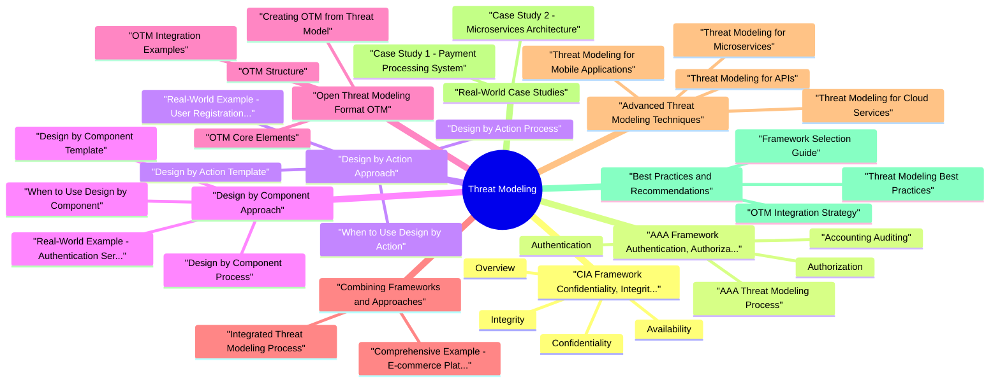

# Threat Modeling revision map

Threat Modeling in one sitting. That is the deal. I mined Threat Modeling - Critical Clarifications.md, Advanced Threat Modeling - Comprehensive Guide.md, Threat Modeling - Interview Questions.md, Threat Modeling - Quick Reference.md. The outline keeps every H2 I cared about from those files.

### What is Advanced Threat Modeling?
- Advanced threat modeling goes beyond basic STRIDE analysis to provide comprehensive security assessment using multiple frameworks, design approaches, and standardized formats. It enables:
- Systematic risk assessment using CIA and AAA frameworks
- Structured analysis through design-by-action and design-by-component approaches
- Automation and integration via OTM format
- Comprehensive coverage of security properties and access control mechanisms

### Why Multiple Frameworks?
- Different frameworks answer different questions:
- CIA: What security properties must be protected?
- AAA: How do we control access?
- STRIDE: How can the system be attacked?
- Design Approaches: How do we structure the analysis?

## CIA Framework (Confidentiality, Integrity, Availability)

### Overview
- The CIA triad is the foundation of information security, representing three core security properties that must be protected.
- AAA provides a framework for access control, ensuring that only authorized entities can access resources and that all access is tracked.
- Design by Action focuses on business operations and workflows rather than system components. It analyzes threats based on what the system does rather than what it is.
- Design by Component focuses on system architecture and components rather than business operations. It analyzes threats based on what the system is rather than what it does.
- OTM (Open Threat Modeling Format) is a platform-independent, machine-readable format for defining threat models. It enables automation, integration, and standardization of threat modeling.
- Machine-readable: Enables automation and tool integration
- Platform-independent: Works with any threat modeling tool
- Version control: Threat models can be versioned like code

### Confidentiality
- Definition: Ensuring that information is accessible only to authorized users, systems, or processes.
- Unauthorized access to data
- Data interception (network sniffing, MitM)
- Data leakage (logs, error messages, backups)
- Insufficient access controls
- Weak encryption
- Encryption (at rest and in transit)
- Access control (RBAC, ABAC)

### Integrity
- Definition: Ensuring that data and systems remain accurate, complete, and unmodified by unauthorized parties.
- Unauthorized data modification
- Data corruption
- Tampering with system configurations
- Man-in-the-middle attacks
- Insecure data transmission
- Digital signatures
- Hash functions (SHA-256, SHA-512)

### Availability
- Definition: Ensuring that systems and data are accessible and usable when needed by authorized users.
- Denial of Service (DoS) attacks
- Distributed Denial of Service (DDoS)
- System failures and outages
- Resource exhaustion
- Natural disasters
- Redundancy and failover
- Load balancing

### CIA Threat Modeling Process
- See the source section `CIA Threat Modeling Process` for the worked example.

### CIA Risk Assessment Matrix
- See the source section `CIA Risk Assessment Matrix` for the worked example.

## AAA Framework (Authentication, Authorization, Accounting)

### Authentication
- Definition: Verifying the identity of users, services, or systems attempting to access resources.
- Something you know: Passwords, PINs, security questions
- Something you have: Tokens, smart cards, mobile devices
- Something you are: Biometrics (fingerprint, face, iris)
- Something you do: Behavioral biometrics
- Requires two or more authentication factors
- Significantly reduces risk of credential compromise
- Common combinations: Password + SMS, Password + TOTP, Password + Biometric

### Authorization
- Definition: Determining what actions an authenticated entity is permitted to perform on specific resources.
- Privilege escalation
- Insecure direct object references (IDOR)
- Missing authorization checks
- Broken access control
- Overly permissive policies
- Principle of least privilege
- Regular access reviews

### Accounting (Auditing)
- Definition: Tracking and logging all security-relevant events for accountability, compliance, and forensic analysis.
- Authentication events (success, failure)
- Authorization decisions (granted, denied)
- Data access (read, write, delete)
- Configuration changes
- Administrative actions
- Security events (attacks, anomalies)
- Completeness: All security events logged

### AAA Threat Modeling Process
- See the source section `AAA Threat Modeling Process` for the worked example.

### AAA Risk Assessment
- See the source section `AAA Risk Assessment` for the worked example.

## Design by Action Approach

### When to Use Design by Action
- Process-oriented systems: Workflows, business processes
- API security: REST APIs, GraphQL endpoints
- User journeys: Authentication flows, payment processes
- Business operations: Order processing, data export
- Compliance requirements: GDPR data export, audit trails

### Design by Action Process
- For each step in the action flow, identify threats:

### Design by Action Template
- See the source section `Design by Action Template` for the worked example.

### Real-World Example: User Registration Action
- See the source section `Real-World Example: User Registration Action` for the worked example.

## Design by Component Approach

### When to Use Design by Component
- Architecture analysis: Microservices, distributed systems
- Infrastructure security: Cloud services, network components
- System design: Component interactions, data flow
- Technology stack: Specific technologies and frameworks
- Deployment architecture: Containers, serverless, hybrid

### Design by Component Process
- Define trust boundaries between components:
- Step 6: Design Component-Level Mitigations

### Design by Component Template
- See the source section `Design by Component Template` for the worked example.

### Real-World Example: Authentication Service Component
- See the source section `Real-World Example: Authentication Service Component` for the worked example.

## Open Threat Modeling Format (OTM)

### OTM Structure
- Based on the OTM specification, an OTM document contains:

### OTM Core Elements
- See the source section `OTM Core Elements` for the worked example.

### Creating OTM from Threat Model
- See the source section `Creating OTM from Threat Model` for the worked example.

### OTM Integration Examples
- See the source section `OTM Integration Examples` for the worked example.

### OTM Best Practices
- Version Control: Store OTM files in Git
- Validation: Validate OTM structure before committing
- Automation: Integrate OTM into CI/CD pipelines
- Documentation: Include detailed descriptions
- Regular Updates: Update OTM as system changes
- Tool Integration: Use OTM with threat modeling tools

## Combining Frameworks and Approaches

### Integrated Threat Modeling Process
- Choose primary approach based on system type:
- Design by Action: For process-oriented systems
- Design by Component: For architecture-oriented systems
- Both: For comprehensive analysis

### Comprehensive Example: E-commerce Platform
- Design by Action + Design by Component + CIA + AAA + OTM

## Advanced Threat Modeling Techniques

### Threat Modeling for Microservices
- Multiple services and interactions
- Service-to-service authentication
- Distributed data
- Network communication
- Model each service as a component
- Map service interactions
- Identify trust boundaries
- Assess CIA/AAA per service

### Threat Modeling for APIs
- Authentication (OAuth, API keys)
- Authorization (Scopes, permissions)
- Input validation
- Rate limiting
- Error handling

### Threat Modeling for Cloud Services
- Shared responsibility model
- Cloud provider security
- Configuration management
- Identity and access management (IAM)
- Network security groups
- Cloud resources (VMs, containers, serverless)
- Storage (S3, databases)
- Networking (VPC, load balancers)

### Threat Modeling for Mobile Applications
- Device security
- App store security
- Data storage (local, cloud)
- Network communication
- Authentication and authorization

## Real-World Case Studies

### Case Study 1: Payment Processing System
- Scenario: E-commerce platform processing credit card payments.
- Design by Action (Payment processing flow)
- CIA Framework (Confidentiality, Integrity critical)
- AAA Framework (Strong authentication, authorization)
- OTM Documentation
- Payment amount tampering (Integrity threat)
- Payment data theft (Confidentiality threat)
- Missing server-side validation (Authorization gap)

### Case Study 2: Microservices Architecture
- Scenario: Distributed system with multiple microservices.
- Design by Component (Each service as component)
- CIA Framework (Per-service assessment)
- AAA Framework (Service-to-service authentication)
- OTM Documentation
- Weak service-to-service authentication
- Insufficient network segmentation
- Missing authorization checks between services

## Best Practices and Recommendations

### Threat Modeling Best Practices
- Start Early: Begin threat modeling in design phase
- Iterate: Update threat model as system evolves
- Use Multiple Frameworks: Combine CIA, AAA, STRIDE
- Document in OTM: Use standardized format
- Involve Stakeholders: Include developers, architects, security
- Prioritize: Focus on high-risk threats first
- Validate: Test mitigations and verify effectiveness

### Framework Selection Guide
- See the source section `Framework Selection Guide` for the worked example.

### OTM Integration Strategy
- Version Control: Store OTM files in Git
- CI/CD Integration: Validate OTM in pipelines
- Tool Integration: Connect to SAST/DAST tools
- Reporting: Generate risk dashboards from OTM
- Automation: Automate threat model updates

## Interview clusters
- Fundamentals: "What is STRIDE?" "What diagram do you start from?"
- Senior: "How do you prioritize threats?" "Who owns mitigations?"
- Staff: "Scale threat modeling to 500 teams without one central bottleneck."

## Cross-links
- Product Security Real-World Scenarios, Risk Prioritization, Secure Design / Zero Trust, Agile Security Compliance (evidence).

## Pocket list

## What it is
- Structured identification of threats (STRIDE, PASTA, attack trees, LINDDUN) against assets and trust boundaries-before or during design-not a one-time pentest substitute.

## STRIDE (per element)

## Minimal workflow (interview)
- Diagram DFD: external entities, processes, data stores, flows
- Mark trust boundaries (browser, VPC edge, tenant line)
- Enumerate threats per entry point
- Rank (risk = impact × likelihood with explicit assumptions)
- Track mitigations and leftover risk owners

## Outputs people expect
- Threat model doc or ticket per feature: assets, abuse cases, mitigations, open risks

## Tools (examples)
- Microsoft Threat Modeling Tool · OWASP Threat Dragon · IriusRisk (enterprise) · Miro + STRIDE canvas

## Cross-read
- Authorization and Authentication · Cloud Security Architecture · Risk Prioritization and Security Metrics

## One-liner

## The clarification file, compressed

## Common Misconceptions

### Misconception 1: "CIA and AAA are the same thing"
- CIA (Confidentiality, Integrity, Availability) focuses on security properties of data and systems
- AAA (Authentication, Authorization, Accounting) focuses on access control mechanisms
- They are complementary but serve different purposes:
- CIA answers: "What security properties must be protected?"
- AAA answers: "How do we control access to resources?"

### Misconception 2: "Design by Action and Design by Component are mutually exclusive"
- Both approaches can be used together in the same threat model
- Design by Action is better for process-oriented systems (workflows, APIs)
- Design by Component is better for architecture-oriented systems (microservices, distributed systems)
- Best Practice: Use both approaches and cross-reference findings

### Misconception 3: "OTM is just another documentation format"
- OTM (Open Threat Modeling Format) is a machine-readable standard
- Enables automation of threat modeling processes
- Supports integration with security tools (SAST, DAST, SIEM)
- Allows version control and collaboration on threat models
- Enables risk calculation and prioritization automation
- Platform-independent (works with any tool)
- Structured data (enables analysis and reporting)
- Integration-ready (connects to security toolchains)

### Misconception 4: "CIA only applies to data, not systems"
- CIA applies to both data and systems
- Confidentiality: Protects data AND system configurations
- Integrity: Ensures data accuracy AND system behavior correctness
- Availability: Ensures data access AND system functionality

### Misconception 5: "AAA is only about user access control"
- AAA applies to users, services, and systems
- Authentication: Verify identity of users, services, and devices
- Authorization: Control access for users, APIs, and system components
- Accounting: Track actions of users, services, and automated processes

### Misconception 6: "Threat modeling is only done at design time"
- Threat modeling should be continuous throughout the SDLC
- Design Phase: Initial threat model
- Development Phase: Update as code changes
- Testing Phase: Validate threat model against actual implementation
- Deployment Phase: Update for production environment
- Operations Phase: Continuous monitoring and threat model updates
- Threat model updates should be triggered by:
- New features

### Misconception 7: "Design by Action means listing all possible actions"
- Design by Action focuses on critical business operations
- Not every action needs threat modeling
- Prioritize based on:
- Business criticality (payment processing > user profile update)
- Data sensitivity (PII handling > public content)
- Attack surface (external-facing APIs > internal services)
- Compliance requirements (GDPR data export > analytics)

### Misconception 8: "Design by Component means modeling every component"
- Focus on components with security implications
- Not all components need detailed threat modeling
- Prioritize based on:
- Trust boundaries (external-facing components)
- Data handling (components processing sensitive data)
- Attack surface (components exposed to attackers)
- Criticality (components essential to business operations)

### Misconception 9: "OTM replaces traditional threat modeling"
- OTM is a format, not a methodology
- You still need to:
- Identify threats (using STRIDE, CIA, etc.)
- Assess risks (using DREAD, CVSS, etc.)
- Design mitigations
- Document findings
- OTM just provides a standardized way to represent your threat model

### Misconception 10: "CIA and STRIDE are competing frameworks"
- They are complementary frameworks
- CIA focuses on what to protect (security properties)
- STRIDE focuses on how it can be attacked (threat categories)
- Use together: CIA identifies what's at risk, STRIDE identifies how it can be attacked

## Key Takeaways
- CIA and AAA are complementary, not competing frameworks
- Design by Action and Design by Component can be used together
- OTM is a format, not a replacement for threat modeling methodology
- CIA applies to both data and systems
- AAA applies to users, services, and systems
- Threat modeling is continuous, not a one-time activity
- Prioritize actions and components based on risk and criticality
- Use multiple frameworks together for comprehensive analysis

## Best Practices

### When to Use CIA Framework
- Assessing security properties of data
- Defining security requirements
- Compliance mapping (GDPR, HIPAA)
- Risk assessment focused on data protection

### When to Use AAA Framework
- Access control design
- Identity and access management
- Audit and compliance requirements
- Privilege management

### When to Use Design by Action
- Process-oriented systems
- API security analysis
- Workflow security
- Business operation security

### When to Use Design by Component
- Architecture security analysis
- Microservices security
- Distributed system security
- Infrastructure security

### When to Use OTM Format
- Automation and tool integration
- Version control of threat models
- Cross-team collaboration
- Continuous threat modeling

## Oral prompts worth repeating

- Fundamental Questions
- What is threat modeling and why is it important?
- Explain the difference between CIA and AAA frameworks.
- When would you use Design by Action vs Design by Component?
- CIA Framework Questions
- Explain each component of the CIA triad with examples.
- How do you assess CIA requirements for an asset?
- How do you map STRIDE threats to CIA properties?
- AAA Framework Questions
- Explain the three components of AAA with examples.
- How do you design authorization for a microservices architecture?
- What are the threats to AAA and how do you mitigate them?
- Design Approach Questions
- Walk me through a Design by Action threat modeling session.
- How do you perform Design by Component threat modeling?
- OTM Format Questions
- What is OTM and why is it important?
- How do you structure a threat model in OTM format?
- How do you integrate OTM into a CI/CD pipeline?
- How do you combine CIA, AAA, STRIDE, and design approaches?
- How do you assess risk in threat modeling?
- Scenario-Based Questions
- Perform threat modeling for a payment API using Design by Action and CIA/AAA.
- Threat model a microservices architecture using Design by Component and OTM.

## Advanced Questions

## Depth: Interview follow-ups - Threat Modeling
- Authoritative references: STRIDE (Microsoft threat modeling tool docs); OWASP Threat Modeling; NIST-ish framing: identify assets & trust boundaries.
- STRIDE without prioritization - how you rank (impact × likelihood × exposure).
- Agile integration - DoD on stories, lightweight diagrams, "abuse cases."
- When TM is theater - mitigations not tracked as engineering work.

## What sits next to this topic

- Stay inside this folder for the long guide. Jump only when a section names a sibling topic.
- Cookie Security, CSRF, XSS, JWT, OAuth, and TLS show up as neighbors on a lot of these maps.
