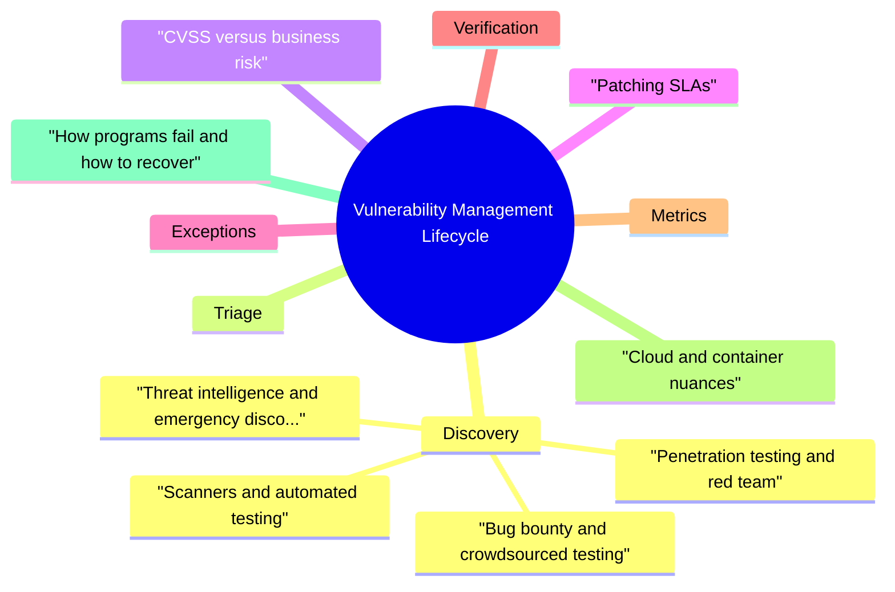

# Vulnerability Management Lifecycle revision map

Vulnerability Management Lifecycle in one sitting. That is the deal. I mined Critical Clarification Vulnerability Management Lifecycle Misconceptions.md, Vulnerability Management Lifecycle - Comprehensive Guide.md, Vulnerability Management Lifecycle - Interview Questions & Answers.md, Vulnerability Management Lifecycle - Quick Reference.md. The outline keeps every H2 I cared about from those files.

## Discovery

### Scanners and automated testing
- Dynamic analysis (DAST/IAST) exercises running systems. Strength: validates exploitable paths in context. Weakness: crawl coverage, auth/session modeling, and environment drift between scan targets and production.
- Secrets detection in repos, CI logs, and images is part of discovery when it surfaces live credentials or keys that enable lateral movement.

### Bug bounty and crowdsourced testing
- Coordination: Serious reports may overlap active incidents or law enforcement inquiries; establish a single coordinator so engineering does not receive conflicting instructions.

### Penetration testing and red team
- See the source section `Penetration testing and red team` for the worked example.

### Threat intelligence and emergency discovery
- See the source section `Threat intelligence and emergency discovery` for the worked example.

## Triage
- Triage turns raw findings into one record per real issue with a single accountable owner.
- Normalization: Map to CVE/CWE where possible; otherwise use an internal taxonomy. Preserve scanner evidence (package version, image digest, commit SHA, policy JSON snippet) for audit and retest.

## CVSS versus business risk
- Exposure: Internet-facing vs internal-only; admin vs unauthenticated paths.
- Asset criticality: Tier-0 payment, identity, secrets, or safety systems vs internal tooling.
- Exploit intelligence: EPSS estimates probability of exploitation in the wild; CISA KEV lists known exploited vulnerabilities-often a mandatory escalate-and-patch signal for US-facing regulated environments.
- Compensating controls: Effective segmentation, hardening, detection coverage, and break-glass procedures can lower leftover risk but must be documented and tested, not assumed.
- Fix cost and blast radius: A one-line dependency bump differs from a kernel change across thousands of hosts; scheduling matters for material risk reduction.

## Patching SLAs
- Severity or risk tier (e.g., critical / high / medium / low) aligned with incident severity language.
- Asset tier (tier-0 vs standard) with shorter clocks for crown jewels.
- Exploitation status (KEV, active exploitation in your estate) triggering emergency timelines.
- Customer contractual or regulatory deadlines that override internal "medium" defaults.

## Exceptions
- Exceptions (risk acceptance) exist because not every finding can be fixed immediately and not every scanner output is true positive. Without governance, exceptions become permanent waivers and compliance theater.
- Finding reference and affected assets (versions, environments, accounts).
- leftover risk statement in business terms.
- Compensating controls with owners and evidence (monitoring rules, network rules, access restrictions).
- Expiry date and re-review trigger (e.g., major version upgrade, architecture change, new exposure).
- Approvers appropriate to impact (product + security + legal for high-risk data).

## Verification
- Verification proves the risk is actually reduced in production, not only that a PR merged.
- Deployment confirmation: Ensure the fix reached all regions, canary and stable tracks, and legacy clusters that scanners sometimes miss.

## Metrics
- Backlog health: Open findings by severity/tier, mean and p90 age, stale tickets without owner updates.
- SLA performance: On-time remediation rate; breach reasons categorized (capacity, vendor, dependency conflict).

## Cloud and container nuances
- Immutable infrastructure: Patches often mean new image and rollout, not apt-get on long-lived VMs. VM programs must tie findings to image tags/digests and deployment pipelines, not hostnames that recycle.
- Multi-tenant and shared services: A finding on a platform component may affect many teams. Route to the platform owner with explicit customer notification rules when tenant isolation is in question.

## How programs fail (and how to recover)
- Scanner floods demoralize teams; fix with dedupe, reachability analysis, and SLA realism.
- No owner for legacy systems; fix with executive-backed inventory and temporary platform swat teams.
- Merged but not deployed; fix with verification tied to production evidence.
- Exception sprawl; fix with expiry, renewal friction, and compensating control requirements.

## Cross-links

## Pocket list

## End-to-end stages

## Scoring (how to speak about it)
- CVSS - technical severity vector; environmental metrics adjust for your network
- EPSS - probability of exploitation in the wild (continuously updated)
- KEV (CISA) - known exploited vulns -> patch now discipline for US-adjacent orgs

## SLA pattern (example framing)
- Internet-facing RCE < 7d · internal high with exploit < 30d · low with compensating control + exception ticket

## Exceptions / risk acceptance
- Named exec approver · expiry date · compensating controls documented · not "infinite backlog"

## Metrics interviewers like
- Open criticals age · % assets scanned weekly · remediation half-life · repeat findings per service

## Cross-read
- Risk Prioritization and Security Metrics · Software Supply Chain Security · Secure CI CD Pipeline Security

## One-liner

## The clarification file, compressed

## "CVSS 10 means drop everything"
- Truth: CVSS is a useful input but not business impact. A CVSS 10 on an internal admin-only system may differ from a 7 on an Internet-facing auth path-context matters.

## "Scanning equals vulnerability management"
- Truth: Scanning produces candidates. Value comes from triage, ownership, SLAs, and verified fixes-otherwise it's noise.

## "We can fix everything immediately"
- Truth: Capacity is finite-prioritization and risk acceptance with expiry are part of mature programs.

## Oral prompts worth repeating

- Walk through the vulnerability management lifecycle from discovery to closure.
- How do you triage a large backlog or a sudden spike without overwhelming engineering?
- What does "good triage" look like in a ticket or record?
- Explain CVSS and why it is not the same as organizational risk.
- How do you decide when to prioritize below or above what CVSS suggests?
- How do EPSS, KEV, and environmental context fit together in prioritization?
- How do you set patching SLAs that engineering and security both accept?
- What is the difference between mean time to remediate and SLA compliance?
- What makes a vulnerability risk exception defensible and auditable?
- How do you manage exception renewals without turning them into rubber stamps?
- How do you verify that a vulnerability is actually fixed in production?
- How do you prevent "merged in Git but still vulnerable in production"?
- What changes when you move from traditional VMs to containers and Kubernetes?
- How should cloud misconfigurations sit in the same lifecycle as application CVEs?
- Which metrics do you show engineering leadership versus executives?
- How do you measure program health beyond "number of open CVEs"?
- How do you handle third-party or SaaS vulnerabilities you cannot patch yourself?
- You can only fix one of two critical findings this week-how do you choose?

### What does "good triage" look like in a ticket or record?
- See the source section `What does "good triage" look like in a ticket or record?` for the worked example.

### How do you prevent "merged in Git but still vulnerable in production"?
- See the source section `How do you prevent "merged in Git but still vulnerable in production"?` for the worked example.

### How do you measure program health beyond "number of open CVEs"?
- See the source section `How do you measure program health beyond "number of open CVEs"?` for the worked example.

### You can only fix one of two critical findings this week-how do you choose?
- Cross-read: Risk Prioritization and Security Metrics, Software Supply Chain Security, Secure CI/CD, Penetration Testing and Security Assessment, Security Observability and Detection Engineering.

## What sits next to this topic

- Stay inside this folder for the long guide. Jump only when a section names a sibling topic.
- Cookie Security, CSRF, XSS, JWT, OAuth, and TLS show up as neighbors on a lot of these maps.
