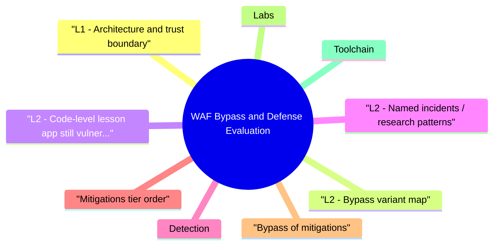

# WAF Bypass and Defense Evaluation revision map

When a WAF Bypass and Defense Evaluation follow-up lands, I want one page that still has the misconception and the VAPT step. I pulled headings from Critical Clarification WAF Bypass and Defense Evaluation Misconceptions.md, WAF Bypass and Defense Evaluation - Comprehensive Guide.md, WAF Bypass and Defense Evaluation - Interview Questions & Answers.md, WAF Bypass and Defense Evaluation - Quick Reference.md, WAF Bypass and Defense Evaluation - VAPT Methodology.md. If a heading is here, the guide still owns the detail.

## L1 - Architecture and trust boundary
- The origin must still be safe if the WAF is wrong (false negative) or absent (misconfig, fail-open).
- TLS: WAF may terminate TLS (MITM at the edge) or use transparent bridging-logging and header trust differ.

## L2 - Bypass variant map
- Many real chains combine multiple trivial transforms-defense must assume composable evasions.

## L2 - Code-level lesson (app still vulnerable)
- Vulnerable app (conceptual SQL): string concat with user input.
- Fixed: parameterized query + type validation.

## L2 - Named incidents / research patterns
- ModSecurity and commercial WAF bypass write-ups historically showed encoding and comment tricks against regex rules-pattern: signature vs parser mismatch.
- Request smuggling (Kettle) often bypasses WAF visibility when front and back disagree-cite parser differential, not "magic bytes."
- Log4Shell (CVE-2021-44228): many WAFs added JNDI string rules; bypass chatter included nested lookups and lower/upper case mutations-patching the library remained authoritative**.

## Detection
- WAF block / challenge logs with rule IDs and matched fragments.
- Origin logs showing 200 on payloads the WAF "should" block -> bypass or alternate path (mobile API, partner VPC).
- Latency and anomaly spikes on encoding-heavy requests.

## Mitigations (tier order)
- Fix the vulnerability in code (parameterization, authZ, SSRF allow-lists).
- Normalize once at the edge with strict RFC behavior; reject ambiguous messages.
- WAF rules as virtual patch with tuned false positive budget.
- Positive security models for APIs (schema validation, mTLS, OAuth scopes).
- Monitoring: canary tests for known exploit primitives after rule changes.

## Bypass of mitigations
- Over-tuned WAF -> fail-open under load or operator disables noisy rules.
- API gateways and microservices skip legacy WAF paths.
- Zero-day payloads never hit signatures.

## Labs
- PortSwigger WAF-related labs (encoding, request smuggling context).
- ModSecurity CRS in a lab VM-tune paranoia level and observe FP/FN.

## Toolchain
- Burp Suite (Repeater, Intruder), wapiti, nuclei templates, cloud WAF logs (AWS WAF, Cloudflare analytics), modsecurity audit logs.

## Interview clusters

## Authoritative references
- OWASP WAF evaluation guidance and CRS documentation.
- RFC 9110/9112 - HTTP semantics relevant to normalization.
- CWE-693 (Protection Mechanism Failure) - umbrella for brittle WAF reliance.

## Cross-links
- HTTP Request Smuggling · HTTP Parameter Pollution · SSRF · TLS · Defense in Depth

## Verification checklist
- [ ] Write a 10-case WAF eval plan for one API.
- [ ] List two logging fields you need to prove a bypass attempt.

## Recall list from Quick Reference

## Model
- Edge inspection -> (optional TLS terminate) -> origin (authoritative security)

## Bypass classes
- Encoding nest · parser diff (JSON/XML) · HPP · multipart tricks · smuggling-adjacent normalization · path variants

## Eval recipe
- Baseline attacks · mutation matrix · FP on prod-like traffic · log proof · latency / error budget

## Mitigation stack
- Fix app -> strict edge normalization -> tuned virtual patch -> schema/mTLS for APIs -> monitor canaries

## Tools
- Burp · nuclei · ModSecurity/CRS · cloud WAF logs (AWS/CF/Akamai patterns)

## Cross-read
- HTTP Request Smuggling · HTTP Parameter Pollution · SSRF

## One-liner

## Corrections I keep repeating

## "WAF = secure application."
- Reality: WAF is auxiliary. Parameterized queries, authZ, and safe parsing remain mandatory.

## "If the WAF blocks sqlmap, we're safe."
- Reality: Custom encodings, nested parsers, and alternate API paths often evade signature sets.

## "ML WAFs can't be bypassed."
- Reality: Adaptive attackers probe blind spots; ML also drifts with traffic shifts.

## "We can skip code fixes because virtual patch exists."
- Reality: Virtual patches rot, fail-open, or get disabled when noisy. Root-cause fix is durable.

## "All traffic hits the WAF."
- Reality: Partner links, legacy hostnames, internal meshes, and mis-DNS bypass intended paths.

## "Blocking is always better than logging."
- Reality: Aggressive block can DoS legitimate clients; tuning needs FP budget and observability.

## "WAF eval = running a vendor scanner once."
- Reality: Real eval needs app-specific mutations, continuous regression after rule changes, and business traffic sampling.

## "HTTPS means the WAF can't see payloads."
- Reality: Edge-terminated TLS is common; visibility depends on architecture, not the lock icon alone.

## Assessment order

## Objective
- Create a repeatable assessment workflow for WAF Bypass and Defense Evaluation that produces reproducible evidence and actionable remediation guidance.

## Phase 1 - Scope and preparation
- Confirm in-scope assets, test windows, and prohibited actions.
- Identify critical user journeys and trust boundaries.
- Define severity rubric and evidence requirements before testing.

## Phase 2 - Recon and attack-surface mapping
- Enumerate relevant endpoints, flows, and data paths.
- Document where security checks are expected to happen.
- Mark high-value assets and high-impact paths.

## Phase 3 - Hypothesis-driven testing
- Start with low-risk probes and baseline behavior.
- Test failure hypotheses systematically (one variable at a time).
- Capture request/response artifacts for each finding candidate.

## Phase 4 - Validation and impact proof
- Reproduce findings with clean-state retests.
- Confirm exploitability and practical impact.
- Eliminate false positives; record confidence level.

## Phase 5 - Remediation and verification
- Provide immediate containment + structural fix recommendations.
- Define post-fix verification tests and telemetry checks.
- Re-test after remediation and close with evidence.

## Evidence template
- Asset / endpoint:
- Preconditions:
- Reproduction steps:
- Observed behavior:
- Security impact:
- Business impact:
- Recommended fix:
- Verification result:

## Interview drill
- In 3 minutes, explain how you would run this VAPT workflow for one production-like service and what evidence you need before escalating severity.

## What I answer in 90 seconds

- Q: WAF inline vs reverse proxy-what changes for bypass?
- Q: Give three bypass classes without naming vendor bugs.
- Q: What's in your pre-production WAF test plan?
- Q: How do you handle APIs that break under aggressive WAF rules?
- Q: When would you recommend removing WAF reliance?

## 60-second answer
- Q: How do attackers bypass WAFs, and how do you evaluate whether yours works?

## Mechanics

### Q: WAF inline vs reverse proxy-what changes for bypass?
- A: TLS termination point changes what you can inspect and which headers you trust. Path and host routing may differ between CDN and origin, creating alternate entry paths that skip intended rules.

## Evaluation

### Q: What's in your pre-production WAF test plan?
- A: Coverage of all external routes, positive traffic FP sampling, blocked vs logged policy checks, latency budget, and rollback if error rate spikes.

## Senior / staff

## Mock ladder

## Nearby reading in this repo

- Stay inside this folder for the long guide. Jump only when a section names a sibling topic.
- Cookie Security, CSRF, XSS, JWT, OAuth, and TLS show up as neighbors on a lot of these maps.
