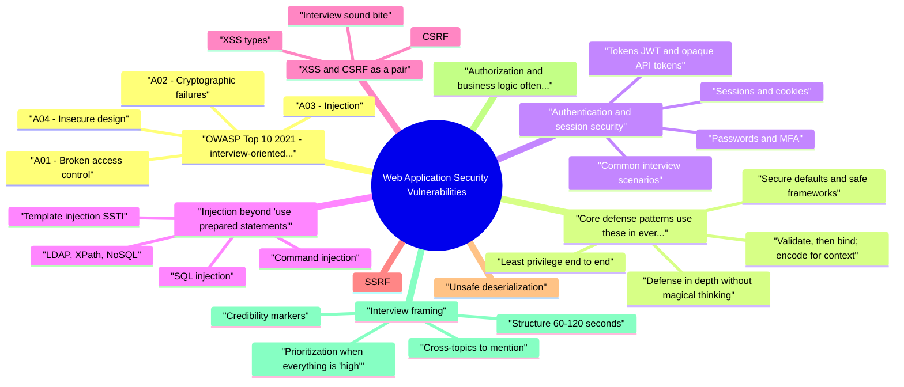

# Web Application Security Vulnerabilities revision map

Last mock I bounced around the Web Application Security Vulnerabilities folder. This file is the stop that. Drawn from Critical Clarification Web Application Security Vu.md, Web Application Security Vulnerabilities - Compreh.md, Web Application Security Vulnerabilities - Intervi.md, Web Application Security Vulnerabilities - Quick R.md. Skim the mermaid, then the outline.

## OWASP Top 10 (2021) - interview-oriented tour
- Use this as a checklist narrative in interviews: name the risk, give a plausible abuse, state primary mitigations, mention logging/detection where it matters.

### A01: Broken access control
- What breaks: Users access objects or actions outside their entitlement (horizontal IDOR, vertical privilege escalation, forced browsing to admin URLs, mass assignment changing role).

### A02: Cryptographic failures
- What breaks: Sensitive data exposed because TLS is missing or weak, passwords stored reversibly, hardcoded keys, wrong algorithm choices, or secrets in logs.

### A03: Injection
- What breaks: Untrusted input becomes part of a command or query (SQL, OS command, LDAP, XPath, template injection).
- Defenses: Parameterized queries / ORM bindings; separate code from data for shells; typed APIs; least-privilege DB roles. Validate business rules after binding, not as a substitute for parameterization.

### A04: Insecure design
- What breaks: The feature is unsafe by construction (no rate limits on sensitive flows, "password reset" without proof, trust of client-sent prices).
- Defenses: Threat modeling early; secure defaults; use abuse cases alongside user stories; separation of duties for high-risk operations.

### A05: Security misconfiguration
- What breaks: Debug on in prod, default creds, open buckets, verbose errors, permissive CORS, missing security headers.
- Defenses: Hardened baselines, IaC review, staging mirrors prod, minimal permissions, error messages safe for users and rich for server-side logs only.

### A06: Vulnerable and outdated components
- What breaks: Known CVEs in frameworks, transitive dependencies, container images.
- Defenses: SBOM, dependabot/Snyk-class workflows, pinning with upgrade policy, virtual patching only as bridge-not the fix.

### A07: Identification and authentication failures
- What breaks: Weak creds, missing MFA where needed, session fixation, broken logout, credential stuffing success.
- Defenses: MFA for sensitive accounts, rate limits and CAPTCHA where appropriate, secure session cookies (HttpOnly, Secure, SameSite), rotation on privilege change, breach-resistant password policies.

### A08: Software and data integrity failures
- What breaks: Unsigned updates, CI/CD compromise, unsafe plugins, trusting client-supplied integrity flags.
- Defenses: Signed artifacts, verified provenance, immutable deploys, dependency pinning with integrity hashes where supported.

### A09: Security logging and monitoring failures
- What breaks: Attacks succeed silently; you cannot answer "who did what, when" for incidents.
- Defenses: AuthN/authZ failures, admin actions, sensitive data access logged with correlation IDs; tamper-resistant or centralized logs; alerting on spikes and impossible travel patterns where applicable.

### A10: Server-side request forgery (SSRF)
- What breaks: Server is tricked into calling internal addresses (metadata, admin panels, Redis) using its higher trust.
- Defenses: Allowlists of destinations; disable URL schemes you do not need; network segmentation; no raw IP from user input without policy; metadata hardening (IMDSv2-style patterns in cloud).

## Core defense patterns (use these in every answer)

### Validate, then bind; encode for context
- See the source section `Validate, then bind; encode for context` for the worked example.

### Least privilege end to end
- Database roles, service accounts, cloud IAM, and application roles should be minimal for the code path. Interviewers listen for blast radius: what one compromised token can do.

### Secure defaults and safe frameworks
- Auto-escaping templates, CSRF middleware in server-rendered apps, framework CSRF for cookie-session models, and turning off dangerous features (XML external entities, debug endpoints) by default.

### Defense in depth without magical thinking
- WAFs and RASP reduce noise and catch some exploits; they fail open or bypass with novel payloads. Your story should still center on correct authorization and safe parsing.

### Verification
- SAST/DAST/IAST, manual testing for authZ and business logic, pentest findings fed into design reviews, and production metrics (failed auth spikes, SSRF-like egress patterns).

## Authentication and session security

### Passwords and MFA
- See the source section `Passwords and MFA` for the worked example.

### Sessions and cookies
- See the source section `Sessions and cookies` for the worked example.

### Tokens (JWT and opaque API tokens)
- See the source section `Tokens (JWT and opaque API tokens)` for the worked example.

### Common interview scenarios
- Credential stuffing: rate limits, MFA, device signals, step-up for risky logins.
- Session hijacking: TLS, Secure cookies, binding session to user agent/IP only with care (mobile networks change), re-auth for sensitive actions.
- Account enumeration: consistent responses and timing discipline for login and reset flows (hard to perfect; discuss tradeoffs).

## Injection (beyond "use prepared statements")

### SQL injection
- See the source section `SQL injection` for the worked example.

### Command injection
- Root cause: user input passed to shell=True or string-built shell commands. Fix: avoid shells; use execve-style APIs with argument arrays; strict allowlists if you must invoke binaries.

### LDAP, XPath, NoSQL
- Same pattern: parameterized or typed APIs; escape only when the API demands it and you understand the grammar.

### Template injection (SSTI)
- Server-side template engines sometimes evaluate expressions in user content. Fix: never let users pick template fragments; sandbox is fragile-prefer logicless rendering paths.

## XSS and CSRF as a pair

### XSS types
- Reflected: payload in request echoed in response.
- Stored: payload persisted and served to victims.
- DOM-based: unsafe sinks in client JS (innerHTML, document.write, eval) using attacker-influenced data.

### CSRF
- Classic model: browser automatically sends cookies to your origin; attacker's site triggers a state-changing request.

### Interview sound bite
- See the source section `Interview sound bite` for the worked example.

## SSRF
- Allowlist hosts and schemes; block link-local and metadata ranges by policy.
- Disable redirects or re-validate destination after redirect.
- Network controls: egress proxy, private link patterns, no public egress from sensitive tiers.
- Parse carefully: differences between URL parsers and HTTP clients enable parser differential bypasses.

## Unsafe deserialization
- Risk: Turning bytes into objects with methods and gadget chains (Java, .NET, PHP, Python pickle). Attacker supplies a serialized blob that triggers arbitrary code or unexpected behavior during readObject-style paths.
- Prefer JSON or other schema-bound formats with plain data types and explicit DTO mapping-no arbitrary type fields from clients.
- Never deserialize untrusted input with native object serializers (pickle, Java serialization) without strong signing and versioned, audited allowlists-and often still avoid.
- If you must support binary RPC, enforce size limits, schema validation, and library updates; watch CVEs in parsers.

## Authorization and business logic (often the real interview depth)
- IDOR: predictable IDs or missing server checks. Fix with authorization service, row-level checks, tenant scoping in queries.
- Mass assignment: client sets isAdmin. Fix with explicit allowlists for writable fields.

## Interview framing

### Structure (60-120 seconds)
- Threat: one sentence on what fails (e.g., "missing object-level auth").
- Exploit sketch: how an attacker abuses it (no live malware; stay conceptual).
- Controls: 2-3 concrete defenses you would implement or require.
- Tradeoff: UX, performance, or false positives (e.g., aggressive CSP breaks third-party scripts).
- Proof: test you ran, SAST rule, pentest theme, or metric you tracked.

### Credibility markers
- Name where the check lives (server, not client).
- Mention regression tests for authZ and logging for detective control.
- Acknowledge what you do not solve in one layer (WAF vs code).

### Cross-topics to mention
- Pair this module with rate limiting, security headers, SSRF, XSS vs CSRF, secrets management, and incident response for end-to-end stories.

### Prioritization when everything is "high"
- See the source section `Prioritization when everything is "high"` for the worked example.

## Related patterns that interviewers bundle with "Top 10"

### XML external entity (XXE) and unsafe XML
- See the source section `XML external entity (XXE) and unsafe XML` for the worked example.

### File uploads and path traversal
- See the source section `File uploads and path traversal` for the worked example.

### CORS and cross-origin data
- See the source section `CORS and cross-origin data` for the worked example.

### Open redirects and OAuth/OIDC confusion
- Open redirects poison return URLs for token theft or phishing. Validate redirect URIs against exact registered values. Pair with state and PKCE for public clients in OAuth flows.

### Prototype pollution and supply chain (JavaScript)
- See the source section `Prototype pollution and supply chain (JavaScript)` for the worked example.

## Alignment with OWASP ASVS (how senior candidates sound)

## Detection and logging hooks (tie to A09)

## Quick reference table

## Fundamentals and process

### How do you use the OWASP Top 10 in real work without treating it as the whole threat model?
- See the source section `How do you use the OWASP Top 10 in real work without treating it as the whole threat model?` for the worked example.

### What is the difference between authentication and authorization, and why does confusing them matter?
- See the source section `What is the difference between authentication and authorization, and why does confusing them matter?` for the worked example.

### Explain "defense in depth" for a web application without listing tools as magic.
- See the source section `Explain "defense in depth" for a web application without listing tools as magic.` for the worked example.

## Access control and design

### What is IDOR and how do you prevent it in a typical REST API?
- See the source section `What is IDOR and how do you prevent it in a typical REST API?` for the worked example.

### How would you catch "mass assignment" vulnerabilities?
- See the source section `How would you catch "mass assignment" vulnerabilities?` for the worked example.

## Injection and parsers

### How do you prevent SQL injection, including second-order cases?
- See the source section `How do you prevent SQL injection, including second-order cases?` for the worked example.

### What is server-side template injection (SSTI) and how do you avoid it?
- See the source section `What is server-side template injection (SSTI) and how do you avoid it?` for the worked example.

## Browser-facing: XSS and CSRF

### Compare reflected, stored, and DOM-based XSS. What mitigations do you prioritize?
- See the source section `Compare reflected, stored, and DOM-based XSS. What mitigations do you prioritize?` for the worked example.

### When is CSRF a risk for your API, and what defenses apply?
- See the source section `When is CSRF a risk for your API, and what defenses apply?` for the worked example.

## SSRF and outbound trust

### Explain SSRF as if to a backend engineer. What controls actually work?
- See the source section `Explain SSRF as if to a backend engineer. What controls actually work?` for the worked example.

## Deserialization and integrity

### Why is unsafe deserialization different from "parsing JSON," and how do you handle each?
- See the source section `Why is unsafe deserialization different from "parsing JSON," and how do you handle each?` for the worked example.

## Authentication and sessions

### How do you defend against session fixation and session hijacking?
- See the source section `How do you defend against session fixation and session hijacking?` for the worked example.

### What are common JWT mistakes in web APIs?
- See the source section `What are common JWT mistakes in web APIs?` for the worked example.

## Configuration, crypto, and components

### Give examples of "security misconfiguration" you look for in production web apps.
- See the source section `Give examples of "security misconfiguration" you look for in production web apps.` for the worked example.

### What do "cryptographic failures" look like in web applications specifically?
- See the source section `What do "cryptographic failures" look like in web applications specifically?` for the worked example.

### How do you prioritize vulnerable dependencies when scanners flood you with CVEs?
- See the source section `How do you prioritize vulnerable dependencies when scanners flood you with CVEs?` for the worked example.

## Testing, logging, and leadership

### Compare SAST, DAST, and manual testing for web apps-what does each miss?
- See the source section `Compare SAST, DAST, and manual testing for web apps-what does each miss?` for the worked example.

### What security events would you log for a typical authenticated web application?
- See the source section `What security events would you log for a typical authenticated web application?` for the worked example.

### Walk me through how you would run a security review before a major release.
- See the source section `Walk me through how you would run a security review before a major release.` for the worked example.

### How do you explain the tradeoff between strict CSP and product features that rely on third-party scripts?
- See the source section `How do you explain the tradeoff between strict CSP and product features that rely on third-party scripts?` for the worked example.

## Depth: Interview follow-ups - Web Application Security Vulnerabilities
- Authoritative references: OWASP Top 10 (verify current year list); mapping to CWE Top 25 for prioritization discussions.
- Top 10 vs real org risk - business logic and authZ often dominate in practice.
- Defense in depth: WAF limitations vs code fixes.
- SSRF/XXE in APIs and parsers-how you prioritize and test URL policies.

## OWASP Top 10 (2021)
- Broken Access Control
- Cryptographic Failures
- Injection
- Insecure Design
- Security Misconfiguration
- Vulnerable and Outdated Components
- Identification and Authentication Failures
- Software and Data Integrity Failures

## Testing Methods

## Common Vulnerabilities and Mitigations

## Defense in Depth Checklist
- Input validation
- Output encoding
- Parameterized queries
- Authentication and authorization
- Encryption (in transit and at rest)
- Secure configuration
- Security headers (CSP, HSTS)
- Monitoring and logging

## Security Headers

## Key Principles
- Defense in depth (multiple layers)
- Input validation and output encoding
- Least privilege access control
- Secure by default configuration
- Regular security testing

## Misreads that still sneak in

## ️ Common Misconceptions

### "OWASP Top 10 covers all security vulnerabilities"
- Truth: OWASP Top 10 is a starting point, not comprehensive coverage of all vulnerabilities.
- Focuses on most common issues
- Doesn't cover business logic flaws
- Misses infrastructure and configuration issues
- Doesn't address newer attack vectors

### "Input validation alone prevents injection attacks"
- Truth: Input validation is one layer of defense - defense in depth is required.
- Input validation (whitelist approach preferred)
- Parameterized queries (SQL injection)
- Output encoding (XSS)
- Least privilege database access
- WAF (Web Application Firewall) as additional layer

### "HTTPS means the application is secure"
- Truth: HTTPS only encrypts data in transit - it doesn't protect against application vulnerabilities.
- Encryption of data in transit
- Server authentication
- Protection against man-in-the-middle attacks
- SQL injection
- XSS attacks
- Authentication flaws
- Authorization bypasses

### "Modern frameworks prevent common vulnerabilities automatically"
- Truth: Modern frameworks reduce risk but don't eliminate vulnerabilities - secure coding is still required.
- Built-in protections (CSRF tokens, parameterized queries)
- Security best practices built-in
- Regular security updates
- Developers can override security features
- Misconfiguration creates vulnerabilities
- Framework vulnerabilities exist
- Business logic flaws aren't prevented

### "Low-severity vulnerabilities can be ignored"
- Truth: Low-severity vulnerabilities can be exploited in combination or in specific contexts to cause significant impact.
- Combined attacks (chaining vulnerabilities)
- Context-dependent severity
- Information disclosure aiding other attacks
- Compliance requirements

## Key Takeaways
- OWASP Top 10 is a Start: Use as baseline, not complete coverage
- Defense in Depth: Multiple layers needed, not just input validation
- HTTPS ≠ Security: Encrypts transit but doesn't protect against app vulnerabilities
- Frameworks Help But Don't Eliminate: Secure coding still required
- Context Matters: Low-severity vulnerabilities can be significant in context

## Cross-links I actually follow

- Stay inside this folder for the long guide. Jump only when a section names a sibling topic.
- Cookie Security, CSRF, XSS, JWT, OAuth, and TLS show up as neighbors on a lot of these maps.
