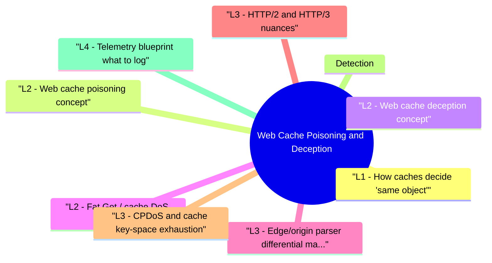

# Web Cache Poisoning and Deception revision map

When a Web Cache Poisoning and Deception follow-up lands, I want one page that still has the misconception and the VAPT step. I pulled headings from Critical Clarification Web Cache Poisoning and Deception Misconceptions.md, Web Cache Poisoning and Deception - Comprehensive Guide.md, Web Cache Poisoning and Deception - Interview Questions & Answers.md, Web Cache Poisoning and Deception - Quick Reference.md. If a heading is here, the guide still owns the detail.

## L1 - How caches decide "same object"
- Caches hash a request into a key (implementation-specific). Typical ingredients:
- Host, path, query string (sometimes sorted or not)
- Selected headers (Authorization, Cookie, Accept-Encoding, Accept-Language) via Vary
- HTTP method (GET vs HEAD)

## L2 - Web cache poisoning (concept)
- Attacker sends request with unkeyed header or parameter that changes response body (e.g., reflected XSS in error page). Cache stores poisoned object under a key that victims share. Victims receive stored XSS.
- Unkeyed inputs are the enemy: headers like X-Forwarded-Host, X-Original-URL, fat Accept headers, etc.-exact list is app and CDN specific.

## L2 - Web cache deception (concept)

## L2 - Fat Get / cache DoS (adjacent)
- Huge query strings or header bombs create distinct cache keys -> low hit rate -> origin overload. Ops interview tie-in.

## L3 - Edge/origin parser differential matrix
- Most high-impact cases come from normalization mismatches between CDN, reverse proxy, and origin app.
- Testing strategy: build a request matrix and compare Cache-Status, response hash, and origin app behavior for each mutation.

## L3 - HTTP/2 and HTTP/3 nuances
- Pseudo-headers vs legacy headers: translation layers (:authority to Host) can create inconsistencies.
- Connection coalescing: shared cert/SAN can route multiple origins over one connection; misconfigured key policies can leak across tenants.
- Header compression effects: not directly exploitable alone, but can hide high-cardinality key abuse unless logs preserve decompressed canonical values.
- Protocol downgrade boundaries: h2/h3 at edge and h1 to origin means two parsers; keying must be explicit at the edge.

## L3 - CPDoS and cache key-space exhaustion
- Two operationally important abuse classes:
- Cache poisoning DoS (CPDoS): induce cache to store error pages for legitimate URLs.
- Key-space explosion: force near-zero hit rate by generating many cache-unique variants.
- Sudden rise in MISS with stable request volume.
- Spike in unique cache keys per route.
- 4xx/5xx object caching where policy should bypass cache.

## Detection
- CDN logs: same URL key serving different content hashes to different users without expected Vary.
- Security tests: param miner reports, diff responses with header mutations.
- Alerts on surge in cache MISS ratio after deploy.

## L4 - Telemetry blueprint (what to log)
- For mature programs, keep structured fields at edge and origin:
- Request canonical form: normalized host/path/query used for keying.
- Cache key id (hash) and cache status (HIT, MISS, BYPASS, STALE).
- Vary decision inputs actually used.
- Response body checksum (short hash) for same key comparisons.
- Origin route id and auth context flags (authenticated/anonymous).

## Mitigations (tier order)
- Disable edge caching for dynamic/authenticated routes.
- Normalize cache keys at CDN; explicit Vary only where needed.
- Reject ambiguous host/path combinations at origin.
- Strip or ignore dangerous unkeyed headers at edge (careful with legit traffic).
- CSP still helps contain XSS impact if poisoning occurs.

## Labs (authorized)
- PortSwigger Web Security Academy - Web cache poisoning / deception modules.

## Toolchain
- Burp Suite (Param Miner, Intruder) · curl with header matrices · CDN vendor cache key docs

## Interview clusters

## Authoritative references
- PortSwigger research (Kettle) on web cache poisoning / deception.
- RFC 9111 (HTTP Caching) - freshness, Vary, invalidation concepts.
- CWE-444 (Inconsistent Interpretation of HTTP Requests) - cousin to smuggling; overlaps in normalization.

## Cross-links
- HTTP Request Smuggling · WAF Bypass and Defense Evaluation · XSS

## Verification checklist
- [ ] Name three inputs that often sit outside cache keys.
- [ ] Explain why Vary: Cookie can fix or break caching.
- [ ] Describe one edge/origin normalization mismatch and its impact.
- [ ] Explain CPDoS vs key-space exhaustion in under 60 seconds.

## Recall list from Quick Reference

## Poisoning vs deception

## Key concepts
- Cache key · unkeyed input · Vary · Cache-Control private/no-store

## Test idea (authorized)
- Burp Param Miner · diff responses on fat headers (X-Forwarded-Host, X-Forwarded-Scheme, Accept)

## Fix patterns
- No edge cache for session HTML · normalize host · strip dangerous headers at edge (carefully) · explicit key recipe per route

## Spec

## Cross-read
- HTTP Request Smuggling · XSS · WAF Bypass

## One-liner

## Corrections I keep repeating

## "CDNs only cache static files."
- Reality: Misconfigurations cache HTML and JSON dangerously.

## "Cache poisoning is the same as HTTP smuggling."
- Reality: Different mechanisms-smuggling is message framing; poisoning is key derivation vs response variance.

## "Vary: * fixes everything."
- Reality: Over-broad Vary kills hit rates and may still miss inputs; precision matters.

## "Private cache-control means CDN won't store it."
- Reality: Vendors interpret directives differently-validate with tests, not assumptions.

## "Only giant sites need to care."
- Reality: Any shared reverse proxy or microcache in front of monoliths can be vulnerable.

## "WAF blocks cache attacks."
- Reality: Logical cache bugs survive WAF; fix keying and origin behavior.

## "Browser cache equals CDN cache."
- Reality: Different threat models; deception often targets shared edge caches.

## "Purging CDN fixes root cause."
- Reality: Purging is incident response; engineering must change key or origin logic.

## "Param Miner green means safe."
- Reality: Tools hint; manual differential testing and code review still required.

## "Cache deception requires XSS."
- Reality: Deception often exfiltrates HTML/JSON directly, not script execution.

## What I answer in 90 seconds

- Q: What is an unkeyed input?
- Q: Does HTTPS stop cache poisoning?
- Q: Quick policy for authenticated HTML?

## 60-second answer
- Q: Explain web cache poisoning vs cache deception.

## Mechanics

## Defense

## Mock ladder

## Nearby reading in this repo

- Stay inside this folder for the long guide. Jump only when a section names a sibling topic.
- Cookie Security, CSRF, XSS, JWT, OAuth, and TLS show up as neighbors on a lot of these maps.
