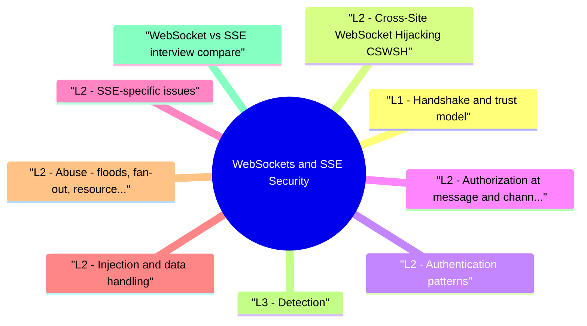

# WebSockets and SSE Security revision map

Last mock I bounced around the WebSockets and SSE Security folder. This file is the stop that. Drawn from Critical Clarification WebSockets and SSE Security Misconceptions.md, WebSockets and SSE Security - Comprehensive Guide.md, WebSockets and SSE Security - Interview Questions & Answers.md, WebSockets and SSE Security - Quick Reference.md. Skim the mermaid, then the outline.

## L1 - Handshake and trust model
- Server responds 101 Switching Protocols - after this, framed messages flow bidirectionally.
- Server streams text/event-stream - server -> client only.

## L2 - Cross-Site WebSocket Hijacking (CSWSH)
- When the app uses cookie-based sessions and the server does not validate Origin, a malicious page can open:
- Validate Origin header against allowlist (strict).
- SameSite cookies (Strict/Lax) reduce cross-site cookie send-not sufficient alone.
- CSRF token for handshake where architecture permits.

## L2 - Authentication patterns
- Reconnect storms: Clients reconnect with expired JWT-handle graceful reauth without silent anonymous mode.

## L2 - Authorization at message and channel level
- Anti-pattern: Auth at handshake only, then subscribe to /tenant/{id} with client-supplied ID.
- Map connection to principal + tenant from token claims.
- Server-side channel ACL - client requests subscribe:orders, server verifies membership.
- Re-check authZ on sensitive actions (admin broadcast, payment confirmation).

## L2 - SSE-specific issues
- EventSource sends cookies on cross-origin if CORS allows-Origin and CORS must be tight.
- No custom headers in classic EventSource-often cookie auth -> same CSWSH class if misconfigured.
- Fetch API + ReadableStream alternative allows headers at cost of complexity.

## L2 - Injection and data handling
- Message content may reach HTML/DOM - treat as untrusted (XSS via WS message).
- JSON parsing - schema validate; size limits per frame.
- Server-side publish endpoints protected from SSRF/open relay (don't let users broadcast to all clients).

## L2 - Abuse: floods, fan-out, resource exhaustion
- Infrastructure: Sticky sessions vs pub/sub backplane (Redis, Kafka)-ensure authZ consistent across nodes.

## L3 - Detection
- Metrics: connections/user, subscribe denials, abnormal Origin values, frame rate.
- Logs: 4401/4403 close codes, auth failures at handshake.
- Correlate with API abuse and credential stuffing.

## WebSocket vs SSE (interview compare)

## Interview clusters

## Labs / references
- PortSwigger Cross-site WebSocket hijacking lab
- OWASP WebSocket Security Cheat Sheet
- RFC 6455 (WebSocket), HTML SSE spec

## Cross-links
- Authorization and Authentication · CORS · Rate Limiting and Abuse Prevention · XSS

## Misreads that still sneak in

## "WebSockets inherit REST security automatically."
- Reality: Persistent channels need explicit auth and authorization design.

## "If upgrade is authenticated, every message is safe."
- Reality: Message-level authZ still matters for multi-tenant actions.

## "SSE is read-only so low risk."
- Reality: Data exposure and unauthorized subscriptions are still critical.

## "Origin checks are optional for WS."
- Reality: Missing origin validation enables cross-site abuse patterns.

## "Realtime channels do not need rate limits."
- Reality: Flooding and fan-out abuse can degrade service quickly.

## "JWT expiry doesn't matter after connect."
- Reality: Long-lived connections need reauth/refresh handling.

## "Private channel names are enough protection."
- Reality: Obscurity is not authorization.

## "TLS alone solves realtime security."
- Reality: Transport encryption does not fix authZ or abuse logic flaws.

## Clusters from the Q&A file

- Cookie auth on WebSockets-safe?
- WebSocket vs SSE security?
- How authorize pub/sub channels?
- Authoritative references

## 60-second answer
- Q: What is Cross-Site WebSocket Hijacking?

### Cookie auth on WebSockets-safe?
- A: Only with Origin validation + SameSite + channel ACLs-prefer token in first message or subprotocol with caveats.

## Cross-links I actually follow

- Stay inside this folder for the long guide. Jump only when a section names a sibling topic.
- Cookie Security, CSRF, XSS, JWT, OAuth, and TLS show up as neighbors on a lot of these maps.
