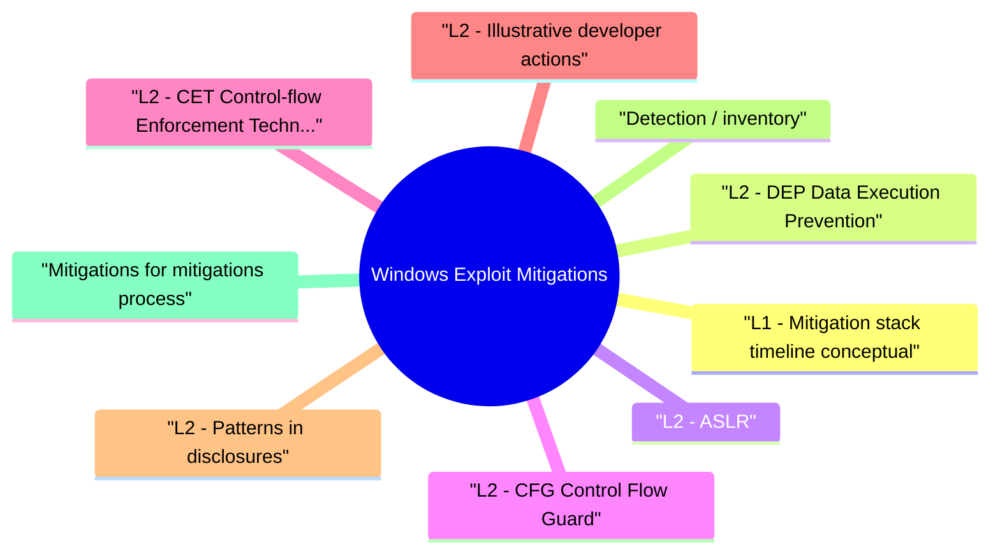

# Windows Exploit Mitigations revision map

I keep this Windows Exploit Mitigations map for the night before a screen, when five markdown files is too many clicks. Built from Critical Clarification Windows Exploit Mitigations Misconceptions.md, Windows Exploit Mitigations - Comprehensive Guide.md, Windows Exploit Mitigations - Interview Questions & Answers.md, Windows Exploit Mitigations - Quick Reference.md. Twenty minutes. Then I close the laptop.

## L1 - Mitigation stack timeline (conceptual)

## L2 - DEP (Data Execution Prevention)
- Marks stack/heap non-executable by default on modern Windows.
- Bypass concept: ROP to call VirtualProtect / NtProtectVirtualMemory and flip permissions-needs gadgets and info disclosure under ASLR.

## L2 - ASLR
- Randomizes base loads for EXE/DLL per boot (simplified).
- Weaknesses: non-ASLR images, partial overwrites, info leaks (format strings, heaps spray less effective today but context-dependent).

## L2 - CFG (Control Flow Guard)
- Bitmap of valid indirect call targets; violations terminate process.
- Limits arbitrary indirect calls but not all logic; advanced research targets valid but unintended call sites (call CFG bypass literature at high level only).

## L2 - CET (Control-flow Enforcement Technology)
- Shadow stack stores return addresses in protected memory; mismatches fault.
- IBT (Indirect Branch Tracking) adds endbr style discipline on indirect jumps (Intel)-reduces JOP gadgets.

## L2 - Illustrative developer actions
- Enable mitigations at link time (/DYNAMICBASE, /NXCOMPAT, /guard:cf on MSVC). Verify with binscope/dumpbin flags in hardening reviews.

## L2 - Patterns in disclosures
- Browser and PDF chains historically chained many bugs to defeat layered mitigations.
- Kernel exploits target separate mitigation sets (PatchGuard, HVCI).

## Detection / inventory
- Sysinternals Process Explorer shows CFG awareness for modules (contextual).
- Enterprise baselines (e.g., Microsoft Security Baseline) prescribe optimal flags.

## Mitigations for mitigations (process)
- Block legacy non-DYNAMICBASE binaries where possible.
- Enable HVCI on high-value hosts to raise kernel bar.
- Red team exercises validate assumptions about "fully mitigated" builds.

## Labs
- Compiler labs: build with/without /GS and observe crashes in test overflows (authorized).
- Microsoft learn modules on Exploit Protection.

## Toolchain
- dumpbin, binscope (legacy), Visual Studio property pages, WDAC for blocking weak binaries.

## Interview clusters

## Authoritative references
- Microsoft "Mitigate threats by using Windows 10 security features" (evolving doc set).
- Intel CET architecture chapter.
- CWE-119, CWE-787 - memory corruption parents.

## Cross-links
- Basic Exploitation Fundamentals · Shellcode Fundamentals and Detection · Windows Security Boundaries · EDR Evasion Awareness and Defense

## Verification checklist
- [ ] Name two ASLR limitations without exploit recipe detail.
- [ ] Explain why CFG doesn't stop data-only attacks.

## Cheat sheet bits

## Stack
- DEP/NX · ASLR · /GS canary · CFG · ACG (context) · CET (shadow stack / IBT)

## What they block
- Exec data · predictable bases · trivial stack smash · unrestricted indirect calls · some returns

## Dev flags (MSVC)

## Cross-read
- Basic Exploitation Fundamentals · Windows Security Boundaries · EDR Evasion Awareness

## One-liner

## Traps that dump interviews

## "ASLR makes exploits impossible."
- Reality: Leaks, partial overwrites, and weak randomization contexts persist.

## "CFG stops all ROP."
- Reality: CFG narrows targets; research continues on valid call sites and data-only attacks.

## "Stack canaries catch heap corruption."
- Reality: Different memory region; need heap mitigations (safe unlink, LFH randomization, etc.).

## "DEP is obsolete."
- Reality: Still foundational; attackers adapt with ROP, JIT spray less common on modern browsers but primitives evolve.

## "64-bit ASLR is always high entropy."
- Reality: Images without DYNAMICBASE, fork without rebase, and leaks reduce entropy.

## "CET has zero performance cost."
- Reality: Measure hot paths; some workloads pay branch costs.

## "Kernel and user mitigations are identical."
- Reality: Kernel has PatchGuard, HVCI, different exploit constraints.

## "Compiler flags alone secure the app."
- Reality: Logic bugs and misconfigurations ignore CFG.

## Prompts I drill out loud

- Q: CFG vs stack canary?
- Q: Does ASLR help heap bugs?
- Q: CET broke our app-what now?

## 60-second answer
- Q: Summarize Windows exploit mitigations for an interview.

## Compare / contrast

## Rollout

### Q: CET broke our app-what now?
- A: Inventory JIT/plugins doing dynamic code; test per module; engage vendors; staged rollout with telemetry.

## Mock ladder

## Sibling folders

- Stay inside this folder for the long guide. Jump only when a section names a sibling topic.
- Cookie Security, CSRF, XSS, JWT, OAuth, and TLS show up as neighbors on a lot of these maps.
