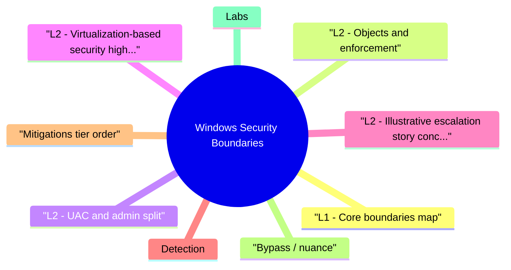

# Windows Security Boundaries revision map

Last mock I bounced around the Windows Security Boundaries folder. This file is the stop that. Drawn from Critical Clarification Windows Security Boundaries Misconceptions.md, Windows Security Boundaries - Comprehensive Guide.md, Windows Security Boundaries - Interview Questions & Answers.md, Windows Security Boundaries - Quick Reference.md. Skim the mermaid, then the outline.

## L1 - Core boundaries map
- Kernel boundary: Ring 0 code can read all physical memory (simplified); user cannot touch kernel VA without bugs or syscalls.
- Session boundary: Terminal sessions isolate interactive users; breakouts via misconfigured services still occur.
- Integrity Level (IL): Mandatory Label on objects; Low IL Internet Explorer era model evolved into modern sandbox labels.

## L2 - Objects and enforcement

## L2 - UAC and admin split
- UAC splits standard vs elevated admin tokens; not a security boundary against determined malware on same session-Microsoft documentation stresses elevation is consent UX, not kernel-style isolation.
- Bypasses historically involved auto-elevate binaries, DLL search order-patched over time; design assumes malware already running as user is bad.

## L2 - Virtualization-based security (high level)
- HVCI (Hypervisor-protected Code Integrity): kernel code integrity enforced with hypervisor help-raises bar for kernel rootkits.
- Credential Guard: isolates secrets with VSM-mitigates Pass-the-Hash classes in many configs.
- WDAC / AppLocker: code integrity policy at user/kernel load paths.

## L2 - Illustrative escalation story (conceptual)
- Web RCE as AppPool identity -> local enumeration.
- SeImpersonate-style primitive -> token manipulation to SYSTEM-adjacent contexts (depends on version/patch).
- BYOVD -> kernel read/write -> boundary gone.

## Detection
- 4688 / Sysmon process events crossing unexpected parents.
- Token elevation events, LSASS access attempts (Credential Guard changes shape).
- Driver loads: new untrusted kernel modules.

## Mitigations (tier order)
- Reduce attack surface on servers (no browsing, minimal roles).
- Credential Guard / protected users for high-value accounts.
- HVCI where compatible; WDAC for servers.
- Patch privesc chains fast; segment tier 0.

## Bypass / nuance
- Same-session malware often doesn't need kernel-credential theft at user may suffice.
- Third-party drivers and admin habits punch holes in policy.

## Labs
- Microsoft learn paths on Windows security baselines.
- HTB Windows privesc rooms (authorized).

## Toolchain
- Sysmon, Process Explorer (token view), accesschk, Windows Event Log, WDAC policy tools.

## Interview clusters

## Authoritative references
- Microsoft docs: Windows internals security model, UAC, HVCI, Credential Guard.
- MITRE ATT&CK Privilege Escalation / Credential Access (Windows).
- Russinovich et al., Windows Internals (reference).

## Cross-links
- Windows Exploit Mitigations · EDR Evasion Awareness and Defense · Initial Access and Attack Surface Entry

## Verification checklist
- [ ] Explain why UAC isn't a kernel-class wall.
- [ ] Name two VBS features and what boundary they strengthen.

## Flags I check in 90 seconds

## Boundaries
- Kernel ↔ user · Session · Integrity level · AppContainer · VBS (HVCI, Credential Guard)

## Enforcement levers
- Token privileges · ACLs · WDAC/AppLocker · hypervisor-backed CI

## Interview facts
- UAC ≠ strong boundary · Patch privesc · segment tier 0

## Cross-read
- Windows Exploit Mitigations · EDR Evasion Awareness and Defense

## One-liner

## Misreads that still sneak in

## "UAC stops malware."
- Reality: UAC prompts aren't a kernel boundary; user malware remains dangerous.

## "Standard user = safe."
- Reality: Credential theft, ransomware, and lateral movement often need no admin.

## "Antivirus equals kernel protection."
- Reality: Kernel drivers and BYOVD can undermine AV; defense is layered.

## "HVCI has no compatibility impact."
- Reality: Some drivers and legacy apps fail; pilot before wide rollout.

## "Credential Guard blocks all PtH."
- Reality: Reduces many classes; misconfigurations and alternate paths remain.

## "Sessions isolate servers completely."
- Reality: Shared services and mis ACLs bridge sessions.

## "Admin password rotation fixes escalation."
- Reality: Token theft and persistence don't care about password age alone.

## "Linux containers are the same as AppContainer."
- Reality: Different models; don't map 1:1 terminology.

## Clusters from the Q&A file

- Q: Is UAC a security boundary?
- Q: AppContainer vs standard user?
- Q: What does HVCI buy you?

## 60-second answer
- Q: What are Windows security boundaries and why do they matter?

## Concepts

## Architecture

## Mock ladder

## Cross-links I actually follow

- Stay inside this folder for the long guide. Jump only when a section names a sibling topic.
- Cookie Security, CSRF, XSS, JWT, OAuth, and TLS show up as neighbors on a lot of these maps.
