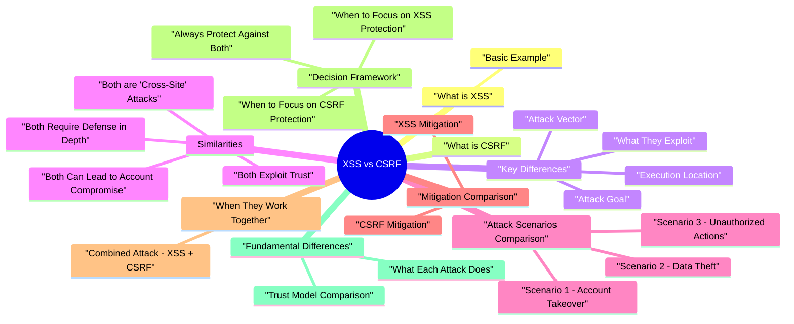

# XSS vs CSRF revision map

XSS vs CSRF in one sitting. That is the deal. I mined Critical Clarification XSS vs CSRF Misconceptions.md, XSS vs CSRF - Comprehensive Comparison Guide.md, XSS vs CSRF - Interview Questions & Answers.md, XSS vs CSRF - Quick Reference.md, XSS vs CSRF - Comprehensive Comparison Guide.md. The outline keeps every H2 I cared about from those files.

## What is XSS

### Basic Example
- Result: Script executes in victim's browser
- Result: Victim's browser submits transfer request automatically

## What is CSRF
- CSRF (Cross-Site Request Forgery) is an attack that tricks a user's browser into making requests to a web application where the user is authenticated, causing the application to perform actions the user didn't intend.

## Key Differences

### Attack Goal
- Goal: Execute malicious scripts in victim's browser
- Focus: Code execution in browser context
- Goal: Trick victim into submitting requests
- Focus: Unauthorized actions on server

### What They Exploit
- Exploits: Trust application has in user input
- Target: Application's output encoding
- Exploits: Trust browser has in application (automatic cookie sending)
- Target: Application's request validation

### Execution Location
- Location: Victim's browser
- Execution: Client-side JavaScript
- Location: Server-side
- Execution: Server processes request

### Attack Vector
- Vector: Script injection
- Payload: JavaScript code
- Entry: User input fields, URL parameters, etc.
- Vector: Form submission
- Payload: HTTP request
- Entry: Malicious website visited by victim

### Target Audience
- Target: Other users viewing the page
- Scope: Can affect multiple users
- Persistence: Can be stored (stored XSS)
- Target: Authenticated users (usually the victim themselves)
- Scope: Affects individual user's session
- Persistence: One-time attack per victim

### Requirements
- Requires: User input reflected/stored in page
- Doesn't Require: User authentication (can affect anonymous users)
- Requires: User authentication (session cookie)
- Doesn't Require: XSS vulnerability

### Mitigation
- Primary: Output encoding
- Secondary: Content Security Policy (CSP)
- Additional: Input validation, HttpOnly cookies
- Primary: CSRF tokens
- Secondary: SameSite cookies
- Additional: Origin/Referer header validation

## Similarities

### Both are "Cross-Site" Attacks
- Attack originates from one site
- Affects another site
- Uses malicious input from attacker
- Attack originates from one site (attacker's)
- Affects another site (target)
- Uses victim's browser to make requests

### Both Exploit Trust
- Exploits application's trust in user input
- Application trusts input is safe
- Exploits browser's trust in application
- Browser automatically includes cookies

### Both Can Lead to Account Compromise
- Steal session cookies
- Hijack user sessions
- Perform actions as user
- Perform unauthorized actions
- Change account settings
- Transfer funds, delete data

### Both Require Defense in Depth
- Multiple layers: encoding, CSP, validation
- Multiple layers: tokens, SameSite, headers

## Attack Scenarios Comparison

### Scenario 1: Account Takeover
- See the source section `Scenario 1: Account Takeover` for the worked example.

### Scenario 2: Data Theft
- Cannot directly extract data
- Must perform actions that expose data
- Limited to actions available via forms

### Scenario 3: Unauthorized Actions
- See the source section `Scenario 3: Unauthorized Actions` for the worked example.

## Mitigation Comparison

### XSS Mitigation
- See the source section `XSS Mitigation` for the worked example.

### CSRF Mitigation
- See the source section `CSRF Mitigation` for the worked example.

## When They Work Together

### Combined Attack: XSS + CSRF
- Scenario: XSS vulnerability allows attacker to bypass CSRF protection by reading CSRF token.
- Prevent XSS (output encoding)
- Use HttpOnly cookies for CSRF tokens
- Additional validation beyond tokens

## Decision Framework

### When to Focus on XSS Protection
- Application displays user input
- User-generated content is shown
- URL parameters reflected in page
- Search functionality exists
- Comment/forum features present

### When to Focus on CSRF Protection
- State-changing operations exist
- POST/PUT/DELETE endpoints present
- User authentication required
- Actions change account settings
- Financial transactions possible

### Always Protect Against Both
- Implement XSS protection (output encoding, CSP)
- Implement CSRF protection (tokens, SameSite)
- Defense in depth approach
- Regular security testing

## Fundamental Differences

### What Each Attack Does
- See the source section `What Each Attack Does` for the worked example.

#### XSS (Cross-Site Scripting)
- XSS occurs when an application includes attacker-controlled data in its output without proper encoding or sanitization, allowing the attacker to inject and execute arbitrary JavaScript in the context of a trusted origin.
- Injects malicious scripts into a trusted website's pages
- The injected code executes in the victim's browser within the application's origin
- Can read the DOM, access cookies (unless HttpOnly), interact with APIs, modify page content, exfiltrate data, and impersonate the user
- The attacker gains the full privileges of the application's JavaScript context
- Reflected XSS - Malicious input is immediately reflected back in the server's response (e.g., in search results or error messages). Requires the victim to click a crafted link.
- Stored XSS - Malicious input is persisted (in a database, file, cache) and served to other users who view the affected page. No victim interaction beyond visiting the page.
- Mutation XSS (mXSS) - Exploits differences in how HTML parsers (browser vs. sanitizer) interpret markup. A payload that looks safe to the sanitizer mutates into executable script when the browser parses it.

#### CSRF (Cross-Site Request Forgery)
- Tricks the victim's browser into making unwanted requests to a site where they are authenticated
- Exploits the browser's automatic cookie-sending behavior
- The attacker cannot read the response - same-origin policy prevents cross-origin response access
- Forces state-changing actions only (fund transfers, password changes, email updates, privilege grants)
- The attacker is "blind" - they fire the request and hope it succeeds

### Trust Model Comparison
- See the source section `Trust Model Comparison` for the worked example.

## Attack Mechanics Deep Dive

### XSS Attack Flow
- See the source section `XSS Attack Flow` for the worked example.

#### Reflected XSS
- The attacker crafts a URL containing malicious JavaScript. The server includes the attacker's input in its response without encoding. When the victim clicks the link, the script executes.
- Flow: Attacker crafts URL -> victim clicks link -> server reflects input in response -> browser executes script in trusted origin

#### Stored XSS
- The attacker submits malicious input that gets stored in the application's database. When other users view the page containing the stored data, the script executes automatically.
- Flow: Attacker submits payload -> server stores it -> other users view page -> browser executes stored script

#### DOM-based XSS
- The vulnerability exists entirely in client-side JavaScript. The server never sees the malicious payload - it may be in the URL fragment (#), which browsers don't send to the server.
- Flow: Victim visits crafted URL -> client-side JS reads attacker-controlled input -> input used in dangerous sink -> script executes
- element.innerHTML, element.outerHTML
- document.write(), document.writeln()
- eval(), setTimeout(string), setInterval(string)
- new Function(string)
- element.setAttribute('onclick', ...)
- location.href, location.assign(), location.replace()

#### Mutation XSS (mXSS)
- Exploits differences between how an HTML sanitizer parses markup and how the browser ultimately renders it. The sanitizer sees safe HTML; the browser's parser mutates it into something executable.
- When the victim (who is logged into their router admin panel) visits this page, the browser sends authenticated GET requests that change DNS settings and disable the firewall.

#### POST-based CSRF
- Flow: Victim visits attacker's page -> hidden form auto-submits -> browser sends authenticated POST request with attacker's parameters
- The form auto-submits on page load. The victim's browser includes the bank's session cookie. The bank's server sees a valid authenticated POST request and processes the transfer.

#### Login CSRF
- An often-overlooked variant: the attacker forces the victim to log into the attacker's account.
- Flow: Attacker creates form that logs victim into attacker's account -> victim performs actions believing they're in their own account -> attacker later reviews account activity

#### JSON-based CSRF
- Modern APIs often expect JSON payloads. Attackers can sometimes send JSON via form submissions or exploit CORS misconfigurations.
- Realistic example - exploiting lenient content-type handling:
- Strictly validate Content-Type: application/json (forms can't set this header cross-origin without CORS preflight)
- Require a custom header (e.g., X-Requested-With) - custom headers trigger CORS preflight
- Standard CSRF tokens in a custom header

### Combined Attack: XSS Enabling CSRF Bypass
- This is perhaps the most critical insight in this entire comparison: XSS on the same origin completely defeats CSRF protections.
- When an attacker has XSS in the target application, the malicious script runs within the application's origin. This means:
- It can read CSRF tokens from hidden form fields, meta tags, or API responses
- It can craft requests with all necessary headers including custom headers like X-Requested-With or X-CSRF-Token
- It operates within the same origin, so SameSite cookies are included normally
- It can read responses, unlike traditional CSRF, making the attack bidirectional
- CORS restrictions don't apply because the request originates from the same origin

## Defense Mechanisms Comparison

### XSS Defenses
- See the source section `XSS Defenses` for the worked example.

#### Output Encoding (Primary Defense)
- Context-dependent encoding is the most critical XSS defense. The encoding must match the context where the data is being inserted.

#### Content Security Policy (CSP)
- CSP provides a defense-in-depth layer that limits what injected scripts can do even if XSS occurs.
- CSP with strict-dynamic for modern applications:

#### Trusted Types API
- A newer browser API that enforces type-safe DOM manipulation, preventing DOM XSS at the browser level.

#### Framework-Level Protections
- Modern frameworks provide automatic encoding by default:
- React: Auto-escapes JSX expressions. Dangerous: dangerouslySetInnerHTML
- Angular: Auto-sanitizes bindings. Dangerous: bypassSecurityTrustHtml()
- Vue: Auto-escapes &#123;&#123; &#125;&#125; interpolation. Dangerous: v-html directive

#### HttpOnly Cookies
- Does not prevent XSS but limits the impact by making session cookies inaccessible to JavaScript.
- Limitation: An attacker with XSS can still perform actions as the user by making fetch/XHR requests - they just can't steal the cookie value and use it from another machine.

#### Input Validation and Sanitization
- A supplementary defense - never the primary one.

### CSRF Defenses
- See the source section `CSRF Defenses` for the worked example.

#### Synchronizer Token Pattern (Primary Defense)
- The server generates a unique, unpredictable token tied to the user's session and embeds it in every state-changing form. The server validates the token on submission.
- Why it works: The attacker cannot read the token because same-origin policy prevents cross-origin reads. Without the valid token, the forged request is rejected.

#### Double Submit Cookie Pattern
- An alternative when server-side state is difficult (e.g., stateless APIs). The token is stored in both a cookie and a request parameter; the server checks they match.
- Why it works: An attacker can cause the browser to send the cookie, but cannot read it (same-origin policy), so they can't duplicate the value in the request header.

#### SameSite Cookie Attribute
- Instructs the browser to restrict when cookies are sent in cross-site requests.
- Important: SameSite=Lax is now the default in modern browsers (Chrome, Edge, Firefox). This has dramatically reduced CSRF risk for applications that properly use POST for state-changing operations.

#### Custom Request Headers
- Require a custom header on state-changing requests. Custom headers on cross-origin requests trigger a CORS preflight, which will be denied if CORS is not configured to allow the attacker's origin.
- Why it works: HTML forms cannot set custom headers. JavaScript from a cross-origin page cannot set custom headers without CORS preflight approval.

#### Origin/Referer Header Validation
- Check the Origin or Referer header to verify the request came from the expected origin.
- Some browsers/proxies strip Referer headers
- Privacy extensions may suppress Origin
- Should be a supplementary defense, not the sole protection

#### Re-authentication for Sensitive Actions
- For high-impact operations, require the user to re-enter their password or complete a second factor.
- This defeats both CSRF (attacker doesn't know current password) and session hijacking.

### Which Defenses Overlap
- Understanding which defenses apply to which attack is critical for interview discussions:
- Key insight: There is almost zero overlap. You need both sets of defenses deployed together. Implementing only CSRF protections leaves you vulnerable to XSS, and vice versa.

### Why XSS Defeats CSRF Protections
- This deserves its own section because it is one of the most important security concepts:
- CSRF tokens become useless - XSS script on the same origin can read tokens from forms, meta tags, or API endpoints and include them in forged requests
- SameSite cookies don't help - The XSS script runs on the same site, so all cookies are attached normally. SameSite only restricts cross-site requests
- Custom header requirements are bypassed - JavaScript on the same origin can set any header on fetch/XHR requests
- Origin/Referer validation passes - Requests from XSS originate from the legitimate origin
- Double-submit cookies are defeated - XSS can read cookies via document.cookie and duplicate the value in the request parameter

## Impact Comparison

### XSS Impact Severity
- XSS is considered one of the most versatile web vulnerabilities because the attacker gains JavaScript execution in the victim's browser:

### CSRF Impact Severity
- CSRF impact depends entirely on what state-changing actions the target application exposes:
- Key limitation: CSRF cannot directly steal data. It is a blind, write-only attack. The attacker can force actions but cannot observe their results.

### Risk Rating Comparison
- See the source section `Risk Rating Comparison` for the worked example.

## Testing Comparison

### Testing for XSS
- Identify all input vectors - form fields, URL parameters, headers (User-Agent, Referer), file uploads, API bodies, WebSocket messages
- Inject test payloads - context-aware probes, not just alert(1)
- Check output encoding - inspect the HTML source to see how your input is rendered
- Test different contexts - HTML body, attributes, JavaScript, URLs, CSS
- Burp Suite - CSRF PoC generator, passive checks for missing tokens
- OWASP ZAP - anti-CSRF token detection
- CSRFTester (OWASP) - dedicated CSRF testing tool

### Testing Comparison Table
- See the source section `Testing Comparison Table` for the worked example.

## Real-World Examples

### Famous XSS Attacks
- See the source section `Famous XSS Attacks` for the worked example.

#### Samy Worm (MySpace, 2005)
- The first self-propagating XSS worm. Samy Kamkar exploited a stored XSS vulnerability in MySpace profiles. The worm:
- Added Samy as a friend to every infected user's profile
- Added "but most of all, samy is my hero" to their profile
- Copied itself to the victim's profile, infecting anyone who viewed it
- Infected over 1 million users in under 20 hours

#### British Airways / Magecart (2018)
- Attackers compromised British Airways' website and mobile app by injecting a malicious script (22 lines of JavaScript) that:
- Captured payment card details as customers entered them
- Exfiltrated data to a lookalike domain (baways.com)
- Ran undetected for approximately 15 days
- Affected ~380,000 transactions

#### TweetDeck Worm (2014)
- A stored XSS vulnerability in TweetDeck allowed a self-retweeting worm. The payload was embedded in a tweet:
- The worm caused approximately 80,000 users to unknowingly retweet the malicious tweet.

### Famous CSRF Attacks
- See the source section `Famous CSRF Attacks` for the worked example.

#### Gmail Email Filter Attack (2007)
- A CSRF vulnerability in Gmail allowed attackers to create email forwarding filters in the victim's account:
- The victim visited a malicious page while logged into Gmail
- The page submitted a forged POST request to Gmail's filter creation endpoint
- A new filter was created that forwarded all emails matching specific criteria to the attacker
- The attacker silently received copies of the victim's emails

#### Netflix Account Takeover (2006)
- Researchers discovered CSRF vulnerabilities in Netflix that allowed:
- Changing the shipping address for DVD rentals
- Adding movies to the victim's queue
- Changing account credentials
- In combination, achieving full account takeover

#### ING Direct (Banking)
- A CSRF vulnerability in ING Direct's banking application allowed attackers to:
- Open additional accounts in the victim's name
- Transfer funds from the victim's existing accounts to the newly created accounts
- The attack exploited the lack of re-authentication for fund transfers

## Common Interview Questions

### "What's the difference between XSS and CSRF?"
- See the source section `"What's the difference between XSS and CSRF?"` for the worked example.

### "Can XSS lead to CSRF?"
- See the source section `"Can XSS lead to CSRF?"` for the worked example.

### "If you could only fix one vulnerability - XSS or CSRF - which would you prioritize?"
- See the source section `"If you could only fix one vulnerability - XSS or CSRF - which would you prioritize?"` for the worked example.

### "How does SameSite=Lax help with CSRF but not XSS?"
- See the source section `"How does SameSite=Lax help with CSRF but not XSS?"` for the worked example.

### "A penetration test found both XSS and CSRF in your application. How do you prioritize remediation?"
- See the source section `"A penetration test found both XSS and CSRF in your application. How do you prioritize remediation?"` for the worked example.

### "Can CSRF steal data?"
- See the source section `"Can CSRF steal data?"` for the worked example.

### "Your application uses a REST API with JWT tokens in the Authorization header (not cookies). Is it vulnerable to CSRF?"
- See the source section `"Your application uses a REST API with JWT tokens in the Authorization header (not cookies). Is it vulnerable to CSRF?"` for the worked example.

## Quick Comparison Matrix

## Cross-Links
- XSS (Cross-Site Scripting) - deep dive into all XSS types, payloads, and defenses
- Cookie Security / HttpOnly and Secure Cookies - SameSite, HttpOnly, Secure, cookie prefixes
- Security Headers - CSP, HSTS, X-Frame-Options, and other response headers
- Session Fixation and Session Hijacking - session management attacks and defenses
- Web Application Security Vulnerabilities - broader web security context
- XSS vs CSRF - Interview Questions & Answers - focused Q&A format
- XSS vs CSRF - Quick Reference - one-page summary
- Critical Clarification: XSS vs CSRF Misconceptions - common mistakes and corrections

## Pocket list

## Comparison Table

## Quick Decision Guide

### When to Focus on XSS Protection
- User input displayed in pages
- User-generated content
- Search functionality
- Comment/forum features
- URL parameters reflected

### When to Focus on CSRF Protection
- State-changing operations
- POST/PUT/DELETE endpoints
- User authentication required
- Account settings changes
- Financial transactions

### Always Protect Against Both
- Implement XSS protection (encoding, CSP)
- Implement CSRF protection (tokens, SameSite)
- Defense in depth approach

## Key Takeaways
- XSS and CSRF are different - different goals, mechanisms, mitigations
- Preventing one doesn't prevent the other - both must be addressed
- CSRF doesn't require XSS - works independently
- XSS is more versatile - multiple attack vectors beyond cookie theft
- Both can be combined - XSS can bypass CSRF protection

## The clarification file, compressed

## ️ Common Misconceptions

### "XSS and CSRF are the same attack"
- Truth: XSS and CSRF are completely different attacks with different goals, mechanisms, and mitigations.
- Goal: Execute malicious scripts in victim's browser
- Mechanism: Inject scripts into web pages
- Target: Other users viewing the page
- Prevention: Output encoding, CSP
- Goal: Trick victim into submitting requests
- Mechanism: Exploit browser's automatic cookie sending
- Target: Authenticated users (usually the victim themselves)

### "Preventing XSS also prevents CSRF"
- Truth: XSS and CSRF require different mitigation strategies. Preventing one does not prevent the other.
- Output encoding
- Content Security Policy (CSP)
- Input validation
- CSRF tokens
- SameSite cookies
- Origin/Referer header validation

### "CSRF requires XSS to work"
- Truth: CSRF does not require XSS. CSRF can work independently of XSS vulnerabilities.
- Victim visits attacker's page (evil.com)
- Form automatically submits to bank.com
- Browser includes session cookie (automatic)
- Bank processes transfer (trusts cookie)

### "XSS can only be used to steal cookies"
- Truth: XSS can be used for multiple attack vectors, not just cookie theft.
- Cookie Theft: document.cookie
- Session Hijacking: Steal session tokens
- Keylogging: Capture user input
- Phishing: Fake login forms
- Defacement: Modify page content
- Data Theft: Extract sensitive information
- Redirects: Send users to malicious sites

### "CSRF only affects GET requests"
- Truth: CSRF can affect any state-changing request, including POST, PUT, DELETE, etc.
- Key Point: CSRF affects any request that changes server state, regardless of HTTP method.

## Key Takeaways

### Understanding
- XSS and CSRF are different attacks with different goals and mechanisms
- Different mitigations required - preventing one doesn't prevent the other
- CSRF doesn't require XSS - works independently
- XSS has multiple attack vectors - not just cookie theft
- CSRF affects any state-changing request - not just GET

### Common Mistakes
- Confusing XSS and CSRF
- Thinking preventing XSS prevents CSRF
- Believing CSRF requires XSS
- Limiting XSS to cookie theft only
- Thinking CSRF only affects GET requests

## Summary Table
- Remember: XSS and CSRF are different vulnerabilities requiring different mitigation strategies. Both must be addressed separately!

## Oral prompts worth repeating

- Comparison Questions
- What are the key differences between XSS and CSRF?
- Does preventing XSS also prevent CSRF?
- Fundamental Questions
- Can CSRF work without XSS?
- Can XSS be used to steal more than just cookies?
- Mitigation Questions
- How do you prevent both XSS and CSRF?
- Scenario-Based Questions
- An attacker wants to change a user's email address. Would they use XSS or CSRF?
- Can XSS and CSRF be combined in an attack?
- Depth: Interview follow-ups - XSS vs CSRF

## Depth: Interview follow-ups - XSS vs CSRF
- Authoritative references: OWASP cheat sheets for XSS and CSRF.
- One sentence distinction: XSS executes script in victim browser; CSRF forges cross-site requests using the victim's cookies/session.
- Can CSRF tokens stop XSS? (No-attacker reads token via XSS.)
- Defense pairing: HttpOnly limits token theft but not CSRF action while session alive.

## What sits next to this topic

- Stay inside this folder for the long guide. Jump only when a section names a sibling topic.
- Cookie Security, CSRF, XSS, JWT, OAuth, and TLS show up as neighbors on a lot of these maps.
