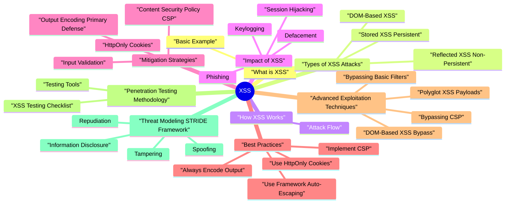

# XSS revision map

XSS in one sitting. That is the deal. I mined Critical Clarification XSS Misconceptions.md, XSS (Cross-Site Scripting) - Comprehensive Guide.md, XSS - Interview Questions & Answers.md, XSS - Quick Reference.md, XSS - VAPT Methodology.md. The outline keeps every H2 I cared about from those files.

### What XSS is Used For
- Steal session cookies and hijack user sessions
- Deface websites or modify content
- Steal sensitive data (credentials, personal information)
- Perform actions on behalf of users
- Deliver malware or redirect users to malicious sites
- Phish users with fake login forms

### Why XSS is Dangerous
- High Impact: Can lead to complete account compromise
- Very Common: Found in most web applications
- Easy to Exploit: Simple payloads, widespread impact
- Hard to Detect: Executes in victim's browser
- Widespread: Affects all applications displaying user input

## What is XSS

### Basic Example
- See the source section `Basic Example` for the worked example.

## Types of XSS Attacks

### Reflected XSS (Non-Persistent)
- Description: Malicious script is reflected off the web server immediately in response to user input. The payload is not stored.
- Attacker crafts malicious URL with XSS payload
- Attacker sends URL to victim (phishing email, etc.)
- Victim clicks link
- Server reflects payload in response
- Script executes in victim's browser
- Payload in URL parameters, headers, or form data
- Not stored on server

### Stored XSS (Persistent)
- Description: Malicious script is stored on the server (database, file, etc.) and executed whenever the affected page is viewed.
- Attacker submits malicious script to application
- Application stores payload (comments, posts, profiles, etc.)
- Victim views page containing stored payload
- Script executes in victim's browser
- Payload stored on server
- Affects all users viewing affected content
- No user interaction needed

### DOM-Based XSS
- Description: Malicious script is executed by manipulating the DOM in the client's browser. The vulnerability is in client-side JavaScript, not server-side code.
- Attacker crafts malicious URL with payload in fragment (#)
- Client-side JavaScript reads URL parameter/fragment
- JavaScript unsafely writes to DOM (innerHTML, document.write, etc.)
- Script executes in browser
- innerHTML
- outerHTML
- document.write()

## How XSS Works

### Attack Flow
- Find where user input is accepted (forms, URL params, headers, etc.)
- Inject JavaScript payload
- Payload designed to execute in browser context
- Application receives input
- Input included in HTML response without encoding
- Browser receives HTML containing payload
- Browser interprets HTML and executes JavaScript
- Malicious JavaScript runs in victim's browser

## Impact of XSS

### Session Hijacking
- Steal session cookies
- Impersonate users
- Gain unauthorized access
- Account compromise
- Unauthorized access
- Data breach
- Identity theft

### Defacement
- Modify page content
- Display malicious content
- Damage reputation

### Keylogging
- Capture user keystrokes
- Steal credentials
- Monitor user activity

### Phishing
- Display fake login forms
- Steal credentials
- Trick users into providing sensitive information

### Redirect Attacks
- Redirect users to malicious sites
- Steal credentials
- Deliver malware

## Mitigation Strategies

### Output Encoding (Primary Defense)
- How It Works: Encode user input based on the context where it's displayed (HTML, JavaScript, URL, CSS).

### Content Security Policy (CSP)
- How It Works: HTTP header that restricts which sources can load content (scripts, styles, images, etc.).
- default-src: Default policy for all resource types
- script-src: Controls script execution
- style-src: Controls stylesheet loading
- img-src: Controls image sources
- connect-src: Controls fetch/XHR requests
- font-src: Controls font loading
- object-src: Controls object/embed/applet

### HttpOnly Cookies
- How It Works: Prevents JavaScript from accessing cookies via document.cookie.
- Only prevents cookie theft via XSS
- Doesn't prevent XSS itself
- Use with output encoding and CSP

### Input Validation
- How It Works: Validate and sanitize input on the server side.
- Input validation helps but doesn't prevent XSS
- Always encode output, even if input is validated
- Use whitelist approach, not blacklist

### Use Safe DOM Manipulation
- See the source section `Use Safe DOM Manipulation` for the worked example.

## Best Practices

### Always Encode Output
- Rule: Encode output based on context, immediately before rendering.

### Use Framework Auto-Escaping
- Rule: Use templating engines with auto-escaping enabled.

### Implement CSP
- Rule: Use strict CSP headers to reduce XSS impact.

### Use HttpOnly Cookies
- Rule: Always set HttpOnly flag on session cookies.

### Avoid Dangerous Functions
- Rule: Never use dangerous DOM manipulation functions with user input.

## Advanced Exploitation Techniques

### Bypassing Basic Filters
- See the source section `Bypassing Basic Filters` for the worked example.

### Bypassing CSP
- Use strict CSP
- Avoid 'unsafe-inline' and 'unsafe-eval'
- Whitelist specific sources only

### DOM-Based XSS Bypass
- See the source section `DOM-Based XSS Bypass` for the worked example.

### Polyglot XSS Payloads
- Technique: Payloads that work in multiple contexts

## Penetration Testing Methodology

### XSS Testing Checklist
- URL parameters
- POST data
- HTTP headers
- File uploads
- WebSocket messages
- HTML body
- HTML attributes
- JavaScript

### Testing Tools
- Intruder for payload testing
- XSS Validator extension
- Manual testing and validation
- Automated XSS scanning
- Manual testing tools
- Reporting
- Console for testing
- Network tab for payload analysis

## Threat Modeling (STRIDE Framework)

### Spoofing
- Threat: Attacker spoofs legitimate user via session hijacking.
- Steal session cookies via XSS
- Impersonate users
- Gain unauthorized access
- HttpOnly cookies
- Output encoding

### Tampering
- Threat: Attacker modifies page content or user data.
- DOM manipulation
- Form tampering
- Content defacement
- Output encoding
- Input validation

### Repudiation
- Threat: Actions performed via XSS cannot be attributed.
- Actions appear to come from victim
- No audit trail
- Difficult to investigate
- Comprehensive logging
- Request correlation
- User activity monitoring

### Information Disclosure
- Threat: Attacker accesses sensitive information via XSS.
- Cookie theft
- LocalStorage access
- Page content extraction
- CSRF token theft
- HttpOnly cookies
- Output encoding
- Secure cookie attributes

### Denial of Service
- Threat: Attacker causes service disruption via XSS.
- Resource exhaustion
- Redirect loops
- DOM manipulation causing crashes
- Output encoding
- Rate limiting

### Elevation of Privilege
- Threat: Attacker gains elevated privileges via XSS.
- Session hijacking (admin sessions)
- CSRF token theft
- API key extraction
- HttpOnly cookies
- Output encoding
- Token protection

## Real-World Case Studies

### Case Study 1: Stored XSS in Comment System
- Background: During penetration test, discovered stored XSS in blog comment system.
- Confidentiality: Critical - Session cookies stolen
- Integrity: High - Could modify comments/content
- Availability: Medium - Potential DoS
- Business Impact: Critical - User account compromise
- No output encoding
- No input validation
- Comments stored as-is

### Case Study 2: Reflected XSS in Search Functionality
- Background: Security assessment revealed reflected XSS in search feature.
- Confidentiality: Critical - Session hijacking
- Integrity: High - Phishing attacks
- Business Impact: Critical - Account compromise, reputation damage

## Advanced Mitigations

### Defense in Depth Strategy
- See the source section `Defense in Depth Strategy` for the worked example.

## SAST/DAST Detection

### SAST (Static Application Security Testing)
- See the source section `SAST (Static Application Security Testing)` for the worked example.

### DAST (Dynamic Application Security Testing)
- Test all parameters, headers, cookies
- Test file uploads, WebSocket messages
- Check if payload is reflected
- Check if script executes
- Determine encoding/filtering
- Encoding variations
- Filter bypasses
- Context-specific payloads

## Risk Assessment

### Risk Matrix
- See the source section `Risk Matrix` for the worked example.

### Risk Calculation
- Common vulnerability
- Easy to exploit
- Widespread impact
- Session hijacking
- Account compromise
- Data theft
- Reputation damage
- Financial: Account compromise, fraud

## Interview clusters
- Fundamentals: "Reflected vs stored XSS?" "Why HttpOnly?"
- Senior: "CSP rollout strategy for a legacy SPA?" "DOM XSS example?"
- Staff: "Org-wide XSS prevention-standards, guardrails, metrics."

## Cross-links
- CSRF, Cookie Security, Browser Frontend Deep Dive (CSP, Trusted Types), OWASP XSS Prevention Cheat Sheet, Secure Source Code Review.

## Pocket list

## XSS Types

### Reflected XSS
- Payload in URL/request
- Not stored on server
- Requires user interaction
- Example: Search parameter reflection

### Stored XSS
- Payload stored on server
- Affects all users
- No interaction needed
- Example: Malicious comment

### DOM-Based XSS
- Client-side vulnerability
- Payload in URL fragment
- No server reflection
- Example: innerHTML usage

## Common XSS Payloads

### Basic
- See the source section `Basic` for the worked example.

### Event Handlers
- See the source section `Event Handlers` for the worked example.

### Context-Specific
- See the source section `Context-Specific` for the worked example.

## XSS Protection Checklist
- Output encoding (HTML, JavaScript, URL, CSS contexts)
- Content Security Policy (CSP)
- HttpOnly cookies
- Input validation (whitelist approach)
- Safe DOM APIs (textContent, not innerHTML)
- Framework auto-escaping
- Regular security testing

## Output Encoding by Context

## Vulnerable Code Patterns

## CSP Directives
- default-src 'self' - Default policy
- script-src 'self' - Script sources
- style-src 'self' - Stylesheet sources
- img-src 'self' https: - Image sources
- connect-src 'self' - Fetch/XHR sources
- object-src 'none' - Block objects
- base-uri 'self' - Base tag URLs
- form-action 'self' - Form submissions

## Risk Levels

## Tools
- Burp Suite: Manual testing, payload crafting
- OWASP ZAP: Automated scanning
- Browser DevTools: Testing and debugging
- Custom Scripts: Targeted testing

## Common Misconceptions
- Input validation prevents XSS
- CSP alone prevents XSS
- Only user-generated content vulnerable
- Server-side code is safe

## Practice links
- Labs map: ../Practice & Exercises/Labs Mapping.md
- Payload references: ../Practice & Exercises/Payload References.md
- Code examples: ../examples/xss/

## The clarification file, compressed

## ️ Common Misconceptions

### "XSS only affects applications with user-generated content"
- Truth: XSS can occur anywhere user input is reflected or stored, not just in user-generated content.
- URL parameters
- HTTP headers
- Form inputs
- Search queries
- File uploads
- API responses

### "Input validation prevents XSS"
- Truth: Input validation helps but does NOT prevent XSS. Only output encoding prevents XSS.
- Key Point: Encode output based on context (HTML, JavaScript, URL, CSS), not just validate input.

### "XSS only affects browsers - server-side code is safe"
- Truth: XSS affects client-side rendering, but the vulnerability is in server-side code that doesn't properly encode output.
- Key Point: Vulnerability is in server code, but attack executes in client browser.

### "All XSS attacks require
- See the source section `"All XSS attacks require` for the worked example.

## Authorized testing outline

## Scope & Threat Model
- Clarify application characteristics:
- SPA vs multi‑page app, mobile / desktop clients, APIs
- Client‑side frameworks (React, Angular, Vue, server‑rendered templates, etc.)
- Identify trust boundaries:
- Untrusted data sources (user input, third‑party integrations, query params)
- Trusted sinks (HTML, attributes, JavaScript, URLs, CSS, JSON, etc.)
- User roles and impact:
- Anonymous users, authenticated users, admins / moderators

## Mapping Inputs & Sinks
- Create an inventory of all places where untrusted data might reach the browser:
- Input sources:
- Form fields, search boxes, comments, chats, profile fields
- Query parameters and fragments (?q=, #tab=)
- URL path segments reflected in the page
- API responses containing user‑generated content
- Third‑party integrations (analytics, chat widgets, WYSIWYG editors)
- Potential sinks:

## Assessment Strategy (Reflected, Stored, DOM‑Based)
- Reflected XSS:
- Focus on parameters that are immediately reflected in responses.
- Use an intercepting proxy to:
- Intercept requests with query/body parameters
- Inject benign markers that are easy to notice in responses
- Observe:
- Where markers are rendered (HTML, attributes, script, URL)
- Whether they are encoded/escaped appropriately.

## Dynamic Testing - What to Look For (High Level)
- When testing inputs (without using harmful payloads), focus on:
- Context awareness:
- Determine if data lands:
- In plain text node
- Inside HTML attributes
- Inside JavaScript code or JSON
- Inside CSS or URLs
- For each context, verify appropriate encoding:

## High‑Risk Areas
- Authentication / account pages:
- Login errors, welcome banners, profile settings, account names
- Messaging / social features:
- Comments, posts, chat messages, user bios, nicknames
- Rich text editors and WYSIWYG components
- Admin and moderation UIs:
- Places where untrusted user content is visible to privileged users
- Embedded third‑party content:

## Tooling & Automation
- Intercepting proxy:
- OWASP ZAP, Burp Suite:
- Record traffic and identify parameters reflected in responses.
- Run focused active scans for XSS categories, tuned to your environment.
- Browser extensions / helpers:
- Developer tools, DOM diff viewers, CSP validators.
- Static / dynamic analysis:
- SAST tools to find unsafe DOM operations.

## Verifying Exploitability Safely
- Confirm context and interpretation:
- Check rendered HTML using browser dev tools.
- Verify whether untrusted data is interpreted as data or as code.
- Demonstrate impact in a controlled way:
- In a test/lab environment, show:
- Ability to read non‑sensitive, test‑only data from the page.
- Ability to perform benign actions on behalf of the current test user.
- Avoid testing actions that could affect real users or real data.

## Reporting & Risk Assessment
- Affected endpoint(s), parameters, and pages where the payload is rendered.
- XSS type (reflected, stored, DOM‑based) and context (HTML, attribute, script, URL, etc.).
- Reproducible steps using test‑only accounts and non‑sensitive data.
- Potential impact in the application context:
- Account takeover, privilege escalation
- Fraudulent actions, data tampering
- Defacement or phishing within the app
- A realistic severity rating using your organization's framework.

## Remediation Guidance
- Apply context‑appropriate output encoding everywhere:
- Use safe templating frameworks and built‑in escaping helpers.
- Avoid manual HTML string concatenation with untrusted data.
- Validate and normalize input:
- Enforce maximum lengths and character sets where appropriate.
- Reject unexpected markup in fields that should contain plain text.
- Harden client‑side code:
- Replace direct innerHTML/similar calls with safe DOM APIs.

## Re‑Testing Checklist
- [ ] Confirm that all previously affected pages now:
- [ ] Properly encode untrusted data in the correct context.
- [ ] No longer treat untrusted input as executable code.
- [ ] Continue to support expected business functionality.
- [ ] Re‑run focused DAST scans for XSS on key flows.
- [ ] Spot‑check new or refactored features that handle user content.
- [ ] Update:
- [ ] Secure coding guidelines for front‑end and back‑end teams.

## Oral prompts worth repeating

- Fundamental Questions
- What is XSS and how does it work?
- What are the three main types of XSS?
- Why is output encoding more important than input validation for preventing XSS?
- Types and Mechanisms
- Explain the difference between Reflected and Stored XSS with examples.
- What is DOM-Based XSS and how is it different?
- Mitigation Questions
- How does output encoding prevent XSS?
- What is Content Security Policy (CSP) and how does it help prevent XSS?
- Why are HttpOnly cookies important for XSS protection?
- What is the impact of XSS vulnerabilities?
- Why doesn't input validation alone prevent XSS?
- Scenario-Based Questions
- You discover a search feature that reflects user input. How would you test for XSS?
- How would you fix a stored XSS vulnerability in a comment system?
- How can you bypass XSS filters?
- What is the difference between innerHTML and textContent in terms of XSS?
- Penetration Testing Questions
- What tools would you use to test for XSS?
- How would you report an XSS vulnerability?
- Depth: Interview follow-ups - XSS
- Flagship Mock Question Ladder - XSS
- Junior (Fundamental clarity)

## Security Questions

## Advanced Questions

## Depth: Interview follow-ups - XSS
- Authoritative references: OWASP XSS; XSS Prevention Cheat Sheet; CSP.
- Contextual encoding: HTML vs JS vs URL vs CSS-why "encode everything" still fails if wrong context.
- DOM XSS: Sources and sinks in SPA frameworks.
- CSP as backstop-unsafe-inline realities.

## Flagship Mock Question Ladder - XSS
- Primary competency axis: context-aware encoding, browser trust model, defense in depth.

### Senior (Design and trade-offs)
- How do you secure rich-text HTML rendering features?
- How would you test and harden a SPA against DOM XSS sinks?
- How do cookie flags and token storage interact with XSS risk?

### Staff (Strategy and scale)
- How do you set org-wide frontend secure rendering standards?
- How should CSP rollout be staged across legacy products?
- What metrics indicate sustained XSS risk reduction?

### 10-minute mock drill format
- 3 min: Pick one Junior prompt and answer with definition, mechanism, and one mitigation.
- 4 min: Pick one Senior prompt and answer with trade-offs and implementation caveats.
- 3 min: Pick one Staff prompt and answer with architecture/policy plus measurement plan.

### Answer quality rubric (quick score)
- Accuracy (facts and mechanism)
- Depth (trade-offs and failure modes)
- Practicality (implementable controls)
- Verification (tests/telemetry proving success)

## What sits next to this topic

- Stay inside this folder for the long guide. Jump only when a section names a sibling topic.
- Cookie Security, CSRF, XSS, JWT, OAuth, and TLS show up as neighbors on a lot of these maps.
